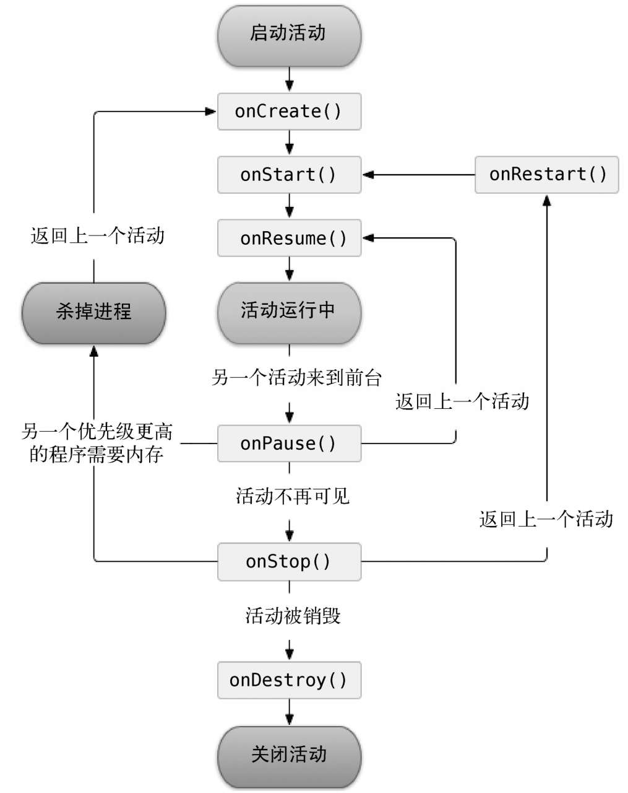
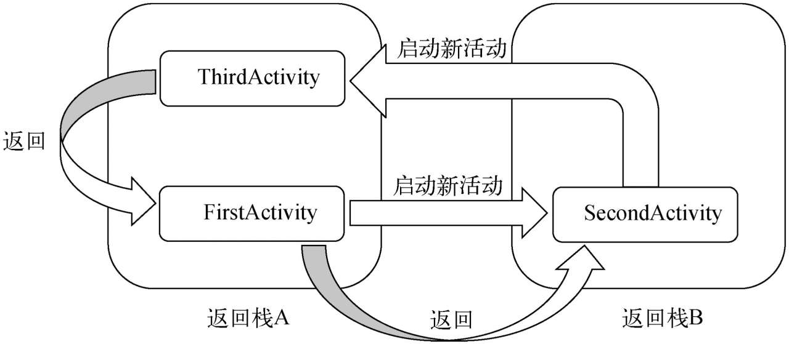

# Activity

活动（Activity）是最容易吸引用户的地方，它是一种可以包含**用户界面**的组件，**主要用于和用户进行交互**。

## 1. 手动创建一个activity

背景：创建一个新的工程，其余都一样，选择`No Activity`，那么创建完成后的工程将会没有任何界面：——只有一个包


然后进入`java` -> `com.example.activitydemo`包，就是之前有MainActivity的地方，自己创建一个`EmptyActivity`


勾选Generate Layout File表示会自动为FirstActivity创建一个对应的**布局文件**

勾选Launcher Activity表示会自动将FirstActivity设置为当前项目的**主活动**

——为了熟悉流程，这两个我们都选择手动创建

需要牢记：**项目的所有活动都需要重写Activity的`onCreate`方法**

——而AS在创建activity的时候会默认给重新该方法——就是默认调用父类重写的方法

```java
public class MyActivity extends AppCompatActivity {

    @Override
    protected void onCreate(Bundle savedInstanceState) {
        super.onCreate(savedInstanceState);
    }
}
```

## 2. 创建和加载布局

Android设计的思维：**逻辑和视图分离**

**一个活动都能对应一个布局，布局用来显示界面**，而里面组件的关系等都是由逻辑实现

而布局是资源，都是存放在`res`文件中，在`res`中创建`layout`文件夹，代表该项目的外观布局的文件夹

然后该目录下，创建一个layout文件.xml

（AS会自动判断该目录是layout，所以在该目录下会增加一个功能选项`new -> Layout Resource File`）


然后会出现该界面：——是AS提供的默认的**可视化布局**编辑器，Design


右上角可以切换编辑方式：Code，Split，Design，分别代表代码化编辑：xml文件方式编辑，双显示：两者都可以使用，可视化编辑：可以拖放来实现编辑

我们选用代码模式：

由于之前在创建的时候，选择用`LinearLayout`作为根元素，那么默认就有一个根元素LinearLayout

```xml
<?xml version="1.0" encoding="utf-8"?>
<LinearLayout xmlns:android="http://schemas.android.com/apk/res/android"
    android:orientation="vertical" android:layout_width="match_parent"
    android:layout_height="match_parent">
</LinearLayout>
```

在里面增加一个button元素：

```xml
<?xml version="1.0" encoding="utf-8"?>
<LinearLayout xmlns:android="http://schemas.android.com/apk/res/android"
    android:orientation="vertical" android:layout_width="match_parent"
    android:layout_height="match_parent">
    
    <Button			// 下面都是该button的属性（不止这些，还有很多，只设置自己关注的）
        android:id="@+id/button_1"		// 唯一确定一个元素的标识符
        android:layout_width="match_parent"
        android:layout_height="wrap_content"
        android:text="button_1" />
    
</LinearLayout>
```

理解：

1. `id`，给当前元素（按钮）定义唯一一个标识符

   `@+id/button_1`：用来定义资源（+表示增加），表示增加id=button_1的资源

   类比**`@id/button_1`**：用来**引用资源**，引用该id为button_1的资源

2. `layout_width`/`layout_height`：用来设定该元素的宽度和长度，分别为`match_parent`：和父类一样，`wrap_content`：只需要包住元素内容即可

3. `text`：该元素显示的文字内容

那么该页面的简单布局已经完成

那么该如何在APP运行时**加载该布局**呢？

——在activity中添加：

```java
public class MyActivity extends AppCompatActivity {
    @Override
    protected void onCreate(Bundle savedInstanceState) {
        super.onCreate(savedInstanceState);
        setContentView(R.layout.first_layout);
    }
}
```

理解：

1. `setContentView()`：就是给该活动增加一个布局，添加使用该资源的id来进行区分：项目中添加的任何资源都会在R文件中生成一个相应的资源id

## 3. AndroidManifest文件中注册（会自动注册）

所有Activity都需要在AndroidManifest.xml中进行注册，但是AS已经帮我们自动注册了

```xml
<?xml version="1.0" encoding="utf-8"?>
<manifest xmlns:android="http://schemas.android.com/apk/res/android"
    package="com.example.activitydemo">	// 指定程序的包名，所以在该包内的可以省略前面的这些，直接写后面的即可

    <application
        android:allowBackup="true"
        android:icon="@mipmap/ic_launcher"
        android:label="@string/app_name"
        android:roundIcon="@mipmap/ic_launcher_round"
        android:supportsRtl="true"
        android:theme="@style/Theme.ActivityDemo">
        <activity android:name=".MyActivity"></activity>		// 活动的注册
    </application>

</manifest>
```

理解：

1. activity的注册需要放在`<application></application>`中，并且活动是通过`<activity></activity>`进行注册的。

   `android:name`：可以用来指明具体注册的活动是哪个

   `.MyActivity`，就是`com.example.activitydemo.MyActivity`的缩写而已，因为在`<manifest></manifest>`的`package`选项中指定了程序的包名

但是，只是注册，还没有设定**主活动**——即指明整个程序运行起来后，应该首先启动哪个活动（类似于APP的开机页面）

那么就在`<activity></activity>`中进行设置

```xml
<?xml version="1.0" encoding="utf-8"?>
<manifest xmlns:android="http://schemas.android.com/apk/res/android"
    package="com.example.activitydemo">

    <application
        android:allowBackup="true"
        android:icon="@mipmap/ic_launcher"
        android:label="@string/app_name"
        android:roundIcon="@mipmap/ic_launcher_round"
        android:supportsRtl="true"
        android:theme="@style/Theme.ActivityDemo">
        <activity
            android:name=".MyActivity"
            android:label="first activity">
            <intent-filter>
                <?--------------------------------?>		// 将该活动设置为主活动
                <action android:name="android.intent.action.MAIN"/>
                <category android:name="android.intent.category.LAUNCHER"/>
                <?--------------------------------?>
            </intent-filter>
        </activity>
    </application>

</manifest>
```

理解：

1. 通过增加两个语句`<action>`、`<category>`来设置主活动
2. 并且，可以通过`android:label`来设置标题栏的内容，但是要注意：主活动指定的label不仅会成为标题栏中的内容，还会成为启动器（Launcher）中**应用程序显示的名称**。
3. 如果某个程序没有设置主活动，那么程序能够正常安装，但是无法启动/打开该程序。这种程序一般作为**第三方服务**，在**其他应用程序内部进行调用的**

## 4. activity中使用Toast

Toast就是一种提醒方式（例如微信的消息提醒），程序中可以将一些小的信息通知给用户，会在一段时间后自行消失，并且不会占用任何屏幕空间（浮在表面）

```java
protected void onCreate(Bundle savedInstanceState) {
    super.onCreate(savedInstanceState);
    setContentView(R.layout.first_layout);			// 加载布局
    Button button1 = findViewById(R.id.button_1);	// 获取布局中的元素
    button1.setOnClickListener(new View.OnClickListener() {		// 监听该元素，实现该接口方法
        @Override
        public void onClick(View v) {
            Toast.makeText(MyActivity.this, "you haven clicked the button", Toast.LENGTH_SHORT).show();
        }
    });
}
```

理解：

1. `findViewById()`：该方法获取到在布局文件中定义的元素，然后传入的是`R.id.button_1`，能够得到button实例，该id是在那个布局文件中定义的：——意味着该布局文件**定义的资源的id需要是唯一的**（不然不能唯一确定）

   ```xml
   <Button
       android:id="@+id/button_1">
   </Button>
   ```

   `findViewById()`方法返回的是一个View对象，然后将其强制类型转换为Button类型

2. Button是TextView的子类，TextView是View的子类，那么Button能够继承父类的`setOnClickListener()`方法——注册监听器，需要传递一个参数，是`OnClickListener`类型的，而该类型是View内部定义的接口，所以用`View.OnClockListener()`调用，而该接口只有一个方法，所以实现该接口的`onClick()`方法即可

   ```java
   public interface OnClickListener {
       /**
            * Called when a view has been clicked.
            *
            * @param v The view that was clicked.
            */
       void onClick(View v);
   }
   ```

   ——该监听器实现的功能就是：当点击该button时，触发监听器，针对该点击，做某些操作。

   所以Toast就在onClick里面写，表示点击按钮之后触发的动作 

3. Toast的操作就是，调用静态方法`makeText()`，**创建一个Toast对象**，然后调用Toast实例对象的方法`show()`来显示

   `makeText()`有3个参数：第一个参数是Context，也就是Toast要求的上下文，由于**activity本身就是一个Context对象**（由很多层继承过来的），因此这里直接传入**MyActivity.this**即可（不能用this，因为是在重写接口，所以需要指明是外部的类对象）；第二个参数是Toast显示的文本内容；第三个参数是Toast显示的时长，有两个内置常量可以选择**Toast.LENGTH_SHORT**和**Toast.LENGTH_LONG**。

## 5. activity中使用menu

使用菜单栏，且在节约空间下加入菜单栏——即默认折叠隐藏。

跟layout一样，menu也是资源，所以**存放在res文件夹**下面，在res文件夹下面new -> directory -> `menu`，

然后在该文件夹下面创建新的menu文件，AS会自动认为是特殊的文件夹，所以选择new -> menu resource file -> `main_menu`

```java
<?xml version="1.0" encoding="utf-8"?>
<menu xmlns:android="http://schemas.android.com/apk/res/android">
    <item
        android:id="@+id/add_item"
        android:title="add"/>
    <item
        android:id="@+id/remove_item"
        android:title="remove"/>
</menu>
```

理解：

1. 创建两个菜单项，**<item>标签用来创建具体的菜单项**，通过`android:id`作为标识符唯一确定一个元素，同button的标识符`@+id/add_item`，`android:title`：是选项名的具体显示

页面创建完成，但是还缺少逻辑

返回到`MyActivity`中编写，表明是在该activity中的一个菜单栏

这边需要重写的方法是：`onCreateOptionsMenu()`

ps：`ctrl+o`可以选择重写的方法

```java
@Override
public boolean onCreateOptionsMenu(Menu menu) {
    getMenuInflater().inflate(R.menu.main_menu, menu);
    return true;
}
```

理解：

1. `getMenuInflater()`是去获取`MenuInflater`对象，然后调用`MenuInflater`的`inflate`方法就可以给当前活动创建菜单了
2. `inflate()`传递两个参数：指定资源文件来创建菜单——就是刚才创建的menu文件的位置；指定我们的菜单项将添加到哪一个Menu对象当中——直接使用传参过来的menu
3. 该方法返回true，表示可视；如果返回false，表示隐藏

——这个就只是显示，菜单栏本质上就是button，那么还需要该按钮做出一定的响应

重写方法：`onOptionsItemSelected`

```java
@Override
public boolean onOptionsItemSelected(@NonNull MenuItem item) {		
    switch (item.getItemId()){
        case R.id.add_item:
            Toast.makeText(this, "you clicked add", Toast.LENGTH_SHORT).show();
            break;
        case R.id.remove_item:
            Toast.makeText(this, "you have clicked remove", Toast.LENGTH_SHORT).show();
            break;
        default:
    }
    return true;
}
```

理解：

1. 传参是，每个菜单项，然后通过case来进行判断
2. 因为传递的是item对象，并不能直接交给switch...case进行判断，而是需要转换成int或者其他类型才行，所以需要先转换`item.getItemId()`
3. 然后，在这之后，可以自定义每个菜单栏选项的对应逻辑操作，即点击之后后台进行啥操作，这边就是简单的使用Toast进行悬浮提示

——最后的效果：


可以看到：只有点击了菜单按钮（三圆点）才会弹出具体的菜单栏，所以不会占据空间


并且，点击之后，会触发`onOptionsItemSelected`，表示该选项被选中，会进行对应的逻辑操作，这边就是进行悬浮提醒

## 6. 销毁一个活动

按下back键就可以销毁当前活动；可以通过代码来实现销毁，相关的方法是：`finish()`方法，调用该方法之后就能销毁当前活动

```java
protected void onCreate(Bundle savedInstanceState) {
    super.onCreate(savedInstanceState);
    setContentView(R.layout.first_layout);
    Button button1 = findViewById(R.id.button_1);
    button1.setOnClickListener(new View.OnClickListener() {
        @Override
        public void onClick(View v) {
            finish();
        }
    });
}
```

修改`onClick()`，改为finish()就会销毁当前活动

# Activity之间的传递——Intent

一个应用肯定不止一个activity，那么如何在activity之间如何跳转呢？——使用Intent

## 1. 使用显式的Intent

首先在原来的工程上，再创建一个activity（勾选`generate layout file`，那么会自动创建一个布局文件）——那么就有2个页面了

（里面的布局和first_layout基本一样）

所以创建第二个activity，根据需要需要覆盖默认生成的layout文件和java文件，而**AndroidManifest会默认注册活动**，因为该activity不是主活动，所以不需要设置`<intent-filter>`内容了，只需要AS默认设置即可。

开始引入正题：如何启动该第二个活动？

在打开app的时候，默认就是进入主活动，我们需要进入第二个活动需要**使用intent**

概念：

- Intent是Android程序中**各组件之间进行交互**的一种重要方式：
  - 不仅可以**指明当前组件想要执行的动作**
  - 还可以在**不同组件之间传递数据**
- Intent一般可被用于**启动活动**、**启动服务**以及**发送广播**等场景
- 一般分为：显式的Intent和隐式的Intent

先学习：启动活动

使用方法：

- Intent构造方法：——先创建一个Intent对象

  Intent有多个构造函数的重载，其中一个是**`Intent(Context packageContext,Class<? >cls)`**

  - 第一个参数Context要求提供一个启动活动的上下文
  - 第二个参数Class则是指定想要启动的目标活动

  ——通过这个构造函数就可以构建出Intent的“意图”

- 使用Intent：

  Activity类中提供了一个**`startActivity()`**方法，这个方法是专门用于**启动活动的**。

  它接收一个Intent参数，这里我们将构建好的Intent传入就可以启动目标活动了。

```java
// 在主activity中，修改按钮的逻辑
protected void onCreate(Bundle savedInstanceState) {
    super.onCreate(savedInstanceState);
    setContentView(R.layout.first_layout);
    Button button1 = findViewById(R.id.button_1);
    button1.setOnClickListener(new View.OnClickListener() {
        @Override
        public void onClick(View v) {
            Intent intent = new Intent(MyActivity.this, SecondActivity.class);
            startActivity(intent);
        }
    });
}
```

理解：

1. 因为我们需要从主活动中启动第二个activity，所以需要修改的是主活动的逻辑，我们这边设置的是，点击按钮，然后启动SecondActivity，那么就是修改button里面的代码

2. 先创建Intent对象，然后传入当前作为上下文——**activity本身就是一个Context对象**，而MyActivity就是要求启动活动的上下文；启动活动的目标是——SecondActivity，由于要传入的是class对象，所以输入` SecondActivity.class`即可

   ——那么**这个Intent的intent就很明显**：在MyActivity的基础上，启动SecondActivity

3. 然后启动活动，传入intent对象即可`startActivity(intent)`

运行之后，点击button_1，即可进入第二个activity


想要销毁该活动，点击back键即可，回到上一个活动。

总结：用该种方式启动活动，intent很明显——明确启动活动的上下文，明确要启动的对象，所以被称为显式Intent

## 2. 使用隐式Intent

隐式Intent，并不明确指出我们想要启动哪一个活动，而是指定了一系列更为抽象的action和category等信息，交由系统去分析这个Intent，并帮我们找出合适的活动去启动。

合适的活动——就是可以**响应我们这个隐式Intent的活动**，所以我们需要对应的配置action和category等信息。

修改文件：

```xml
// AndroidManifest.xml
<activity android:name=".SecondActivity">
    <intent-filter>
        <action android:name="com.example.activitydemo.ACTION_START"/>
        <category android:name="android.intent.category.DEFAULT"/>
    </intent-filter>
</activity>
```

理解：

1. 设定`<action />`标签，这边指明了当前活动可以响应`com.example.activitytest.ACTION_START`这个action
2. 设定`<category />`标签，包含了一些附加信息，更精确地指明了当前的活动能够响应的Intent中还可能带有的category

**只有<action>和<category>中的内容同时能够匹配上Intent中指定的action和category时，这个活动才能响应该Intent。**

再修改一个文件：

```java
// MyActicity.java
protected void onCreate(Bundle savedInstanceState) {
    super.onCreate(savedInstanceState);
    setContentView(R.layout.first_layout);
    Button button1 = findViewById(R.id.button_1);
    button1.setOnClickListener(new View.OnClickListener() {
        @Override
        public void onClick(View v) {
            Intent intent = new Intent("com.example.activitydemo.ACTION_START");
            startActivity(intent);
        }
    });
}
```

理解：

1. 使用了Intent的另一个构造函数`Intent(String action)`，直接将刚才配置的action的字符串内容传了进去，表明我们想要启动能够响应`com.example.activitytest.ACTION_START`这个action的活动
2. 而前面设置的category，并没有配置，这是因为android.intent.category.DEFAULT是一种默认的category，在调用startActivity()方法的时候会自动将这个category添加到Intent中。

——重新编译之后，发现跟之前显式调用效果一样

规则：**一个Intent只能指定一个action，但是能够指定多个category**，activity只有同时满足action和category才能响应该Intent

eg：

```JAVA
protected void onCreate(Bundle savedInstanceState) {
    super.onCreate(savedInstanceState);
    setContentView(R.layout.first_layout);
    Button button1 = findViewById(R.id.button_1);
    button1.setOnClickListener(new View.OnClickListener() {
        @Override
        public void onClick(View v) {
            Intent intent = new Intent("com.example.activitydemo.ACTION_START");
            intent.addCategory("android.intent.category.NEW_CATEGORY");
            startActivity(intent);
        }
    });
}
```

理解：

1. 用Intent的实例方法：addCategory()来增加category，但是重新编译运行之后，会发现出现bug崩溃了

   

   这边提示的是，找不到能响应该intent的activity——主要是category设定的原因

```XML
//AndroidManifest.xml
<activity android:name=".SecondActivity">
    <intent-filter>
        <action android:name="com.example.activitydemo.ACTION_START"/>
        <category android:name="android.intent.category.DEFAULT"/>
        <category android:name="android.intent.category.NEW_CATEGORY"/>
    </intent-filter>
</activity>
```

理解：增加了一个新的category，就可以响应了，说明该**一个activity也可以有多个category**

（注意，一旦出现了，action和category必须都要出现，并且category的default配置要写，不然只写下面那个会报错的，因为startActivity()方法的时候会自动将这个default的category添加到Intent中）

### ps：更多的隐式Intent方法

Intent可以启动程序内部的活动，也可以启动其他程序的活动，那么**多个app之间能够共享功能**，

eg1：应用程序不必自己实现一个浏览器功能，而直接调用系统的浏览器即可

```java
protected void onCreate(Bundle savedInstanceState) {
    super.onCreate(savedInstanceState);
    setContentView(R.layout.activity_second);
    Button button2 = findViewById(R.id.button_2);
    button2.setOnClickListener(new View.OnClickListener() {
        @Override
        public void onClick(View v) {
            Intent intent = new Intent(Intent.ACTION_VIEW);
            intent.setData(Uri.parse("http://baidu.com"));
            startActivity(intent);
        }
    });
```

理解：

主要实现的就是启用内置浏览器

1. 创建一个intent对象，首先指定了Intent的action是**`Intent.ACTION_VIEW`**，是Android系统内置的动作，其常量值为`android.intent.action.VIEW`

2. 使用**`Uri.parse()`**方法，将一个网址字符串解析成一个Uri对象（xxx.parse()，很常见，都是将一个字符串转换为需要的实例对象）

3. 调用Intent的**`setData()`**方法将这个Uri对象传递进去。

   ```java
   public Intent setData(@Nullable Uri data);		// setData需要的参数是Uri对象
   ```

   ——所以，流程一般都是数据一般都是字符串形式，然后通过`Uri.parse("xxxx");`转换称Uri对象，然后通过`setData(uri)`指定该intent需要操作的数据

4. 启动该活动

——所以整个逻辑：主activity 通过intent，去启动 SecondActivity，然后通过intent，去启动内置浏览器的activity

ps：可以在<intent-filter>标签中再配置一个<data>标签，用于更精确地指定当前活动能够响应什么类型的数据

——即通过<data>可以对传递的网址进行一定的限制，不满足配置要求的，activity都不会响应该intent

- android:scheme：用于指定数据的协议部分，如上例中的http部分
- android:host：用于指定数据的主机名部分，如上例中的www.baidu.com部分
- android:port：用于指定数据的端口部分，一般紧随在主机名之后
- android:path：用于指定主机名和端口之后的部分，如一段网址中跟在域名之后的内容
- android:mimeType：用于指定可以处理的数据类型，允许使用通配符的方式进行指定。

**只有<data>标签中指定的内容和Intent中携带的Data完全一致时，当前活动才能够响应该Intent**。

不过一般在<data>标签中都不会指定过多的内容

创建第三个activity，然后修改AndroidManifest.xml的与第三个activity相关的内容

```xml
<activity android:name=".ThirdActivity">
    <intent-filter>
        <action android:name="android.intent.action.VIEW" />
        <category android:name="android.intent.category.DEFAULT" />
        <data android:scheme="http" />
    </intent-filter>
</activity>
```

理解：

1. 前面说的intent的构造函数传参是**`Intent.ACTION_VIEW`**，是Android系统内置的动作，其常量值为`android.intent.action.VIEW`，所以这边直接就设置为这个常量值
2. 注意需要写data，且配置了android:scheme指定了数据的协议必须是http协议，那么才能和浏览器一样才能响应打开网页的intent

运行之后有如下的效果：

因为存在多个activity能够响应该intent，所以需要用户做出选择

ps：实际上我们的ThirdActivity并没有打开网页的能力，所以逻辑上并不合理，这边只是用来展示效果


除了http协议外，还可以指定很多其他协议，比如geo表示显示地理位置、tel表示拨打电话。下面的代码展示了如何在我们的程序中调用系统拨号界面。

```java
protected void onCreate(Bundle savedInstanceState) {
    super.onCreate(savedInstanceState);
    setContentView(R.layout.activity_third);
    Button button3 = findViewById(R.id.button_3);
    button3.setOnClickListener(new View.OnClickListener() {
        @Override
        public void onClick(View v) {
            Intent intent = new Intent(Intent.ACTION_DIAL);
            intent.setData(Uri.parse("tel:10086"));
            startActivity(intent);
        }
    });
}
```

理解：同上面浏览器那边的操作一样

——打电话、查网页、定位等都是和上面同样的操作过程：

- intent对象创建（但是传入的参数是不同的），浏览器是Intent.ACTION_VIEW，打电话是Intent.ACTION_DIAL
- 处理数据Uri.parse(“xxx:xxxx”)，注意这边的xxx，就是http/geo/tel，代表不同的协议
- 传入data：setData

## 3. 向下一个活动传递数据

Intent中提供了一系列**`putExtra()`**方法的重载，可以把想要传递的数据暂存在Intent中，启动了另一个活动后，只需要把这些数据再从Intent中取出就可以了

```java
// MyActivity——主活动的按钮逻辑
public void onClick(View v) {
    String data = "hello second";
    Intent intent = new Intent(MyActivity.this, SecondActivity.class);
    intent.putExtra("extra", data);
    startActivity(intent);
}

// SecondActivity
protected void onCreate(Bundle savedInstanceState) {
    super.onCreate(savedInstanceState);
    setContentView(R.layout.activity_second);
    Intent intent = getIntent();
    String data = intent.getStringExtra("extra");
    Log.d("second:", data);
}
```

理解：

1. 可以看到，为了简便，就直接使用了一个显式Intent调用
2. 调用了intent的实例方法**`putExtra`**，它需要两个参数，一个是key；一个是value，这个包含真正的内容
3. 在第二个activity中，使用**`getIntent()`**，用来**获取启动当前活动的Intent**——就是前面代码逻辑中的intent
4. 然后输入实例方法`getStringExtra`，传递key，用来获取value，这边注意，如果value是整型数据，则使用**`getIntExtra()`**，如果是布尔型数据，则使用**`getBooleanExtra()`**
5. 最后将获取的数据打印到log中，该log的等级是debug类型

最后运行之后，能够看到：


## 4. 向上一个活动返回数据

Activity中一个**`startActivityForResult()`**方法也是用于启动活动的，这个方法能够**在活动销毁的时候能够返回一个结果给上一个活动**，所以只需要使用该方法即可实现数据的返回

```java
// MyActivity.java中
protected void onCreate(Bundle savedInstanceState) {
    super.onCreate(savedInstanceState);
    setContentView(R.layout.first_layout);
    Button button1 = findViewById(R.id.button_1);
    button1.setOnClickListener(new View.OnClickListener() {
        @Override
        public void onClick(View v) {
            String data = "hello second";
            Intent intent = new Intent(MyActivity.this, SecondActivity.class);
            intent.putExtra("extra", data);		// 这边是向下传递数据所用
            startActivityForResult(intent, 1);	// 这个是得到下一个activity的返回值用
        }
    });
}

// SecondActivity.java中
protected void onCreate(Bundle savedInstanceState) {
    super.onCreate(savedInstanceState);
    setContentView(R.layout.activity_second);
    /**************************/	// 这边是获取前一个活动传递下来的数据
    Intent intent = getIntent();
    String data = intent.getStringExtra("extra");
    Log.d("second:", data);
    /**************************/
    
    /**************************/		// 这边是向上一个活动返回数据——用按钮触发返回
    Button button2 = findViewById(R.id.button_2);
    button2.setOnClickListener(new View.OnClickListener() {
        @Override
        public void onClick(View v) {
            Intent intent = new Intent();
            intent.putExtra("data_return", "back first");
            setResult(RESULT_OK, intent);
            finish();
        }
    });
    /**************************/
}
```

理解：

1. **`startActivityForResult()`**需要两个参数：

   - 第一个参数是Intent；
   - 第二个参数是请求码，用于在之后的回调中判断数据的来源

   并且该参数是替换了简单的`startActivity()`，所以是**用在上层的activity中的，用来期待下层的activity销毁返回时的返回值**

   所以第一个参数就是：启动第二个activity的intent；第二个参数是：1——请求码只要是一个唯一值就可以了，这里传入了1

2. 在第二个activity中添加返回的逻辑：按钮触发返回

   还需要构建一个Intent，但是这个Intent仅仅是用于传递数据而已，它**没有指定任何的“意图”**，所以选择的是默认构造方法

3. 接着，将要返回的数据添加到intent中，用`putExtra()`

4. 然后，调用方法：**`setResult()`**，专门用于向上一个活动返回数据的，需要两个参数：

   - 第一个参数，表示返回的处理结果，一般只使用**RESULT_OK**或**RESULT_CANCELED**这两个值
   - 第二个参数，要返回去的带有数据的Intent

5. 最后，需要调用finish()销毁该activity

**使用`startActivityForResult()`方法来启动下层activity的，在被销毁之后会回调上一个活动的`onActivityResult()`方法**，所以还需要重写该方法：

——是默认回调的

```java
// MyActivity.java中
protected void onActivityResult(int requestCode, int resultCode, @Nullable Intent data) {
    super.onActivityResult(requestCode, resultCode, data);
    switch (requestCode) {
        case 1:
            if (resultCode == RESULT_OK) {
                String res = data.getStringExtra("data_return");
                Log.d("first:", res);
            }
            break;
        default:
    }
}
```

理解：

**`onActivityResult()`**方法带有三个参数：

- 第一个参数requestCode，即我们在启动活动时传入的请求码——只是用来判断数据的来源，来自当前activity

  由于在一个活动中有可能调用`startActivityForResult()`方法去启动很多不同的活动，每一个活动返回的数据都会回调到`onActivityResult()`这个方法中，因此我们首先要做的就是通过检查`requestCode`的值来判断数据来源

- 第二个参数resultCode，即我们在返回数据时传入的处理结果，来自下层的activity

- 第三个参数data，就是Intent，是下层带有数据的intent，来自下层activity

而如果是通过back按钮销毁当前activity并且返回，那么需要重写：**`onBackPressed()`**

```java
// SecondActivity.java中
public void onBackPressed() {
    Intent intent = new Intent();
    intent.putExtra("data_return", "back by back");
    setResult(RESULT_OK, intent);
    finish();
}
```

逻辑同上

然后实现效果同上

# Activity的生命周期

了解activity如何创建使用，并且activity之间如何进行数据交互之后，还需要了解它的生命周期，那么能够写出更加流畅的程序，并且合理管理应用资源

## 1. 返回栈

activity有点类似于进程，activity可以层叠的。我们每启动一个新的活动，就会覆盖在原活动之上，然后点击Back键会销毁最上面的活动，下面的一个活动就会重新显示出来——很显然，这就有栈的特点

Android是使用**任务（Task）**来管理活动的，一个任务就是一组存放在栈里的活动的集合，这个栈也被称作**返回栈**（Back Stack）。每当我们启动了一个新的活动，它会在返回栈中入栈，并处于栈顶的位置。而每当我们按下Back键或调用finish()方法去销毁一个活动时，处于栈顶的活动会出栈，这时前一个入栈的活动就会重新处于栈顶的位置。**系统总是会显示处于栈顶的活动给用户**。

## 2. 活动状态

activity最多有4个状态（类似于os的线程的多状态）

- 运行状态：当一个活动**位于返回栈的栈顶时**，这时活动就处于运行状态。系统不会去回收的

- 暂停状态：当一个活动**不再处于栈顶位置，但仍然可见**时，这时活动就进入了暂停状态，处于暂停状态的活动仍然是完全存活着的。系统不会去回收（只有在内存极低的情况下，系统才会去考虑回收这种活动）

  这个出现在：并不是每一个活动都会占满整个屏幕的，比如对话框形式的活动只会占用屏幕中间的部分区域，所以其他显式部分的活动就处于暂停状态

- 停止状态：当一个活动**不再处于栈顶位置，并且完全不可见的时候**，就进入了停止状态。系统仍然会为这种活动保存相应的状态和成员变量，但是这并不是完全可靠的，当内存不足的时候，也会被系统回收

- 销毁状态：当一个活动从返回栈中**移除**后就变成了销毁状态。系统会优先销毁该activity

## 3. 活动的生存期

Activity类中定义了7个回调方法，覆盖了活动生命周期的每一个环节

- **onCreate()**：每个活动中我们都重写了这个方法，是**活动的创建**。它会在活动第一次被创建的时候调用。在这个方法中完成**活动的初始化操作**，比如说加载布局、绑定事件等
- **onStart()**：在活动由不可见变为可见的时候调用
- **onResume()**：在活动准备好和用户进行交互的时候调用。此时的活动一定位于返回栈的栈顶，并且处于运行状态。
- **onPause()**：在系统准备去启动或者恢复另一个活动的时候调用。通常会在这个方法中将一些消耗CPU的资源释放掉，以及保存一些关键数据，但这个方法的执行速度一定要快，不然会影响到新的栈顶活动的使用。
- **onStop()**：在活动完全不可见的时候调用。
- **onDestroy()**：在活动被销毁之前调用，之后活动的状态将变为销毁状态。
- **onRestart()**：活动由停止状态变为运行状态之前调用，也就是活动被重新启动了。

这其中的6个回调方法可以两两相对，在两个中间就是一个完整的生存期阶段

- **完整生存期**：onCreate()方法和onDestroy()方法之间：活动创建，初始化 -> 活动销毁

- **可见生存期**：onStart()方法和onStop()方法之间：开始可见（存在只能看，但是无法交互的情况） -> 完全不可见

  可以通过这两个方法，合理地管理那些对用户可见的资源。eg：onStart()方法中对资源进行加载，而在onStop()方法中对资源进行释放，从而保证处于停止状态的活动不会占用过多内存。

- **前台生存期**：onResume()方法和onPause()方法之间。开始处于运行状态，可交互 -> 不可交互



下面通过代码来看转换关系：

创建3个activity：MainActivity（主活动）、NormalActivity（正常窗口）、DialogActivity（小窗口）

```xml
<application
             android:allowBackup="true"
             android:icon="@mipmap/ic_launcher"
             android:label="@string/app_name"
             android:roundIcon="@mipmap/ic_launcher_round"
             android:supportsRtl="true"
             android:theme="@style/Theme.MyApplication">
    <activity android:name=".MainActivity">			// 标注为主活动
        <intent-filter>
            <action android:name="android.intent.action.MAIN" />
            <category android:name="android.intent.category.LAUNCHER" />
        </intent-filter>
    </activity>
    <activity android:name=".NormalActivity" />		// 默认活动，单纯注册
    <activity android:name=".DialogActivity"		// 小窗口
              android:theme="@style/Theme.AppCompat.Dialog"></activity>
</application>
```

理解：`android:theme="xxxx"`用于给当前活动指定主题的，Android系统内置有很多主题可以选择，也可以定制自己的主题

```java
public class MainActivity extends AppCompatActivity {
    public static final String TAG = "MainActivity";
    @Override
    protected void onCreate(Bundle savedInstanceState) {
        super.onCreate(savedInstanceState);
        setContentView(R.layout.activity_main);
        Log.d(TAG, "onCreate");
        Button button1 = (Button) findViewById(R.id.start_normal);	// 编写两个按钮的逻辑
        Button button2 = (Button) findViewById(R.id.start_dialog);
        button1.setOnClickListener(new View.OnClickListener() {
            @Override
            public void onClick(View v) {
                Intent intent = new Intent(MainActivity.this, NormalActivity.class);
                startActivity(intent);
            }
        });
        button2.setOnClickListener(new View.OnClickListener() {
            @Override
            public void onClick(View v) {
                Intent intent = new Intent(MainActivity.this, DialogActivity.class);
                startActivity(intent);
            }
        });
    }
	// 重写6个方法，当被回调时，在log打印出来
    @Override
    protected void onStart() {
        super.onStart();
        Log.d(TAG, "onStart");
    }

    @Override
    protected void onResume() {
        super.onResume();
        Log.d(TAG, "onResume");
    }

    @Override
    protected void onPause() {
        super.onPause();
        Log.d(TAG, "onPause");
    }

    @Override
    protected void onStop() {
        super.onStop();
        Log.d(TAG, "onStop");
    }

    @Override
    protected void onDestroy() {
        super.onDestroy();
        Log.d(TAG, "onDestory");
    }

    @Override
    protected void onRestart() {
        super.onRestart();
        Log.d(TAG, "onRestart");
    }
}
```

对话窗口式主题，后面的activity作为背景，所以后面还是可见的，而普通的activity会覆盖前面的activity，直接变成不可见的状态


从MainActivity到DialogActivity的，MainActivity状态的变化：——回调了onPause方法


返回MainActivity：——回调了onResume方法


从MainActivity到NormalActivity：——回调了onPause方法，变得不可交互；后回调onStop，变得不可见


返回上一个活动：——回调了onRestart方法，重新启动了；然后回调onStart，开始可见；最后回调onResume，开始可交互。

注意此时onCreate()方法不会执行，因为MainActivity并没有重新创建。


最后销毁主方法：——回调了onPause，变得不可交互；然后回调onStop，变得不可见；最后回调onDestory，销毁该方法


## 4. 如果活动中途被回收了

如果一个活动进入stop状态，那么系统是可能会回收的，那么当回退到该活动时，该活动还是会显示的，只不过会再次执行`onCreate`，重新创建该活动并显示，但是**原活动的临时数据和状态全部都没有了**

eg：MainActivity中有一个文本输入框，输入了一段文字后启动NormalActivity，这时MainActivity由于系统内存不足被回收掉，这时Back键回到MainActivity，MainActivity还在但是刚刚输入的文字全部都没了，因为MainActivity被重新创建了。

Activity中还提供了一个**`onSaveInstanceState()`**回调方法：可以保证在活动被回收之前一定会被调用，因此我们可以通过这个方法来**解决活动被回收时临时数据得不到保存的问题**。

onSaveInstanceState()方法会携带一个Bundle类型的参数，Bundle提供了一系列的方法用于保存数据，比如可以使用putString()方法保存字符串，使用putInt()方法保存整型数据....

每个保存方法需要传入两个参数，第一个参数是键，用于后面从Bundle中取值，第二个参数是真正要保存的内容

```java
// 重写方法，数据保存处
public void onSaveInstanceState(@NonNull Bundle outState, @NonNull PersistableBundle outPersistentState) {
    super.onSaveInstanceState(outState, outPersistentState);
    String tempData = "instancestate";
    outState.putString("key", tempData);
}

// 数据获取处
protected void onCreate(Bundle savedInstanceState) {		// onCreate的传参就是Bundle类型的
    super.onCreate(savedInstanceState);
    setContentView(R.layout.activity_main);
    if(savedInstanceState != null){
        String tempData = savedInstanceState.getString("key");
        Log.d(TAG, tempData);
    }
    ....
    ....
}
```

理解：

1. 使用Bundle对象来保存数据，`bundle.putString(key,value)`，来实现数据保存
2. 使用`getString(key)`方法来获取保存的数据

# Activity的启动模式

在实际项目中我们应该根据特定的需求为每个活动指定恰当的启动模式，启动模式一共有4种，**分别是standard、singleTop、singleTask和singleInstance**

配置方法：在AndroidManifest.xml中对<activity>标签指定`android:launchMode`即可

下面将看一下效果：

## 1. standard

默认的启动模式

在standard模式下，**每当启动一个新的活动，它就会在返回栈中新入栈，并处于栈顶的位置**，即使该activity已经出现过，还是会重新创建一个新的实例

eg:

```java
protected void onCreate(Bundle savedInstanceState) {
    super.onCreate(savedInstanceState);
    setContentView(R.layout.first_layout);
    Log.d("myActivity", this.toString());		// 打印日志用来看创建了几个该activity
    Button button1 = findViewById(R.id.button_1);
    button1.setOnClickListener(new View.OnClickListener() {
        @Override
        public void onClick(View v) {
            Intent intent = new Intent(MyActivity.this, MyActivity.class);	// 我创建我自己
            startActivity(intent);
        }
    });
}
```

理解：

1. 用显式的Intent，在MyActivity的基础上启动MyActivity，即创建两个一样的活动，在逻辑上没有什么意义

   由于默认是standard启动模式，所以还是会创建一个新的activity，并且处于栈顶


可以看到创建了两个一样的activity

并且，如果不断点击按钮，就会不断创建新的activity（有点递归的意思）

## 2. singleTop

在singleTop模式下，在启动活动时**如果发现返回栈的栈顶已经是该活动，则认为可以直接使用它，不会再创建新的活动实例**，即栈顶活动不会被重复创建实例。如果创建的是非栈顶的活动，那么还是存在重复创建的情况。

```xml
<activity
          android:name=".MyActivity"
          android:label="first activity"
          android:launchMode="singleTop">		// 修改启动模式
    <intent-filter>
        <action android:name="android.intent.action.MAIN" />

        <category android:name="android.intent.category.LAUNCHER" />
    </intent-filter>
</activity>
```

再次编译之后，发现MyActivity位于栈顶，此时点击按钮，而不会创建新的activity


而如果MyActivity不位于栈顶，而需要启动该活动，则又会新建一个activity

代码修改如下：

```java
// MyActivity.java
protected void onCreate(Bundle savedInstanceState) {
    super.onCreate(savedInstanceState);
    setContentView(R.layout.first_layout);
    Log.d("myActivity", this.toString());
    Button button1 = findViewById(R.id.button_1);
    button1.setOnClickListener(new View.OnClickListener() {
        @Override
        public void onClick(View v) {
            Intent intent = new Intent(MyActivity.this, SecondActivity.class);
            startActivity(intent);
        }
    });
}

// SecondActivity.java
protected void onCreate(Bundle savedInstanceState) {
    super.onCreate(savedInstanceState);
    setContentView(R.layout.activity_second);
    Button button2 = findViewById(R.id.button_2);
    button2.setOnClickListener(new View.OnClickListener() {
        @Override
        public void onClick(View v) {
            Intent intent1 = new Intent(SecondActivity.this, MyActivity.class);
            startActivity(intent1);
        }
    });
}
```

理解：主activity跳转到SecondActivity，然后SecondActivity启动MyActivity

可以发现由于此时MyActivity不在栈顶，那么又会重新创建一个新的MyActivity


## 3. singleTask

在singleTask模式下，每次启动该活动时系统首先会在返回栈中检查是否存在该活动的实例，**如果发现已经存在则直接使用该实例，并把在这个活动之上的所有活动统统出栈，如果没有发现就会创建一个新的活动实例。**——注意，该模式下会返回栈中所有在该实例上的活动全部出栈

代码修改：

```xml
<activity
          android:name=".MyActivity"
          android:label="first activity"
          android:launchMode="singleTask">		// 修改模式为singleTask
    <intent-filter>
        <action android:name="android.intent.action.MAIN" />
        <category android:name="android.intent.category.LAUNCHER" />
    </intent-filter>
</activity>
```

```java
// MyActivity.java中增加，其余同2
protected void onRestart() {
    super.onRestart();
    Log.d("MyActivity", "onRestart");
}

// SecondActivity.java中增加，其余同2
protected void onDestroy() {
    super.onDestroy();
    Log.d("SecondActivity", "onDestory");
}
```

主活动点击，进入SecondActivity，然后在此启动MyActivity，然后发现并没有创建一个新的activity，而是之前的（因为使用了restart，重新运行）；而SecondActivity被出栈了，所以就被销毁了（如果还需要用就需要重新创建）


## 4. singleInstance

在singleInstance模式下，活动会启用一个新的返回栈来管理这个活动

意义在于：有一个活动是允许其他程序调用的，会有一个单独的返回栈来管理这个活动，不管是哪个应用程序来访问这个活动，都共用的同一个返回栈，也就解决了共享活动实例的问题。

代码修改：

```xml
<activity android:name=".SecondActivity"
          android:launchMode="singleInstance">	// 对第二个活动的启动模式进行修改
    <intent-filter>
        <action android:name="com.example.activitydemo.ACTION_START" />

        <category android:name="android.intent.category.DEFAULT" />
        <category android:name="com.example.activitydemo.NEW_CATEGORY" />
    </intent-filter>
</activity>
```

```java
// MyActivity.java 
protected void onCreate(Bundle savedInstanceState) {
    super.onCreate(savedInstanceState);
    setContentView(R.layout.first_layout);
    Log.d("myActivity", "Task id is: "+getTaskId());	// 获得所属返回栈的编号
    Button button1 = findViewById(R.id.button_1);
    button1.setOnClickListener(new View.OnClickListener() {
        @Override
        public void onClick(View v) {
            Intent intent = new Intent(MyActivity.this, SecondActivity.class);	// 按钮启动第二个活动
            startActivity(intent);
        }
    });
}

// SecondActivity.java
protected void onCreate(Bundle savedInstanceState) {
    super.onCreate(savedInstanceState);
    setContentView(R.layout.activity_second);
    Log.d("SecondActivity", "Task id is: "+ getTaskId());	// 获得所属返回栈的编号
    Button button2 = findViewById(R.id.button_2);
    button2.setOnClickListener(new View.OnClickListener() {
        @Override
        public void onClick(View v) {
            Intent intent1 = new Intent(SecondActivity.this, ThirdActivity.class);	// 按钮启动第三个活动
            startActivity(intent1);
        }
    });
}

// ThirdActivity.java
protected void onCreate(Bundle savedInstanceState) {
    super.onCreate(savedInstanceState);
    setContentView(R.layout.activity_third);
    Log.d("ThirdActivity", "Task id is: "+ getTaskId());		// 获得所属的返回栈的编号
}
```

可以发现流程MyActivity启动SecondActivity，而SecondActivity能启动ThirdActivity，由于SecondActivity的启动模式是`singleInstance`，是单独创建一个返回栈存放的，所以可以通过log发现，SecondActivity真的属于不同的栈，而由其启动的ThirdActivity又回到了前一栈中。所以SecondActivity所属的栈只有一个活动。并且除非被destory，如果MyActivity启动SecondActivity，不会创建新的SecondActivity和返回栈，而是用之前创建的

ps：可以发现，不同栈之间的切换动画是不同的。MyActivity到SecondActivity是切换了栈，所以是横着的动画；SecondActivity到ThirdActivity也是横着的；然后back键，ThirdActivity到MyActivity，在同一栈中，是上下的动画（它们属于同一个栈，所以back直接返回到了MyActivity）——该栈空了之后，又切换到SecondActivity的栈，此时又是横着的动画，最后back键后，退出程序





# Activity的实践Tip

前面学习了很多关于activity创建、启动切换、传递消息等很多基本功能。但是技巧是多种多样的，有些技巧有助于方便开发。下面将关注一些实践上好用的技巧

## 1. 明确当前所处的活动

用来快速定位当前页面所属哪个活动（尤其在修改别人代码的时候）

方法是创建一个父类，该父类继承了`AppCompatActivity`，然后重写了`onCreate()`方法，让其他几个activity去继承该父类，而不是之前的AppCompatActivity，所以由于继承关系，都会默认去调用父类的`onCreate()`方法

```java
package com.example.activitydemo;

import android.os.Bundle;
import android.util.Log;

import androidx.annotation.Nullable;
import androidx.appcompat.app.AppCompatActivity;

public class BaseActivity extends AppCompatActivity {
    @Override
    protected void onCreate(@Nullable Bundle savedInstanceState) {
        super.onCreate(savedInstanceState);
        Log.d("BaseActivity", getClass().getSimpleName());	// 主要就是添加一个log，记录当前的activity所属的类名
    }
}

// MyActivity.java
public class MyActivity extends BaseActivity {		// 继承对象变化了
    ....
}
```

理解：BaseActivity是基本的Java文件，而不是activity类型的，不同在AndroidManifest.xml中注册，只需要被activity继承了。那么由于super关系，都会去执行BaseActivity的方法，那么会将log打印出来，从而可以看到当前页面的所属。且不会影响现有的所有功能。

## 2. 随时随地退出程序

如果界面停留在ThirdActivity，如果想退出程序是非常不方便的，需要连按3次Back键才行。按Home键只是把**程序挂起**，并没有退出程序。

方法：只需要用一个专门的**集合类对所有的活动进行管理**就可以了

```java
package com.example.activitydemo;

import android.app.Activity;

import java.util.ArrayList;
import java.util.List;

public class ActivityCollector {
    public static List<Activity> activityList = new ArrayList<>();
    public static void addActivity(Activity activity){		// 最新加入一个实例活动
        activityList.add(activity);
    }
    public static void removeActivity(Activity activity){	// 删除一个实例活动
        activityList.remove(activity);
    }
    public static void removeAll(){			// 清除所有活动
        for(Activity activity: activityList){
            if(!activity.isFinishing()) {		// 如果活动还未结束，就结束
                activity.finish();		// 结束活动
            }
        }
        activityList.clear();	// 列表清除
        android.os.Process.killProcess(android.os.Process.myPid());
    }
}
```

理解：

1. 创建一个类，用来存放所有activity，如果该activity被调用`onDestory`销毁，那么移除`removeActivity`；如果调用`onCreate`创建，那么加入`addActivity`；并且设置了一个清除全部的功能
2. `android.os.Process.killProcess()`：杀掉当前进程，能够保证程序完全退出。killProcess()方法用于杀掉一个进程，它接收一个进程id参数，myPid()方法可以获得当前程序的进程id，但是killProcess()方法只能够杀死当前线程，而不能杀死其他线程

利用上面的集合类：

```java
// BaseActivity.java
public class BaseActivity extends AppCompatActivity {
    @Override
    protected void onCreate(@Nullable Bundle savedInstanceState) {
        super.onCreate(savedInstanceState);
        Log.d("BaseActivity", getClass().getSimpleName());
        ActivityCollector.addActivity(this);		// 创建activity后，加入到列表中
    }

    @Override
    protected void onDestroy() {
        super.onDestroy();
        ActivityCollector.removeActivity(this);		// 销毁后，列表中也删除
    }
}
```

```java
// ThirdActivity.java
buttonFinish.setOnClickListener(new View.OnClickListener() {	// 增加一个按钮，专门用来快速结束程序
    @Override
    public void onClick(View v) {		
        ActivityCollector.removeAll();			// 清除所有活动	
    }
});
```

——可以看到，点击`finish`按钮，就可以直接退出该程序，且程序完全被杀死了

## 3. 启动活动的最佳写法

如果按照之前的activity的启动方法：通过Intent构建启动的意图，然后调用`startActivity()`或`startActivityForResult()`启动另一个activity，然后如果有数据需要传递，那么可以用`intent.putExtra()`来增加。

eg：要启动SecondActivity，需要用到两个必须的字符串参数，必须在启动SecondActivity的时候传递过来，那么很自然从MyActivity启动时，添加两个参数从intent传递过来

```java
// MyActivity.java
Intent intent = new Intent(MyActivity.this, SecondActivity.class);
intent.putExtra("param1", "data1");
intent.putExtra("param2", "data2");
startActivity(intent);
```

这样的写法语法没有问题，但是如果是整体项目开发过程中，SecondActivity是其他人负责的，而你要去启动它，那么只能去阅读SecondActivity中的代码，询问负责编写SecondActivity的同事。

所以，只需要将启动SecondActivity的操作单独编写一个方法，且放在SecondActivity中，只留一个对外的接口，那么可以明确启动SecondActivity需要哪些参数

```java
// SecondActivity.java
public class SecondActivity extends BaseActivity {
    ...
    public static void actionStart(Context context, String param1, String param2){	// 启动本activity的方法
        Intent intent = new Intent(context, SecondActivity.class);
        intent.putExtra("param1", param1);
        intent.putExtra("param2", param2);
        context.startActivity(intent);
    }
    ...
}

// MyActivity.java
public class MyActivity extends BaseActivity {
    @Override
    protected void onCreate(Bundle savedInstanceState) {
        super.onCreate(savedInstanceState);
        setContentView(R.layout.first_layout);
        Log.d("myActivity", "Task id is: "+getTaskId());
        Button button1 = findViewById(R.id.button_1);
        button1.setOnClickListener(new View.OnClickListener() {
            @Override
            public void onClick(View v) {
                SecondActivity.actionStart(MyActivity.this, "data1", "data2");
            }
        });
    }
}
```

理解：**抽象出启动该活动的方法，然后明确需要的接口**，那么其他activity如果要启动该activity，那么只需要调用该方法即可，并传递需要的参数

——一个良好的习惯：给编写的每个activity都添加一个类似的启动方法，那么启动简单、也可以方便阅读和修改


