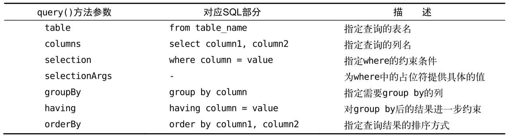

# Android的数据存储方案

数据持久化：内存中的**瞬时数据保存到存储设备**中，保证即使在手机或电脑关机的情况下，这些数据仍然不会丢失

持久化技术则提供了一种机制可以让数据在瞬时状态和持久状态之间进行转换

Android系统中主要提供了3种方式用于简单地实现数据持久化功能，即**文件存储、SharedPreferences存储以及数据库存储**。

# 1. 文件存储

文件存储是一种最基本的存储方式，**不对存储的内容进行任何的格式化处理，原封不动地保存到文件**中。

它比较适合存储：一些简单的文本数据或二进制数据

如果需要存储复杂的数据，需要定义一套自己的格式规范，以便之后将数据解析出来。

## 1.2 数据存储到文件中

关键方法：Context类提供的**`openFileOutput()`**方法，可以将数据存储到文件中

`Context.openFileOutput()`，有2个参数：

- 需要创建的文件名，注意不能带路径，所有文件都是默认存储到：`/data/data/<package name>/files/`目录下的

- 文件的操作模式，两种模式可选：`MODE_PRIVATE`和`MODE_APPEND`

  - MODE_PRIVATE：当指定的文件存在时，就覆盖原文件；
  - MODE_APPEND：如果该文件已经存在，就在文件内容的后面追加，不创建新的文件

  （本来还有另外两种：MODE_WORLD_READABLE和MODE_WORLD_WRITEABLE，这两种模式表示允许其他的应用程序可对文件进行读写操作，不过由于这两种模式过于危险，很容易引起应用的安全性漏洞，已经被废弃）

实践部分：

创建一个页面，该页面只有一个输入文本，输入内容，点击back时，将数据存储到文件中：

1. 页面布局（跳过）
2. 逻辑：

```java
public class MainActivity extends AppCompatActivity {
    private EditText editText;
    @Override
    protected void onCreate(Bundle savedInstanceState) {
        super.onCreate(savedInstanceState);
        setContentView(R.layout.activity_main);
        editText = (EditText) findViewById(R.id.edit_text);	// 获取输入文本对象
    }

    @Override
    protected void onDestroy() {			// 在关闭页面的时候，获取输入的内容
        super.onDestroy();
        String inputText = editText.getText().toString();
        save(inputText);
    }

    private void save(String input){			// 核心
        FileOutputStream out = null;
        BufferedWriter writer = null;
        try{
            out = openFileOutput("myData", Context.MODE_PRIVATE);
            writer = new BufferedWriter(new OutputStreamWriter(out));
            writer.write(input);
        } catch (IOException e) {
            e.printStackTrace();
        }finally {
            try {
                if (writer != null){
                    writer.close();
                }
            }catch (IOException e){
                e.printStackTrace();
            }
        }
    }
}
```

理解：其他都很熟悉了，下面只关注核心的`save()`文件

1. 对于Java流来说：`openFileOutput("文件名", 文件操作模式)`，得到的是：`FileOutputStream`对象，然后再次基础上通过构造方法`new OutputStreamWriter(out)`得到`OutputStreamWriter`对象，然后再调用构造方法`new BufferedWriter(outwriter)`创建`BufferedWriter`对象，然后该writer就能将文本内容写入了`BufferedWriter.write(string)`

   ——总结：**获得`FileOutputStream` -> `OutputStreamWriter` -> `BufferedWriter`，就能写入了**

2. 并且需要处理异常，IOException，并且最后需要关闭`writer.close()`，所以写在finally中，而保证该关闭语句已经会被执行到，而该语句也是需要处理异常的IOException

   ——由于finally一定会被执行，所以参数都需要初始化

——这个方法是一个模板，可以记住直接使用

可以用Android Device Monitor工具进行查看，具体步骤[如下](#use_ddm)

最后可以将文件导出到电脑上，看到了里面的内容，就是前面输入的：


## 1.3 从文件中读取数据

与前面`openFileOutput`对应的是，**`openFileInput()`**，该方法需要一个参数：就是要读取的文件名，而系统会自动到`data/data/<packagename>/files`，该文件夹下去打开该文件，会返回一个**`FileInputStream`**对应，之后就是Java流的逆操作了：

```java
public class MainActivity extends AppCompatActivity {
    private EditText editText;
    @Override
    protected void onCreate(Bundle savedInstanceState) {
        super.onCreate(savedInstanceState);
        setContentView(R.layout.activity_main);
        editText = (EditText) findViewById(R.id.edit_text);
        String inputText = load();			// 获得之前的字符串
        if(!TextUtils.isEmpty(inputText)){
            editText.setText(inputText);		// 将获得的字符串写在文本中
            editText.setSelection(inputText.length());		// 移动到字符串尾部，作为输入的开始
            Toast.makeText(MainActivity.this, "restore context success", Toast.LENGTH_SHORT).show();
        }
    }

    @Override
    protected void onDestroy() {
		...				// 同上
    }

    private void save(String input){		// 同上
        ....
    }
    
    private String load(){
        FileInputStream in = null;
        BufferedReader reader = null;
        StringBuffer sb = new StringBuffer();
        try {
            in = openFileInput("myData");
            reader = new BufferedReader(new InputStreamReader(in));
            String line = null;
            while((line = reader.readLine()) != null){
                sb.append(line);
            }
        }catch (IOException e){
            e.printStackTrace();
        }finally {
            try {
                if(reader != null){
                    reader.close();
                }
            }catch (IOException e){
                e.printStackTrace();
            }
        }
        return sb.toString();
    }
}
```

理解：

1. 首先理解核心的读取数据代码：

   和刚才的存储数据很类似：

   首先调用`openFileInput("文件名")`得到的是`FileInputStream`，然后作为构造方法的参数，去调用`new InputStreamReader(fileInputStream)`，得到了`InputStreamReader`对象，然后调用`new BufferedReader(inputStreamReader)`去获得`bufferedReader`对象，就能去读取数据了

   ——所以流程是**`FileInputStream` -> `InputStreamReader` ->`BufferedReader`，就能去读取了**

2. 如何读取呢？——一行一行读取`reader.readLine()`，返回值就是String，然后将string加入到`StringBuffer`对象中，最后`stringBuffer.toString()`就是返回值

3. 其次，看如何将得到的string内容写到输入框中，整个代码是写在`onCreate`中的，说明每次创建该活动就会进行文件加载：**`TextUtils.isEmpty(input)`**——是判断是否可加载内容，当传入的字符串等于null或者等于空字符串的时候，这个方法都会返回true；然后`editText.setText(xxx)`——写入内容；`editText.setSelection(xxx)`定位最新光标的位置——一般都是定位到最后`editText.setSelection(input.length())`

运行后发现，重新加载的程序会去加载文件，如果内容存在就加载到页面上：


所以，文件系统的核心就是：Context类中提供的openFileInput()和openFileOutput()方法，和对应的Java流

写入：**获得`FileOutputStream` -> `OutputStreamWriter` -> `BufferedWriter`，就能写入了**

读取：**获得`FileInputStream` -> `InputStreamReader` ->`BufferedReader`，就能去读取了**


# 2. SharedPreferences

它比文件存储更加简单易用，而且可以很方便地对某一指定的数据进行读写操作。

SharedPreferences是使用**键值对的方式来存储数据**的。

而且SharedPreferences还支持多种不同的数据类型存储，如果存储的数据类型是整型，那么读取出来的数据也是整型的；如果存储的数据是一个字符串，那么读取出来的数据仍然是字符串。

## 2.1 将数据存储到SharedPreferences

要想使用SharedPreferences来存储数据，首先需要获取到SharedPreferences对象。Android中主要提供了3种方法用于得到SharedPreferences对象：

- Context类中的`getSharedPreferences()`方法：

  需要两个参数：

  - 指定的SharedPreferences文件的名称，如果不存在就会创建一个

  - 指定操作模式：Context.MODE_PRIVATE

    （其他几种操作模式均已被废弃，MODE_WORLD_READABLE和MODE_WORLD_WRITEABLE这两种模式是在Android 4.2版本中被废弃的，MODE_MULTI_PROCESS模式是在Android 6.0版本中被废弃的。）

  ——整体和`OpenFileOutput()`方法类似

- Activity类中的`getPreferences()`方法

  只需要一个参数：操作模式

  文件名：自动将当前活动的类名作为SharedPreferences的文件名。

- PreferenceManager类中的`getDefaultSharedPreferences()`方法

  需要一个参数：Context参数

  文件名：使用当前应用程序的包名作为前缀来命名SharedPreferences文件

SharedPreferences文件都是存放在**`/data/data/<package name>/shared_prefs/`**目录

主要步骤：

1. 上面3个方法中选择一个去获取一个`SharedPreferences`对象
2. 调用SharedPreferences对象的`edit()`方法，获取`SharedPreferences.Editor`对象
3. 向`SharedPreferences.Editor`对象中添加数据，布尔型数据是`putBoolean()`、字符串是`putString()`
4. 调用`apply()`提交数据，然后数据存储完成

```java
protected void onCreate(Bundle savedInstanceState) {
    super.onCreate(savedInstanceState);
    setContentView(R.layout.activity_main);
    button = (Button) findViewById(R.id.button);
    button.setOnClickListener(new View.OnClickListener() {		// 点击按钮，将里面的内容提交出去
        @Override
        public void onClick(View v) {
            SharedPreferences.Editor editor = getSharedPreferences("myData", Context.MODE_PRIVATE).edit();
            editor.putString("name", "milk");
            editor.putInt("age", 12);
            editor.putBoolean("Sex", false);
            editor.apply();
        }
    });
}
```

理解：

1. `getSharedPreferences("myData", Context.MODE_PRIVATE).edit()`——一步到位，直接获得了`SharedPreferences.Editor`对象
2. `putString()`、`putInt()`、`putBoolean()`输入键值对
3. `apply()`提交数据

然后能够在：ADM中看到：


拉到电脑上，是xml文件，打开看内容：


和输入的对应。

用第二种方法创建`SharedPreferences`对象，得到的是默认包名的文件

```java
SharedPreferences.Editor editor = getPreferences(Context.MODE_PRIVATE).edit();
```


用第三种方法创建的`SharedPreferences`对象，文件是前缀包名

```java
SharedPreferences.Editor editor = PreferenceManager.getDefaultSharedPreferences(MainActivity.this).edit();
```


其余步骤都是一样的

## 2.2 从SharedPreferences中读取数据

SharedPreferences文件中读取数据会更加地简单。

SharedPreferences对象中提供了一系列的get方法，对应了前面的put方法。

get方法都需要两个参数：

- 第一个参数是键，传入存储数据时使用的键就可以得到相应的值了；
- 第二个参数是默认值，即表示当传入的键找不到对应的值时会以什么样的默认值进行返回。

注意，前面的put是通过`SharedPreferences.Editor`对象去调用的，而get是直接`SharedPreferences`对象去调用

```java
Button button2 = (Button) findViewById(R.id.button_2);
button2.setOnClickListener(new View.OnClickListener() {
    @Override
    public void onClick(View v) {
        SharedPreferences sp = getSharedPreferences("myData", Context.MODE_PRIVATE);
        String name = sp.getString("name", "");
        int age = sp.getInt("age", 0);
        boolean sex = sp.getBoolean("Sex", true);
        Log.d("MainActivity", "name is: "+name);
        Log.d("MainActivity", "age is: " + age);
        Log.d("MainActivity", "sex is(false is F, true is M): " + sex);
    }
});
```

理解：直接通过`SharedPreferences`对象去获得存储的内容，比前面的文件存储简单很多。

## 2.3 实践

利用前一讲的广播中的登录页面，在上面进行修改

目的：记住登录密码，勾选记住之后，下一次登录就自动输好密码了

布局页面：

```xml
<LinearLayout xmlns:android="http://schemas.android.com/apk/res/android"
    android:orientation="vertical"
    android:layout_width="match_parent"
    android:layout_height="match_parent">
    ...
    <LinearLayout
        android:orientation="horizontal"
        android:layout_width="match_parent"
        android:layout_height="30dp">
        <CheckBox
            android:id="@+id/checkbox"
            android:layout_width="wrap_content"
            android:layout_height="wrap_content"
            android:layout_gravity="center_vertical" />
        <TextView
            android:layout_width="0dp"
            android:layout_height="wrap_content"
            android:layout_weight="1"
            android:layout_gravity="center_vertical"
            android:text="remember password" />
    </LinearLayout>
	...
</LinearLayout>
```

理解：接触到的新控件，CheckBox——复选框，用户可以通过点击的方式来进行选中和取消

```java
public class LoginActivity extends BaseActivity {
    private SharedPreferences sp;
    private SharedPreferences.Editor editor;
    @Override
    protected void onCreate(Bundle savedInstanceState) {
        super.onCreate(savedInstanceState);
        setContentView(R.layout.activity_login);
        EditText accoutInfo = (EditText) findViewById(R.id.account);	// 输入框对象
        EditText passwdInfo = (EditText) findViewById(R.id.passwd);
        Button login = (Button) findViewById(R.id.login);		// 按钮对象
        CheckBox checkBox = (CheckBox) findViewById(R.id.checkbox);	// 复选框对象
        sp = getSharedPreferences("account", Context.MODE_PRIVATE);		// 获得SharedPreferences对象
        boolean isRemember = sp.getBoolean("remember", false);	// 获取前一次的数据——是否记住密码
        if(isRemember){				// 如果前一次是记住密码，那么可以直接获取用户名和密码
            String account = sp.getString("name", "");
            String password = sp.getString("passwd", "");
            accoutInfo.setText(account);
            passwdInfo.setText(password);
            checkBox.setChecked(true);		// 勾选复选框
        }
        login.setOnClickListener(new View.OnClickListener() {
            @Override
            public void onClick(View v) {
                String account = accoutInfo.getText().toString();
                String passwd = passwdInfo.getText().toString();
                if(account.equals("admin") && passwd.equals("123456")){
                    editor = sp.edit();
                    if(checkBox.isChecked()){			// 如果提交的时候，选择的是记住密码，那么保存
                        editor.putBoolean("remember", true);
                        editor.putString("name", account);
                        editor.putString("passwd", passwd);
                    }
                    else{				// 如果选择的是不记住，那么清除之前的记录
                        editor.clear();
                    }
                    editor.apply();
                    Intent intent = new Intent(LoginActivity.this, MainActivity.class);
                    startActivity(intent);
                    finish();
                }
                else{
                    Toast.makeText(LoginActivity.this, "wrong account or password", Toast.LENGTH_SHORT).show();
                }
            }
        });
    }
}
```

理解：只关注新的内容：

1. 复选框：判断是否选中——`checkBox.isChecked()`，设置复选框`checkBox.setChecked(false/true)`，false表示不选中，true表示选中
2. SharedPreference在存储和读取时都需要用到，而SharedPreference.Editor只在存储的时候用到，所以前者在onCreate的时候已经创建对象了
3. 这次也是在`onCreate()`创建活动的时候，将原来的内容加载出来；而在提交的时候根据选择，看是否需要保存数据
4. `editor.clear()`，将文件中存储的内容全部清除

```xml
// 勾选记住密码后：
<?xml version="1.0" encoding="UTF-8" standalone="true"?>
<map>
    <boolean value="true" name="remember"/>
    <string name="passwd">123456</string>
    <string name="name">admin</string>
</map>

// 调用clear之后：
<?xml version="1.0" encoding="UTF-8" standalone="true"?>
<map>
```

这里实现的记住密码功能仍然只是个简单的示例，并不能在实际的项目中直接使用。因为将密码以明文的形式存储在SharedPreferences文件中是非常不安全的，很容易就会被别人盗取，因此在正式的项目里还需要结合一定的加密算法来对密码进行保护才行。


# 3. 数据库存储

**Android系统是内置了数据库的**——SQLite数据库

## 3.1 SQLite数据库存储

定义：SQLite是一款轻量级的**关系型数据库**，它的运算速度非常快，占用资源很少，通常只需要几百KB的内存就足够了，因而特别适合在移动设备上使用。

使用上：SQLite不仅支持标准的SQL语法，还遵循了**数据库的ACID事务**；不需要设置用户名和密码就可以使用。	

场景：当需要存储大量复杂的关系型数据的时候，必须要使用Android中的SQLite数据库

### 3.1.1 创建数据库

先介绍数据库相关的类：

Android专门提供了一个帮助类：`SQLiteOpenHelper`，用来快速创建数据库和升级数据库

1. SQLiteOpenHelper是一个抽象类，如果要使用它，就需要创建一个自己的帮助类去继承它。抽象类有两个待实现的方法：**`onCreate()`、`onUpgrade()`**，必须要继承该抽象类，并且重写这两个方法，才能在其他地方使用该帮助类。
2. SQLiteOpenHelper中有两个构造方法可供重写，一般使用参数少一点的那个构造方法即可，这个构造方法中接收4个参数：
   - 第一个参数是Context，必须要有它才能对数据库进行操作
   - 第二个参数是数据库名，创建数据库时使用的就是这里指定的名称
   - 第三个参数允许我们在查询数据的时候返回一个自定义的Cursor，一般都是传入null
   - 第四个参数表示当前数据库的版本号，可用于对数据库进行升级操作。

3. SQLiteOpenHelper还有两个实例方法：**`getReadableDatabase()`、`getWritableDatabase()`**——这两个方法都可以创建或打开一个现有的数据库，而如果数据库已存在则直接打开，否则创建一个新的数据库。

   当数据库不可写入的时候（如磁盘空间已满）,getReadableDatabase()方法返回的对象将以只读的方式去打开数据库，而getWritableDatabase()方法则将出现异常。

操作逻辑是：先调用构造方法，创建出SQLiteOpenHelper的实例之后 -> 再调用它的getReadableDatabase()或getWritableDatabase()方法创建数据库，数据库文件会存放在`/data/data/<package name>/databases/`目录下。此时，重写的**onCreate()方法也会得到执行**，所以通常会在这里去处理一些创建表的逻辑。

数据类型：

- integer：整型
- real：浮点型
- text：文本类型
- blob：二进制类型

`primary key`——是设置主键，`autoincrement`——是自动增加，每次增加1

首先了解**建表的SQL语句：**

```sql
create table Book(
	id integer primary key autoincrement,		// 主键，且id是自增的
	author text,
	price real,
	page integer
)
```

下面创建自实现的`SQLiteOpenHelper`类：

```java
public class MyDatabaseHelper extends SQLiteOpenHelper {
    public static final String CREATE_BOOK ="create table Book("		// 建表语句
            + "id integer primary key autoincrement,"
            + "author text,"
            + "price real,"
            + "page integer)";
    private Context myContext;
    // 构造方法——4个参数，主要都是给父类的，context下面需要用到，所以设置为实例变量
    public MyDatabaseHelper(Context context, String databaseName, SQLiteDatabase.CursorFactory cursor, int version){
        super(context, databaseName, cursor, version);
        myContext = context;
    }

    @Override
    public void onCreate(SQLiteDatabase db) {
        db.execSQL(CREATE_BOOK);
        Toast.makeText(myContext, "create sucess", Toast.LENGTH_SHORT).show();	// 弹框提示创建按成功
    }

    @Override
    public void onUpgrade(SQLiteDatabase db, int oldVersion, int newVersion) {
		// 暂时忽略
    }
}
```

理解：建表语句是用字符串形式的，在`onCreate()`中，需要创建数据库，用**`db.execSQL(“建表语句”)`**——`db.execSQL()`表示执行里面的SQL语句

——这样就可以保证在数据库创建完成的同时还能成功创建Book表

（注意，`onCreate`是在数据库创建的时候，顺便调用的方法，而不是用该方法来创建数据库，创建数据库的方法是`getWritableDatabase()`）

使用该帮助类：

```java
public class MainActivity extends AppCompatActivity {
    private Button button;
    private MyDatabaseHelper dbHepler;
    @Override
    protected void onCreate(Bundle savedInstanceState) {
        super.onCreate(savedInstanceState);
        setContentView(R.layout.activity_main);
        dbHepler = new MyDatabaseHelper(this, "Book.db", null, 1);		// 创建帮助类的对象
        button = (Button) findViewById(R.id.build);
        button.setOnClickListener(new View.OnClickListener() {
            @Override
            public void onClick(View v) {
                dbHepler.getWritableDatabase();		// 点击按钮就创建可写数据库
            }
        });
    }
}
```

理解：点击按钮就创建数据库

1. 在创建帮助类的实例对象时，需要传递的数据库名字是完整的名字`Book.db`
2. `dbHelper.getWritableDatabase()`是用来获取数据库的，如果该数据库不存在，就会去创建数据库，并且去调用`onCreate()`方法；而如果该数据库存在，那么不需要创建直接获取即可，不会再次调用`onCreate()`方法了

​	实验发现：Toast只在第一次创建的时候出现，第二次就不出现，和前面的分析一致

可以用`adb`来确认是否创建成功：

打开命令行，输入：**`adb shell`**


（#符号是超级管理员的意思，也就是说现在你可以访问模拟器中的一切数据。如果你的命令行上显示的是$符号，那么就表示你现在是普遍管理员，需输入su命令切换成超级管理员，才能执行下面的操作）

使用cd命令进入到/data/data/com.example.storetech/databases/目录下，并使用ls命令查看到该目录里的文件：


（**Book. db-journal则是为了让数据库能够支持事务而产生的临时日志文件**，通常情况下这个文件的大小都是0字节）

借助sqlite命令来打开数据库了，只需要键入**`sqlite3`**，后面加上数据库名即可：


打开数据库之后，可以用**`.table`**看现在存在的表有哪些：


android_metadata表是每个数据库中都会自动生成的，不用管它

可以通过**`.schema`**看每个表的建表语句：


——到这步，能确认表已经创建成功了

键入**`.exit`**或**`.quit`**命令可以退出数据库的编辑，再键入**`exit`**命令就可以退出设备控制台了	

### 3.1.2 升级数据库

问题发现：在创建数据库的时候，创建了一张表，那么在运行过程中，还需要增加一张表，该如何操作呢？

（因为onCreate只会在创建数据库的时候执行，除非将数据库删除再创建遍，不可能重复执行了）

所以，使用`onUpgrade()`可以用来更新数据库的表的

修改代码：

```java
public class MyDatabaseHelper extends SQLiteOpenHelper {
    ...
    public static final String CREATE_CATEGORY = "create table Category("
            + "id integer primary key autoincrement,"
            + "category_name text,"
            + "category_code integer)";			// 新创建一个表
    ...

    @Override
    public void onCreate(SQLiteDatabase db) {
        db.execSQL(CREATE_BOOK);
        db.execSQL(CREATE_CATEGORY);		// 新增
        Toast.makeText(myContext, "create sucess", Toast.LENGTH_SHORT).show();
    }

    @Override
    public void onUpgrade(SQLiteDatabase db, int oldVersion, int newVersion) {
        db.execSQL("drop table if exists Book");
        db.execSQL("drop table if exists Category");
        onCreate(db);
    }
}
```

理解：再创建一个表的语句不再赘述

1. `drop table if exists Book`——如果已经出现了Book表，就将原来的表丢弃，因为下面需要重新调用`onCreate()`，会去创建一个Book表，**如果在创建表时发现这张表已经存在了，就会直接报错**

2. 那么如何调用`onUpgrade()`方法呢——获得dbHelper对象时，将**version改为比之前大的，就会去调用`onUpgrade`**

   ```java
   dbHepler = new MyDatabaseHelper(this, "Book.db", null, 5); 
   ```

如下，就是创建成功的内容：


drop是很暴力的方式，导致更新一次数据库必须要将之前的数据全部丢掉了，可以用比较复杂的方式来实现安全的升级（随着版本越多越难维护），具体[见](https://blog.csdn.net/guolin_blog/article/details/39151617)

### 3.1.3 添加数据（create）

数据库的基本操作就是：CRUD：C代表添加（Create）, R代表查询（Retrieve）, U代表更新（Update）, D代表删除（Delete）

在Android中即使不去编写SQL语句，也能轻松完成所有的CRUD操作。

前面接触到：`getWritableDatabase`、`getReadableDatabase`可以用来创建数据库和更新数据库的，并且**它们都会返回`SQLiteDatabase`对象**，而该对象可以用来进行CRUD操作。

SQLiteDatabase中提供了一个**`insert()`**方法，这个方法就是专门用于添加数据的

布局中增加一个按钮，点击该按钮，增加两条数据进去：

```java
Button add = (Button) findViewById(R.id.add);
add.setOnClickListener(new View.OnClickListener() {
    @Override
    public void onClick(View v) {
        SQLiteDatabase db = dbHepler.getWritableDatabase();		// 获取SQLiteDatabase对象
        ContentValues content = new ContentValues();		// 创建ContentValues对象
        content.put("author", "moyan");
        content.put("price", 25.0);
        content.put("page", 100);
        db.insert("Book", null, content);		// 将该条插入到表中
        content.clear();
        content.put("author", "laoshe");
        content.put("price", 40.8);
        content.put("page", 258);
        db.insert("Book", null, content);
    }
});
```

理解：添加数据的主要步骤如下：

1. 首先获得`SQLiteDatabase`对象（因为该对象才有insert方法）——利用`dbHelper.getWritableDatabase()`获得

2. 创建`ContentValues`对象，调用构造方法即可

3. 将要添加的数据组装，根据表中的条目进行添加`content.put("key", value)`

   注意，id那一条没有赋值，因为前面设定了自动赋值，即`autoincrement`

4. 调用`SQLiteDatabase`对象的`insert()`方法，将content条目添加到对应的表中，有3个参数

   - 第一个参数：数据表名
   - 第二个参数：在未指定添加数据的情况下给某些可为空的列自动赋值多少，默认输入为null
   - 第三个参数：ContentValues对象

运行之后，查询数据库可以发现，增加了两条：`select * from Book;`（如果点击多次按钮，那么会有2n条数据）


### 3.1.4 更新数据（update）

同上面，提供了`SQLiteDatabase.update()`方法，来更新数据，该方法需要4个参数：

- 第一个参数：表名
- 第二个参数：ContentValue对象
- 第三个参数、第四个参数：用来指定更新某一行或某几行中的数据，不指定的话默认就是更新所有行。第三行对应的是`where`，第四行对应的是具体的值

具体看例子：

布局中增加一个按钮update，点击update，就修改数据表中部分数据的内容：

```java
Button update = (Button) findViewById(R.id.update);
update.setOnClickListener(new View.OnClickListener() {
    @Override
    public void onClick(View v) {
        SQLiteDatabase db = dbHepler.getWritableDatabase();
        ContentValues content = new ContentValues();
        content.put("price", 10.99);			// 更新的条目
        db.update("Book", content, "author = ?", new String[]{"moyan"});
    }
});
```

理解：这边新的是`db.update()`，第3个参数：`author = ?`，表示更新所有author=?的行，而？是一个占位符；第4个参数指定了占位符的具体内容，即所有name="moyan"的条目，都需要修改price

运行之后，发现确实发生修改：


### 3.1.5 查询数据（retrieve）⭐

最复杂的操作。

SQL查询涉及的内容实在是太多了，这边只关注Android上的查询功能。

SQLiteDatabase提供了一个**`query()`**方法用于对数据进行查询，该方法最少的也需要7个参数：

- 第一个参数：表名
- 第二个参数：指定去查询哪几列，如果不指定则默认查询所有列
- 第三、第四个参数：定位查询某一行或某几行的数据，不指定则默认查询所有行的数据
- 第五个参数：指定需要去group by的列，不指定则表示不对查询结果进行group by操作
- 第六个参数：对group by之后的数据进行进一步的过滤，不指定则表示不进行过滤
- 第七个参数：指定查询结果的排序方式，不指定则表示使用默认的排序方式



多数情况下只需要传入少数几个参数就可以完成查询操作了。

调用query()方法后会返回一个**Cursor对象**，查询到的所有数据都将从这个对象中取出。

```java
Button query = (Button) findViewById(R.id.query);
query.setOnClickListener(new View.OnClickListener() {
    @Override
    public void onClick(View v) {
        SQLiteDatabase db = dbHepler.getWritableDatabase();
        Cursor cursor = db.query("Book", null, null, null, null, null, null);
        if(cursor.moveToFirst()){
            do{
                String author = cursor.getString(cursor.getColumnIndex("author"));
                double price = cursor.getDouble(cursor.getColumnIndex("price"));
                int page = cursor.getInt(cursor.getColumnIndex("page"));
                Log.d("MainActivity", "book author is: " + author);
                Log.d("MainActivity", "book price is: "+ price);
                Log.d("MainActivity", "book page is: " + page);
            }while(cursor.moveToNext());
        }
        cursor.close();
    }
});
```

理解：这边实际上是将Book表中所有的数据都取出了

1. `cursor.moveToFirst()`：是将数据的指针移动到第一行的位置
2. 进入了一个循环当中，去遍历查询到的每一行数据，每读取完一行就向后移动`cursor.moveToNext();`
3. 通过`cursor.getColumnIndex("key")`来获取每一列在表中的位置索引，然后传入到`cursor.getString()/getInt()`等，就可以获取数据
4. 最后需要将cursor关闭：`cursor.close()`

### 3.1.6 删除数据（delete）

SQLiteDatabase中提供了一个**`delete()`**方法，接收3个参数：

- 第一个参数：是表名
- 第二、第三个参数：用于约束删除某一行或某几行的数据，不指定的话默认就是删除所有行。

```java
Button delete = (Button) findViewById(R.id.delete);
delete.setOnClickListener(new View.OnClickListener() {
    @Override
    public void onClick(View v) {
        SQLiteDatabase db = dbHepler.getWritableDatabase();
        db.delete("Book", "author = ?", new String[]{"moyan"});
    }
});
```

和前面类似，不再赘诉。

运行后发现，作者是"moyan"的条目都被删除了


### 3.1.7 使用SQL语句操作数据库

Android允许直接通过SQL来操作数据库。

增：

```sql
db.execSQL("insert into Book(author, price, page) values(?, ?, ?)", new String[]{"moyan", "45", "320"});
```

更：

```sql
db.execSQL("update Book set price = ? where author = ?", new String[]{"10.99", "moyan"});
```

删：

```sql
db.execSQL("delete from Book where autor = ?", new String[]{"moyan"});
```

查：

```sql
db.rawQuery("select * from Book", null);
```

查询数据调用的是`db.rawQuery`，其余均调用的是`db.execSQL()`

## 3.2 LitePal操作数据库

LitePal是一款开源的Android数据库框架，它采用了**对象关系映射（ORM）的模式**，并将平时开发最常用到的一些数据库功能进行了封装，使得不用编写一行SQL语句就可以完成各种建表和増删改查的操作。

最新的LitePal更新到了3.2.3（截至2021.2.17）

- 3.2的重大更新是能够支持索引（二分查找，但是对于数据量较少的移动设备不是很明显的增加，但是至少和服务器的数据库对应了）

- 3.1.1的重大更新是事务接口的支持

- 3.0，对Java版本和kotlin版本进行合并，所以dependencies中的语法变了

  ```groovy
  implementation 'org.litepal.guolindev:core:3.1.1'
  ```

- 2.0的重大更新是，重构，几乎所有API接口都变化了，提示被废弃了但是还是可以使用的，具体[见](https://guolin.blog.csdn.net/article/details/80586028)

（由于版本更新较快，一些写法也都变化了，虽然作者说都是向下兼容的，但是如果有变化就选择最新的使用方式）

### 3.2.1 配置LitePal

书上的配置方法已经过时了，所以查看了作者的blog，来进行配置

1. 添加依赖：修改之后，记得点击sync now

```groovy
// app/build.gradle
dependencies {
	....
    implementation 'org.litepal.guolindev:core:3.1.1'		// 添加库，不是最新的库
}
```

2. 配置litepal.xml文件

   需要创建一个新的文件，首先创建文件夹`app/src/main`目录下面，创建一个新的文件夹**`assets`**（不能是其他名字，否则识别不出来的），和java、res是同一级下面

   然后创建文件`litepal.xml`文件

```xml
<?xml version="1.0" encoding="utf-8"?>
<litepal>
    <dbname value="BookStore"></dbname>
    <version value="1"></version>
    <list>
    </list>
</litepal>
```

理解：

1. `<dbname>`是用来指定数据库名的
2. `<version>`指定数据库版本号
3. `<list>`指定所有的映射模型

```xml
// AndroidManifest.xml
<application
        android:name="org.litepal.LitePalApplication"  
        ...
        android:theme="@style/Theme.StoreTech">
        ...
    </application>
```

这里将项目的application配置为org.litepal.LitePalApplication，那么能保证所有的数据库操作就都不用再传Context了（因为操作数据库需要用到Context）

有些程序可能会有自己的Application，并在这里配置过了，即`android:name="com.example.myApplcation"`类似的，那么可以修改一下继承结构：让它不要直接继承Application类，而是继承LitePalApplication类，就可以使用一切都能正常工作了

还有些程序需要继承另外一个AnotherApplication，并且这个AnotherApplication还是在jar包当中的，不能修改它的代码。可以把LitePal的源码下载下来，然后把src目录下的所有代码直接拷贝到你项目的src目录下面，接着打开LitePalApplication类，将它的继承结构改成继承自AnotherApplication，再让MyApplication继承自LitePalApplication，这样所有的Application就都可以在一起正常工作了。具体[见](https://blog.csdn.net/guolin_blog/article/details/38556989)

至此配置完成

### 3.2.2 创建和升级数据库

LitePal采取的是对象关系映射（ORM）的模式。

理解：Java是面向对象语言，而使用的数据库则是关系型数据库，那么将面向对象的语言和面向关系的数据库之间建立一种映射关系，这就是对象关系映射了。

——LitePal，能够让我们用面向对象的思想操作数据库

在ORM中，每一张表都应该对应一个模型(Model)，那么创建一个类，而该类就会对应一个数据表

```java
public class Book {
    private int id;
    private String name;
    private String author;
    private double price;
    private int pages;

    public int getId() {
        return id;
    }

    public void setId(int id) {
        this.id = id;
    }
	....(同上)
}
```

理解：id这个字段可写可不写，即使不写这个字段，LitePal也会在表中自动生成一个id列

关于数据类型：可以进行对象关系映射的数据类型一共有8种，**int、short、long、float、double、boolean、String和Date**，只要是声明成这8种数据类型的字段都会被自动映射到数据库表中，并不需要进行任何额外的配置。

该Book类就会对应数据库中的一张表

将Book类添加到映射模型中，

```xml
<litepal>
    <dbname value="BookStore"></dbname>
    <version value="1"></version>
    <list>
        <mapping class="com.example.storetech.Book"></mapping>
    </list>
</litepal>
```

理解：`<mapping></mapping>`就是来声明要映射的模型类，class中指定类名——**需要使用完整的类名**

```java
protected void onCreate(Bundle savedInstanceState) {
    super.onCreate(savedInstanceState);
    setContentView(R.layout.activity_main);
    Button create = findViewById(R.id.build);
    create.setOnClickListener(new View.OnClickListener() {
        @Override
        public void onClick(View v) {
            LitePal.getDatabase();
        }
    });
}
```

理解：调用**`LitePal.getDatabase()`**方法就是一次最简单的数据库操作

——同前面的`dbHelper.getWritableDatabase/getReadableDatabase`，即数据库如果存在就直接获取该对象了SQLiteDatabase对象，如果不存在就按照配置建库，如果要建表那么建表

运行之后发现：


（android_metadata表不用管，table_schema表是LitePal内部使用的）

并且查看建表语句：`.schema`


SQLiteOpenHelper来升级数据库的方式，之前是将所有要重复的数据表全部drop了，这在实际中存在很严重的问题——每次升级数据库，里面的数据都被清空了。当然也不用一定要drop，但是维护起来麻烦。

而LitePal的升级方法很简单：——**需要改任何需要改的内容，然后将版本号加1就行了。**

```xml
<litepal>
    <dbname value="BookStore"></dbname>
    <version value="2"></version>			// 版本+1
    <list>
        <mapping class="com.example.storetech.Book"></mapping>		// 里面增加了press列，Java代码中增加了
        <mapping class="com.example.storetech.Category"></mapping>	// 新增了一个模型
    </list>
</litepal>
```

只需要修改版本号，就会自动更新里面变化的内容


可以看到表增加了一张，旧的表也新增了一列

而对于删除某一列：SQLite是不支持删除列的命令的。而使用LitePal，只需要在对应的模型类中把它删除掉，然后将版本号加1，下次操作数据库的时候这个列就会不见了——底层实现，LitePal并没有删除任何一列，它只是先将原表重命名成一个临时表，然后根据最新的类的结构生成一个新的表，再把临时表中除了该列之外的数据复制到新的表中，最后把临时表删掉，那么就做了一个全局替换。

而想删除某一张表的话，直接在litepal.xml中的映射列表中将相应的类删除，表自然也就不存在了

——比之前简便很多

### 3.2.3 用LitePal添加数据

添加的流程：只需要创建出模型类的**实例**，再将所有要存储的**数据设置好**，最后调用一下**save()**方法就可以了。

前面创建模型，可以发现都是单独类，即没有继承，但是**如果想进行CRUD，必须要继承`LitePalSupport`**

所以，先在对应的Book类中添加继承关系

```java
Button newItem = (Button) findViewById(R.id.add);
newItem.setOnClickListener(new View.OnClickListener() {
    @Override
    public void onClick(View v) {
        Book book = new Book();		// 创建实例对象
        book.setName("yetangyuese");		// 设置数据
        book.setAuthor("zhuziqing");
        book.setPrice(20.2);
        book.setPages(200);
        book.setPress("null");
        book.save();			// save一下
    }
});
```

理解：步骤：创建实例对象 -> 设置数据值（如果不设置，则默认没有，LitePal会按照数据类型默认给值）-> `实例对象.save()`

这样一条数据就写入数据库了

运行之后的结果：


save()也是存在返回值的，返回的是布尔值，true表示成功，false表示操作失败，但是不会抛出异常

### 3.2.4 用LitePal更新数据

最简单的更新方法：对已存储的对象重新设值，然后重新调用save()方法

而如何判断已存储：调用**`model.isSaved()`**，true表示存储（调用model.save()方法添加过数据了；通过LitePal提供的查询API查出来的，存在在数据库中，可能不通过LitePal存储的，or外部数据库的），false表示未存储

```java
Button update = (Button) findViewById(R.id.update);
update.setOnClickListener(new View.OnClickListener() {
    @Override
    public void onClick(View v) {
        Book book = new Book();
        book.setName("yetangyuese");
        book.setAuthor("zhuziqing");
        book.setPrice(10.99);
        book.setPages(200);
        book.setPress("null");
        book.save();
        book.setPages(199);
        book.save();
    }
});
```

LitePal会发现当前的Book对象是已存储的，因此不会再向数据库中去添加一条新数据，而是会直接更新当前的数据

但是，这个**需要获取对应的book对象**，会自动去调用book.isSaved()，判断该对象是否是已存储，如果是已存储，那么就只修改不增加。

——限制性比较大

更加灵巧的更新方法：

```java
Button update = (Button) findViewById(R.id.update);
update.setOnClickListener(new View.OnClickListener() {
    @Override
    public void onClick(View v) {
        Book book = new Book();
        book.setPages(100);
        book.updateAll("author= ? and price = ?", "long", "39.99");
    }
});
```

理解：可以看到，先创建一个实例对象，并将要修改的数据设置好，调用**`book.updateAll()`**方法，去修改数据，如果`updateAll()`没有任何限制的话，那么就是更新全部数据，而限制的语法和前面类似：第一个参数就是定位+占位符，之后的参数就是明确占位符的内容。`updateAll()`方法的参数是一个`String... conditions`，所以长度不限

运行后发现，的确发生了修改：


需要注意：

如果**想把一个字段的值更新成默认值时，不能直接通过set设置**，之后用updateAll更新，因为java中每个参数都有默认值，而你如果再设置默认值是不会发生更新的

对于所有想要将为数据更新成默认值的操作，LitePal统一提供了一个**`setToDefault()`方法**，然后传入相应的列名就可以实现了

eg：

```
Book book = new Book();
book.setToDefault("page");		// 不能用setPage(0)
book.updateAll();
```

### 3.2.5 用LitePal删除数据

也是有两种方法：

简单：调用`book.delete()`对已存储的对象进行删除，缺点同上，需要获取对应的book对象，才能删除，限制比较大

灵活方法：

```java
Button delete = (Button) findViewById(R.id.delete);
delete.setOnClickListener(new View.OnClickListener() {
    @Override
    public void onClick(View v) {
        LitePal.deleteAll(Book.class, "price < ?", "15");
    }
});
```

理解：调用的是静态方法：`LitePal.deleteAll()`方法，需要至少1个参数：

- 第一个参数，指定删除哪张表中的数据，传递的是类
- 指定约束条件


如果deleteAll不做任何限制，那么就是删除该表中的全部数据

### 3.2.6 用LitePal查询数据

使用静态方法：`findAll()`，至少要一个参数，指定要查询的表，还可以传递一些限制

返回值是List对象

```java
Button query = (Button) findViewById(R.id.query);
query.setOnClickListener(new View.OnClickListener() {
    @Override
    public void onClick(View v) {
        List<Book> list = LitePal.findAll(Book.class);		// 表示查表中的所有数据
        for(Book book:list){
            Log.d("main", "name is: " + book.getName());
            Log.d("main", "author is: " + book.getAuthor());
            Log.d("main", "price is: " + book.getPrice());
            Log.d("main", "page is: " + book.getPages());
            Log.d("main", "page is: " + book.getPress());
        }
    }
});
```

这是最简单的用法，还可以进行一定的扩展：

- findFirst/findLast

  ```
  Book book = LitePal.findFirst(Book.class);
  ```

  ——可以得到表中的第一条数据，注意返回值不再是List，而是实例对象

  同理，还有**`findLast()`**

- select()：指定查询哪几列的数据

  ```java
  List<Book> list = LitePal.select("name","author").find(Book.class);
  ```

  只查询name、author这两列数据，而如果还是要获取其他列的，那只能给默认值

  

- where()：指定查询的约束条件

  ```java
  List<Book> list = LitePal.where("pages > ?", "200").find(Book.class);
  ```

  那么只查询，pages>200的条目

- order()：指定结果的排序方式

  ```java
  List<Book> list = LitePal.order("pages desc").find(Book.class);
  ```

  其中desc表示降序排列，asc或者不写表示升序排列。

- limit()：限制查询结果的数量，eg：只查表中的前3条数据，

  ```java
  List<Book> list = LitePal.limit(2).find(Book.class);
  ```

  只返回前面的2条数据

- offset()：指定查询结果的偏移量，一般和前面配合使用

  ```java
  List<Book> list = LitePal.limit(2).offset(1).find(Book.class);
  ```

  只返回前面的第2条数据，第3条数据

并且可以对这些方法任意组合，有需要就添加限制，没需要就不用写——增加灵活性

当然，还是支持原生的SQL指令的：`findBySQL(xxxx)`

```java
Cursor cursor = LitePal.findBySQL("select * from Book where pages > ? and price < ?", "400", "40");
```


# ps：DDM首次使用教程

<a name="use_ddm"></a>

AS官方在3.0版本之后，将DDMS从tool中移除了。但是，书中推荐了用该工具，且暂时也没有找到合适的替代品，所以还是打算使用它。

DDMS并没有被完全删除，还是可以找到的，在SDK的目录下面：


然后，打开该目录，找到`...\Sdk\tools`，该目录下存在工具`monitor.bat`：


双击该文件 or 以管理员身份运行，如果能运行，那么说明正常。

但是，我一开始不能运行，需要配置一下：

打开AS的安装目录：`C:\Program Files\Android\Android Studio`（类似于这样的）


将`jre`文件复制到刚才的SDK的目录下的该路径中：`...\Sdk\tools\lib\monitor-x86`

（ps：lib文件夹下有两个和monitor的文件夹`monitor-x86`和`monitor-86_64`，为了保险起见，两个文件夹中都复制一份刚才拷贝的jre文件

）

现在再次打开刚才的`monitor.bat`文件，发现可以正确进入了：

这边注意：**要先打开monitor，后打开模拟器，否则会因为端口冲突导致无法正确看到内容**

正常来说，先打开monitor，显示是空白内容，此时打开模拟器，先显示设备，状态是`Offline`，随后状态变成`online`，这之后就可以正常使用了，

然后将程序加载到模拟器中，可以看到自己创建的包出现在左边：


根据《第一行代码》说，**所有的文件都是默认存储到/data/data/<package name>/files/目录下**，然后点击data，发现该目录下为空。实际上是**权限不够**，需要修改文件的权限，**使用adb来修改权限**：

在sdk的目录下：`...\Sdk\platform-tools`，存在adb工具：


将该目录添加到环境变量：


添加完成后，在任意位置打开命令行，输入adb，如果成功表示环境变量添加完成：


这边我选择不修改权限，直接输入`adb root`，获得管理员权限（因为下面导出还是需要管理员权限）


这样之后，再次点击data，就能正确打开了：

实践发现，在没有输入数据前，只存在`cache、code_cache`两个文件夹，只有当数据保存到文件中后，才存在`file`文件夹


然后选中需要导出的文件，选择如下左侧的图标：


就可以将`myData`文件导出到电脑上

用记事本打开：


至此，书上的步骤才完成


