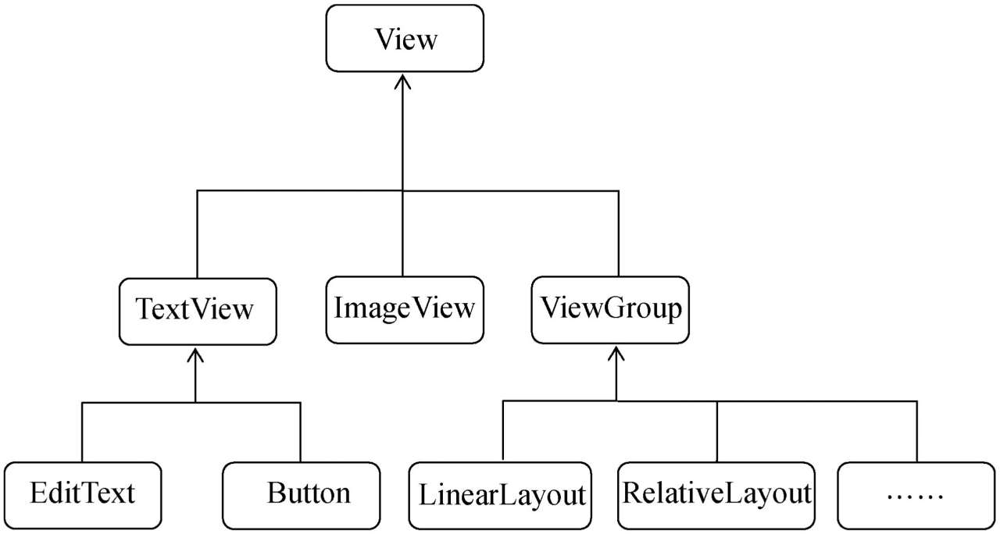
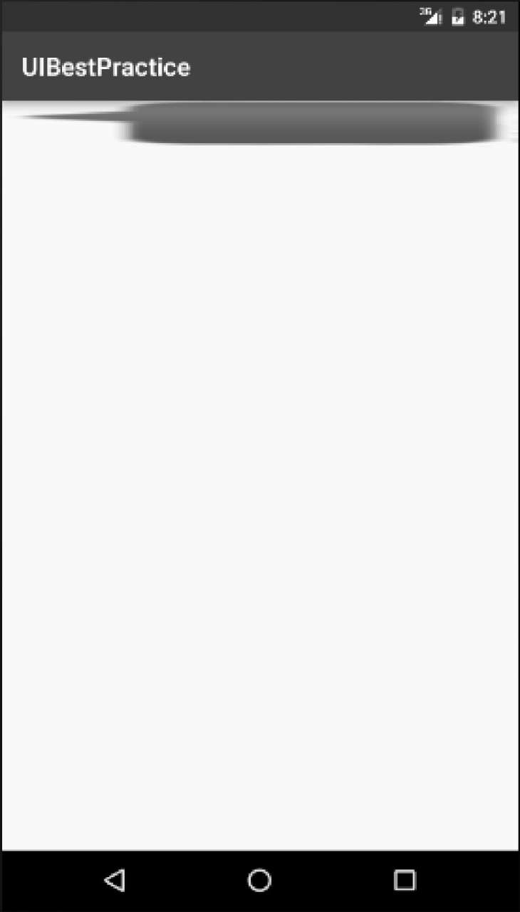

# UI开发

AS支持使用可视化的方式进行页面设计，即拖拽那些组件从而实现。但是，不利于知道背后的原理，且对于复杂的页面就无法单纯的用拖拽来实现。所以，学习的时候，都采用XML代码来实现页面设计。

# 常用控件的使用

## 1. TextView

Android中最简单的一个控件了，主要就是在页面上显示一段文本信息。

如下图就是一个最简单的布局：

```java
<?xml version="1.0" encoding="utf-8"?>
<LinearLayout xmlns:android="http://schemas.android.com/apk/res/android"
    android:orientation="vertical"
    android:layout_height="match_parent"
    android:layout_width="match_parent">
    <TextView
        android:layout_width="match_parent"
        android:layout_height="wrap_content"
        android:id="@+id/text_view"
        android:text="hello_world" />
</LinearLayout>
```

理解：可以看到里面的一个<TextView>就是一个控件

1. 使用`android:id`给当前控件定义了一个唯一标识符

2. **`android:layout_width`和`android:layout_height`**指定了控件的宽度和高度：**Android中所有的控件都具有这两个属性**

   有3个选项：

   - `match_parent`：当前控件的大小和父布局的大小一样，也就是由父布局来决定当前控件的大小——即**和父布局同步**
   - `fill_parent`：同上，但是官方更推荐`match_parent`
   - `wrap_content`：当前控件的大小能够刚好包含住里面的内容，**控件内容决定当前控件的大小**

   当然也可以指定一个固定的大小，这可能会存在适配的问题

   所以上面控件：宽度和父布局一样，即手机屏幕的宽度一样；高度足够包含住里面的内容就行

   

3. TextView的文字是**默认左上角对齐的**，所以如上图会显示在左侧

4. TextView可以修改**文字的对齐方式：`android:gravity`**

   注意，和**`android:layout_gravity`：是整个TextView控件在屏幕上的布局**（由于前面的宽度设定的是match_parent，所以设置为center，没有效果，因为控件整个已经居中了）

   对齐方式可选的有：

   - top、bottom、left、right、center

   可以**用`|`间隔来指定多个值**，效果等同于`center_vertical|center_horizontal`

   eg：

   ```xml
   android:gravity="center"
   ```

5. TextView可以修改文字的大小和颜色

   **`android:textSize`**属性可以指定文字的大小，字体大小使用sp作为单位

   通过**`android:textColor`**属性可以指定文字的颜色

   ```xml
   android:textSize="24sp"
   android:textColor="#ff0000"
   ```


## 2. Button

基本功能同TextView，能够设置控件的宽度、高度等，并且设置内容的字体大小、颜色等，具体可以看手册

```xml
<Button
        android:layout_width="match_parent"
        android:layout_height="wrap_content"
        android:textSize="20sp"
        android:textColor="#000000"
        android:id="@+id/button_1"
        android:text="button" />
```

可以根据下图发现，button有一些默认的格式，比如：内容自动居中并且内容会自动转换为大写；控件有圆角，控件有默认背景色（都是和TextView有不同的地方）。


**系统默认会对Button中的所有英文字母自动进行大写转换**，可以修改来禁用该默认配置。

`android:textAllCaps="false"`

button的通常使用：（在activity中已经用了很多了）

为Button的点击事件**注册一个监听器**

```java
public class MainActivity extends AppCompatActivity {

    @Override
    protected void onCreate(Bundle savedInstanceState) {
        super.onCreate(savedInstanceState);
        setContentView(R.layout.activity_main);
        Button button = (Button)findViewById(R.id.button_1);
        button.setOnClickListener(new View.OnClickListener() {
            @Override
            public void onClick(View v) {
                Toast.makeText(MainActivity.this, "you clicked me", Toast.LENGTH_SHORT).show();
            }
        });
    }
}
```

理解：

1. 在`onCreate()`里面创建一个监听器

2. 需要先获取该button对象——`findViewById`，记得要强转一下；后注册监听器`button.setOnClickListener()`

3. 由于`setOnClickListener()`需要传递一个参数，该参数是`View.OnclickedListener`，是一个View的内部接口，需要有类去实现该接口（即只需要实现`onClick()`方法），所以常见是传入一个**匿名内部类**，它继承了`View.OnclickedListener`，然后重写了该接口方法即可。当然，如果觉得这个不利于代码阅读，也可以使用实现接口的方式来进行注册

   eg：

   ```java
   public class MainActivity extends AppCompatActivity implements View.OnClickListener{	// 实现该接口
   
       @Override
       protected void onCreate(Bundle savedInstanceState) {
           super.onCreate(savedInstanceState);
           setContentView(R.layout.activity_main);
           Button button = (Button)findViewById(R.id.button_1);
           button.setOnClickListener(this);		// 直接调用自己即可，因为自己实现了该接口，也是该接口的子类
       }
   
       @Override
       public void onClick(View v) {		// 具体实现接口方法
           Toast.makeText(MainActivity.this, "you clicked me", Toast.LENGTH_SHORT).show();
   
       }
   }
   ```

   效果同上

## 3. EditText

EditText是用于和用户进行交互的另一个重要控件

特性：**允许用户在控件里输入和编辑内容**，程序会对该内容读取处理并做出响应。

应用场景：发短信、发微博、聊QQ等操作时——有关于用户输入的，都少不了它

```xml
<EditText
        android:layout_width="match_parent"
        android:layout_height="wrap_content"
        android:maxLines="2"
        android:id="@+id/edit_text"
        android:hint="tell me something"/>
```

理解：其他同上。

只关注特殊的：

1. `android:hint="xxxx"`——指定一段提示性的文本当我们输入任何内容时，这段文本就会自动消失

2. `android:maxLines="2"`——指定输入文本的显示最大不超过2行，如果超过了就上滚，EditText不会再无限扩张

   因为，EditText设置的高度的属性是`wrap_context`，所以如果输入的内容不断增加，这部分会不断扩张，界面会很难看，所以用`maxLines`这个属性可以控制住


EditText通常和button配合使用：点击按钮，来获取EditText里面的内容并做出处理

```java
public class MainActivity extends AppCompatActivity implements View.OnClickListener{
    private EditText editText;			// 实例变量
    @Override
    protected void onCreate(Bundle savedInstanceState) {
        super.onCreate(savedInstanceState);
        setContentView(R.layout.activity_main);
        Button button = (Button)findViewById(R.id.button_1);
        editText = (EditText)findViewById(R.id.edit_text);	// 同button方式一样，去获取editText对象
        button.setOnClickListener(this);
    }

    @Override
    public void onClick(View v) {		// 点击按钮就去获取editText的内容
        switch (v.getId()){
            case R.id.button_1:
                String input = editText.getText().toString();	// 获取editText的输入内容，并且转换为String类型
                Toast.makeText(MainActivity.this, input, Toast.LENGTH_SHORT).show();
                break;
            default: break;
        }
    }
}
```

理解：

1. editText对象的获取方式和button类似
2. 获取editText的内容的方式：`editText.getText()`，返回值是`Editable`类型，可以转换为string类型，通过`toString()`

## 4. ImageView

用于在界面上展示图片，图片通常都是放在**以“drawable”开头的目录下的**。一般工程下有一个drawable目录，不过由于这个目录没有指定具体的分辨率，所以一般不使用它来放置图片

将自己找的两张图片放到`mipmap-hdpi`文件下面

（ps：书中说自己新建一个`drawable-xhpi`，实验了一下发现不可以，应该是AS限定了不能取这个名字）

```xml
<ImageView
        android:layout_width="wrap_content"
        android:layout_height="wrap_content"
        android:id="@+id/image_view"
        android:src="@mipmap/img1" />
```

由于图片的宽度和高度是不确定的，所以设置都是跟随图片大小来确定ImageView的范围——这样就保证了不管图片的尺寸是多少，图片都可以完整地展示出来

如下图：


还可以配合按钮使用，点击按钮就切换图片：

```java
public class MainActivity extends AppCompatActivity implements View.OnClickListener{
    private EditText editText;
    private ImageView imageView;		// 私有实例变量

    @Override
    protected void onCreate(Bundle savedInstanceState) {
        super.onCreate(savedInstanceState);
        setContentView(R.layout.activity_main);
        Button button = (Button)findViewById(R.id.button_1);
        editText = (EditText)findViewById(R.id.edit_text);
        imageView = (ImageView)findViewById(R.id.image_view);	// 同上的获取方法
        button.setOnClickListener(this);
    }

    @Override
    public void onClick(View v) {
        switch (v.getId()){
            case R.id.button_1:
                imageView.setImageResource(R.mipmap.img2);	// 点击按钮就切换另一张图片
            default: break;
        }
    }
}
```

理解：

1. 获取`ImageView`对象的方法同button、TextView
2. 重新设置展示的图片`imageView.setImageResource(xxxx)`，这回注意到传递的参数都是int类型，即`R.id.xxx`/`R.mipmap.xxx`所有资源都有一个编号，通过传递编号来调用。

ps：根据上面的控件设计可以发现：Android控件的用法基本上都很相似：**给控件定义一个id，再指定控件的宽度和高度**，然后再适当**加入一些控件特有的属性**就差不多了。

## 5. ProcessBar

用于在界面上显示一个进度条，表示程序正在加载一些数据

```xml
<ProgressBar
        android:layout_width="match_parent"
        android:layout_height="wrap_content"
        android:id="@+id/process_bar" />
```

可以看到进度条一直在转（不会停），并且图形默认是在控件中居中的


那么如何控制，进度条在加载完成后消失呢？

首先了解：**Android控件的可见属性**——`android:visiablity`，**所有的Android控件都具有这个属性。**

有3种属性：

- visible：默认值，不设置该属性，都是默认可见的
- invisible：不可见，但是仍然占据所在的空间（可以认为是变透明了）
- gone：消失了，不可见且不占据所在的空间了

但是，xml就是一锤子买卖，在activity创建的时候就加载进去，里面空间的配置就不能变化了——能够通过代码来改变配置的状态**`setVisiablity`——来设置空间的可见状态**，可以传入`View.VISIBLE`、`View.INVISIBLE`和`View.GONE`这3种值

通过按钮来实现进度条是否可见：

```java
public class MainActivity extends AppCompatActivity implements View.OnClickListener{
    private EditText editText;
    private ImageView imageView;
    private ProgressBar progressBar;

    @Override
    protected void onCreate(Bundle savedInstanceState) {
        super.onCreate(savedInstanceState);
        setContentView(R.layout.activity_main);
        Button button = (Button)findViewById(R.id.button_1);
        editText = (EditText)findViewById(R.id.edit_text);
        imageView = (ImageView)findViewById(R.id.image_view);
        progressBar = (ProgressBar)findViewById(R.id.process_bar);
        button.setOnClickListener(this);
    }

    @Override
    public void onClick(View v) {
        switch (v.getId()){
            case R.id.button_1:
                if(progressBar.getVisibility() == View.GONE){	// 如果原来是消失的，那么变得可见
                    progressBar.setVisibility(View.VISIBLE);
                }
                else{							// 如果原来是可见的，那么变得消失
                    progressBar.setVisibility(View.GONE);
                }
            default: break;
        }
    }
}
```

理解：根据前面的命名规则，可以自然推出，获得当前控件的可视状态可以用`xxx.getVisiable()`，如果要设置可是状态可以用`xxx.setVisiable()`，同理，其他属性也可以用类似的方法

进度条还可以有不同的样式：默认是圆圈，还可以将它指定成水平进度条等很多形态

```xml
<ProgressBar
        android:layout_width="match_parent"
        android:layout_height="wrap_content"
        style="?android:progressBarStyleHorizontal"
        android:max="100"
        android:id="@+id/process_bar" />
```

理解：

1. 样式可以用`style="xxxx"`设定，注意这个没有android前缀了
2. 通过`android:max="xxxx"`给进度条设置一个最大值——默认进度条状态为0（且不会像圆圈一样滚动）

可以通过代码来改变进度：——通过按钮

```java
public void onClick(View v) {
    switch (v.getId()){
        case R.id.button_1:
            int process = progressBar.getProgress();
            process += 10;
            progressBar.setProgress(process);
        default: break;
    }
}
```

理解：按一下按钮，+10的进度，获得当前进度用`processBar.getProcess()`，设置当前进度用`processBar.setProcess()`


## 6. AlertDialog

在当前的界面弹出一个对话框，这个对话框是置顶于所有界面元素之上的，能够屏蔽掉其他控件的交互能力。**AlertDialog一般都是用于提示一些非常重要的内容或者警告信息**，eg：防止用户误删重要内容，在删除前弹出一个确认对话框

常用方法是写在逻辑代码中。

eg：点击按钮，弹出警告

```java
public void onClick(View v) {
    switch (v.getId()){
        case R.id.button_1:
            AlertDialog.Builder dialog= new AlertDialog.Builder(MainActivity.this);
            dialog.setTitle("ALERT");
            dialog.setMessage("important!!!");
            dialog.setCancelable(false);
            dialog.setPositiveButton("OK", new DialogInterface.OnClickListener() {
                @Override
                public void onClick(DialogInterface dialog, int which) {
                }
            });
            dialog.setNegativeButton("CANCEL", new DialogInterface.OnClickListener() {
                @Override
                public void onClick(DialogInterface dialog, int which) {
                }
            });
            dialog.show();
            break;
        default: break;
    }
}
```

理解：

1. 首先通过`AlertDialog.Builder`的构造方法创建一个`AlertDialog.Builder`实例，需要传递一个context上下文，就用当前activity

2. 设置标题：`dialog.setTitle("xxxx")`

3. 设置内容：`dialog.setMessage("xxxx")`

4. 是否能够通过back键关闭对话框：`dialog.setCancelable()`，传递的参数是true（可以使用back关闭）/false（不可以）

5. 设置确认按钮的内容和对应的逻辑操作：`dialog.setPositiveButton()`

   参数：按钮的内容：string类型；匿名内部类（和button的监视器类似）

   ```java
   dialog.setPositiveButton("OK", new DialogInterface.OnClickListener() {
       @Override
       public void onClick(DialogInterface dialog, int which) {
       }
   });
   ```

6. 设置取消按钮的内容和对应的逻辑操作：`dialog.setNegativeButton()`。具体方法同上

7. 设置警示框是否可见：`dialog.show()`

可以看到该控件位于所有的界面上面，必须先处理该控件，才能继续使用该app。


## 7. ProgressDialog

和AlertDialog有点类似，都可以在界面上弹出一个对话框，都能够屏蔽掉其他控件的交互能力。

主要不同的是应用场景，**ProgressDialog会在对话框中显示一个进度条**，一般用于表示当前操作比较耗时，让用户耐心地等待

用法和AlertDialog类似：

```java
public void onClick(View v) {
    switch (v.getId()){
        case R.id.button_1:
            ProgressDialog dialog = new ProgressDialog(MainActivity.this);
            dialog.setTitle("WAIT");
            dialog.setMessage("loading...");
            dialog.setCancelable(true);
            dialog.show();
            break;
        default: break;
    }
}
```

理解：

1. 创建ProgressDialog的实例对象：`new ProgressDialog(xxx)`，需要传递一个Context的上下文，就用当前activity即可
2. 设置对话框的开头：同上：`setTitle("xxx")`
3. 设置内容（即进度条旁边的内容，进度条默认是有的）：`setMessage("Xxx")`
4. 设置是否可以用back对话框：`setCancable(xxx)`，true/false，实验发现，想要关闭对话框，可以点页面的其他地方即可，如果配置了可以用back，那么back也可以
5. `show()`显示对话框

注意，该对话框没有按钮，默认有进度条——所以适用场景不同


# 四种布局

界面总是要由很多个控件组成的，需要借助布局来实现各个控件的合理摆放

概念：布局是一种可用于放置很多控件的**容器**，它可以按照一定的规律调整内部控件的位置，从而编写出精美的界面

布局的内部除了放置控件外，也可以放置布局，通过多层布局的嵌套，我们就能够完成一些比较复杂的界面实现

## 1. 线性布局

LinerLayout：线性布局，最常用的布局之一。将它所包含的控件**在线性方向上依次排列**

之前用到的都是`<LinearLayout></LinearLayout>`，并且都是在垂直方向上线性排列。

1. **`android:orientation = "xxxx"`**，选项：`vertical/horizontal`

   主要是配置了：`android:orientation="vertical"`，如果改成`horizontal`，那么就是在水平方向线性排列

   eg：

   ```xml
   <?xml version="1.0" encoding="utf-8"?>
   <LinearLayout xmlns:android="http://schemas.android.com/apk/res/android"
       android:orientation="horizontal"		// vertical
       android:layout_height="match_parent"
       android:layout_width="match_parent">
       <Button
           android:layout_width="wrap_content"
           android:layout_height="wrap_content"
           android:id="@+id/button_1"
           android:text="button" />
       <Button
           android:layout_width="wrap_content"
           android:layout_height="wrap_content"
           android:id="@+id/button_2"
           android:text="button_2" />
       <Button
           android:layout_width="wrap_content"
           android:layout_height="wrap_content"
           android:id="@+id/button_3"
           android:text="button_3" />
   </LinearLayout>
   ```

   

   修改成vertical：

   

   ps：在实验过程中发现，如果设置为水平方向线性，然后将button的`android:layout_width="match_parent"`，可以发现button都重叠在一起了。——因为单独一个控件就会将整个水平方向占满，其他的控件就没有可放置的位置了

   同样的道理，如果LinearLayout的排列方向是vertical，内部的控件就不能将高度指定为match_parent。

2. `android:layout_gravity="xxx"` 和`android:gravity="xxx"`，选项一样，常用的选项：`center/bottom/top`等

   

   需要注意的是：

   - 如果当前排列方向是vertical，那么控件的方向只能修改左右的

     ```xml
     <LinearLayout xmlns:android="http://schemas.android.com/apk/res/android"
         android:orientation="vertical"
         android:layout_height="match_parent"
         android:layout_width="match_parent">
         <Button
             android:layout_width="wrap_content"
             android:layout_height="wrap_content"
             android:layout_gravity="center_horizontal"	// 水平居中
             android:id="@+id/button_1"
             android:text="button" />
         <Button
             android:layout_width="wrap_content"
             android:layout_height="wrap_content"
             android:id="@+id/button_2"
             android:layout_gravity="left"	// 居左
             android:text="button_2" />
         <Button
             android:layout_width="wrap_content"
             android:layout_height="wrap_content"
             android:id="@+id/button_3"
             android:layout_gravity="right"		// 居右
             android:text="button_3" />
     </LinearLayout>
     ```

     

     垂直方向根据前后顺序排列，不可修改；水平方向的位置可以修改，但只能在垂直的范围内修改

   - 如果当前排列方向是horizontal，那么控件的方向只能修改上下的

     ```xml
     <LinearLayout xmlns:android="http://schemas.android.com/apk/res/android"
         android:orientation="horizontal"
         android:layout_height="match_parent"
         android:layout_width="match_parent">
         <Button
             android:layout_width="wrap_content"
             android:layout_height="wrap_content"
             android:layout_gravity="top"			// 置顶
             android:id="@+id/button_1"
             android:text="button" />
         <Button
             android:layout_width="wrap_content"
             android:layout_height="wrap_content"
             android:id="@+id/button_2"
             android:layout_gravity="center_vertical"		// 垂直居中
             android:text="button_2" />
         <Button
             android:layout_width="wrap_content"
             android:layout_height="wrap_content"
             android:id="@+id/button_3"
             android:layout_gravity="bottom"			// 置底
             android:text="button_3" />
     </LinearLayout>
     ```

     

     水平方向根据先后顺序排列；垂直方向可以在限定的水平范围内上下移动

3. 重要属性：**`android:layout_weight="xxx"`**，填入数字即可

   **它允许我们使用比例的方式来指定控件的大小**，它在手机屏幕的适配性方面可以起到非常重要的作用

   ```xml
   <LinearLayout xmlns:android="http://schemas.android.com/apk/res/android"
       android:orientation="horizontal"			// 水平布局
       android:layout_height="match_parent"
       android:layout_width="match_parent">
       <EditText
           android:layout_width="0dp"			// 宽度设置为0，高度跟随父布局（全部占满）
           android:layout_height="wrap_content"
           android:layout_weight="1"			// 占比为1/2（即水平）	
           android:id="@+id/edit_text"
           android:hint="type something"/>
       <Button
           android:layout_width="0dp"
           android:layout_height="wrap_content"
           android:layout_gravity="top"
           android:layout_weight="1"			// 水平占比为1/2（水平）
           android:id="@+id/button_1"
           android:text="button" />
   </LinearLayout>
   ```

   宽度都设置为0dp，然后使用`android:layout_weight=1`，实验中可以发现，两个控件是平分的。因为weight是按照比例来分配的

   系统会先把LinearLayout下所有控件指定的layout_weight值相加，得到一个总值，然后每个控件所占大小的比例就是用该控件的layout_weight值除以刚才算出的总值。所以总值为2，那么editText占比为1/2，所以就是占比一半

   

   这样是对半分。

   修改为`3:1`，那么就是如下的：

   

   可以只设定部分的控件的`android:layout_weight`，那么这些控件**会按照比例分配剩下来的空间**

   ```xml
   <EditText
       android:layout_width="0dp"
       android:layout_height="wrap_content"
       android:layout_weight="1"
       android:id="@+id/edit_text"
       android:hint="type something"/>
   <Button
       android:layout_width="wrap_content"
       android:layout_height="wrap_content"
       android:layout_gravity="top"
       android:id="@+id/button_1"
       android:text="button" />
   ```

   理解：只设定了editText按照比例分配；而button是按照内容分配。editText是获得剩下的所有空间

   

   ——使用这种方式编写的界面，不仅在各种屏幕的适配方面会非常好，而且看起来也更加舒服

## 2. 相对布局

RelativeLayout：相对布局，是最常用的布局之一。RelativeLayout显得更加随意一些，它可以通过**相对定位的方式**让控件出现在布局的任何位置。但是因此可用的属性多很多。

```xml
<RelativeLayout xmlns:android="http://schemas.android.com/apk/res/android"
    android:layout_height="match_parent"
    android:layout_width="match_parent">
    <Button
        android:layout_width="wrap_content"
        android:layout_height="wrap_content"
        android:id="@+id/button_1"
        android:layout_alignParentTop="true"
        android:layout_alignParentLeft="true"
        android:text="button_1" />
    <Button
        android:layout_width="wrap_content"
        android:layout_height="wrap_content"
        android:layout_alignParentTop="true"
        android:layout_alignParentRight="true"
        android:id="@+id/button_2"
        android:text="button_2" />
    <Button
        android:layout_width="wrap_content"
        android:layout_height="wrap_content"
        android:layout_alignParentBottom="true"
        android:layout_alignParentLeft="true"
        android:id="@+id/button_3"
        android:text="button_3" />
    <Button
        android:layout_width="wrap_content"
        android:layout_height="wrap_content"
        android:layout_alignParentBottom="true"
        android:layout_alignParentRight="true"
        android:id="@+id/button_4"
        android:text="button_4" />
    <Button
        android:layout_width="wrap_content"
        android:layout_height="wrap_content"
        android:layout_centerInParent="true"
        android:id="@+id/button_5"
        android:text="button_5" />
</RelativeLayout>
```

理解：关键的是`android:layout_alignParentLeft`、`android:layout_alignParentRight`、`android:layout_alignParentTop`、`android:layout_alignParentBottom`、`android:layout_centerInParent`——这些都是相对父布局的定位方式

也可以相对于某个控件进行布局

```xml
<RelativeLayout xmlns:android="http://schemas.android.com/apk/res/android"
    android:layout_height="match_parent"
    android:layout_width="match_parent">
    <Button
        android:layout_width="wrap_content"
        android:layout_height="wrap_content"
        android:id="@+id/button_1"
        android:layout_centerInParent="true"
        android:text="button_1" />
    <Button
        android:layout_width="wrap_content"
        android:layout_height="wrap_content"
        android:layout_above="@id/button_1"
        android:layout_toLeftOf="@id/button_1"
        android:id="@+id/button_2"
        android:text="button_2" />
    <Button
        android:layout_width="wrap_content"
        android:layout_height="wrap_content"
        android:layout_above="@id/button_1"
        android:layout_toRightOf="@id/button_1"
        android:id="@+id/button_3"
        android:text="button_3" />
    <Button
        android:layout_width="wrap_content"
        android:layout_height="wrap_content"
        android:layout_below="@id/button_1"
        android:layout_toLeftOf="@id/button_1"
        android:id="@+id/button_4"
        android:text="button_4" />
    <Button
        android:layout_width="wrap_content"
        android:layout_height="wrap_content"
        android:layout_below="@id/button_1"
        android:layout_toRightOf="@id/button_1"
        android:id="@+id/button_5"
        android:text="button_5" />
</RelativeLayout>
```

主要就是4个属性设置的`android:layout_above="xxxx"`，参数是指定的控件——是相对另一个控件的位置，格式`@id/xxx`同样`android:layout_below="xxxx"`，`android:layout_toLeftOf="xxxx"`，`android:layout_toRightOf="xxxx"`，就是用来实现相对其他控件相对位置布局的。

还需要注意：当一个控件去引用另一个控件的id时，该控件一定要定义在引用控件的后面，不然会出现找不到id的情况


## 3. 帧布局

FrameLayout：帧布局，功能少很多，应用场景少很多。

这种布局没有方便的定位方式，所有的控件都会**默认摆放在布局的左上角**——且会堆在一起

```xml
<FrameLayout xmlns:android="http://schemas.android.com/apk/res/android"
    android:layout_height="match_parent"
    android:layout_width="match_parent">
    <TextView
        android:layout_width="wrap_content"
        android:layout_height="wrap_content"
        android:id="@+id/text_view"
        android:text="tell me something: i love you" />
    <ImageView
        android:layout_width="wrap_content"
        android:layout_height="wrap_content"
        android:id="@+id/image_view"
        android:src="@mipmap/ic_launcher_round" />
</FrameLayout>
```

会发现所有组件都默认堆在左上角


也可以修改布局，用`android:layout_gravity="xxx"`

```xml
<FrameLayout xmlns:android="http://schemas.android.com/apk/res/android"
    android:layout_height="match_parent"
    android:layout_width="match_parent">
    <TextView
        android:layout_width="wrap_content"
        android:layout_height="wrap_content"
        android:layout_gravity="left"
        android:id="@+id/text_view"
        android:text="tell me something: i love you" />
    <ImageView
        android:layout_width="wrap_content"
        android:layout_height="wrap_content"
        android:layout_gravity="right"
        android:id="@+id/image_view"
        android:src="@mipmap/ic_launcher_round" />
</FrameLayout>
```


FrameLayout由于定位方式的欠缺，导致它的应用场景也比较少，不过在下一章中介绍碎片的时会用到它的。

## 4. 百分比布局

背景：**只有LinearLayout支持使用layout_weight属性来实现按比例指定控件大小的功能**，RelativeLayout和FrameLayout都不支持

为此，Android引入了一种全新的布局方式来解决此问题——**百分比布局——允许直接指定控件在布局中所占的百分比**，这样的话就可以轻松实现平分布局甚至是任意比例分割布局的效果了。

分类：**提供了`PercentFrameLayout`和`PercentRelativeLayout`这两个全新的布局**，根据命名规律可以发现分别是对FrameLayout和RelativeLayout进行了功能扩展（LinearLayout已经能够通过weight来实现相对布局了，不需要扩展了）

提前准备：百分比布局是新布局，所以需要导包——Android团队将百分比布局定义在了support库当中，我们只需要在**项目的build.gradle中添加百分比布局库的依赖**，就能保证百分比布局在Android所有系统版本上的兼容性了。

具体操作（和书上有些区别）：

```groovy
dependencies {
    ....
    // for layout in percentLayout for frameLayout & relativeLayout
    implementation "androidx.percentlayout:percentlayout:1.0.0"     
}
```

每当修改了任何gradle文件时，Android Studio都会弹出提示，主要就是通知：gradle文件自上次同步之后又发生了变化，需要再次同步才能使项目正常工作。只需要点击Sync Now就可以了，然后gradle会开始进行同步，把我们新添加的百分比布局库引入到项目当中。

```xml
<?xml version="1.0" encoding="utf-8"?>
<androidx.percentlayout.widget.PercentFrameLayout
    xmlns:android="http://schemas.android.com/apk/res/android"
    xmlns:app="http://schemas.android.com/apk/res-auto"
    android:layout_width="match_parent"
    android:layout_height="match_parent">
    <Button
        android:id="@+id/button1"
        android:text="Button 1"
        android:layout_gravity="left|top"
        app:layout_widthPercent="50%"
        app:layout_heightPercent="50%"
        />
    <Button
        android:id="@+id/button2"
        android:text="Button 2"
        android:layout_gravity="right|top"
        app:layout_widthPercent="50%"
        app:layout_heightPercent="50%"
        />
    <Button
        android:id="@+id/button3"
        android:text="Button 3"
        android:layout_gravity="left|bottom"
        app:layout_widthPercent="50%"
        app:layout_heightPercent="50%"
        />
    <Button
        android:id="@+id/button4"
        android:text="Button 4"
        android:layout_gravity="right|bottom"
        app:layout_widthPercent="50%"
        app:layout_heightPercent="50%"
        />
</androidx.percentlayout.widget.PercentFrameLayout>
```

理解：

1. 由于百分比布局并不是内置在系统SDK当中的，所以需要把完整的包路径写出来——`androidx.percentlayout.widget.PercentFrameLayout`

2. 必须定义一个app的命名空间，这样才能使用百分比布局的自定义属性——`xmlns:app="http://schemas.android.com/apk/res-auto"`

   `app:layout_widthPercent="xxx"`、`app:layout_heightPercent="xxx"`两个属性可以按照比例来设定

   ——之所以能使用**app前缀的属性就是因为刚才定义了app的命名空间**

   能使用android前缀的属性也是同样的道理（因为前面定义了`xmlns:android="xxxx"`，这个就是定义了命名空间）

3. 用`layout_gravity`决定四个按钮的位置，可以用新的方法决定`layout_gravity="right|bottom"`

4. 这样写好之后是可以正常运行的，但是AS内置的语法检查器可能会提示错误：认为每一个控件都应该通过android:layout_width和android:layout_height属性指定宽高才是合法的——可以直接忽略，因为百分比布局是用`layout_widthPercent/layout_heightPercent`来指定宽和长的


PercentRelativeLayout类似，不研究。


# 自定义控件

先关注一下，控件、布局之间的继承关系：



所用的所有控件都是直接或间接继承自View的，所用的所有布局都是直接或间接继承自ViewGroup的，而ViewGroup也是继承自View的，所以控件、布局都有一个公共的祖先：View

View：**Android中最基本的一种UI组件，它可以在屏幕上绘制一块矩形区域，并能响应这块区域的各种事件**。所以，使用的各种控件其实就是在View的基础之上又添加了各自特有的功能。而ViewGroup则是一种特殊的View，它可以包含很多子View和子ViewGroup，是一个用于放置控件和布局的容器（递归调用）。

当系统自带的控件并不能满足我们的需求时，则可以**利用上面的继承结构来创建自定义控件**。有2种方法创建自定义控件：

## 1. 引入布局

目标：模仿iPhone的风格，在界面的顶部放置一个标题栏，标题栏上会有一到两个按钮可用于返回或其他操作——创建一个自定义的标题栏。

类似于这样：


如果单纯实现这样一个页面很简单：只需要2个button + 1个textView就可以实现，但是如果需要整个app都要这样的风格，不可能重复画轮子——可以使用**引入布局的方式**来解决这个问题，即将一个布局作为模板使用

```xml
<LinearLayout
    xmlns:android="http://schemas.android.com/apk/res/android"
    android:layout_width="match_parent"		// 标题宽度跟随父布局，整个长度
    android:layout_height="wrap_content"	// 标题高度包住内容即可
    android:background="@mipmap/title_bg">
    <Button
        android:id="@+id/title_back"

        android:layout_width="wrap_content"
        android:layout_height="wrap_content"
        android:layout_gravity="center"
        android:layout_margin="5dp"
        android:background="@mipmap/back_bg"

        android:text="Back"
        android:textColor="#fff"
        android:textAllCaps="false" />
    <TextView
        android:id="@+id/title_text"

        android:layout_width="0dp"
        android:layout_height="wrap_content"
        android:layout_gravity="center"
        android:layout_weight="1"

        android:text="Title Text"
        android:gravity="center"
        android:textColor="#fff"
        android:textSize="24dp" />
    <Button
        android:id="@+id/title_edit"

        android:layout_width="wrap_content"
        android:layout_height="wrap_content"
        android:layout_gravity="center"
        android:layout_margin="5dp"
        android:background="@mipmap/edit_bg"

        android:text="Edit"
        android:textColor="#fff"
        android:textAllCaps="false" />
</LinearLayout>
```

理解：

1. 新的属性：`android:background="xxxx"`——填入的内容是按照图片存放的位置，不需要填入图片的类型后缀。`@mipmap/xxx`
2. 控件新的属性：`android:layout_margin="xxx"`，它可以指定控件在上下左右方向上偏移的距离（上下左右边距都一样），当然也可以使用`android:layout_marginLeft`或`android:layout_marginTop`等属性来单独指定控件在某个方向上偏移的距离。

编写完成，就要看如何使用了

```xml
// activity_main.xml
<LinearLayout
    xmlns:android="http://schemas.android.com/apk/res/android"
    android:layout_width="match_parent"
    android:layout_height="match_parent" >
    <include layout="@layout/title_model"/>
</LinearLayout>
```

理解：只需要<include>就可以引入了——<include layout="xxxx" />

但是，系统会自带一个标题栏，所以需要将默认的标题栏隐藏掉。

```java
protected void onCreate(Bundle savedInstanceState) {
    super.onCreate(savedInstanceState);
    setContentView(R.layout.activity_main);
    ActionBar actionBar = getSupportActionBar();
    if(actionBar != null){
        actionBar.hide();
    }
}
```

理解：

1. 调用了`getSupportActionBar()`获得ActionBar的实例对象，然后将该实例对象隐藏起来：`actionBar.hide()`

   （p.s. 12章会讲ActionBar）


## 2. 创建自定义控件

针对某些控件存在统一的功能，如果这个控件每次使用都要在对应的java文件中注册并且响应，那么又是存在重复代码的问题

eg：标题栏的返回按钮：都是统一功能——点击之后销毁当前活动，可以写一个统一的代码

——**使用自定义控件**的方式。

```java
public class TitleLayout extends LinearLayout {
    public TitleLayout(Context context, AttributeSet attributeSet){	// 构造函数
        super(context, attributeSet);
        LayoutInflater.from(context).inflate(R.layout.title_model, this);
        Button backButton = (Button) findViewById(R.id.title_back);
        Button editButton = (Button) findViewById(R.id.title_edit);
        backButton.setOnClickListener(new OnClickListener() {
            @Override
            public void onClick(View v) {
                ((Activity)getContext()).finish();
            }
        });
        editButton.setOnClickListener(new OnClickListener() {
            @Override
            public void onClick(View v) {
                Toast.makeText(getContext(), "you clicked edit button", Toast.LENGTH_SHORT).show();
            }
        });
    }
}

```

理解：

1. 该标题栏布局继承了<LinearLayout>，因为前面设定的标题栏是在<LinearLayout>下的一个布局。

2. 重写了LinearLayout中带有两个参数的构造函数：

   - 先继承父类的`super(xxx)`；

   - 在构造函数中需要对标题栏布局进行**动态加载，这就要借助`LayoutInflater`来实现**了：`LayoutInflater.from(context)`——构造出一个`LayoutInflater`的实例对象，然后用`inflate(xxx)`动态加载一个布局——就将功能和布局绑定起来了

     inflate需要传递的是两个参数：需要加载的布局文件的id——`R.layout.title_main`（就是上面的标题栏布局），一个是在前面布局上的父布局，这边就是该文件自己（本身继承自LinearLayout，所以也是布局类型），所以就用this

3. 然后为标题栏的两个按钮注册点击事件——同之前的操作：获取该按钮id，然后注册+编写响应操作

   注意这边的Toast，第一个参数是`Context`，可以通过`getContext()`获得

   注意finish需要指定activity，所以可以先获得context：`getContext()`，然后强制类型转换即可，因为一个活动本身也是一个context——`((Activity)getContext()).finish()`

——这样**自定义控件就完成了（实际上就是写一个java文件，继承自某个android内置布局，然后重写构造方法，动态加载之前写好的模板布局，并且把需要的响应等逻辑操作编写在里面）**

那么该如何使用呢？——在xml文件中导入，用绝对路径：

```xml
<LinearLayout
    xmlns:android="http://schemas.android.com/apk/res/android"
    android:layout_width="match_parent"
    android:layout_height="match_parent" >
    <com.example.uitest.TitleLayout					
        android:layout_width="wrap_content"
        android:layout_height="wrap_content" />
</LinearLayout>
```

理解：可以将自定义控件看成一个普通的控件，eg: button，导入方法一样，只不过导入的时候需要写的是绝对路径——指明控件的完整类名，即`包名 + 类名`——效果和上面的include一样，只不过这个还增加了逻辑响应。


# ListView（最常见的控件）

ListView是**最常见的控件之一，几乎所有的应用程序都会使用到**。

背景：程序有大量东西需要显示，但是一个页面显示的内容有限，则需要扩展，所以设计了上下滑动方式

ListView允许用户通过**手指上下滑动的方式**将屏幕外的数据滚动到屏幕内，同时屏幕上原有的数据则会滚动出屏幕。

## 1. ListView的简单用法

由于ListView是控件，所以需要添加到布局文件中，添加布局比较简单：

```xml
<LinearLayout
    xmlns:android="http://schemas.android.com/apk/res/android"
    android:layout_width="match_parent"
    android:layout_height="match_parent" >
    <ListView
        android:id="@+id/list_view"
        android:layout_width="match_parent"
        android:layout_height="match_parent" />
</LinearLayout>
```

理解：关键词就是<ListView>，然后添加id、layout_width、layout_height这些控件必须有的，就完成了。AS给的外观大致是这样：


可以看到一条条栏目。

但是，此时只是引入了布局，里面还没有填入数据、

ListView是用于展示大量数据的，所以需要有数据——可以是从网上下载的，也可以是从数据库中读取的，应该视具体的应用程序场景而定。

关于ListView数据的导入需要写在java的逻辑中：

```java
public class MainActivity extends AppCompatActivity implements View.OnClickListener{
    private String[] data = { "Apple", "Banana", "Orange", "Watermelon",
                             "Pear", "Grape", "Pineapple", "Strawberry", "Cherry", "Mango",
                             "Apple", "Banana", "Orange", "Watermelon", "Pear", "Grape",
                             "Pineapple", "Strawberry", "Cherry", "Mango" };
    @Override
    protected void onCreate(Bundle savedInstanceState) {
        super.onCreate(savedInstanceState);
        setContentView(R.layout.activity_main);
        ArrayAdapter<String> arrayAdapter = new ArrayAdapter<String>(MainActivity.this, 				                                                           android.R.layout.simple_list_item_1, data);
        ListView listView = (ListView) findViewById(R.id.list_view);
        listView.setAdapter(arrayAdapter);
    }
```

理解：

1. 首先，这边是直接创建一个数组，存放很多数据——`String[] data={....}`

2. 接着，数组中的数据是无法直接传递给ListView的，我们还需要借助**适配器来完成——`ArrayAdapter`**——它可以通过泛型来指定要适配的数据类型，然后在构造函数中把要适配的数据传入。

   ArrayAdapter有多个构造函数的重载，根据数据的实际情况选择。这边提供的是String类型，所以传入的泛型类型是String

   **构造函数的参数：当前的上下文，ListView子项布局的id，数据对象**

   `android.R.layout.simple_list_item_1`是作为ListView子项布局的id，它实际上是Android内置的布局文件，里面只有一个TextView，可以简单的显示一个文本，即数据中的一个条目就是一个子项，就是一个TextView

   ps：Android提供了很多适配器的实现类，但是书中推荐用ArrayAdapter。

   ——这样，ArrayAdapter实例对象就构建完成了

3. 最后调用`ListView`的**`setAdapter()`**方法，将构建好的适配器传递进去，那么ListView和数据的关联就完成了，就可以显示数据了


它实际上是可以上下滚动的。

## 2. 定制ListView页面

上面是对ListView的简单应用，比较单调。我们需要丰富内容，那么就需要定制该页面。

目标：将前面的单调的水果名称展示页面加上对应的图标，每个条目左边图标右边文字

步骤：

1. 先创建一个Fruit类，用来存放每个水果对应的条目

   包括：水果名字（String）、水果图片的路径（int——因为），对应的构造方法和get属性的方法

   ```java
   public class Fruit {
       private String name;
       private int imgId;
       public Fruit(String name, int imgId){
           this.name = name;
           this.imgId = imgId;
       }
       public int getImgId() {
           return imgId;
       }
       public String getName() {
           return name;
       }
   }
   ```

2. 后面创建一个条目的布局——类比于内置的布局：`android.R.layout.simple_list_item_1`，即自定义一个布局：图片 +文字

   ```xml
   <LinearLayout
       xmlns:android="http://schemas.android.com/apk/res/android"
       android:layout_width="match_parent"
       android:layout_height="wrap_content">
       <ImageView
           android:id="@+id/fruit_img"
   
           android:layout_width="wrap_content"
           android:layout_height="wrap_content" />
       <TextView
           android:id="@+id/fruit_name"
   
           android:layout_width="wrap_content"
           android:layout_height="wrap_content"
           android:layout_gravity="center_vertical"
           android:layout_margin="10dp"/>
   </LinearLayout>
   ```

   理解：

   1. layout的布局的宽度`match_parent`，高度`wrap_content`，因为是一个条目，不能宽度充满整个空间，只需要包住内容即可
   2. 添加`ImageView`，存放图片，宽度和高度都和内容一致
   3. 添加`TextView`，存放文本内容，宽度和高度都和内容一致，为了和图片保持一致，所以要将文本内容在垂直方向上居中——在当前的laypout中居中

3. 自定义一个适配器，对应`ArrayAdapter`：

   ```java
   public class FruitAdapter extends ArrayAdapter<Fruit> {
       private int rID;	// 保存当前布局条目id
       public FruitAdapter(Context context, int textViewRID, List<Fruit> objs){
           super(context, textViewRID, objs);
           rID = textViewRID;
       }
   
       @NonNull
       @Override
       public View getView(int position, View convertView, ViewGroup parent) {
           Fruit fruit = getItem(position);        // 获得当前的水果实例
           View view = LayoutInflater.from(getContext()).inflate(rID, parent, false);  // 获得当前的布局
           ImageView fruitImg = (ImageView) view.findViewById(R.id.fruit_img);     // 当前布局的图片对象
           TextView fruitName = (TextView) view.findViewById(R.id.fruit_name);     // 当前布局的文本对象
           fruitImg.setImageResource(fruit.getImgId());            // 设置当前的图片对象的具体图片内容
           fruitName.setText(fruit.getName());         // 设置当前文本对象的具体的文本内容
           return view;            // 然后将设置好的内容返回——就是一个条目
       }
   }
   ```

   理解：

   1. 该FruitAdapter继承自ArrayAdapter，并将泛型指定为Fruit类

   2. 重写构造方法：需要有的参数和`ArrayAdapter`对应：上下文、ListView子项布局的id和数据，主要就是调用父类的构造方法，并且保存当前的条目布局的id，主要是给view使用——`inflate()`（第一个参数，是需要加载的布局文件的id）

   3. 另外又重写了**getView()方法**，这个方法在每个子项被滚动到屏幕内的时候会被调用

      - 首先通过**`getItem()`**方法得到当前项的Fruit实例
      - 使用LayoutInflater来为这个子项加载我们传入的布局，首先需要获得当前的上下文`getContext()`，然后调用`inflate()`：需要动态加载的布局文件id，父布局，然后是false——**表示只让我们在父布局中声明的layout属性生效，但不会为这个View添加父布局，因为一旦View有了父布局之后，它就不能再添加到ListView中了**（暂时理解到，这是ListView中的标准写法）
      - 之后就是获取该布局中的两个元素`TextView`和`ImageView`的对象，然后对它们分别设置对应的文字和图片——就是当前fruit item的两个属性，然后将该配置好的view返回

      ——自定义的适配器就完成了

   4. 然后在`activity_main.xml`中引入`ListView`控件，同上的简单用法

      ```xml
      <LinearLayout
          xmlns:android="http://schemas.android.com/apk/res/android"
          android:layout_width="match_parent"
          android:layout_height="match_parent" >
          <ListView
              android:id="@+id/list_view"
              android:layout_width="match_parent"
              android:layout_height="match_parent" />
      </LinearLayout>
      ```

   5. 然后在MainActivity中进行使用：

      ```java
      public class MainActivity extends AppCompatActivity{
          private List<Fruit> fruitList = new ArrayList<>();
          @Override
          protected void onCreate(Bundle savedInstanceState) {
              super.onCreate(savedInstanceState);
              setContentView(R.layout.activity_main);
              initFruit();
              FruitAdapter fruitAdapter = new FruitAdapter(MainActivity.this, R.layout.fruit_item, fruitList);
              ListView listView = (ListView) findViewById(R.id.list_view);
              listView.setAdapter(fruitAdapter);
          }
      
          private void initFruit(){
              for(int i = 0; i < 2; i++){
                  Fruit apple = new Fruit("apple", R.mipmap.apple_pic);
                  fruitList.add(apple);
                  ....
                  Fruit mango = new Fruit("mango", R.mipmap.mango_pic);
                  fruitList.add(mango);
              }
          }
      }
      ```

      - 需要提供数据：使用一个List，用来Fruit类型的数据，并且编写一个`initFruit`用来初始化数据——主要是创建fruit实例对象和将该对象添加到list中，该list会作为数据传入
      - 在`onCreate`中创建一个`FruitAdapter`的实例对象，将三个参数传入：上下文、条目布局文件id、数据
      - 然后获取当前页面对应的布局文件，并且将FruitAdapter对象作为参数导入`listview.setAdapter`

   ——至此，定制控件已经完成。

   可以发现一个定制的步骤：首先需要定制页面，即创建一个xml文件，将每个item的布局情况定下来，上面就是`fruit_item.xml`；后面一般会创建一个对应的类，将一个item中用到的数据包装成一个对象，对应上面的`Fruit.java`；自定义一个适配器，是继承自ArrayAdapter，然后重写构造方法和getView()方法——将xml文件和其动态绑定起来，并且也将类对象对应起来，对应上面的`FruitAdapter.java`；——定制已经完成

   使用：在xml文件中就按照普通的ListView的控件的使用方法一样；在java文件中，需要先创建好数据，然后创建一个自定义适配器的对象，调用构造方法将参数传递过去即可，然后用ListView的setAdapter导入该对象即可。

   

## 3. 提升ListView的运行效率

说ListView这个控件很难用，是因为它有很多细节可以优化——运行效率就是很重要的一点。

问题：前面创建的ListView的运行效率是很低的，因为在FruitAdapter的getView()方法中，每次都将布局重新加载了一遍，即每渲染一个item，都需要重新加载view布局。当ListView快速滚动的时候，这就会成为性能的瓶颈。

这边可以用到：getView()方法中还有一个**convertView参数，这个参数用于将之前加载好的布局进行缓存**，以便之后可以进行重用。——只需要在加载view的时候进行判断，如果convertView有内容，就不用再加载view，可以使用缓存的；而如果convert为空，说明是第一次加载，则需要重新加载

```java
if(convertView == null){
    view = LayoutInflater.from(getContext()).inflate(rID, parent, false);
}
else{
    view = convertView;
}
```

优化之后，页面更加顺滑一点了

还能再优化：

问题：每次在getView()方法中还是会调用View的findViewById()方法来获取一次控件的实例——借助一个ViewHolder来对这部分性能进行优化

```java
public class FruitAdapter extends ArrayAdapter<Fruit> {
    private int rID;
    public FruitAdapter(Context context, int textViewRID, List<Fruit> objs){
        super(context, textViewRID, objs);
        rID = textViewRID;
    }

    @Override
    public View getView(int position, View convertView, ViewGroup parent) {
        Fruit fruit = getItem(position);        // 获得当前的水果实例
        View view;
        ViewHolder viewHolder;
        if (convertView == null){
            view =LayoutInflater.from(getContext()).inflate(rID, parent, false);
            viewHolder = new ViewHolder();
            viewHolder.imageView = (ImageView) view.findViewById(R.id.fruit_img);
            viewHolder.textView = (TextView) view.findViewById(R.id.fruit_name);
            view.setTag(viewHolder);
        }
        else {
            view = convertView;
            viewHolder = (ViewHolder) view.getTag();
        }
        viewHolder.imageView.setImageResource(fruit.getImgId());          // 设置当前的图片对象的具体图片内容
        viewHolder.textView.setText(fruit.getName());         // 设置当前文本对象的具体的文本内容
        return view;            // 然后将设置好的内容返回——就是一个条目
    }
    class ViewHolder{       // 创建一个内部类
        ImageView imageView;
        TextView textView;
    }
}
```

理解：

1. 新增了一个内部类ViewHolder，用于对控件的实例进行缓存
2. 当convertView为null的时候，创建一个ViewHolder对象，并将控件的实例都存放在ViewHolder里，然后调用View的setTag()方法，将ViewHolder对象存储在View中。
3. 当convertView不为null的时候，则调用View的getTag()方法，把ViewHolder重新取出。这样所有控件的实例都缓存在了ViewHolder里，就没有必要每次都通过findViewById()方法来获取控件实例了。

——可以发现，性能修改就在构造的适配器中，减去不需要的重复操作，用缓存保存避免重新加载——`convertView`是默认的缓存；而`View`可以提供显式的缓存，`setTag`和`getTag`对应使用，可以获得之前的缓存

## 4. ListView的点击事件

目标：点击每个item要进行一定的响应

```java
protected void onCreate(Bundle savedInstanceState) {
    super.onCreate(savedInstanceState);
    setContentView(R.layout.activity_main);
    initFruit();
    FruitAdapter fruitAdapter = new FruitAdapter(MainActivity.this, R.layout.fruit_item, fruitList);
    ListView listView = (ListView) findViewById(R.id.list_view);
    listView.setAdapter(fruitAdapter);
    listView.setOnItemClickListener(new AdapterView.OnItemClickListener() {
        @Override
        public void onItemClick(AdapterView<?> parent, View view, int position, long id) {
            Fruit fruit = fruitList.get(position);
            Toast.makeText(MainActivity.this, fruit.getName(), Toast.LENGTH_SHORT).show();
        }
    });
}
```

理解：

使用`setOnItemClickListener()`可以注册一个item的监听器，传递的参数是`OnItemClickListener`类型，是AdapterView的内部接口，这边同`View.OnClickListener`，实现一个匿名内部类，然后实现`onItemClick`的方法

如果用户点击了任何一个item就会回调onItemClick()方法。在这个方法中可以通过**position参数**判断出用户点击的是哪一个子项，然后获取到相应的水果，并通过Toast将水果的名字显示出来。


# 滚动控件RecyclerView

背景：ListView普通的使用性能比较差，如果进行性能优化效率较好，但是性能优化比较难；ListView的扩展性不够好，只能实现数据的纵向滚动，不能实现横向滚动。

那么可以使用：RecyclerView，它可以说是一个增强版的ListView，不仅可以轻松实现和ListView同样的效果，还优化了ListView中存在的各种不足之处。目前Android官方更加推荐使用RecyclerView

## 1. 导入

RecyclerView不属于内部库，所以和PercentView一样，为了让RecyclerView在所有Android版本上都能使用，Android团队采取了同样的方式，将RecyclerView定义在了support库当中，我们需要手动导入——在项目的build.gradle中添加相应的依赖库。

这边提供另一种自动方法：

右键`app`文件夹 -> 选择`Open Module Setting` -> 选择`Dependencies` -> 点击➕，add Dependecies -> 选择第一个`Library Dependency` -> 输入要添加的库`recyclerview` -> 等出现之后选择google开发的那个（默认选中） -> 点击ok，即可导入


完成之后可以看一下`app/build.gradle`，可以发现第36行就是新添加的依赖库：


这个步骤主要针对的是，只知道要添加的对象名字，至于版本啥的毫无所知，那么可以用该方法找到最新的版本并且自动添加

## 2. RecyclerView的基本用法

目的：用RecyclerView实现ListView同样的效果

前面创建的Fruit.java和Fruit_item.xml可以复用，在此基础上需要重新自定义一个适配器——`RecyclerFruitAdapter.java`，因为继承的类都不一样了，肯定需要再写一个：

```java
public class RecyclerFruitAdapter extends RecyclerView.Adapter<RecyclerFruitAdapter.ViewHolder>{
    private List<Fruit> recyclerFruitList;
    static class ViewHolder extends RecyclerView.ViewHolder{
        ImageView imageView;
        TextView textView;
        public ViewHolder(View view){
            super(view);
            imageView = (ImageView) view.findViewById(R.id.fruit_img);
            textView = (TextView) view.findViewById(R.id.fruit_name);
        }
    }
    public RecyclerFruitAdapter(List<Fruit> recyclerFruitList){
        this.recyclerFruitList = recyclerFruitList;
    }

    @NonNull
    @Override
    public ViewHolder onCreateViewHolder(@NonNull ViewGroup parent, int viewType) {
        View view = LayoutInflater.from(parent.getContext()).inflate(R.layout.fruit_item, parent, false);
        ViewHolder holder = new ViewHolder(view);
        return holder;
    }

    @Override
    public void onBindViewHolder(@NonNull ViewHolder holder, int position) {
        Fruit fruit = recyclerFruitList.get(position);
        holder.imageView.setImageResource(fruit.getImgId());
        holder.textView.setText(fruit.getName());
    }

    @Override
    public int getItemCount() {
        return recyclerFruitList.size();
    }
}
```

理解：

1. 继承自`RecyclerView.Adapter`，并且指定泛类是`RecyclerFruitAdapter.ViewHolder`——是下面实现的一个内部类
2. 首先看内部类：ViewHolder，对照的是RecyclerAdater的内部类ViewHolder，且继承的也是它。该内部类：创建了两个实例变量；构造函数，要传入一个View参数，这个参数通常就是RecyclerView子项的最外层布局，那么就能够将view的里面两个控件对象取出并且存放到该实例变量中。
3. RecyclerFruitAdapter也有构造方法：要展示的数据源传进来，并赋值给一个全局变量
4. 由于继承，所以必须要重写：`onCreateViewHolder()`、`onBindViewHolder()`和`getItemCount()`这3个方法
   - `onCreateViewHolder()`：用来创建ViewHolder实例的，获得当前的view：即用LayoutInflater，但是传递的参数稍微有点不同：**`LayoutInflater.from(parent.getContext()).inflate(R.layout.fruit_item, parent, false);`**，记住即可
   - `onBindViewHolder()`：用于对RecyclerView子项的数据进行赋值的，会在每个子项被滚动到屏幕内的时候执行。可以通过position参数得到当前项的Fruit实例，然后再将当前fruit对象的数据内容设置到ViewHolder的ImageView和TextView当中即可——那么ViewHolder的数据绑定完成
   - `getItemCount()`：用于告诉RecyclerView一共有多少子项，直接返回数据源的长度就可以了。

适配器已经完成，下面就是使用了：

activity_main.xml已经导入了recyclerView

```java
public class MainActivity extends AppCompatActivity implements View.OnClickListener{
    private List<Fruit> fruitList = new ArrayList<>();
    @Override
    protected void onCreate(Bundle savedInstanceState) {
        super.onCreate(savedInstanceState);
        setContentView(R.layout.activity_main);
        initFruit();
        RecyclerView recyclerView = (RecyclerView) findViewById(R.id.recycler_view);
        LinearLayoutManager layoutManager = new LinearLayoutManager(this);
        recyclerView.setLayoutManager(layoutManager);
        RecyclerFruitAdapter fruitAdapter = new RecyclerFruitAdapter(fruitList);
        recyclerView.setAdapter(fruitAdapter);
    }
    ....
}
```

理解：

1. initFruit沿用之前的
2. 先去获得recyclerView对象，然后创建了一个LinearLayoutManager对象，并用`setLayoutManager()`方法将它设置到RecyclerView当中
3. 创建一个RecyclerFruitAdapter适配器实例，将数据传进去，最后调用RecyclerView的setAdapter()方法来完成适配器设置，这样RecyclerView和数据之间的关联就建立完成了。

运行之后效果和ListView类似：


但是，横线界限没有了，且没有点击效果（ListView是默认有点击效果的，没有写click逻辑时没有具体响应）

代码量方面并没有明显地减少，但是逻辑变得更加清晰了

## 3. 实现横向滚动和瀑布流布局

背景：ListView的扩展性并不好，它只能实现纵向滚动的效果，如果想进行横向滚动的话，ListView就做不到了

而RecyclerView可以实现且很简单。

```xml
<LinearLayout
    xmlns:android="http://schemas.android.com/apk/res/android"
    android:orientation="vertical"
    android:layout_width="100dp"			// 由于要变成横向，所以要控制每个item的宽度，设置为固定值100dp，如果设置为wrap_content，由于内容不同大小不同，会不统一；如果设置为match_parent，宽度过长，一个条目占满整个屏幕不好看
    android:layout_height="wrap_content">
    <ImageView
        android:id="@+id/fruit_img"

        android:layout_width="wrap_content"
        android:layout_height="wrap_content"
        android:layout_gravity="center_horizontal" />	// 在水平方向上居中，即在100dp的宽度中居中
    <TextView
        android:id="@+id/fruit_name"

        android:layout_width="wrap_content"
        android:layout_height="wrap_content"
        android:layout_gravity="center_horizontal"	// 在100dp的宽度中居中
        android:layout_marginTop="10dp"/>			// 文字需要和图片有一定的间隔

</LinearLayout>
```

逻辑里面添加一句话即可：第3句

```java
protected void onCreate(Bundle savedInstanceState) {
    ...
    RecyclerView recyclerView = (RecyclerView) findViewById(R.id.recycler_view);
    LinearLayoutManager layoutManager = new LinearLayoutManager(this);
    layoutManager.setOrientation(LinearLayoutManager.HORIZONTAL);
    recyclerView.setLayoutManager(layoutManager);
    ...
}
```

理解：调用LinearLayoutManager的**`setOrientation()`**方法来设置布局的排列方向，默认是纵向排列的，我们传入**`LinearLayoutManager.HORIZONTAL`**表示让布局横行排列，这样RecyclerView就可以横向滚动了。

能够简单实现的原因：得益于RecyclerView出色的设计。ListView的布局排列是由自身去管理的，而RecyclerView则将这个工作交给了LayoutManager, LayoutManager中制定了一套可扩展的布局排列接口，子类只要按照接口的规范来实现，就能定制出各种不同排列方式的布局了。

并且，RecyclerView还提供了`GridLayoutManager`和`StaggeredGridLayoutManager`这两种内置的布局排列方式。**GridLayoutManager可以用于实现网格布局**，**StaggeredGridLayoutManager可以用于实现瀑布流布局**.

```xml
<LinearLayout
    xmlns:android="http://schemas.android.com/apk/res/android"
    android:orientation="vertical"
    android:layout_width="match_parent"		// 将宽度设置为跟随父布局大小，这边需要根据布局的列数来自动适配的——后面代码中会设置列数
    android:layout_height="wrap_content"
    android:layout_margin="5dp">		// 每个item之间留间隙
    <ImageView
        android:id="@+id/fruit_img"

        android:layout_width="wrap_content"
        android:layout_height="wrap_content"
        android:layout_gravity="center_horizontal" />
    <TextView
        android:id="@+id/fruit_name"

        android:layout_width="wrap_content"
        android:layout_height="wrap_content"
        android:layout_gravity="left"		// 因为文字有多行，所以居中不好看，选择向左对齐
        android:layout_marginTop="10dp"/>		
</LinearLayout>
```

MainActivity.java文件的修改

```java
protected void onCreate(Bundle savedInstanceState) {
        super.onCreate(savedInstanceState);
        setContentView(R.layout.activity_main);
        initFruit();
        RecyclerView recyclerView = (RecyclerView) findViewById(R.id.recycler_view);
        StaggeredGridLayoutManager layoutManager = new StaggeredGridLayoutManager(3, StaggeredGridLayoutManager.VERTICAL);		// 修改布局
        recyclerView.setLayoutManager(layoutManager);
        RecyclerFruitAdapter fruitAdapter = new RecyclerFruitAdapter(fruitList);
        recyclerView.setAdapter(fruitAdapter);

    }
```

理解：只需要将布局类型修改即可，将前面的`LinearLayoutManager`（线性布局，例如水平、垂直这样的普通布局就是线性的），修改成瀑布`StaggeredGridLayoutManager`，该构造函数需要2个参数：**布局的列数，布局的排列方向**`StaggeredGridLayoutManager.VERTICAL`

（使用了Random对象来创造一个1到20之间的随机数，然后将参数中传入的字符串随机重复几遍。在initFruits()方法中，每个水果的名字都改成调用getRandomLengthName()这个方法来生成，这样就能保证各水果名字的长短差距都比较大，子项的高度也就各不相同了）

最后效果如下：


## 4. RecyclerView的点击事件

RecyclerView并没有提供类似于setOnItemClickListener()这样的注册监听器方法，而是需要我们自己给子项具体的View去注册点击事件，相比于ListView来说，实现起来要复杂一些。

主要原因是：ListView在点击事件上的处理并不人性化，setOnItemClickListener()方法注册的是子项的点击事件，但如果我想点击的是子项里具体的某一个按钮呢？虽然ListView也是能做到的，但是实现起来就相对比较麻烦了。为此，RecyclerView干脆直接摒弃了子项点击事件的监听器，**所有的点击事件都由具体的View去注册，就再没有这个困扰了**。

总结：RecyclerView的点击事件需要自行实现，那么能够自行设计，灵活度更大。

首先需要明确：每个组件都是可以单独响应的，只要获得该对象，设置监听器，并且实现`View.onClickListener()`的`onClick()`方法，就可以了：

```java
static class ViewHolder extends RecyclerView.ViewHolder{
    View view;
    ImageView imageView;
    TextView textView;
    public ViewHolder(View view){
        super(view);
        this.view = view;		// add
        imageView = (ImageView) view.findViewById(R.id.fruit_img);
        textView = (TextView) view.findViewById(R.id.fruit_name);
    }
}
public ViewHolder onCreateViewHolder(@NonNull ViewGroup parent, int viewType) {
    View view = LayoutInflater.from(parent.getContext()).inflate(R.layout.fruit_item, parent, false);
    final ViewHolder holder = new ViewHolder(view);
    holder.view.setOnClickListener(new View.OnClickListener() {		// add
        @Override
        public void onClick(View v) {
            int position = holder.getAbsoluteAdapterPosition();
            Fruit fruit = recyclerFruitList.get(position);
            Toast.makeText(v.getContext(), "you clicked view " + fruit.getName(), Toast.LENGTH_SHORT).show();
        }
    });
    holder.imageView.setOnClickListener(new View.OnClickListener() {		// add
        @Override
        public void onClick(View v) {
            int position = holder.getAbsoluteAdapterPosition();
            Fruit fruit = recyclerFruitList.get(position);
            Toast.makeText(v.getContext(), "you clicked img " + fruit.getName(), Toast.LENGTH_SHORT).show();
        }
    });
    return holder;
}
```

理解：

1. 在内部类中，增加一个实例变量：`View`的实例对象，保存子项最外层布局的实例

2. 在`onCreateViewHolder`中注册监听器，这里分别为最外层布局和ImageView都注册了点击事件

   **RecyclerView的强大之处也在这里，它可以轻松实现子项中任意控件或布局的点击事件**：调用方法：`xxx.setOnClickListener(new View.OnClickListener(){ public void onClick(View v){...}})`

   首先，根据ViewHolder对象获取position：`holder.getAbsoluteAdapterPosition()`——关键

   然后，根据position拿到fruit的实例对象：`get()`

   那么能获得该对象的name/imgId

运行之后效果如下：

点击图片：


点击文字，由于TextView没有被注册，那么是被外层的view捕捉到，所以响应的是view的内容


# 实践：聊天页面的实现

## 1. 制作9-batch图片

背景：一张普通的图片作为背景，可能会被拉长，拉宽，导致页面很不美观



所以需要将图片控制一下。

AS内置了一种方法：**Nine-Patch【.9】图片，它是一种被特殊处理过的png图片，能够指定那些区域被拉伸、那些区域不可以。**

在Android Studio中对着任意一张png图片右击——>选择`Create 9-Patch file`，即可创建Nine-Patch图片

（在AndroidStudio2.3之前，在Android sdk目录下有一个tools文件夹，在这个文件夹中找到draw9patch.bat文件，我们可以使用它来制作Nine-Patch图片。）

如何进行修改呢：

- **上边框和左边框绘制的部分表示当图片需要拉伸时就拉伸黑点标记的区域**
- **下边框和右边框绘制的部分表示内容会被放置的区域**


黑色线都是可以进行拖拽的

点击保存就已经完成了，完成后的图片命名：`message_right.9.png`，使用这张图片替换掉之前的message_left.png图片，重新运行程序，就会变得正常：


## 2. 编写

内容都是之前用到过的

主要是利用`recyclerView`来实现

代码清单：

1. 创建信息的item类：Msg.java

```java
public class Msg {
    public static final int TYPE_RECVED = 0;
    public static final int TYPE_SENT = 1;
    private String content;
    private int type;
    public Msg(String content, int type){
        this.content = content;
        this.type = type;
    }
    public String getContent(){
        return content;
    }

    public int getType() {
        return type;
    }
}
```

理解：一个信息有：内容和类型：是发送出去 or 收到的（主要对应不同的放置位置）

2. 整体布局：activity_main.xml

```xml
<LinearLayout
    xmlns:android="http://schemas.android.com/apk/res/android"
    android:layout_height="match_parent"
    android:layout_width="match_parent"
    android:orientation="vertical"		// 垂直方向上布局
    android:background="#d8e0e8">		// 设置背景颜色
    <androidx.recyclerview.widget.RecyclerView		// 滚动控件
        android:id="@+id/recycler_view"
                                               
        android:layout_width="match_parent"
        android:layout_height="0dp"
        android:layout_weight="1" />		// 除下面的部分之外的都是它的部分
    <LinearLayout
        android:layout_width="match_parent"			// 宽度占满
        android:layout_height="wrap_content" >		// 长度包住内容即可
        <EditText
            android:id="@+id/edit_text"

            android:layout_width="0dp"			// 除下面的部分之外都是它的部分
            android:layout_height="wrap_content"
            android:layout_weight="1"

            android:hint="type somthing here"
            android:maxLines="2"/>
        <Button
            android:id="@+id/button"

            android:layout_width="wrap_content"		// 包住内容即可
            android:layout_height="wrap_content"
            android:layout_gravity="center"

            android:text="send"
            android:textAllCaps="false"/>
    </LinearLayout>
</LinearLayout>
```

理解：大致就是分为两部分：上部分（大部分）是聊天内容框 + 下部分是输入部分（输入框 + 按钮）

3. `msg_item.xml`表示每个对话的布局

```xml
<LinearLayout
    xmlns:android="http://schemas.android.com/apk/res/android"
    android:orientation="vertical"
    android:layout_width="match_parent"
    android:layout_height="wrap_content"
    android:padding="10dp">
    <LinearLayout						// 分为左边、右边布局
        android:id="@+id/left_layout"

        android:layout_width="wrap_content"
        android:layout_height="wrap_content"
        android:layout_gravity="left"			// 左边布局所以靠左边
        android:background="@mipmap/message_left">		// 设置对话框背景
        <TextView							// 里面填充内容
            android:id="@+id/left_msg"		

            android:layout_width="wrap_content"
            android:layout_height="wrap_content"
            android:layout_margin="10dp"		// 且内容跟框有边界
            android:layout_gravity="center"		// 内容需要在框中居中

            android:textColor="#fff" />			
    </LinearLayout>
    <LinearLayout					// 右边同左边
        android:id="@+id/right_layout"

        android:layout_width="wrap_content"
        android:layout_height="wrap_content"
        android:layout_gravity="right"
        android:background="@mipmap/message_right">
        <TextView
            android:id="@+id/right_msg"
            android:layout_width="wrap_content"
            android:layout_height="wrap_content"
            android:layout_margin="10dp"
            android:layout_gravity="center" />
    </LinearLayout>
</LinearLayout>
```

所以，配置中左、右两边都是存在的——只要稍后在代码中根据消息的类型来决定隐藏和显示哪种消息就可以了。

4. `MsgAdapter.java`重构适配器

```java
public class MsgAdapter extends RecyclerView.Adapter<MsgAdapter.ViewHolder> {
    private List<Msg> msgList;
    static class ViewHolder extends RecyclerView.ViewHolder{	// 内部类
        LinearLayout leftLayout;		// 实例变量——左侧布局
        LinearLayout rightLayout;		// 右侧布局
        TextView leftMsg;			// 左侧内容
        TextView rightMsg;			// 右侧内容
        public ViewHolder(View view){
            super(view);
            leftLayout = (LinearLayout) view.findViewById(R.id.left_layout);// 通过传入的view获取4个布局/控件
            rightLayout = (LinearLayout) view.findViewById(R.id.right_layout);
            leftMsg = (TextView) view.findViewById(R.id.left_msg);
            rightMsg = (TextView) view.findViewById(R.id.right_msg);
        }
    }
    public MsgAdapter(List<Msg> msgList){
        this.msgList = msgList;
    }

    @NonNull
    @Override
    public ViewHolder onCreateViewHolder(@NonNull ViewGroup parent, int viewType) {	// 和前面一样
        View view = LayoutInflater.from(parent.getContext()).inflate(R.layout.msg_item, parent, false);
        return new ViewHolder(view);
    }

    @Override
    public void onBindViewHolder(@NonNull ViewHolder holder, int position) {	// 不一样的地方
        Msg msg = msgList.get(position);		// 根据position取获得当前的msg
        if(msg.getType() == Msg.TYPE_RECVED){		// 判断当前msg的类型是收到，那么右侧的需要隐藏
            holder.leftLayout.setVisibility(View.VISIBLE);
            holder.rightLayout.setVisibility(View.GONE);
            holder.leftMsg.setText(msg.getContent());		// 设置左侧的内容
        }
        else if(msg.getType() == Msg.TYPE_SENT){		// 如果当前的msg类型是发送，那么左侧的需要隐藏
            holder.leftLayout.setVisibility(View.GONE);
            holder.rightLayout.setVisibility(View.VISIBLE);
            holder.rightMsg.setText(msg.getContent());
        }
    }

    @Override
    public int getItemCount() {
        return msgList.size();
    }
}
```

5. `MainAcitity`

```java
public class MainActivity extends AppCompatActivity {
    private List<Msg> msgList = new ArrayList<>();
    private EditText editText;
    private Button send;
    private RecyclerView recyclerView;
    private MsgAdapter msgAdapter;

    @Override
    protected void onCreate(Bundle savedInstanceState) {
        super.onCreate(savedInstanceState);
        setContentView(R.layout.activity_main);
        initMsg();
        editText = (EditText) findViewById(R.id.edit_text);  // 主要是输入用的
        send = (Button) findViewById(R.id.button);		// 主要是输入发送用的
        recyclerView = (RecyclerView) findViewById(R.id.recycler_view);
        LinearLayoutManager layoutManager = new LinearLayoutManager(this);
        recyclerView.setLayoutManager(layoutManager);
        msgAdapter = new MsgAdapter(msgList);
        recyclerView.setAdapter(msgAdapter);
        send.setOnClickListener(new View.OnClickListener() {	// 设置按钮响应
            @Override
            public void onClick(View v) {
                String s = editText.getText().toString();	// 获得输入的内容
                if(!"".equals(s)){			// 如果输入的内容存在那么将它整理成msg对象，放到队列中去
                    Msg msg = new Msg(s, Msg.TYPE_SENT);
                    msgList.add(msg);
                    msgAdapter.notifyItemChanged(msgList.size());	// 有更新，提示更新
                    recyclerView.scrollToPosition(msgList.size() - 1);		// 定位到最后一行
                    editText.setText("");		// 清空输入框
                }
            }
        });
    }
    private void initMsg(){		// 初始化一些信息，即创建几个msg对象
        Msg msg1 = new Msg("hello", Msg.TYPE_RECVED);
        msgList.add(msg1);
        Msg msg2 = new Msg("hi", Msg.TYPE_SENT);
        msgList.add(msg2);
        Msg msg3 = new Msg("who is that", Msg.TYPE_SENT);
        msgList.add(msg3);
        Msg msg4 = new Msg("Tom, who are you", Msg.TYPE_RECVED);
        msgList.add(msg4);
    }
}
```

这边新的内容是`msgAdapter.notifyItemChanged(msgList.size())`——这个是提示更新，然后recyclerView就会去更新。

然后使用`recyclerView.scrollToPosition(msgList.size()-1)`显式的数据定位到最后一行，那么最新发出的消息一定能被看到：


``


