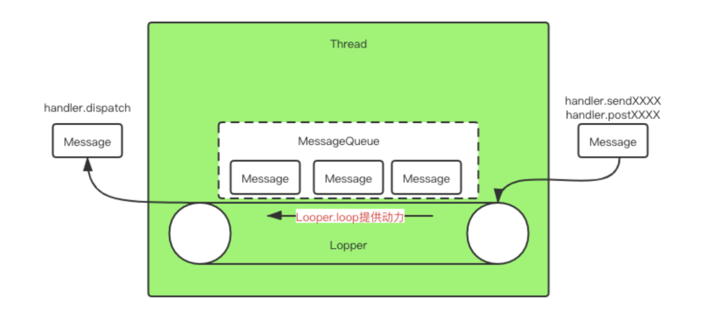

# Android的handler机制

面试很多次被问到过，直接选择说不会（毕竟用都没有用过），结果很多就给我挂了:pensive:

所以这次将这个总结以下：看了多篇大佬的文章（跪谢:heart_eyes:  也在不理解的地方去看了源码进行理解。

为了方便记忆，将学习到的记录一遍（一般面试都能说出来了）


## 概述

handler是**Android中的消息处理机制，用来进行IPC的**

handler会在进程中创建一个**队列**，里面存储待处理的**消息**，**消息顺序就是设置的消息延迟时间**

关键组成：Looper、MessageQueue、Message/Runnable、Handler

官方定义：handler实例是一个线程和该线程上的messageQueue唯一关联的，它能够发送Message/Runnable对象到**该线程**的MessageQueue。每个handler实例在创建的时候都是和线程的Looper绑定（主线程已经默认创建Looper了，子线程需要手动创建，然后才能使用），handler负责将message/runnable对象传递到messageQueue上，也**负责对它们进行处理**



模式：生产者-消费者：handler用来send/post消息，就是生产者，hanlder.dispatch就是消费者，用来处理消息

MessageQueue的数据结构：单链表的优先级队列，优先级即处理的时间排序

## handler使用

先创建looper，启动loop，才能创建handler，并使用：

```java
class MainActivity extends AppCompactActivity{
    @Override
    public void onCreate(@Nullable Bundle savedInstanceState){
        super.onCreate(savedInstanceState);
        setContentView(R.layout.activity_main);
        Thread(new Runnable(){
            @Override 
            public void run(){
                Looper.prepare();		// 创建looper对象
                new Handler().post(new Runnable(){
                    @Override
                    public void run(){
                        Toast.makeText(this, "toast", Toast.LENGTH_LONG).show()
                    }
                });
                Looper.loop();
            }
        }).show()
    }
}

// kt，简化很多，但是可读性不是很好
class MainActivity : AppCompatActivity() {
    override fun onCreate(savedInstanceState: Bundle?) {
        super.onCreate(savedInstanceState)
        setContentView(R.layout.activity_main)
        val thread = Thread{
            Looper.prepare()
            Handler().post{
                Toast.makeText(this, "toast", Toast.LENGTH_LONG).show()
            }
            Looper.loop()
        }.start()
    }
}
```

注意：所有事情处理完成后应该调用quit方法来终止消息循环，否则这个子线程就会一直处于循环等待的状态，因此不需要的时候终止Looper，调用`Looper.myLooper().quit()`

## 常见问题


## 源码分析

> 面试中被问到：有没有好奇过Android的main函数在哪里呀？
>
> 答：没有
>
> 回：好的，我没有什么想问你了，你有什么想问我的吗？
>
> 答：main函数在哪里了，突然好奇了
>
> 回：...你自己去找找吧
>
> 答：（这次面试啥都没收获，没骗到知识）

实际上，和我想得差不多，activity作为app的入口，那么可以从activity开始找——

`AppCompatActivity` -> `FragmentActivity` -> `ComponentActivity` -> `android.core.app.ComponentActivity`-> `Activity`

activity是所有activity的基类，里面有一个activityThread对象：`ActivityThread mMainThread;`

**ActivityThread里面就包含了main函数：**

在main函数里面有主动在main线程中创建looper（对应了上面的定义）

```java
public static void main(String[] args) {
    Trace.traceBegin(Trace.TRACE_TAG_ACTIVITY_MANAGER, "ActivityThreadMain");

    // Install selective syscall interception
    AndroidOs.install();

    // CloseGuard defaults to true and can be quite spammy.  We
    // disable it here, but selectively enable it later (via
    // StrictMode) on debug builds, but using DropBox, not logs.
    CloseGuard.setEnabled(false);

    Environment.initForCurrentUser();

    // Make sure TrustedCertificateStore looks in the right place for CA certificates
    final File configDir = Environment.getUserConfigDirectory(UserHandle.myUserId());
    TrustedCertificateStore.setDefaultUserDirectory(configDir);

    // Call per-process mainline module initialization.
    initializeMainlineModules();

    Process.setArgV0("<pre-initialized>");
	
    /*****************************************************/
    // 是main线程在创建looper
    Looper.prepareMainLooper();				
    /*****************************************************/

    // Find the value for {@link #PROC_START_SEQ_IDENT} if provided on the command line.
    // It will be in the format "seq=114"
    long startSeq = 0;
    if (args != null) {
        for (int i = args.length - 1; i >= 0; --i) {
            if (args[i] != null && args[i].startsWith(PROC_START_SEQ_IDENT)) {
                startSeq = Long.parseLong(
                    args[i].substring(PROC_START_SEQ_IDENT.length()));
            }
        }
    }
    ActivityThread thread = new ActivityThread();		// 创建线程
    thread.attach(false, startSeq);
	
    /*******************************************************/
    // handler的创建——main线程会主动创建一个
    if (sMainThreadHandler == null) {
        sMainThreadHandler = thread.getHandler();
    }
    /*******************************************************/
    
    if (false) {
        Looper.myLooper().setMessageLogging(new
                                            LogPrinter(Log.DEBUG, "ActivityThread"));
    }

    // End of event ActivityThreadMain.
    Trace.traceEnd(Trace.TRACE_TAG_ACTIVITY_MANAGER);
    /*****************************************************/
    // 刚创建的looper去调用loop——类似于启动传送带的感觉？
    Looper.loop();
    /*****************************************************/

    throw new RuntimeException("Main thread loop unexpectedly exited");
}
```

调用：Looper类的实现：

```java
public static void prepareMainLooper() {			// 创建主线程的looper
    prepare(false);
    synchronized (Looper.class) {
        if (sMainLooper != null) {		// 如果looper已经存在，则会抛出异常
            throw new IllegalStateException("The main Looper has already been prepared.");
        }
        sMainLooper = myLooper();
    }
}
	
// 真实在创建looper的方法
private static void prepare(boolean quitAllowed) {
    if (sThreadLocal.get() != null) {		// 如果已经存在了looper，但是还是调用了该方法，就会抛出异常
        throw new RuntimeException("Only one Looper may be created per thread");
    }
    sThreadLocal.set(new Looper(quitAllowed));	// 将创建的looper存储在当前线程的threadlocal中——从而保证每个线程特有
}

// Looper的构造函数
private Looper(boolean quitAllowed) {
    mQueue = new MessageQueue(quitAllowed);		// 对应去创建messageQueue
    mThread = Thread.currentThread();			// 绑定在当前线程上
}
```

理解：

总的来说，是在activity中有一个activityThread对象，该对象里面有main方法，就是Android程序的入口，在这个里面主要是去创建主looper，主线程handler对象，主线程对象，然后去启动looper的循环操作。

在创建主线程looper的时候：

1. 先去创建looper，如果looper已经创建了，就会抛出异常——说明一个线程只能有一个looper
2. looper对象创建时，会去对应的messageQueue——说明一个线程也只有一个mq；会将该looper和当前线程对应
3. 创建完成的线程对象会存放在线程的threadlocal中——说明是每个线程特有的


主线程的handler，在main函数里面会创建一个。

```java
if (sMainThreadHandler == null) {
    sMainThreadHandler = thread.getHandler();	// 获取handler
}

final H mH = new H();

final Handler getHandler() {		// 在activityThread里面
    return mH;
}
```

H是activityThread的内部类

```java
class H extends Handler {		// 实现了Handler里面的某些空方法，例如handleMessage方法
    public static final int BIND_SERVICE = 121;		// 一些硬编码字段
    ...

    String codeToString(int code) {				// 打印东西
        if (DEBUG_MESSAGES) {
            switch (code) {
                case BIND_SERVICE: return "BIND_SERVICE";
         		...
            }
        }
        return Integer.toString(code);
    }
    
    // 核心内容：根据传递进来的message，进行对应的任务处理，例如：处理四大组件，Application，比如创建Service，绑定Service
    public void handleMessage(Message msg) {
        if (DEBUG_MESSAGES) Slog.v(TAG, ">>> handling: " + codeToString(msg.what));
        switch (msg.what) {		// 调用对应的方法
           	...
            case RECEIVER:
                Trace.traceBegin(Trace.TRACE_TAG_ACTIVITY_MANAGER, "broadcastReceiveComp");
                handleReceiver((ReceiverData)msg.obj);
                Trace.traceEnd(Trace.TRACE_TAG_ACTIVITY_MANAGER);
                break;
            ...
            case BIND_SERVICE:
                Trace.traceBegin(Trace.TRACE_TAG_ACTIVITY_MANAGER, "serviceBind");
                handleBindService((BindServiceData)msg.obj);
                Trace.traceEnd(Trace.TRACE_TAG_ACTIVITY_MANAGER);
                break;
            ...
        }
        Object obj = msg.obj;
        if (obj instanceof SomeArgs) {
            ((SomeArgs) obj).recycle();
        }
        if (DEBUG_MESSAGES) Slog.v(TAG, "<<< done: " + codeToString(msg.what));
    }
}
```

`Looper.loop()`：启动looper的死循环机制

```java
public static void loop() {
    final Looper me = myLooper();		// 获取looper对象
    if (me == null) {		// 没有获取到，说明还没有创建就想使用了
        throw new RuntimeException("No Looper; Looper.prepare() wasn't called on this thread.");
    }
    if (me.mInLoop) {		// 说明重新调用了该loop方法
        Slog.w(TAG, "Loop again would have the queued messages be executed"
               + " before this one completed.");
    }

    me.mInLoop = true;		// 设置为true，表示已经调用过该方法了
    final MessageQueue queue = me.mQueue;		// 获取当前线程的messagequeue对象

    // Make sure the identity of this thread is that of the local process,
    // and keep track of what that identity token actually is.
    Binder.clearCallingIdentity();
    final long ident = Binder.clearCallingIdentity();

    // Allow overriding a threshold with a system prop. e.g.
    // adb shell 'setprop log.looper.1000.main.slow 1 && stop && start'
    final int thresholdOverride =
        SystemProperties.getInt("log.looper."
                                + Process.myUid() + "."
                                + Thread.currentThread().getName()
                                + ".slow", 0);

    boolean slowDeliveryDetected = false;

    for (;;) {				// 里面是一个死循环
        Message msg = queue.next(); // 去获取链表的第一个message，可能发生阻塞：还未到消息处理时间/没有消息
        // 如果执行到这边，说明没有挂起/挂起结束
        if (msg == null) {				// 如果message为null，标志mq要退出了——结束循环，直接返回
            // No message indicates that the message queue is quitting.
            return;
        }

        // This must be in a local variable, in case a UI event sets the logger
        final Printer logging = me.mLogging;
        if (logging != null) {
            logging.println(">>>>> Dispatching to " + msg.target + " " +
                            msg.callback + ": " + msg.what);
        }
        // Make sure the observer won't change while processing a transaction.
        final Observer observer = sObserver;

        final long traceTag = me.mTraceTag;
        long slowDispatchThresholdMs = me.mSlowDispatchThresholdMs;
        long slowDeliveryThresholdMs = me.mSlowDeliveryThresholdMs;
        if (thresholdOverride > 0) {
            slowDispatchThresholdMs = thresholdOverride;
            slowDeliveryThresholdMs = thresholdOverride;
        }
        final boolean logSlowDelivery = (slowDeliveryThresholdMs > 0) && (msg.when > 0);
        final boolean logSlowDispatch = (slowDispatchThresholdMs > 0);

        final boolean needStartTime = logSlowDelivery || logSlowDispatch;
        final boolean needEndTime = logSlowDispatch;

        if (traceTag != 0 && Trace.isTagEnabled(traceTag)) {
            Trace.traceBegin(traceTag, msg.target.getTraceName(msg));
        }

        final long dispatchStart = needStartTime ? SystemClock.uptimeMillis() : 0;
        final long dispatchEnd;
        Object token = null;
        if (observer != null) {
            token = observer.messageDispatchStarting();
        }
        long origWorkSource = ThreadLocalWorkSource.setUid(msg.workSourceUid);
        try {
            msg.target.dispatchMessage(msg);	// 获取msg执行的handler，去执行事件分发，这个就看handler的实现了
            if (observer != null) {
                observer.messageDispatched(token, msg);
            }
            dispatchEnd = needEndTime ? SystemClock.uptimeMillis() : 0;
        } catch (Exception exception) {
            if (observer != null) {
                observer.dispatchingThrewException(token, msg, exception);
            }
            throw exception;
        } finally {
            ThreadLocalWorkSource.restore(origWorkSource);
            if (traceTag != 0) {
                Trace.traceEnd(traceTag);
            }
        }
        if (logSlowDelivery) {
            if (slowDeliveryDetected) {
                if ((dispatchStart - msg.when) <= 10) {
                    Slog.w(TAG, "Drained");
                    slowDeliveryDetected = false;
                }
            } else {
                if (showSlowLog(slowDeliveryThresholdMs, msg.when, dispatchStart, "delivery",
                                msg)) {
                    // Once we write a slow delivery log, suppress until the queue drains.
                    slowDeliveryDetected = true;
                }
            }
        }
        if (logSlowDispatch) {
            showSlowLog(slowDispatchThresholdMs, dispatchStart, dispatchEnd, "dispatch", msg);
        }

        if (logging != null) {
            logging.println("<<<<< Finished to " + msg.target + " " + msg.callback);
        }

        // Make sure that during the course of dispatching the
        // identity of the thread wasn't corrupted.
        final long newIdent = Binder.clearCallingIdentity();
        if (ident != newIdent) {
            Log.wtf(TAG, "Thread identity changed from 0x"
                    + Long.toHexString(ident) + " to 0x"
                    + Long.toHexString(newIdent) + " while dispatching to "
                    + msg.target.getClass().getName() + " "
                    + msg.callback + " what=" + msg.what);
        }

        msg.recycleUnchecked();		// 对message回收复用
    }
}

// 里面涉及的子方法：
public static @Nullable Looper myLooper() {
    return sThreadLocal.get();		// 当前线程的threadLocal中获取looper对象
}

// Loop类的成员变量
private boolean mInLoop;

// Message类中
Handler target;			// 可以看到message.target就是对应的handler，用这个来找到message的分发和处理对象
Runnable callback;

// Handler类中：
final Callback mCallback;	// 内部接口对象，需要实现handleMessage方法
public void dispatchMessage(@NonNull Message msg) {
    if (msg.callback != null) {		// 如果message存在callback对象，那么调用callback处理
        handleCallback(msg);
    } else {			// 不存在callback
        if (mCallback != null) {		// handler中是否存在callback对象（内部接口）——实现了，存在调用该方法
            if (mCallback.handleMessage(msg)) {	// 内部接口对象mcallback
                return;
            }
        }
        handleMessage(msg);		// 如果都没有的话，调用handler的该方法——默认是空方法，需要重写
    }
}
```

```java
Message next() {			// 
    // Return here if the message loop has already quit and been disposed.
    // This can happen if the application tries to restart a looper after quit
    // which is not supported.
    final long ptr = mPtr;
    if (ptr == 0) {			// 表示loop要退出了，那么直接返回null作为标志
        return null;
    }

    int pendingIdleHandlerCount = -1; // -1 only during first iteration
    int nextPollTimeoutMillis = 0;
    for (;;) {			// 死循环
        if (nextPollTimeoutMillis != 0) {
            Binder.flushPendingCommands();
        }

        nativePollOnce(ptr, nextPollTimeoutMillis);

        synchronized (this) {
            // Try to retrieve the next message.  Return if found.
            final long now = SystemClock.uptimeMillis();
            Message prevMsg = null;
            Message msg = mMessages;
            if (msg != null && msg.target == null) {
                // Stalled by a barrier.  Find the next asynchronous message in the queue.
                do {
                    prevMsg = msg;
                    msg = msg.next;
                } while (msg != null && !msg.isAsynchronous());
            }
            if (msg != null) {
                if (now < msg.when) {
                    // Next message is not ready.  Set a timeout to wake up when it is ready.
                    nextPollTimeoutMillis = (int) Math.min(msg.when - now, Integer.MAX_VALUE);
                } else {
                    // Got a message.
                    mBlocked = false;
                    if (prevMsg != null) {
                        prevMsg.next = msg.next;
                    } else {
                        mMessages = msg.next;
                    }
                    msg.next = null;
                    if (DEBUG) Log.v(TAG, "Returning message: " + msg);
                    msg.markInUse();
                    return msg;
                }
            } else {
                // No more messages.
                nextPollTimeoutMillis = -1;
            }

            // Process the quit message now that all pending messages have been handled.
            if (mQuitting) {
                dispose();
                return null;
            }

            // If first time idle, then get the number of idlers to run.
            // Idle handles only run if the queue is empty or if the first message
            // in the queue (possibly a barrier) is due to be handled in the future.
            if (pendingIdleHandlerCount < 0
                && (mMessages == null || now < mMessages.when)) {
                pendingIdleHandlerCount = mIdleHandlers.size();
            }
            if (pendingIdleHandlerCount <= 0) {
                // No idle handlers to run.  Loop and wait some more.
                mBlocked = true;
                continue;
            }

            if (mPendingIdleHandlers == null) {
                mPendingIdleHandlers = new IdleHandler[Math.max(pendingIdleHandlerCount, 4)];
            }
            mPendingIdleHandlers = mIdleHandlers.toArray(mPendingIdleHandlers);
        }

        // Run the idle handlers.
        // We only ever reach this code block during the first iteration.
        for (int i = 0; i < pendingIdleHandlerCount; i++) {
            final IdleHandler idler = mPendingIdleHandlers[i];
            mPendingIdleHandlers[i] = null; // release the reference to the handler

            boolean keep = false;
            try {
                keep = idler.queueIdle();
            } catch (Throwable t) {
                Log.wtf(TAG, "IdleHandler threw exception", t);
            }

            if (!keep) {
                synchronized (this) {
                    mIdleHandlers.remove(idler);
                }
            }
        }

        // Reset the idle handler count to 0 so we do not run them again.
        pendingIdleHandlerCount = 0;

        // While calling an idle handler, a new message could have been delivered
        // so go back and look again for a pending message without waiting.
        nextPollTimeoutMillis = 0;
    }
}
```


参考：

1. https://juejin.cn/post/6887930091991007240（这是个大佬，有6个part）
2. https://juejin.cn/user/4441682709326958/posts（也是个大佬，从郭神那边找到的，写的文章都很好）