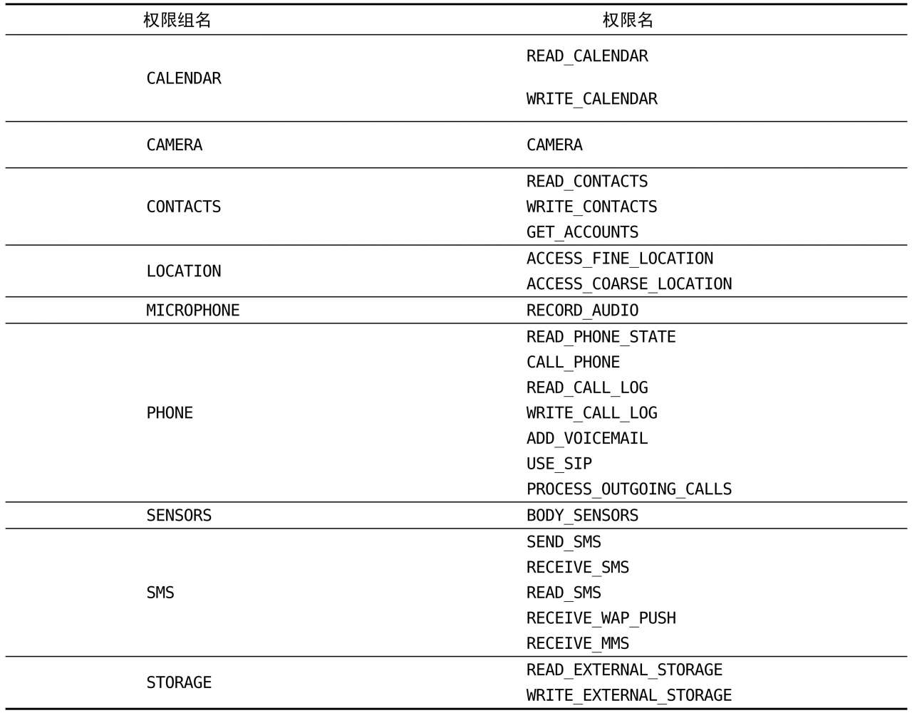
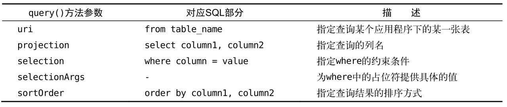

# 内容提供器

# 1. 概念

**在不同的应用程序之间实现数据共享的功能**。它提供了一套完整的机制，允许一个程序访问另一个程序中的数据，同时还能保证被访数据的安全性

——使用内容提供器是Android实现跨程序共享数据的标准方式。

内容提供器可以选择**只对哪一部分数据进行共享**，从而保证我们程序中的隐私数据不会有泄漏的风险。

# 2. 运行时权限

Android 6.0系统中引用了运行时权限这个功能

## 2.1 Android的权限机制

在广播那边接触到了Android权限相关的。

访问系统的网络状态以及监听开机广播：

需要在`AndroidManifest.xml`中增加：

```xml
<uses-permission android:name="android.permission.RECEIVE_BOOT_COMPLETED" />
<uses-permission android:name="android.permission.ACCESS_NETWORK_STATE" />
```

因为访问系统的网络状态以及监听开机广播涉及了用户设备的安全性，因此必须在AndroidManifest.xml中加入权限声明，否则我们的程序就会崩溃。

这样就能够保护用户设备的安全性，防止被该app侵犯：

1. 用户在低于6.0系统的设备上安装该程序，会在安装界面给出确认提醒。用户就可以清楚地知晓该程序一共申请了哪些权限，从而决定是否要安装这个程序。
2. 用户可以随时在应用程序管理界面查看任意一个程序的权限申请情况

——以此保证应用程序不会出现各种滥用权限的情况，用户如果认可所申请的权限，那么就会安装程序，如果不认可，那么拒绝安装就可以了。

——**6.0之前是在安装的时候申请完所有的权限**，而如果我只对部分权限持否定态度，也只能选择不安装。

——6.0之后，中加入了**运行时权限功能**。也就是说，用户不需要在安装软件的时候一次性授权所有申请的权限，而是可以在**软件的使用过程中再对某一项权限申请进行授权**，如果我不允许，只不过使用不了该项功能，而该程序的其他还是能够使用的

Android将所有的权限归成了3类：

- **普通权限**：不会直接威胁到用户的安全和隐私的权限，系统会自动帮我们进行授权，而不需要用户再去手动操作了

  eg：开机启动监听和网络状况监听，是普通权限

- **危险权限**：可能会触及用户隐私或者对设备安全性造成影响的权限，必须要由用户手动点击授权才可以，否则程序就无法使用相应的功能。

  eg：获取设备联系人信息、定位设备的地理位置等

- **特殊权限**：不过这种权限使用得很少，不讨论。

共有上百个权限，除了危险权限之外，剩余的就都是普通权限了，所以只需要记住危险权限即可：



——如果是属于这张表中的权限，那么就**需要进行运行时权限处理**，如果不在这张表中，那么只需要在AndroidManifest.xml文件中添加一下权限声明就可以了。

注意：每个危险权限都属于一个权限组，处理时使用的是权限名，用户一旦同意授权了，那么该权限所对应的**权限组中所有的其他权限也会同时被授权。**

## 2.2 程序运行时申请权限

例子：调用打电话功能。拨打电话会涉及用户手机的资费问题，因而被列为了危险权限。

```java
Button button = (Button) findViewById(R.id.call);
button.setOnClickListener(new View.OnClickListener() {
    @Override
    public void onClick(View v) {
        try {
            Intent intent = new Intent(Intent.ACTION_CALL);
            intent.setData(Uri.parse("tel:10086"));
            startActivity(intent);
        }catch (SecurityException e){
            e.printStackTrace();
        }
    }
});
```

理解：

1. 拨号，就是开启一个活动，所以用intent来启动，确定action——`new Intent(Intent.ACTION_CALL)`，并且将号码设置好——`intent.setData(Uri.parse("tel:10086"))`。

   拨号之前也接触过一种：当时指定的action是`Intent.ACTION_DIAL`是打开拨号界面，这个不需要申请权限，而直接打电话是需要申请权限的——`Intent.ACTION_CALL`

2. 为了防止程序崩溃，我们将所有操作都放在了异常捕获代码块当中——`SecurityException`

点击发现后没有响应：


使用危险权限时都必须进行运行时权限处理（即使在AndroidManifest.xml中设置了也不行）

下面研究运行时权限的申请流程：

首先：还是要在`AndroidManifest.xml`中给权限：

```xml
<manifest xmlns:android="http://schemas.android.com/apk/res/android"
    package="com.example.permissiontest">
    <uses-permission android:name="android.permission.CALL_PHONE" />
</manifest>
```

主要涉及到3个方法：

```java
protected void onCreate(Bundle savedInstanceState) {
    super.onCreate(savedInstanceState);
    setContentView(R.layout.activity_main);
    Button button = (Button) findViewById(R.id.call);
    button.setOnClickListener(new View.OnClickListener() {
        @Override
        public void onClick(View v) {
            if (ContextCompat.checkSelfPermission(MainActivity.this, Manifest.permission.CALL_PHONE) != PackageManager.PERMISSION_GRANTED){
                ActivityCompat.requestPermissions(MainActivity.this, new String[]{Manifest.permission.CALL_PHONE}, 1);
            }
            else{
                call();
            }

        }
    });
}
private void call(){			// 单独写一个方法调用
    try {
        Intent intent = new Intent(Intent.ACTION_CALL);
        intent.setData(Uri.parse("tel:10086"));
        startActivity(intent);
    }catch (SecurityException e){
        e.printStackTrace();
    }
}

@Override
public void onRequestPermissionsResult(int requestCode, @NonNull String[] permissions, @NonNull int[] grantResults) {
    switch (requestCode){
        case 1:
            if (grantResults.length > 0 && grantResults[0] == PackageManager.PERMISSION_GRANTED){
                call();
            }
            else{
                Toast.makeText(MainActivity.this, "you haved denied the permission", Toast.LENGTH_SHORT).show();
            }
            break;
        default:break;
    }
}
```

理解：

1. 首先判断是否已经获得授权：**`ContextCompat.checkSelfPermission()`**，需要2个参数：

   - 第一个参数：Context
   - 第二个参数：指定具体的权限名：**`Manifest.permission.CALL_PHONE`**

   将该方法的返回值和**`PakageManager.PERMISSION_GRANTED`**进行比较，如果相等说明已经授权，直接调用封装好的call方法；如果不相等，说明未授权

2. 如果未授权，需要进行授权：调用**`ActivityCompat.requestPermissions()`**方法，需要3个参数：

   - 第一个参数：activity对象
   - 第二个参数：String数组，把要申请的权限放在里面即可：`Manifest.permission.CALL_PHONE`
   - 第三个参数：请求码，只要是唯一值即可

3. 弹出申请框之后，点击允许 or 不允许，会将结果封装到`grantResults`中，都会回调`onRequestPermissionsResult`方法，这个也需要重写：具体看代码，和前面类似

——整个过程，可以当成一个模板，如果要申请运行时权限，都可以套进去，call方法替换即可


而且该申请只有一次，拒绝之后就一直处于禁止状态；而允许之后就一直处于允许状态，可以在设置中修改。

# 3. 访问其他程序中的数据

内容提供器的用法一般有两种：

- 使用现有的内容提供器来读取和操作相应程序中的数据——用别人给的
- 创建自己的内容提供器给我们程序的数据提供外部访问接口——自己创建，给别人用

如果一个应用程序**通过内容提供器对其数据提供了外部访问接口，那么任何其他的应用程序就都可以对这部分数据进行访问**。

Android系统中自带的电话簿、短信、媒体库等程序都提供了内容提供器

## 3.1 ContentResolver的基本用法

**想要访问内容提供器中共享的数据，就一定要借助ContentResolver类**

ContentResolver对象可以通过`Context.getContentResolver()`方法获得

ContentResolver中提供了一系列的方法用于对数据进行CRUD操作，其中**insert()**方法用于添加数据，**update()**方法用于更新数据，**delete()**方法用于删除数据，**query()**方法用于查询数据

ContentResolver中的增删改查方法都是不接收表名，而是使用一个**Uri参数**代替，这个参数被称为**内容URI**。

内容URI给内容提供器中的数据**建立了唯一标识符**，它主要由两部分组成：**authority和path**

- authority：用于对**不同的应用程序**做区分的，一般为了避免冲突，都会采用**程序包名的方式来进行命名**

  eg：`com.example.storetech.provider`

- path：对同一应用程序中**不同的表**做区分的，通常都会添加到authority的后面

  eg：`com.example.storetech.provider/book`

——所以标准写法：`content://com.example.storetech.provider/book`

——而传入的是string对象，需要将其修改为uri对象后才能使用`Uri.parse("content://com.example.storetech.provider/book")`

而该uri对象就可以用来查询数据了，格式如下：

```java
Cursor cursor = getContentResolver.query(uri, projection, selection, selectionArgs, sortOrder);
```

每个部分的功能如下：



查询完成后返回的是一个Cursor对象，可以将数据从Cursor对象中逐个读取出来了，和前面的类似：

```java
Uri uri = Uri.parse("content://com.example.contenttest.provider/tabel1");
Cursor cursor = getContentResolver().query(uri, new String[]{"name"}, "price > ? ", new String[]{"50.00"}, 												"pages desc");
if(cursor != null){
    while(cursor.moveToNext()){
        String name = cursor.getString(cursor.getColumnIndex("name"));
        double price = cursor.getDouble(cursor.getColumnIndex("price"));
        int page = cursor.getInt(cursor.getColumnIndex("page"));
    }
}
cursor.close();
```

理解：cursor最后要记得关闭；应该是跟具体操作不同，前面的SQLite的cursor在末尾，而这个的cursor在开头

而CRUD的其余3个都简单：

```java
ContentValues values = new ContentValues();		// 创建contentValues对象
values.put("name", "moyan");
values.put("price", 50.00);
values.put("page", 200);
getContentResolver().insert(uri, values);
```

```java
getContentResolver().delete(uri, "name = ?", new String[]{"moyan"});
```

```java
ContentValues values2 = new ContentValues();
values2.put("price", 29.99);
getContentResolver().update(uri, values2, "name = ?", new String[]{"moyan"});
```

——和SQLite类似

## 3.2 实践——读取联系人

联系人是官方提供的，它允许其他程序共享，它有内容提供器，下面将结合 运行时权限申请 + contentResolver来实现读取：

首先看一下布局：

使用一个`ListView`来实现大量数据展示（不用recyclerView因为代码太多，而ListView的最简单用法最适合）

```xml
<LinearLayout xmlns:android="http://schemas.android.com/apk/res/android"
    android:orientation="vertical"
    android:layout_width="match_parent"
    android:layout_height="match_parent">
    <ListView
        android:id="@+id/contacts_view"
        android:layout_width="match_parent"
        android:layout_height="match_parent" />
</LinearLayout>
```

实现：

```java
public class MainActivity extends AppCompatActivity {
    ArrayAdapter<String> adapter;			//ListView的适配器
    List<String> contactsList = new ArrayList<>();		// 数据存储的列表
    @Override
    protected void onCreate(Bundle savedInstanceState) {
        super.onCreate(savedInstanceState);
        setContentView(R.layout.activity_main);
        ListView contactsView = (ListView) findViewById(R.id.contacts_view);	// 获得该控件
        // 创建适配器
        adapter = new ArrayAdapter<String>(this, android.R.layout.simple_list_item_1, contactsList);
        contactsView.setAdapter(adapter);		// 将构建好的适配器传递过去，那么ListView和adapter的关联完成
        if (ContextCompat.checkSelfPermission(this, Manifest.permission.READ_CONTACTS) != PackageManager.PERMISSION_GRANTED){			// 获取权限
            ActivityCompat.requestPermissions(MainActivity.this, new String[]{Manifest.permission.READ_CONTACTS}, 1);
        }
        else {
            readContacts();
        }
    }
    private void readContacts(){
        Cursor cursor = null;
        try{
            // 查询数据
            cursor = getContentResolver().query(ContactsContract.CommonDataKinds.Phone.CONTENT_URI, null, null, null, null);
            if (cursor != null){
                while(cursor.moveToNext()){
                    String name = cursor.getString(cursor.getColumnIndex(ContactsContract.CommonDataKinds.Phone.DISPLAY_NAME));
                    String phone = cursor.getString(cursor.getColumnIndex(ContactsContract.CommonDataKinds.Phone.NUMBER));
                    contactsList.add(name + "\n" + phone);
                }
                adapter.notifyDataSetChanged();			// 更新数据
            }

        }catch (SecurityException e){
            e.printStackTrace();
        }finally {
            if (cursor != null){
                cursor.close();		// 关闭
            }
        }
    }

    @Override
    // 获取权限的后续操作：
    public void onRequestPermissionsResult(int requestCode, @NonNull String[] permissions, @NonNull int[] grantResults) {
        switch (requestCode){
            case 1:
                // 如果得到权限，那么就去获取数据
                if (grantResults.length > 0 && grantResults[0] == PackageManager.PERMISSION_GRANTED){
                    readContacts();
                }
                else {
                    Toast.makeText(this, "you denied the permission", Toast.LENGTH_SHORT).show();
                }
                break;
            default: break;
        }
    }
}
```

理解：

1. 第一部分：和获取权限相关：权限名字是：`Manifest.permission.READ_CONTACTS`
2. 第二部分：和ContentSolver相关，这边的uri是`ContactsContract.CommonDataKinds.Phone`，系统已经做好封装，直接使用`ContactsContract.CommonDataKinds.Phone.CONTENT_URI`即可，而列名也是系统提供的封装：`ContactsContract.CommonDataKinds.Phone.DISPLAY_NAME`和`ContactsContract.CommonDataKinds.Phone.NUMBER`
3. 第三部分：ListView更新的方法：适配器提供的`adapter.notifyDataSetChanged()`

记得：在`AndroidManifest.xml`中要进行权限配置：

```xml
<uses-permission android:name="android.permission.READ_CONTACTS" />
```


# 4. 创建自己的内容提供器

去访问其他程序的内容提供器，比较简单：获取到应用程序的内容Uri，然后用`ContentResolver`对象的CRUD方法即可

而自己的程序信息要给其他程序共享的话，需要创建自己的内容提供器。

## 4.1 创建内容提供器的步骤

如果想要实现跨程序共享数据的功能，**官方推荐的方式就是使用内容提供器**——通过新建一个类去**继承ContentProvider**的方式来创建一个自己的内容提供器。

ContentProvider类中有6个抽象方法，需要将这6个方法全部重写：

- onCreate()：初始化提供器时需要调用

  一般在这里，完成对数据库的创建和升级等操作

  返回值：true表示内容提供器初始化成功，返回false则表示失败

- query()：从内容提供器中查询数据

  参数：

  - uri参数来确定查询哪张表，
  - projection参数用于确定查询哪些列，
  - selection和selectionArgs参数用于约束查询哪些行，
  - sortOrder参数用于对结果进行排序

  （和前面的contentResolver的query方法对应）

- insert()：向内容提供器中添加一条数据

  参数：

  - uri参数来确定要添加到的表
  - value参数：保存要添加的数据

  返回值：添加完成后，返回一个用于表示这条新记录的URI

- update()：更新内容提供器中已有的数据

  参数：

  - uri参数来确定更新哪一张表中的数据
  - value参数：保存要添加的数据
  - selection和selectionArgs参数用于约束更新哪些行

  返回值：受影响的行数

- delete()：

  参数：

  - uri参数来确定删除哪一张表中的数据，
  - selection和selectionArgs参数用于约束删除哪些行

  返回值：被删除的行数

- getType()：根据传入的内容URI来返回相应的MIME类型

  参数：Uri

可以发现，这6个方法，都需要传递Uri参数，那么我们需要对Uri进行解析：

### Uri的解析

需要对传入的Uri参数进行解析，从中分析出调用方期望访问的表和数据。

根据前面ContentResolver的uri的传递可以看到标准的uri的格式如下：

```java
Uri.parse("content://com.example.storetech.provider/table1");
```

除此之外，我们还可以在这个内容URI的后面加上一个id：`content://com.example.storetech.provider/table1/1`，表示调用方期望访问的是com.example.storetech这个应用的table1表中id为1的数据。

可以使用通配符的方式来分别匹配这两种格式的内容URI，规则如下：

- *：匹配任意长度的任意字符
- #：匹配任意长度的数字

那么上面分别能写成：

```
content://com.example.storetech.provider/*
content://com.example.storetech.provider/table1/#
```

再借助**`UriMatcher`**这个类就可以轻松地实现匹配内容URI的功能，

**`uriMatcher.addURI()`**方法，这个方法接收3个参数：

- authority：限定包
- path：典型表
- 自定义代码：int类型，当匹配时，会将该代码作为返回值返回

——这个可以构造所有可能的uri

然后调用`uriMathcer.match(uri)`，将输入的uri和所有可能的uri匹配

所以，CRUD4个方法的实现框架都如下：

```java
// 内容提供器的实现——实现了6个方法（现在都还是框架）
public class MyProvider extends ContentProvider {
    public static final int TABLE1_DIR = 0;			// 自定义代码，当匹配时会作为返回值
    public static final int TABLE1_ITEM = 1;
    public static final int TABLE2_DIR = 2;
    public static final int TABLE2_ITEM = 3;
    private static UriMatcher uriMatcher;
    static {
        uriMatcher = new UriMatcher(UriMatcher.NO_MATCH);		// 创建UriMatcher对象
        uriMatcher.addURI("com.example.contenettest.provider", "table1", TABLE1_DIR);// 访问所有数据
        uriMatcher.addURI("com.example.contenettest.provider", "table1/#", TABLE1_ITEM);// 访问单条数据
        uriMatcher.addURI("com.example.contenettest.provider", "table2", TABLE2_DIR);
        uriMatcher.addURI("com.example.contenettest.provider", "table2/#", TABLE2_ITEM);
    }
    @Override
    public boolean onCreate() {
        return false;
    }

    @Nullable
    @Override
    public Cursor query(@NonNull Uri uri, @Nullable String[] projection, @Nullable String selection, @Nullable String[] selectionArgs, @Nullable String sortOrder) {
        switch (uriMatcher.match(uri)){		// 匹配
            case TABLE1_DIR:		// 根据返回值，匹配查询模式
                break;
            case TABLE1_ITEM:
                break;
            case TABLE2_DIR:
                break;
            case TABLE2_ITEM:
                break;
            default: break;
        }
        return null;
    }

    @Nullable
    @Override
    public Uri insert(@NonNull Uri uri, @Nullable ContentValues values) {
        return null;
    }

    @Override
    public int delete(@NonNull Uri uri, @Nullable String selection, @Nullable String[] selectionArgs) {
        return 0;
    }

    @Override
    public int update(@NonNull Uri uri, @Nullable ContentValues values, @Nullable String selection, @Nullable String[] selectionArgs) {
        return 0;
    }

    @Nullable
    @Override
    public String getType(@NonNull Uri uri) {
        return null;
    }
}
```

理解：主要关注静态代码块和query()方法——都是模板，之后可以直接使用

insert()、update()、delete()这几个方法的实现也是差不多的，都是类似的框架，只不过case里面的实现不同

### getType()的实现

getType()方法：用于获取Uri对象所对应的MIME类型。

一个内容URI所对应的MIME字符串主要由3部分组成，Android对这3个部分做了如下格式规定：

- 必须以vnd开头
- 如果内容URI以路径结尾，则后接android.cursor.dir/，如果内容URI以id结尾，则后接android.cursor.item/
- 最后接上vnd.<authority>.<path>

eg：`content://com.example.app.provider/table1`的MIME：

`vnd.android.cursor.dir/com.example.app.provider/table1`

`content://com.example.app.provider/table1/1`的MIME：

`vnd.android.cursor.item/com.example.app.provider/table1`

```java
@Override
public String getType(@NonNull Uri uri) {
    switch (uriMatcher.match(uri)){
        case TABLE1_DIR:
            return "vnd.android.cursor.dir/com.example.contenttest/table1";
        case TABLE1_ITEM:
            return "vnd.android.cursor.item/com.example.contenttest/table1";
        case TABLE2_DIR:
            return "vnd.android.cursor.dir/com.example.contenttest/table2";
        case TABLE2_ITEM:
            return "vnd.android.cursor.item/com.example.contenttest/table2";
        default: return null;
    }
}
```

关于安全性问题：

因为所有的CRUD操作都一定要匹配到相应的内容URI格式才能进行的，那么不可能向UriMatcher中添加隐私数据的URI，所以这部分数据根本无法被外部程序访问到，安全问题也就不存在了。

## 4.2 实战：实现跨程序数据共享

首先创建内容提供器：在包上右键 -> 选择 other -> 选择 content_provider -> 填写类名 和 authorities：默认包名 +provider

Exported属性表示是否允许外部程序访问我们的内容提供器，Enabled属性表示是否启用这个内容提供器。默认勾选。


点击确认后发现，创建了一个`DataBaseProvider`类，里面的框架按照上面一节的都填写完毕了，就等填写内容：

```java
public class DataBaseProvider extends ContentProvider {
    public static final int BOOK_DIR = 0;			// 4个自定义代码，做匹配的返回值
    public static final int BOOK_ITEM = 1;
    public static final int CATEGORY_DIR = 2;
    public static final int CATEGORY_ITEM = 3;
    public static final String AUTHORITY = "com.example.storetech.provider";
    private static UriMatcher uriMatcher;
    private MyDatabaseHelper dbHepler;			// 操控数据库的帮助类对象
    static {
        uriMatcher = new UriMatcher(UriMatcher.NO_MATCH);
        uriMatcher.addURI(AUTHORITY, "book", BOOK_DIR);
        uriMatcher.addURI(AUTHORITY, "book/#", BOOK_ITEM);
        uriMatcher.addURI(AUTHORITY, "category", CATEGORY_DIR);
        uriMatcher.addURI(AUTHORITY, "category/#", CATEGORY_ITEM);
    }
    public DataBaseProvider() {
    }

    @Override
    public int delete(Uri uri, String selection, String[] selectionArgs) {
        SQLiteDatabase db = dbHepler.getWritableDatabase();
        int deleteData = 0;
        switch (uriMatcher.match(uri)){
            case BOOK_DIR:
                deleteData = db.delete("book", selection, selectionArgs);
                break;
            case BOOK_ITEM:
                String deleteId = uri.getPathSegments().get(1);
                deleteData = db.delete("book", "id = ?", new String[]{deleteId});
                break;
            case CATEGORY_DIR:
                deleteData = db.delete("category", selection, selectionArgs);
                break;
            case CATEGORY_ITEM:
                String deleteId2 = uri.getPathSegments().get(1);
                deleteData = db.delete("category", "id = ?", new String[]{deleteId2});
            default: break;
        }
        return deleteData;
    }

    @Override
    public String getType(Uri uri) {
        switch (uriMatcher.match(uri)){
            case BOOK_DIR:
                return "vnd.android.cursor.dir/com.example.storetech/book";
            case BOOK_ITEM:
                return "vnd.android.cursor.item/com.example.storetech/book";
            case CATEGORY_DIR:
                return "vnd.android.cursor.dir/com.example.storetech/category";
            case CATEGORY_ITEM:
                return "vnd.android.cursor.item/com.example.storetech/category";
            default: return null;
        }
    }

    @Override
    public Uri insert(Uri uri, ContentValues values) {
        SQLiteDatabase db = dbHepler.getWritableDatabase();
        Uri uriReturn = null;
        switch (uriMatcher.match(uri)){
            case BOOK_DIR:
            case BOOK_ITEM:
                long newBookId = db.insert("book", null, values);
                uriReturn = Uri.parse("content://" + AUTHORITY + "/book/" + newBookId);
                break;
            case CATEGORY_DIR:
            case CATEGORY_ITEM:
                long newCategoryId = db.insert("category", null, values);
                uriReturn = Uri.parse("content://" + AUTHORITY + "/category/" + newCategoryId);
                break;
            default: break;
        }
        return uriReturn;
    }

    @Override
    // 用来创建数据库
    public boolean onCreate() {
        dbHepler = new MyDatabaseHelper(getContext(), "Library.db", null, 2);
        return true;
    }

    @Override
    public Cursor query(Uri uri, String[] projection, String selection,
                        String[] selectionArgs, String sortOrder) {
        SQLiteDatabase db = dbHepler.getReadableDatabase();		// 查询，所以只需要读取就可以了
        Cursor cursor = null;
        switch (uriMatcher.match(uri)){
            case BOOK_DIR:
                cursor = db.query("book", projection, selection, selectionArgs, null, null, sortOrder);
                break;
            case BOOK_ITEM:
                String bookID = uri.getPathSegments().get(1);
                cursor = db.query("book", projection, "id = ?", new String[]{bookID}, null, null, sortOrder);
                break;
            case CATEGORY_DIR:
                cursor = db.query("category", projection, selection, selectionArgs, null, null, sortOrder);
                break;
            case CATEGORY_ITEM:
                String categoryID = uri.getPathSegments().get(1);
                cursor = db.query("category", projection, "id = ?", new String[]{categoryID}, null, null, sortOrder);
                break;
            default: break;
        }
        return cursor;
    }

    @Override
    public int update(Uri uri, ContentValues values, String selection,
                      String[] selectionArgs) {
        SQLiteDatabase db = dbHepler.getWritableDatabase();
        int updateData = 0;
        switch (uriMatcher.match(uri)){
            case BOOK_DIR:
                updateData = db.update("book", values, selection, selectionArgs);
                break;
            case BOOK_ITEM:
                String bookId = uri.getPathSegments().get(1);
                updateData = db.update("book", values, "id = ?", new String[]{bookId});
                break;
            case CATEGORY_DIR:
                updateData = db.update("category", values, selection, selectionArgs);
                break;
            case CATEGORY_ITEM:
                String categoryId = uri.getPathSegments().get(1);
                updateData = db.update("category", values, "id = ?", new String[]{categoryId});
                break;
            default:
                break;
        }
        return updateData;
    }
}
```

理解：代码都是类似的，需要关注的是：

1. `uri.getPathSegments().get(1);`——getPathSegments()方法，它会将内容URI权限之后的部分以“/”符号进行分割，并把分割后的结果放入到一个字符串列表中，那这个列表的第0个位置存放的就是路径，第1个位置存放的就是id了，即`table1/1`，被分成了2部分：table和1，1就是需要的1——返回的是string，用来做占位符的解释：

   eg：`String categoryId = uri.getPathSegments().get(1);`

   ``db.update("category", values, "id = ?", new String[]{categoryId});`

2. `getReadableDatabase()`该方法用于查询，`getWritableDatabase()`方法用于修改数据库的操作中

内容提供器一定要在AndroidManifest.xml文件中注册才可以使用，但是由于使用Android Studio的快捷方式创建的内容提供器，因此注册这一步已经被自动完成了

```xml
<provider
          android:name=".DataBaseProvider"		// 指定类名
          android:authorities="com.example..storetech.provider"	// 指定authorities
          android:enabled="true"		// 启用
          android:exported="true">		// 允许被外部使用
</provider>
```

——这个配置，就是刚才在创建时的4个条目

然后创建另外一个程序，来使用该内容提供器：

有4个按钮，每个按钮对应CRUD的功能：

```java
public class MainActivity extends AppCompatActivity {
    private String newID;
    @Override
    protected void onCreate(Bundle savedInstanceState) {
        super.onCreate(savedInstanceState);
        setContentView(R.layout.activity_main);
        Button add = (Button) findViewById(R.id.add);
        add.setOnClickListener(new View.OnClickListener() {
            @Override
            public void onClick(View v) {
                Uri uri = Uri.parse("content://com.example.storetech.provider/book");
                ContentValues values = new ContentValues();
                values.put("author","xxx");
                values.put("price", 50.00);
                values.put("page", 200);
                Uri newUri = getContentResolver().insert(uri,values);
                newID = newUri.getPathSegments().get(1);
            }
        });
        Button delete = (Button) findViewById(R.id.delete);
        delete.setOnClickListener(new View.OnClickListener() {
            @Override
            public void onClick(View v) {
                Uri uri = Uri.parse("content://com.example.storetech.provider/book");
                getContentResolver().delete(uri,null,null);
            }
        });
        Button update = (Button) findViewById(R.id.update);
        update.setOnClickListener(new View.OnClickListener() {
            @Override
            public void onClick(View v) {
                Uri uri = Uri.parse("content://com.example.storetech.provider/book");
                ContentValues values = new ContentValues();
                values.put("price", 29.99);
                getContentResolver().update(uri, values, "names = ?", new String[]{"xxx"});
            }
        });
        Button query = (Button) findViewById(R.id.query);
        query.setOnClickListener(new View.OnClickListener() {
            @Override
            public void onClick(View v) {
                Uri uri = Uri.parse("content://com.example.storetech.provider/book");
                Cursor cursor = getContentResolver().query(uri, null, null, null, null);
                if(cursor != null){
                    while(cursor.moveToNext()){
                        String name = cursor.getString(cursor.getColumnIndex("name"));
                        double price = cursor.getDouble(cursor.getColumnIndex("price"));
                        int page = cursor.getInt(cursor.getColumnIndex("page"));
                        Log.d("MainActivity", "name is: "+name);
                        Log.d("MainActivity", "page is: "+page);
                        Log.d("MainActivity", "price is: "+price);
                    }
                }
                cursor.close();
            }
        });
    }
}
```

使用方式，第一部分已经实现，和前面的类似不再研究

——还存在一定问题，待解决