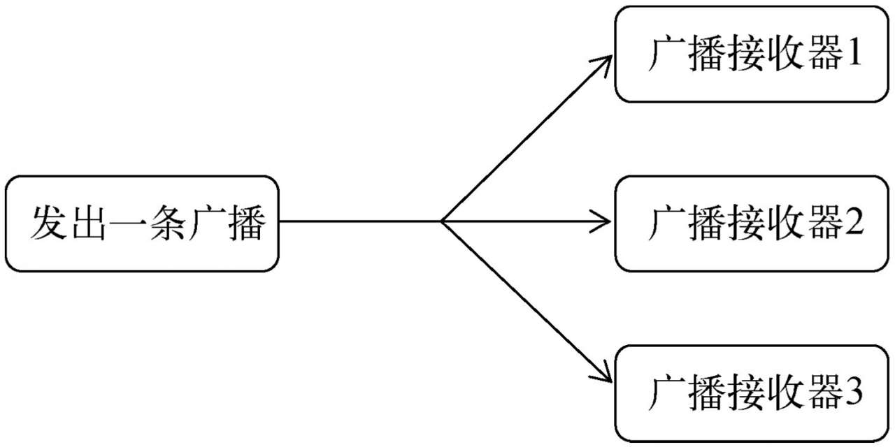

# 广播机制

在计网中，广播数据包会被发送到同一网络上的所有端口，这样在该网络中的每台主机都将会收到这条广播。

为了便于进行系统级别的消息通知，Android也引入了一套类似的广播消息机制。

# 1. 概念介绍

Android存在广播机制，且Android中的广播机制更加灵活：每个应用程序都可以对自己感兴趣的广播**进行注册**，这样该程序就只会**接收到自己所关心的广播内容**，这些广播可能是来自于系统的，也可能是来自于其他应用程序的。

Android提供了一套完整的API，允许应用程序自由地发送和接收广播：

- 发送广播：用Intent
- 接收广播：用广播接收器——Broadcast Receiver

广播的类型：

- 标准广播

  完全异步执行的广播。

  在广播发出之后，所有的广播接收器几乎都会在**同一时刻接收到这条广播消息**，因此它们之间没有任何先后顺序可言。这种广播的**效率会比较高，但同时也意味着它是无法被截断的**

  ——符合普通意义上的广播

  

- 有序广播

  同步执行的广播，在广播发出之后，**同一时刻只会有一个广播接收器能够收到这条广播消息**，当这个广播接收器中的逻辑执行完毕后，**广播才会继续传递**。所以此时的广播接收器是有先后顺序的，优先级高的广播接收器就可以先收到广播消息，并且前面的广播接收器还可以截断正在传递的广播，这样后面的广播接收器就无法收到广播消息了。

  


# 2. 接收系统广播

Android内置了很多**系统级别的广播**，我们可以在应用程序中通过监听这些广播来得到各种系统的状态信息。

eg：手机开机完成后会发出一条广播，电池的电量发生变化会发出一条广播，时间或时区发生改变也会发出一条广播。

如果要能收到广播，必须要使用广播接收器

## 2.1 动态注册

广播接收器可以注册感兴趣的广播，那么当有相应的广播发出时，广播接收器可以收到广播，并且**会在内部处理相应的逻辑**。

注册广播的方式一般有两种：

- 在代码中注册——动态注册
- 在AndroidManifest.xml中注册——静态注册

创建一个广播接收器：需要新建一个类，让它继承自Broadcast-Receiver -> 重写父类的onReceive()方法。

这样当有广播到来时，onReceive()方法就会得到执行，具体的逻辑就可以在这个方法中处理。

下面来实现动态注册监听网络变化：

```java
public class MainActivity extends AppCompatActivity {
    private IntentFilter intentFilter;
    private NetworkChangeReceiver networkChangeReceiver;
    @Override
    protected void onCreate(Bundle savedInstanceState) {
        super.onCreate(savedInstanceState);
        setContentView(R.layout.activity_main);
        intentFilter = new IntentFilter();		// 创建intentfilter
        // 添加行为
        intentFilter.addAction("android.net.conn.CONNECTIVITY_CHANGE");
        networkChangeReceiver = new NetworkChangeReceiver();
        registerReceiver(networkChangeReceiver, intentFilter);	// 用intentfilter注册broadCastReceiver
    }

    @Override
    protected void onDestroy() {
        super.onDestroy();
        unregisterReceiver(networkChangeReceiver);
    }

    class NetworkChangeReceiver extends BroadcastReceiver{
        @Override
        public void onReceive(Context context, Intent intent) {
            Toast.makeText(MainActivity.this, "network changed", Toast.LENGTH_SHORT);
        }
    }
}
```

理解：

1. 首先实现了一个内部类：

   继承自`BroadCastReceiver`，然后重写了父类的方法`onReceiver`，当广播来时，会有toast提示

   那么网络有变化时，`onReceiver()`会得到执行，toast会提示一段文本

2. 在`onCreate()`中，创建了一个`intentFilter`实例，并给它添加了一个值为`android.net.conn.CONNECTIVITY_CHANGE`的action

   该值的含义是：当网络状态发生变化时，系统发出的正是一条值为android.net.conn.CONNECTIVITY_CHANGE的广播；

   ——所以流程就是：broadReceiver需要监听什么广播，就先在intentFilter中添加对应的行为`addAction("xxx")`

   （ntentFilter的作用是可以过滤Intent）

3. 创建好intentFilter之后，创建了一个networkChangeReceiver的实例——即广播接收器

4. 然后调用`resgisterReceiver()`进行注册，需要传递两个实例：intentFilter实例（以及添加好行为addAction），自定义的广播接收器（networkChangeReceiver，实现了onReceive，收到广播后对应的逻辑行为）

   ——那么，NetworkChange-Receiver就会收到所有值为android.net.conn.CONNECTIVITY_CHANGE的广播，也就实现了监听网络变化的功能。

5. 注意：**动态注册的广播接收器一定都要取消注册**，在onDestroy()方法中通过调用`unregisterReceiver()`方法来实现，需要传递的参数是指定的广播接收器

所以整个流程：

实现一个类，继承BroadcastRecevier，并重写BroadcastRecevier的`onReceive()`方法 -> 在onCreate中创建一个`IntentFilter`的实例 -> 将监听的行为添加上去：`intentFilter.addAction("xxx")` -> 创建一个前面广播接收器重写类的实例 -> 注册广播`registerReceiver(xxxReceiver, intentFilter)`，参数就是前面创建的两个实例 -> 重写`onDestory()`方法，调用`unregisterReceiver(xxxReceiver)`，取消注册该广播接收器

运行之后，可以发现，关闭网络时 和 重新开启网络时 都会进行提示：


下面再改进一下，能够提示当前是关闭网络 or 打开网络：

```java
public void onReceive(Context context, Intent intent) {
    ConnectivityManager connectivityManager = (ConnectivityManager) getSystemService(Context.CONNECTIVITY_SERVICE);
    NetworkInfo networkInfo = connectivityManager.getActiveNetworkInfo();
    if(networkInfo != null && networkInfo.isAvailable()){
        Toast.makeText(context,"network is available", Toast.LENGTH_SHORT).show();
    }
    else {
        Toast.makeText(context, "network is unavailable", Toast.LENGTH_SHORT).show();
    }
}
```

理解：需要重写`onRecevie()`方法：

1. 通过`getSystemService()`来获得`ConnectivityManager`的实例，`ConnectivityManager`是一个系统服务类，专门用来管理网络连接的，**`ConnectivityManager connectivityManager = (ConnectivityManager) getSystemService(Context.CONNECTIVITY_SERVICE);`**是一个模板写法

2. 然后调用**`connectivityManager.getActiveNetworkInfo()`**方法，能够得到networkdInfo实例，然后调用**`networkInfo.isAvailable()`**方法得到当前网络状态，true表示有网，false表示没网

3. 如果程序需要进行一些对用户来说比较敏感的操作，就**必须在配置文件中声明权限才可以**，否则程序将会直接崩溃（比如在安装软件的时候需要获取一定的权限，就是如此）

   ```xml
   // AndroidManifest.xml
   <manifest xmlns:android="http://schemas.android.com/apk/res/android" 
             package="com.example.broadcasttest">
   
       <uses-permission android:name="android.permission.ACCESS_NETWORK_STATE" />
       
   </manifest>
   ```

   在实验的时候，发现在通过`getSystemService()`就会进行报错提示，然后提示需要相应的权限，那么点击提示之后，AS会自动在AndroidManifest.xml中自动进行声明

   （Android 6.0系统中引入了更加严格的运行时权限，从而能够更好地保证用户设备的安全和隐私）

运行之后如下效果：

关闭网络：


打开网络：


## 2.2 静态注册


# 3. 发送自定义广播


# 4. 使用本地广播


# 5. 实践