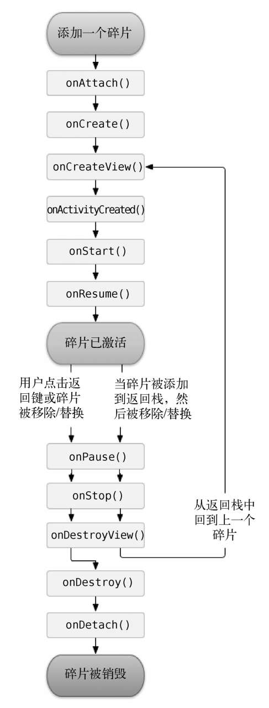
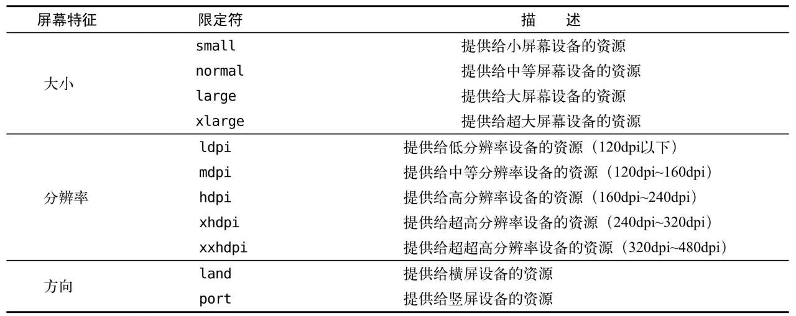

# 碎片

主要是，平板电脑电脑上也会搭载Android系统。

平板电脑和手机最大的区别就在于屏幕的大小，一般手机屏幕的大小会在3英寸到6英寸之间，而一般平板电脑屏幕的大小会在7英寸到10英寸之间。屏幕大小差距过大有可能会让同样的界面在视觉效果上有较大的差异，比如一些界面在手机上看起来非常美观，但在平板电脑上看起来就可能会有控件被过分拉长、元素之间空隙过大等情况。

**Android自3.0版本开始引入了碎片的概念，它可以让界面在平板上更好地展示**

# 1. 碎片的概念

概念：可以嵌入在活动当中的UI片段，它能让程序更加合理和充分地利用大屏幕的空间——在平板上应用得非常广泛

它和活动很像了，同样都能包含布局，同样都有自己的生命周期。你可以将碎片理解成一个迷你型的活动，虽然这个迷你型的活动有可能和普通的活动是一样大的。

使用的场景：

在手机屏幕上，页面比较小，可以塞下的东西比较少，那么可以将新闻标题列表放在一个活动中，将新闻的详细内容放在另一个活动中


但是在平板上，空间比较大，新闻标题单独在一个活动占满整个屏幕太过于空旷，所以一般采用如下布局：


新闻标题列表界面和新闻详细内容界面分别放在两个碎片中，然后在同一个活动里引入这两个碎片，这样就可以将屏幕空间充分地利用起来

# 2. 碎片的使用

需要启动的是平板模拟器，而工程创建是和手机在一起的，即默认的工程是兼容手机和平板的

## 1. 简单的用法

1. 首先创建两个布局：left_fragment.xml，right_fragment.xml

   ```xml
   <LinearLayout
       xmlns:android="http://schemas.android.com/apk/res/android"
       android:layout_width="match_parent"
       android:layout_height="match_parent">
       <Button					// 左侧存在一个按钮，且按钮位于布局的中间
           android:id="@+id/button"
   
           android:layout_width="match_parent"
           android:layout_height="wrap_content"
           android:layout_gravity="center_vertical"
   
           android:text="button" />
   </LinearLayout>
   ```

   ```xml
   <LinearLayout
       xmlns:android="http://schemas.android.com/apk/res/android"
       android:layout_width="match_parent"
       android:layout_height="match_parent"
       android:orientation="vertical"
       android:background="#00ff00">			// 右侧背景色为绿色，主要做区分
       <TextView				// 右侧存在一个文本，在顶部的中间
           android:id="@+id/text_view"
   
           android:layout_width="wrap_content"
           android:layout_height="wrap_content"
           android:layout_gravity="center_horizontal"
   
           android:textSize="20sp"
           android:text="right" />
   </LinearLayout>
   ```

   主要就是设定之后要创建的两个碎片中的布局

2. 新建两个Fragment类，并让它们继承自Fragment：`LeftFragment.java`、`RightFragment.java`

   （ps，书中还有多个Fragment可供选择，主要是为了兼容性问题，实验过程中发现只有一个版本，应该已经做好了兼容性了）

   ```java
   public class LeftFragment extends Fragment {
       @Override
       public View onCreateView(@NonNull LayoutInflater inflater, @Nullable ViewGroup container, @Nullable Bundle savedInstanceState) {
           View view = inflater.inflate(R.layout.left_fragment, container, false);
           return view;
       }
   }
   ```

   ```java
   public class RightFragment extends Fragment {
       @Override
       public View onCreateView(@NonNull LayoutInflater inflater, @Nullable ViewGroup container, @Nullable Bundle savedInstanceState) {
           View view = inflater.inflate(R.layout.right_fragment, container, false);
           return view;
       }
   }
   ```

   重写了Fragment的onCreateView()方法，然后在这个方法中通过LayoutInflater的inflate()方法将刚才定义的fragment布局动态加载进来.

3. 碎片已经创建好了，下面是使用。修改`activity_main.xml`文件：<a name="aim"></a>

   ```xml
   <LinearLayout
       xmlns:android="http://schemas.android.com/apk/res/android"
       android:layout_width="match_parent"
       android:layout_height="match_parent"
       android:orientation="horizontal"		// 水平布局，即下面的两个空间均水平分布
       >
       <fragment
           android:id="@+id/left_fragment"
           android:name="com.example.fragmenttest.LeftFragment"	// 需要导入
   
           android:layout_width="0dp"			// 水平方向上均分
           android:layout_height="match_parent"		// 垂直方向上占满
           android:layout_weight="1" />
       <fragment
           android:id="@+id/right_fragment"
           android:name="com.example.fragmenttest.RightFragment"
   
           android:layout_width="0dp"
           android:layout_height="match_parent"
           android:layout_weight="1" />
   
   </LinearLayout>
   ```

   理解：需要使用的控件是`<fragment></fragment>`，其余性质都一样，还需要**`android:name`——来指明要添加的类名（注意是完整类名，需要加上包名）**

这样，碎片的最简单用法已经实现了：


## 2. 动态添加碎片

碎片真正的强大之处在于，**它可以在程序运行时动态地添加到活动当中**。根据具体情况来动态地添加碎片，就可以将程序界面定制得更加多样化。

所以，设计了这样一个场景：点击左侧的按钮，右边的内容会进行改变

首先需要创建另外一个碎片的布局文件和碎片类：

```xml
<LinearLayout
    xmlns:android="http://schemas.android.com/apk/res/android"
    android:orientation="vertical"
    android:layout_width="match_parent"
    android:layout_height="match_parent"
    android:background="#0000ff">		// 背景颜色变化了
    <TextView
        android:layout_width="match_parent"
        android:layout_height="wrap_content"

        android:text="another_fragment"
        android:textSize="20sp" />
</LinearLayout>
```

```java
public class AnotherFragment extends Fragment {
    @Override
    public View onCreateView(@NonNull LayoutInflater inflater, @Nullable ViewGroup container, @Nullable Bundle savedInstanceState) {
        View view = inflater.inflate(R.layout.another_fragment, container, false);
        return view;
    }
}
```

——内容和之前的一样，这样就准备好了另外一个碎片

下面是动态添加：

先修改`activity_main.xml`文件

```xml
<LinearLayout
    xmlns:android="http://schemas.android.com/apk/res/android"
    android:layout_width="match_parent"
    android:layout_height="match_parent"
    android:orientation="horizontal"
    >
    <fragment					// 左侧不变
        android:id="@+id/left_fragment"
        android:name="com.example.fragmenttest.LeftFragment"

        android:layout_width="0dp"
        android:layout_height="match_parent"
        android:layout_weight="1" />
    <FrameLayout					// 右侧变化了
        android:id="@+id/frame_layout"

        android:layout_width="0dp"
        android:layout_height="match_parent"
        android:layout_weight="1" />
</LinearLayout>
```

右侧变成了FrameLayout布局，所有的控件默认都会摆放在布局的左上角。由于这里仅需要在布局里放入一个碎片，不需要任何定位

因为右侧不再是一个能确定内容的碎片布局，所以不能用<fragment>指定（name无法确定），所以需要一个简单的布局来占位——FrameLayout最适合

重头戏，在逻辑修改中：

```java
public class MainActivity extends AppCompatActivity implements View.OnClickListener{
    @Override
    protected void onCreate(Bundle savedInstanceState) {
        super.onCreate(savedInstanceState);
        setContentView(R.layout.activity_main);
        Button button = (Button) findViewById(R.id.button);
        button.setOnClickListener(this);
        replaceFragment(new RightFragment());
    }

    @Override
    public void onClick(View v) {
        switch (v.getId()) {
            case R.id.button:
                replaceFragment(new AnotherFragment());
                break;
            default:
                break;
        }
    }

    private void replaceFragment(Fragment fragment){
        FragmentManager fragmentManager = getSupportFragmentManager();
        FragmentTransaction transaction = fragmentManager.beginTransaction();
        transaction.replace(R.id.frame_layout, fragment);
        transaction.commit();
    }
}
```

大的逻辑是：activity需要有一个`onCreate()`里面放注册内容：默认有布局导入，由于要用到按钮，所以要获取按钮对象，并且需要注册一个监听器，所以需要重写`onClick()`方法（继承View.onClickListener引起的），还需要加载右半边的碎片，所以写了一个`replacementFragment()`方法，既包括了初始的默认右边碎片的导入，又包括了后面点击后的新右边碎片更新

所以核心是`replacementFragment()`方法：

动态加载碎片主要有5步：

1. **创建待添加的碎片实例**——作为参数传入：`new RightFragmen()/new AnotherFragment()`是前面碎片类的默认构造方法，返回的是该对象
2. **获取FragmentManager对象**——直接通过`getSupportFragmentManager()`获得
3. **开启fragmentMangager的一个事务**——通过`fragmentManager.beginTransaction()`获得
4. **根据事务，向容器内添加或替换碎片**，一般使用**`transaction.replace()`**方法实现，需要的参数：容器的id、待添加的碎片实例
5. **提交事务**，调用**`transaction.commit()`**方法来完成

运行之后效果如下：


## 3. 碎片中模拟栈

上面页面下点击back，发现页面直接退出了。

但是常见的设计是，模仿类似于返回栈的效果，**按下Back键可以回到上一个碎片**

FragmentTransaction中提供了一个**addToBackStack()**方法，可以用于将一个事务添加到返回栈中

```java
private void replaceFragment(Fragment fragment){
    FragmentManager fragmentManager = getSupportFragmentManager();
    FragmentTransaction transaction = fragmentManager.beginTransaction();
    transaction.replace(R.id.frame_layout, fragment);
    transaction.addToBackStack(null);
    transaction.commit();
}
```

理解：需要在提交事务之前添加`addToBackStack()`，参数：String，名字用来描述返回栈的状态，一般传入null

运行发现，点击按钮将AnotherRightFragment添加到活动中，然后按下Back键，你会发现程序并没有退出，而是回到了RightFragment界面，继续按下Back键，RightFragment界面也会消失，再次按下Back键，程序才会退出

## 4. 碎片和活动的通信

为了方便碎片和活动之间进行通信，FragmentManager提供了一个类似于**findFragmentById()**的方法，专门用于从布局文件中获取碎片的实例：

```java
// MainActivity.java
LeftFragment leftFragment = (LeftFragment) getSupportFragmentManager().findFragmentById(R.id.left_fragment);
```

——那么能在活动里直接获取到当前页面的碎片，然后就能调用fragment里面实现的方法了

每个碎片中都可以通过调用**getActivity()**方法来得到和当前碎片相关联的活动实例：

```java
// LeftFragment.java
MainActivity mainActivity = (MainActivity) getActivity();
```

并且当碎片中需要使用Context对象时，也可以使用getActivity()方法，因为获取到的活动本身就是一个Context对象。

那么碎片和碎片之间的通信呢？

**可以先去获得该碎片相关的活动，然后通过该活动去获得另外一个碎片的实例**，那么碎片之间也能通信了

# 3. 碎片的生命周期

## 1. 碎片的状态

4种：

1. 运行状态

   当一个碎片是**可见的**，并且它所关联的**活动正处于运行状态**时，该碎片也处于运行状态。

2. 暂停状态

   **当一个活动进入暂停状态时**（由于另一个未占满屏幕的活动被添加到了栈顶），与它相关联的可见碎片就会进入到暂停状态。

3. 停止状态

   - 当一个活动**进入停止状态**时，与它相关联的碎片就会进入到停止状态
   - 或者通过调用FragmentTransaction的remove()、replace()方法将**碎片从活动中移除**，且事务提交之前**调用addToBackStack()方法**，这时的碎片会进入到停止状态。

   总的来说，进入停止状态的碎片对用户来说是**完全不可见的**，有可能会被系统回收。

4. 销毁状态

   - 当**活动被销毁**时，与它相关联的碎片就会进入到销毁状态
   - 或者通过调用FragmentTransaction的remove()、replace()方法将**碎片从活动中移除**，且事务提交之前并**没有调用addToBackStack()方法**，这时的碎片会进入到销毁状态。

## 2. 碎片的回调方法

Fragment类中也提供了一系列的回调方法，以覆盖碎片生命周期的每个环节。其中，活动中有的回调方法，碎片中几乎都有，不过碎片还提供了一些附加的回调方法，那我们就重点看一下这几个回调：

- onAttach()：当碎片和活动**建立关联**的时候调用
- onCreateView()：为碎片**创建视图（加载布局）**时调用
- onActivityCreated()：确保与碎片**相关联的活动一定已经创建完毕**的时候调用
- onDestroyView()：当与碎片关联的**视图被移除**的时候调用
- onDetach()：当碎片和活动**解除关联**的时候调用



所以，当RightFragment第一次被加载到屏幕上时，会依次执行onAttach()、onCreate()、onCreateView()、onActivityCreated()、onStart()和onResume()方法。

后面点击按钮，AnotherRightFragment替换了RightFragment，此时的RightFragment进入了停止状态，因此onPause()、onStop()和onDestroyView()方法会得到执行，因为调用了`addToBackStack()`所以没被销毁，否则就直接，继续调用`onDestroy()`、`onDetach()`将该碎片销毁了。

注意：可以通过**`onSaveInstanceState()`**方法来保存数据的，因为进入停止状态的碎片有可能在系统内存不足的时候被回收。保存下来的数据在onCreate()、onCreateView()和onActivityCreated()这3个方法中都可以重新得到，它们都含有一个Bundle类型的savedInstanceState参数

# 4. 动态加载布局的技巧

动态添加碎片的功能很强大，可以解决很多实际开发中的问题。如果能够根据设备的分辨率或屏幕大小在运行时来决定加载哪个布局，那就更加完美了。所以涉及到了动态加载布局的技巧：

## 1. 使用限定符

现在很多的平板应用都采用的是双页模式（程序会在左侧的面板上显示一个包含子项的列表，在右侧的面板上显示内容），因为平板电脑的屏幕足够大，完全可以同时显示下两页的内容

那么怎样才能在运行时判断程序应该是使用双页模式还是单页模式呢？这就需要**借助限定符（Qualifiers）来实现了**

在res下创建一个文件`layout-large`，然后将[原来的布局文件](#aim)复制到这边，创建和layout同名的`activity_main.xml`文件

而在layout文件夹下：

```xml
<LinearLayout
    xmlns:android="http://schemas.android.com/apk/res/android"
    android:layout_width="match_parent"
    android:layout_height="match_parent"
    android:orientation="horizontal" >
    <fragment
        android:id="@+id/left_fragment"
        android:name="com.example.fragmenttest.LeftFragment"

        android:layout_width="match_parent"
        android:layout_height="match_parent" />
</LinearLayout>
```

——只剩下单个碎片，表示手机等小屏幕模式下的布局

而`layout-large`代表的是大屏幕下的布局情况

而`MainActivity`中的逻辑变成最初的默认内容

可以发现，在平板下：


在手机模式下：


Android中一些常见的限定符可以参考下表：——只需要创建不同的文件夹的时候带上后缀就行，eg`layout-large`



## 2. 使用最小宽度的限定符

large到底是指多大呢？有的时候我们希望可以更加灵活地为不同设备加载布局，不管它们是不是被系统认定为large，这时就可以使用**最小宽度限定符（Smallest-width Qualifier）**了

概念：最小宽度限定符允许我们对屏幕的宽度指定一个最小值（以**dp为单位**），然后以这个最小值为临界点，屏幕宽度大于这个值的设备就加载一个布局，屏幕宽度小于这个值的设备就加载另一个布局。

eg：在res目录下新建**layout-sw600dp文件夹**，然后在这个文件夹下新建activity_main.xml布局——这就意味着，当程序运行在屏幕宽度**大于等于600dp的设备上时，会加载layout-sw600dp/activity_main布局**，当程序运行在屏幕宽度**小于600dp的设备上时，则仍然加载默认的layout/activity_main布局**。

# 5. 实践

碎片很多时候都是在平板开发当中使用的，主要是为了解决屏幕空间不能充分利用的问题，但是维护两个版本的代码成本很高，增加、删除都是需要双份的，所以需要**编写同时兼容手机和平板的应用程序**。

目的：需要创建一个新闻应用，且兼容手机和平板

主要用到之前的RecyclerView + 碎片

1. 首先需要写News类，主要是用来存放news的标题和内容，用在`RecyclerView`的item中

   ```java
   public class News {         // 新闻类，每条新闻有2个参数：标题 + 内容
       private String title;
       private String content;
       public News(String title, String content){
           this.title = title;
           this.content = content;
       }
   
       public String getContent() {
           return content;
       }
   
       public String getTitle() {
           return title;
       }
   }
   ```

2. 左右两个碎片内部的布局文件：`news_title_layout.xml`，`news_content_layout.xml`

   左边碎片的布局文件：主要展示news新闻标题——是一个RecyclerView的滚动控件

   ```xml
   <LinearLayout
       xmlns:android="http://schemas.android.com/apk/res/android"
       android:layout_width="match_parent"
       android:layout_height="match_parent"
       android:orientation="vertical">		// 内部是垂直方向的
       <androidx.recyclerview.widget.RecyclerView
           android:id="@+id/recycler_view"
           android:layout_width="match_parent"
           android:layout_height="match_parent" />
   </LinearLayout>
   ```

   右边碎片的布局文件：主要展示新闻内容，默认是不可见（默认是没有内容）

   ```xml
   <!-- 碎片中的布局情况，采用相对布局，左边一条黑色的竖线，右边，上边是标题，中间横线隔开，下面是内容 -->
   <RelativeLayout
       xmlns:android="http://schemas.android.com/apk/res/android"
       android:layout_width="match_parent"
       android:layout_height="match_parent">
       <LinearLayout
           android:id="@+id/visibility_layout"
   
           android:layout_width="match_parent"
           android:layout_height="match_parent"
           android:orientation="vertical"		// 内部是垂直布局
           android:visibility="invisible" >	// 默认不可见
           <TextView
               android:id="@+id/news_title"
   
               android:layout_width="match_parent"
               android:layout_height="wrap_content"
                     
               android:padding="10dp"		// 标题内容和周围有间距
               android:gravity="center"	// 内容居中
               android:textSize="20sp" />
           <View				// 画一条黑色的横线
               android:layout_width="match_parent"
               android:layout_height="1dp"
               android:background="#000" />
           <TextView
               android:id="@+id/news_content"
   
               android:layout_width="match_parent"		// 剩余的地方都给内容
               android:layout_height="0dp"
               android:layout_weight="1"
                     
               android:padding="15dp"			// 内容和周围有间距
               android:textSize="18sp" />
       </LinearLayout>
       <View					// 左边一条竖线——向左靠齐
           android:layout_width="1dp"
           android:layout_height="match_parent"
           android:layout_alignParentLeft="true"
           android:background="#000" />
   </RelativeLayout>
   ```

3. 碎片布局文件完成后，需要编写两个碎片对应的文件，但是左侧因为是一个recyclerView滚动插件，所以需要先创建一个子项的布局文件：`news_title_item.xml`

   每个条目内容很简单，就只是存放标题，所以一个textView即可

   ```xml
   <TextView
       xmlns:android="http://schemas.android.com/apk/res/android"
       android:id="@+id/news_title_item"
   
       android:layout_width="match_parent"
       android:layout_height="wrap_content"
   
       android:maxLines="1"
       android:textSize="18sp"
       android:ellipsize="end"	// 文本内容超出控件宽度时，文本的缩略方式，这里指定成end表示在尾部进行缩略
       android:paddingLeft="10dp"			// 设定内容和周围的间距——补白，文本内容不会紧贴在边缘上
       android:paddingTop="15dp"
       android:paddingRight="10dp"
       android:paddingBottom="15dp">
   </TextView>
   ```

   新的知识点是：`android:ellipsize="end"`

4. 下面可以编写两个碎片对应的文件：`NewsTitleFragment.java`、`NewsContentFragment.java`

   左边标题对应的逻辑文件，因为左边存在recyclerView，所以还要在内部实现一个适配器

   ```java
   public class NewsTitleFragment extends Fragment {
       private boolean isTwoPane;		// 标志位，判断当前是双屏or单屏
       @Nullable
       @Override
       public View onCreateView(@NonNull LayoutInflater inflater, @Nullable ViewGroup container, @Nullable Bundle savedInstanceState) {
           View view = inflater.inflate(R.layout.news_title_layout, container, false);
           return view;
       }
   
       @Override
       // 重写该方法，通过在活动中能否找到一个id为news_content_layout的View来判断当前是双页模式还是单页模式
       public void onActivityCreated(@Nullable Bundle savedInstanceState) {
           super.onActivityCreated(savedInstanceState);
           if (getActivity().findViewById(R.id.news_content_layout) != null){	// 在顶层布局中才会用到
               isTwoPane = true;
           }
           else{
               isTwoPane = false;
           }
       }
       
       // 内部类，适配器的实现
       class NewsAdapter extends RecyclerView.Adapter<NewsAdapter.ViewHolder>{
           private List<News> newsList;		// 新闻列表
           class ViewHolder extends RecyclerView.ViewHolder{	// ViewHolder主要给onCreateViewHolder使用，给定一个view能创建一个viewHolder供返回
               TextView newsTitleText;		// 内容就一个标题
               public ViewHolder(View view){
                   super(view);
                   newsTitleText = (TextView) view.findViewById(R.id.news_title_item);
               }
           }
           public NewsAdapter(List<News> newsList){
               this.newsList = newsList;
           }
   
           @NonNull
           @Override
           // 用来创建ViewHolder实例的：根据parent获得当前的上下文，再根据子项的内容，获得view，然后调用内部类的构造方法，获得ViewHolder返回值
           public ViewHolder onCreateViewHolder(@NonNull ViewGroup parent, int viewType) {
               View view = LayoutInflater.from(parent.getContext()).inflate(R.layout.news_title_item, parent, false);
               final ViewHolder viewHolder = new ViewHolder(view);
               // 需要能够响应点击操作
               view.setOnClickListener(new View.OnClickListener() {
                   @Override
                   public void onClick(View v) {
                       // 获得当前新闻
                       News news = newsList.get(viewHolder.getAdapterPosition());
                       if(isTwoPane){	// 在activity创建的时候已经判断过是否是双屏了
                           NewsContentFragment newsContentFragment = (NewsContentFragment) getFragmentManager().findFragmentById(R.id.news_content_fragment);// 获得当前页面的另外一个碎片（右侧碎片）
                           newsContentFragment.refresh(news.getTitle(), news.getContent());// 然后更新内容
                       }
                       else {		// 单屏模式，直接刷新——内容在后面出现
                           NewsContentActivity.actionStart(getActivity(), news.getTitle(), news.getContent());
                       }
                   }
               });
               return viewHolder;
           }
   
           @Override
           // 子项进行赋值所用，子项内容就是标题，所以只需要将holder的标题的内容设置好即可
           public void onBindViewHolder(@NonNull ViewHolder holder, int position) {
               News news = newsList.get(position);
               holder.newsTitleText.setText(news.getTitle());
           }
   
           @Override
           public int getItemCount() {
               return newsList.size();
           }
       }
   }
   ```

   右边的碎片：实现了`onCreateView`，即实现了布局绑定

   ```java
   public class NewsContentFragment extends Fragment {		// 继承fragment
       private View view;			// 主要是给refresh中使用
       @Nullable
       @Override
       public View onCreateView(@NonNull LayoutInflater inflater, @Nullable ViewGroup container, @Nullable Bundle savedInstanceState) {
           view = inflater.inflate(R.layout.news_content_layout, container, false);    // 绑定碎片中的布局文件
           return view;
       }
       public void refresh(String title, String content){      // 用来得到该碎片布局后，得到碎片对象，然后更新里面的内容
           TextView news_title = (TextView) view.findViewById(R.id.news_title);// 根据view来获得标题和内容对象
           TextView news_content = (TextView) view.findViewById(R.id.news_content);
           news_title.setText(title);		// 然后将内容设置给两个对象——实现更新
           news_content.setText(content);
       }
   }
   ```

5. 左右碎片的布局文件、逻辑代码已经完成，下面要写双屏的顶层布局代码了：

   ```xml
   // layout-sw600dp/mainActivity.xml
   <LinearLayout
       xmlns:android="http://schemas.android.com/apk/res/android"
       android:layout_width="match_parent"
       android:layout_height="match_parent"
       android:orientation="horizontal">
       <fragment			// 左边碎片，指定左边碎片绑定的逻辑代码
           android:id="@+id/news_title_fragment"
           android:name="com.example.fragmenttest.NewsTitleFragment"
           android:layout_width="0dp"
           android:layout_height="match_parent"
           android:layout_weight="1" />
       <FrameLayout
           android:id="@+id/news_content_layout"
           android:layout_width="0dp"
           android:layout_height="match_parent"
           android:layout_weight="3">
           <fragment
               android:id="@+id/news_content_fragment"
               android:name="com.example.fragmenttest.NewsContentFragment"
               android:layout_width="match_parent"
               android:layout_height="match_parent" />
       </FrameLayout>
   </LinearLayout>
   ```

   而如果只有单屏下，那么顶层的代码如下：——只有左侧一个碎片

   ```xml
   // layout/activity_main.xml
   <FrameLayout
       xmlns:android="http://schemas.android.com/apk/res/android"
       android:id="@+id/news_tilte_only"
   
       android:layout_width="match_parent"
       android:layout_height="match_parent">
       <fragment
           android:id="@+id/news_title_fragment"
           android:name="com.example.fragmenttest.NewsTitleFragment"
           android:layout_width="match_parent"
           android:layout_height="match_parent" />
   </FrameLayout>
   ```

6. 因为需要兼容单屏和双屏，前面写的布局文件和逻辑代码都是在双屏下面的写的，所以需要对应写单屏的情况

   单屏下，点击一个标题，那么会跳转到一个新的页面，标题页已经完成（如上），那么新页面就是一个新的activity，所以需要创建一个activity + 对应的布局文件

   ```xml
   <!--单页情况下的布局，新闻内容页只有新闻，具体可以复用之前给碎片的布局文件，所以直接用fragment控件即可-->
   <LinearLayout
       xmlns:android="http://schemas.android.com/apk/res/android"
       android:orientation="vertical"			// 垂直布局
       android:layout_width="match_parent"
       android:layout_height="match_parent" >
       <fragment
           android:id="@+id/news_content_fragment"
           android:name="com.example.fragmenttest.NewsContentFragment"
           android:layout_width="match_parent"
           android:layout_height="match_parent" />
   </LinearLayout>
   ```

   ```java
   public class NewsContentActivity extends AppCompatActivity {        // 单独一个新闻内容页
       @Override
       protected void onCreate(Bundle savedInstanceState) {        // 启动时的操作
           super.onCreate(savedInstanceState);
           setContentView(R.layout.activity_news_content);
           String news_title = getIntent().getStringExtra("news_title");   // 得到传递来的参数的描述需要和下面一致
           String news_content = getIntent().getStringExtra("news_content");
           // 根据当前的布局，获取碎片布局，从而更新view中的内容
           NewsContentFragment newsContentFragment = (NewsContentFragment) getSupportFragmentManager().findFragmentById(R.id.news_content_fragment);
           newsContentFragment.refresh(news_title, news_content);
       }
       public static void actionStart(Context context, String newsTitle, String newsContent){      // 给其他activity来调用，启动当前的activity，需要传入两个附加参数
           Intent intent = new Intent(context, NewsContentActivity.class); // 显式启动：指明上下文和目标activity（就是该activity类）
           intent.putExtra("news_title", newsTitle);        // 需要传递两个参数，描述要和上面一致，不然取不到数据
           intent.putExtra("news_content", newsContent);
           context.startActivity(intent);      // 启动
       }
   }
   ```

7. 最后，需要导入recyclerView，然后使用recyclerView，由于recyclerView在NewsTitleFragment中使用，那么就在那边填充数据并且调用即可：

   ```java
   public class NewsTitleFragment extends Fragment {
       private boolean isTwoPane;
       @Override
       public View onCreateView(@NonNull LayoutInflater inflater, @Nullable ViewGroup container, @Nullable Bundle savedInstanceState) {
           View view = inflater.inflate(R.layout.news_title_layout, container, false);
           // 调用RecyclerView方法——和前面的RecyclerView使用一样
           // 获得recycler_view的布局id
           RecyclerView titleRecyclerView = (RecyclerView) view.findViewById(R.id.recycler_view);
           // 创建LinearLayoutManager对象，需要传递当前的activity进去
           LinearLayoutManager layoutManager = new LinearLayoutManager(getActivity());
           // 设置recyclerView的布局
           titleRecyclerView.setLayoutManager(layoutManager);
           NewsAdapter newsAdapter = new NewsAdapter(getNews());	// 获取适配器对象，需要传递数据内容
           titleRecyclerView.setAdapter(newsAdapter);
           return view;
       }
   
       ....
       ....
           
       private List<News> getNews(){		// 数据填充
           List<News> newsList = new ArrayList<>();
           for(int i = 1; i <= 50; i++){
               News news = new News("this is news title" + i, getRandomNewsContent("this is new content" + i));
               newsList.add(news);
           }
           return newsList;
       }
       private String getRandomNewsContent(String content){
           Random random = new Random();
           int len = random.nextInt(20) + 1;
           StringBuilder sb = new StringBuilder();
           for(int i = 0; i < len; i++){
               sb.append(content);
           }
           return sb.toString();
       }
   }
   ```

最后实现的效果：

手机效果：


平板效果：


