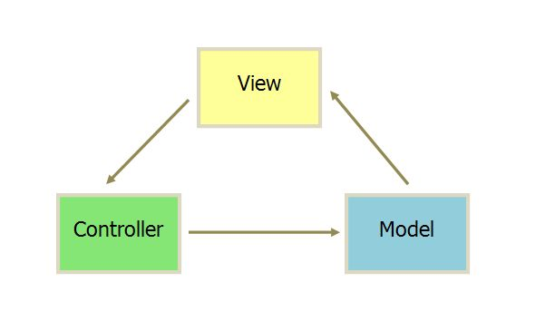
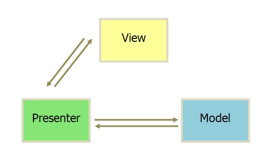

# 软件架构模式

背景：在《第一行代码》中提到了“天气app”是利用了MVVM软件架构模式

在面试的时候也被问到，但是并没有回答出来。特此整理，比较浅显的

> 你刚才提到的app的设计模式是MVVM模式，讲讲如何设计的，在项目中是如何体现的

MVVM：

1. model：与业务实体有一一对应的关系

2. view

3. view model：变化之处

   model of view，即对view的展示的数据的模型。vm和view是一一对应关系

   viewmodel对view，直接进行绑定，确定要展示的数据

   对model，进行逻辑处理，数据过滤等，将需要展示的数据提取出来

**如果外界变化，操作的都是viewmodel中的数据**，而由于存在绑定关系，所以viewmodel变化了，view也会跟着变化。

外界变化：用户的点击等事件、网络通信等

存在一个交互：如果view变化了，viewmodel需要变化吗？ 如果viewmodel变化了，view变化吗？

1. 单向绑定：viewmodel变化时，view跟着变化——默认要有的特性

2. 双向绑定：单向绑定的基础上，view变化了，viewmodel也要变化

   ——麻烦之处在于，view的输入可能无法直接与viewmodel进行映射——属性转换器

   eg：view有一个下拉选择框：性别：0-未知，1-男，2-女，用户在选择后，view要去更新viewmodel，但是这种枚举情况，viewmodel存储的数据都是int类型，所以view到viewmodel需要进行转换

常见的：一些网络请求，也会放在viewmodel中，从而view那边只需要点击按钮，就会去调用viewmodel中的push指令：

```java
class LoginViewModel {
    String  userId;
    String  password;
    bool    isLoading;
    bool    loginStatus;
    String  errorMessage;

    Login() {						// 网络请求
        request(url, this.userId, this.password, {
            success: function() {
                ...
            },
            failed: function() {
                this.isLoading = false;             //触发绑定关系，隐藏登陆 loading 框
                this.isShowErrorMessage = true;     //触发绑定关系，显示错误提示框
                this.errorMessage = '密码错误';      //触发绑定关系，设置错误提示文字内容
            }
        });
    }
}
```

view中的代码：

```java
function onUserIdTextViewChanged(textView) {
    loginViewModel.userId = textView.text;			// 单向绑定，需要手动将viewmodel的数据更新
}

function onPasswordTextViewChanged(textView) {
    loginViewModel.password = textView.text;
}

function onLoginButtonClick() {
    loginViewModel.isLoading = true;            //触发绑定关系，显示登陆 loading 框
    loginViewModel.isShowErrorMessage: false;   //触发绑定关系，隐藏错误提示框
    loginViewModel.login();                     //开始登陆——具体就交给viewmodel处理了
}
```

核心问题：

如何实现viewmodel数据变化，view就会更新？

步骤：

1. 设定viewmodel和view的映射关系

   ——findViewById，去获取view，然后将view和viewmodel对应：

   ```kotlin
   val numberView: TextView = findViewById(R.id.numberView)
   numberView.bind(myViewModel)				// 就实现了数据绑定		
   ```

   ——如果不需要绑定，则调用unbind，可以调用recycle将数据回收

2. 全局控制viewmodel的变化，一旦变化就要去更新view


> 还有其他哪些软件架构模式？

常见的客户端架构有3种：

1. MVC

   最经典 model-view-controller

   

   分别代表：数据模型-视图（具体展示）- 控制model的读取、存储，更新数据的逻辑控制

   controller需要读取model的数据、存储，还需要对某些控件进行响应、网络请求等

   他们之间的逻辑是：用户通过view进行修改，然后传递给controller进行业务逻辑处理，然后交给model进行持久化，并且将结果反馈给view进行展示

   ——代码耦合严重，不易阅读和修改

   （activity中的代码尽量不要超过300行——随便记录着玩的）

   eg：对应关系：

   1. view：xml文件
   2. model：数据文件
   3. controller：activity，能够去处理逻辑，然后交给xml文件展示

   问题：xml文件能力太弱（无法动态改变），所有设置都必须在activity中实现，eg：背景更换、颜色显式等

   ——所以activity就兼具了controller和view的双重功能，导致代码耦合严重

2. MVP

   model-view-presenter

   

   两个部分之间的通信是双向的，view和model之间没有通信，通过presenter进行间接传递。

   view只进行展示，被称为被动视图，而presenter特别多内容，所有逻辑都在这边

   eg：对应关系：

   1. view：activity、fragment、自定义view，主要就是ui渲染
   2. model：数据模型
   3. presenter：数据处理，和view、model之间的交互，**它持有view和model的引用**

   view只会暴露可以修改的接口，eg：text的颜色修改接口等，presenter获取到model数据并处理，然后通过view的接口去更新ui——从而实现view和model的隔离

   问题：

   1. presenter需要获取model的数据，并且处理逻辑，且要调用view的接口将数据展示——presenter代码量很大
   2. **view暴露的接口和接口的粒度需要进行设计**，eg：对text的修改，可能存在内容、颜色的修改，那么是需要两个api分别修改，还是集中在一个api修改两方面，且可能会有大量的接口
   3. activity会有大量ui相关的方法，presenter通过调用该方法来实现view的改变，如果view的ui变化了，那么接口变化了，那么activity中代码变化，presenter的调用代码也变化

3. MVVM

   model-view-viewmodel

   1. view：主要负责ui渲染

      监听viewmodel的数据变化
   
   2. model：实体模型
   
      创建模型，并且暴露获取数据的方法，eg：如何post、get数据
   
   3. viewmodel：业务逻辑
   
      接收view的事件指令（按钮、输入数据等），然后通过model暴露的方法去获取并处理数据
   
   ——很类似于MVP
   
   但是，区别在于view和viewmodel之间实现了双向绑定：view变化了会传递给viewmodel，viewmodel变化了会传递给view进行展示更新。
   
   优势：
   
   1. 低耦合：view和model独立了，viewmodel不会持有view的对象，而view也只会监听数据的变化，viewmodel可以绑定到不同的view上，每一块都可以独立开发
   2. 可重用性：视图逻辑放到viewmodel中，很多view都可以用
   3. 数据驱动，viewmodel变化了，view也变化了，view变化了，viewmodel也会跟着变化
   4. 异步线程更新数据


参考：

1. https://www.jianshu.com/p/a898ef83f38c
2. https://www.jianshu.com/p/e7628d6e6f61