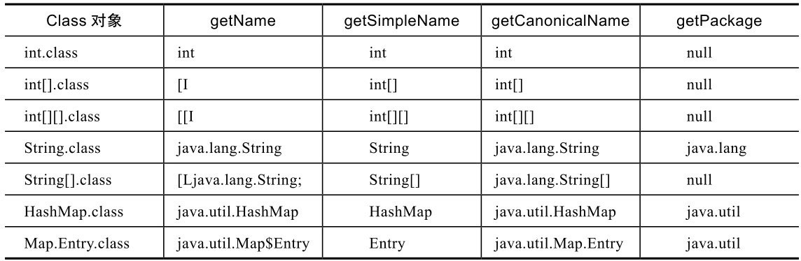

# Java动态特性

# 1. 反射

反射：**在运行时动态获取类型的信息**，eg：接口信息、成员信息、方法信息、构造方法信息，然后根据动态获取到的信息创建对象、访问修改成员、调用方法等。

**反射的入口是名称为Class的类**

## 1.1 Class类

### 1.1.1 定义

已加载的类在内存都有一份类信息，**每个对象都有指向它所属类信息的引用**。

类信息也是一个对象，对应的类是：`java.lang.Class`

Object超类里面有一个方法，可以用来获取该对象对应的类信息（类对象）：

```java
public final native Class<？> getClass();
```

——该方法是native方法，且不能由子类重写

### 1.1.2 Class对象获取

getClass()并不知道具体的类型，所以返回**Class<?>**

- 如果知道类名，可以直接获取Class对象

  ```java
  Class<Date> cls = Date.class;
  ```

- 接口也有Class对象

  ```java
  Class<Comparable> cls = Comparable.class;
  ```

- 基本类型没有getClass方法，但也都有对应的Class对象，类型参数为对应的包装类型

  ```java
   Class<Integer> cls = int.class;
  ```

- void作为特殊的返回类型，也有对应的Class

  ```java
  Class<Void> cls = void.class;
  ```

- 对于数组，每种类型都有对应数组类型的Class对象，每个维度都有一个，即一维数组有一个，二维数组有一个不同的类型

  ```
  Class<? extends int[]> cls = arr.getClass();
  class [I
  
  Class<? extends int[][]> cls = arr.getClass();
  class [[I
  ```

  它使用**`前缀[`**表示数组，有几个[表示是几维数组。

  数组的类型用一个字符表示，I表示int, L表示类或接口，其他类型与字符的对应关系为：boolean(Z)、byte(B)、char(C)、double(D)、float(F)、long(J)、short(S)。对于引用类型的数组，注意最后有一个分号，eg：String类型的一维数组：**[Ljava.lang.String;**

- 枚举类型也有对应的Class

**Class有一个静态方法：`forName`，可以根据类名直接加载Class，获取Class对象**——这个是下面类加载的重点

```java
try{
    Class<?> cls = Class.forName("java.util.HashMap");		// forName会抛出异常，所以需要处理
    System.out.println(cls);
}catch(ClassNotFoundException e){
    e.printStackTrace();
}

>> class java.util.HashMap
```

有了Class对象就可以了解到该类的很多信息：名称信息、字段信息、方法信息、创建对象和构造方法、类型信息等

### 1.1.3 根据Class对象获取名称信息

Class对象，提供了4种方法获取名称信息：

```java
public String getName();
public String getSimpleName();
public String getCanonicalName();
public String getPackage();

// 使用
int.class ——获取Class对象
int.class.getName();		——获得String类型的类名字
```




### 1.1.4 字段信息

字段信息包括：类中定义的静态变量和实例变量都被称为字段，用**类Field表示**，位于包`java.lang.reflect`下——反射相关的。

```java
public Field[] getFields();			// 根据Class对象获取类中public的字段，包括父类的
public Field[] getDeclaredFields();		// 获取类中的所有字段，包括所有可见性的，但是不包括父类

public Field getField(String name);			// 根据指定的名字找到对应的Field字段，包括父类
public Field getDeclaredField(String name);			// 不包括父类，但是可以查询所有可见性字段的——如果找不到都会抛出异常NoSuchFieldException
```

举例：

```java
Class<ArrayList> cls3 = ArrayList.class;
Field[] fields1 = cls3.getDeclaredFields();			// 返回的是数组
```

```java
try{
    Field serial = cls3.getDeclaredField("serialVersionUID");
}catch (NoSuchFieldException e){			// 需要处理异常
    e.printStackTrace();
}
```

还有很多其他的方法：

eg：

```java
try{
    Field serial = cls3.getDeclaredField("serialVersionUID");
    int mod = serial.getModifiers();				// 获取字段的修饰符
    System.out.println(Modifier.toString(mod));		// toString，就可以获取修饰符——private static final
}catch (NoSuchFieldException e){
    e.printStackTrace();
}
```

### 1.1.5 方法信息

类中定义的静态和实例方法都被称为方法，用**类Method表示**。

具体方法和字段信息类似：

```java
public Method[] getMethods();
public Method[] getDeclaredMethods();

public Method getMethod(String name, Class<?>.. paramterTypes);		// 由于方法存在重载，所以需要指定该方法的参数类型
public Method getDeclaredMethod(String name, Class<?>.. paramterTypes);		//——如果找不到会抛出NoSuchMethodException异常，所以需要处理
```

获得了该方法之后，可以获取方法名、方法的可使用性：

```java
public String getName();
public void setAccessible(boolean flag);
public Object invoke(Object obj, Object... args)throws IllegalAccessException,IllegalArgumentException,InvocationTargetException
```

——需要关注的是invoke方法，它能够调用该方法，只需要传递对象和参数即可。如果该方法是静态方法，第一个参数可以是null，args可以是数组 or null

eg：

```java
Class<? extends Integer> cls = Integer.class;
try {
    Method method = cls.getMethod("parseInt", String.class);
    System.out.println(method.invoke(null, "123"));
}catch (NoSuchMethodException e){
    e.printStackTrace();
}catch (InvocationTargetException | IllegalAccessException e){
    e.printStackTrace();
}
```

### 1.1.6 构造方法

构造方法可以用**类Constructor表示**

获取构造方法同Method、Field一致，但是由于构造方法不能重写，所以不存在父类的问题

获取构造方法后，可以用来创建对象：

```java
try{
    Constructor constructor = cls.getConstructor(new Class[]{int.class});	// 获取具体的构造方法
    Object out = constructor.newInstance(123);		// 创建对象
    System.out.println(out.getClass());		// class java.lang.Integer
}catch (NoSuchMethodException e){
    e.printStackTrace();
}catch (InvocationTargetException e){

} catch (IllegalAccessException e) {
    e.printStackTrace();
} catch (InstantiationException e) {
    e.printStackTrace();
}
```

也可以直接通过Class对象创建实例对象——但是调用的是无参构造方法

```java
HashMap<String, Integer> hashMap = cls2.newInstance();
hashMap.put("1234", 1234);
```

### 1.1.7 类型检查

`instanceof`是用来检查某个对象是否是某个类型的，即`arrayList instanceof ArrayList`=> true，指定的类必须是在运行前就确定了。但是，如果类是运行时才确定的，那么可以使用Class类的`isInstance`方法

```java
Class<? extends ArrayList> cls = ArrayList.class;
if(cls.isInstance(arrayList)){....}
```

强制类型转换也可以在运行时才确定：cast

```java
public T cast(Object obj);
```

java.lang.reflect包中有一个针对数组的专门的类Array（注意不是java.util中的Arrays)，提供了对于数组的一些反射支持，以便于统一处理多种类型的数组，主要方法有：

```java
public native Class<?> getComponentType();		// ——获得数组的元素的类型
```

### 1.1.8 反射和泛型

泛型参数在运行时会被擦除，但是类信息Class中依然有关于泛型的一些信息，可以通过反射得到

Class可以获得类的泛型信息：

```java
public TypeVariable<Class<T>>[] getTypeParameters()
```

Field可以获得字段对应的泛型信息：

```java
public Type getGenericType()
```

Method可以获得方法对应的泛型信息：

```java
public Type getGenericReturnType();
public Type[] getGenericParameterTypes();
public Type[] getGenericExceptionTypes();
```

反射灵活，但是容易出错，所以不建议，主要原因：

1. 反射更容易出现运行时错误，使用显式的类和接口，编译器能帮我们做类型检查，减少错误，但使用反射，类型是运行时才知道的，编译器无能为力。
2. 反射的性能要低一些，在访问字段、调用方法前，反射先要查找对应的Field/Method，要慢一些

**如果能用接口实现同样的灵活性，就不要使用反射。**

# 2. 注解

注解就是给程序添加一些信息，用**字符@开头**，这些信息用于修饰它后面紧挨着的其他代码元素。注解可以被编译器、程序运行时和其他工具使用，用于增强或修改程序行为等。

## 2.1 内置注解

Java内置了一些常用注解：@Override、@Deprecated、@SuppressWarnings

- @Override：它可以减少一些编程错误，如果在重写子类的方法时，如果子类的方法名、参数列表、修饰符范围等不符合要求，就会提示错误。

  如果没有Override注解，编译器不会报告任何错误，它会认为该方法是子类新加的方法。

- @Deprecated：修饰的范围很广，包括类、方法、字段、参数等，它表示对应的代码已经过时了，程序员不应该使用它，不过，它是一种警告，而不是强制性的

  从Java 9开始，@Deprecated多了两个属性：since和forRemoval。since是一个字符串，表示是从哪个版本开始过时的；forRemoval是一个boolean值，表示将来是否会删除。`@Deprecated(since="9")`

- @SuppressWarnings：压制Java的编译警告，它有一个必填参数，表示压制哪种类型的警告，它也可以修饰大部分代码元素`@SuppressWarnings{"Deprecation", "unused"}`

——内置的注解使用的还是比较少

## 2.2 框架和库的注解

各种框架和库定义了大量的注解，可以通过**注解配置框架和库**。

eg：

```java
@Path("/hello")
public class HelloResource {
    @GET
    @Path("test")
    @Produces(MediaType.APPLICATION_JSON)			// 通过注解实现配置
    public Map<String, Object> test(
        @QueryParam("a") String a) {
        Map<String, Object> map = new HashMap<>();
        map.put("status", "ok");
        return map;
    }
}
```

## 2.3 创建注解

自行创建注解。

```java
@Target(ElementType.METHOD)
@Retention(RetentionPolicy.SOURCE)		// 两个元注解@Target和@Retention,专门用于定义注解本身
public @interface Override {
}
```

`@interface`：interface前面有一个@，在前面有两个元注解：@Target、@Retention，他们主要来定义注解本身。

- @Target：表示注解可以适用的目标，eg：@Override的范围就是Method，方法

  ElementType是METHOD

  TYPE：表示类、接口（包括注解），或者枚举声明；

  FIELD：字段，包括枚举常量；

  METHOD：方法；

  PARAMETER：方法中的参数；

  CONSTRUCTOR：构造方法；

  LOCAL_VARIABLE：本地变量；

  MODULE：模块（Java 9引入的）

  如果没有声明@Target，默认为适用于所有类型

- @Retention：注解信息保留到什么时候，取值只能有一个，类型为RetentionPolicy，它是一个枚举，有三个取值

  SOURCE：只在源代码中保留，编译器将代码编译为字节码文件后就会丢掉

  CLASS：保留到字节码文件中，但Java虚拟机将class文件加载到内存时不一定会在内存中保留

  RUNTIME：一直保留到运行时。

  如果没有声明@Retention，则默认为CLASS

可以为注解定义一些参数，定义的方式是在**注解内定义一些方法**

eg：有且只有一个方法，且方法名为value，那么在使用的时候可以忽略value，其余均不能忽略

```java
@Retention(RUNTIME)
@Target(FIELD)
public @interface Label {
    String value() default "";		// 定义了一些方法
}
@Retention(RUNTIME)
@Target(FIELD)
public @interface Format {
    String pattern() default "yyyy-MM-dd HH:mm:ss";
    String timezone() default "GMT+8";
}

static class Student {
    @Label("姓名")			// 省略了value
    String name;
    @Label("出生日期")			
    @Format(pattern="yyyy/MM/dd")		// 不能省略
    Date born;
    @Label("分数")
    double score;
    //其他代码
}
```

# 3. 类加载机制

**类加载器ClassLoader就是加载其他类的类**。它负责将字节码文件加载到内存，创建Class对象——加载过程做的。

ClassLoader一般是系统提供的，不需要自己实现，不过，通过创建自定义的ClassLoader，可以实现一些强大灵活的功能：热部署、从不同地方灵活加载。

## 3.1 类加载的基本机制和过程

Java在加载时，会根据类的完全限定名去寻找并且加载类，寻找的内容包括：系统类、指定的类路径中找。

如果是class文件，那么直接查看是否有对应的目录和是否有对应的文件。

如果是jar文件，首先在内存中解压，然后再看是否存在该文件。

类加载器负责加载类，输入是完全限定名，输出是Class对象——输入完全限定名，然后将对应的class文件字节流加载到内存的方法区。然后将字节流的存储格式转换为运行时格式，然后在方法区中生成一个该类的`java.lang.Class`类的对象，该对象是该类的入口地址，就是类加载器的输出。

类加载器有3个：

- **启动类加载器**Bootstrap ClassLoader：是JVM的一部分，是native的，**负责加载Java的基础类**，内容是：`/lib/rt.jar`，eg：String、ArrayList等
- **扩展类加载器**Extension ClassLoader：负责加载Java的扩展类，内容是`/lib/ext`里面的jar包
- **应用程序类加载器**Application ClassLoader：包括自己写的类和第三方的类库

存在父子关系，但是该关系是**父子委派关系**：子ClassLoader有一个变量parent指向父ClassLoader。

类的更具体地加载流程：

- 先判断该类是否已经加载过，如果已经加载过了，那么直接返回Class对象
- 如果没有加载过，那么会先让父ClassLoader去加载，如果成功，那么直接返回Class对象
- 如果父类没有加载成功，那么才会让子ClassLoader去加载。

——**双亲委派**：优先让父ClassLoader去加载。

优先让父ClassLoader去加载：**避免Java类库被覆盖**。

用户程序也定义了一个类java.lang.String，通过双亲委派，java.lang.String只会被Bootstrap ClassLoader加载，避免自定义的String覆盖Java类库的定义。

“双亲委派”虽然是一般模型，但也有一些例外：

- 自定义的加载顺序：但是以java开头的类也不能被自定义类加载器加载
- 网状加载顺序：在一个模块加载一个类时，可能是从自己模块加载，也可能是委派给其他模块的类加载器加载
- 父加载器委派给子加载器加载

## 3.2 ClassLoader的理解

ClassLoader里面的一个主要方法，主要就是用来加载类：

```java
public Class<?> loadClass(String name) throws ClassNotFoundException
```

```java
public static ClassLoader getSystemClassLoader();			// 通过该方法可以获得默认的系统类加载器
```

上面是了解了基本的双亲委派的类加载模式，下面了解一下动态扩展方式

每个Class对象都有一个方法，可以来获得实际加载它的ClassLoader，如果它是由Bootstrap ClassLoader加载的，则返回NULL。

```java
public ClassLoader getClassLoader();
```

动态扩展之一——反射

### 3.2.1 反射forName

前面讲过：

可以通过Class类的forName方法来加载类，从而获得Class对象：

```java
public static Class<?> forName(String className)			// 使用系统类加载器
public static Class<?> forName(String name, boolean initialize, ClassLoader loader)		// 使用指定的类加载器
```

ClassLoader的loadClass不会执行类的初始化代码；而Class.forName会执行类的初始化代码

```java
ClassLoader cl = ClassLoader.getSystemClassLoader();			// 获得当前类的默认的系统加载器
try {
    Class<?> cls = cl.loadClass(className);			// 调用该系统加载器去加载指定的类
} catch (ClassNotFoundException e) {
    e.printStackTrace();
}
```

### 3.2.2 用户自定义类加载器

暂时不关注。