# Java并发知识

根本：Java中所使用的并发机制依赖于**JVM的实现和CPU的指令**

# 1. Java并发机制的底层实现原理

## 1.1 volatile

和synchronized不同，volatile不是锁，而是**在多处理器开发中保证了共享变量的“可见性“**。

可见性：当一个线程去修改该变量时，另外一个线程能够读到该变化（并发存在的一个问题是，某个结点读取值之后被抢占了，而再次调度回来的时候，实际上值已经改变，而线程仍旧用原来的值，这个就是并发的问题）

### volatile的实现原理：

volatile的特性：如果一个字段被声明成volatile，Java线程内存模型确保所有线程看到这个变量的值是一致的。

CPU的术语：（在技术博客中遇到过）：

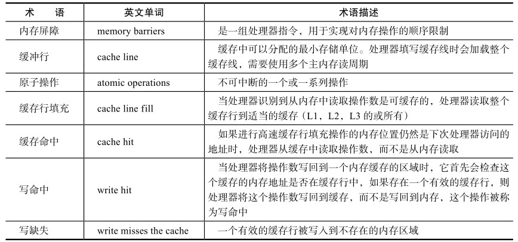

eg：

```java
volatile instance;
instance = new Singleton();
```

—— volatile修饰的变量被赋值，就是写操作。

转换为汇编：

```
0x01a3de1d: movb $0×0,0×1104800(%esi);0x01a3de24: 
lock addl $0×0,(%esp);
```

下面一行`lock addl $0×0,(%esp);`有volatile变量修饰的共享变量进行写操作的时候会多出。

Lock前缀的指令在多核处理器下会引发了两件事：

- 将当前处理器缓存行的数据**写回到系统内存**（而不是暂时写在缓存行里，待适合的时机写回内存）
- 这个写回内存的操作会使**在其他CPU里缓存了该内存地址的数据无效**。

解释：

- 对于第一条：常规来说处理器不直接和内存进行通信，而是先将系统内存的数据读到内部缓存（L1，L2或其他）后再进行操作，但操作完不知道何时会写到内存，而**volatile的变量进行写操作，JVM就会向处理器发送一条Lock前缀的指令，将这个变量所在缓存行的数据写回到系统内存**
- 对于第二条：如何确保缓存的同步性——为了保证各个处理器的缓存是一致的，就**会实现缓存一致性协议**，每个处理器通过嗅探在总线上传播的数据来检查自己缓存的值是不是过期了，当处理器发现自己缓存行对应的内存地址被修改，就会将当前处理器的缓存行设置成无效状态，当处理器对这个数据进行修改操作的时候，会重新从系统内存中把数据读到处理器缓存里。

volatile的两条实现原则：

1. **Lock前缀指令会引起处理器缓存回写到内存**（内存独占式的）

   - 对于旧的CPU，Lock会**锁总线**，导致其他CPU不能访问总线，那么就不能访问内存，那么该CPU就独占内存——但是锁总线开销大
   - 在最近的处理器里，LOCK信号一般不锁总线，而是**锁缓存**。如果访问的内存区域已经缓存在处理器内部，则不会声言LOCK#信号。相反，它会**锁定这块内存区域的缓存并回写到内存**，并使用**缓存一致性机制来确保修改的原子性**，此操作被称为**“缓存锁定”**，缓存一致性机制会阻止同时修改由两个以上处理器缓存的内存区域数据。——只锁部分区域，所以开销少

2. **一个处理器的缓存回写到内存会导致其他处理器的缓存无效**

   处理器使用**嗅探技术**保证它的内部缓存、系统内存和其他处理器的缓存的数据在总线上保持一致。

   如果通过嗅探一个处理器来检测其他处理器打算写内存地址，而这个地址当前处于共享状态，那么正在嗅探的处理器将使它的缓存行无效，在下次访问相同内存地址时，强制执行缓存行填充。

eg：volatile的使用技巧：

JDK7中：LinkedTransferQueue，在使用volatile变量时，用一种追加字节的方式来优化队列出队和入队的性能

```java
/** 队列中的头部节点 **/
private transient final PaddedAtomicReference<QNode> head;
/** 队列中的尾部节点 **/
private transient final PaddedAtomicReference<QNode> tail;
static final class PaddedAtomicReference <T> extends AtomicReference <T> {
  //使用很多4个字节的引用追加到64个字节
  Object p0, p1, p2, p3, p4, p5, p6, p7, p8, p9, pa, pb, pc, pd, pe;
  PaddedAtomicReference(T r) {
    super(r);
  }
}
public class AtomicReference <V> implements java.io.Serializable {
  private volatile V value;			// 4字节
  //省略其他代码
}
```

所以，PaddedAtomicReference对象，有64B。

英特尔酷睿i7等处理器，**缓存行是64个字节宽，不支持部分填充缓存行**。如果头尾都不足64字节的话，处理器会将它们都读到同一个高速缓存行中。所以如果需要修改，那么会将整个缓存行锁定，导致头尾结点均被锁定，而导致其他处理器不能访问自己高速缓存中的头尾结点了——降低了并发性。**追加到64字节的方式来填满高速缓冲区的缓存行，避免头节点和尾节点加载到同一个缓存行，使头、尾节点在修改时不会互相锁定。**

当然，这种字节填充也是有适用场景的，某些场景下是不适用的：

- 缓存行非64字节宽的处理器，某些是32位宽的等
- 共享变量不会被频繁地写，锁的几率也非常小，就没必要通过追加字节的方式来避免相互锁定。

### volatile实现的进程间通信：

**volatile可以通过写-读操作，实现进程间通信**。

写：就是线程A对线程B（要读该共享变量的线程）发出了消息，消息就是提醒共享变量值已经修改

读：线程B就是接收了线程A发出的消息。

从上层看，就是A对B发送了消息。从底层实现是A先将值写回主内存，然后将所有的该变量的缓存置为无效，然后B从内存中读取

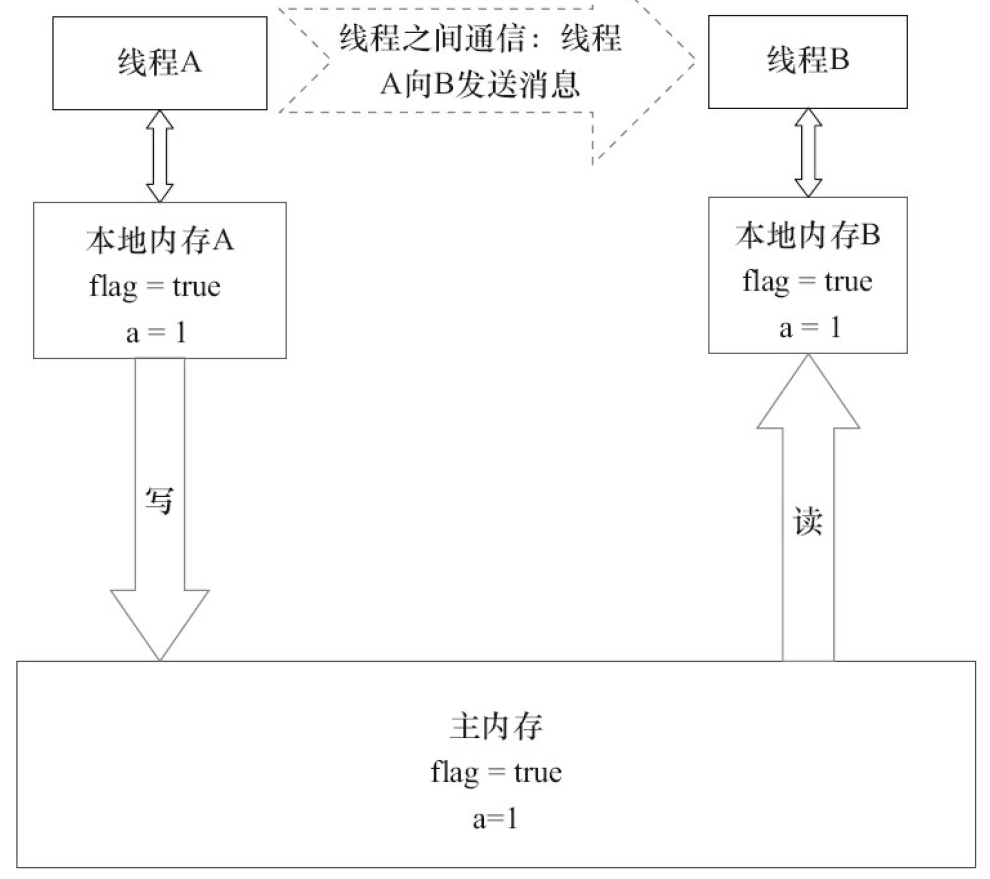


## 1.2 synchronized的实现原理与应用

synchronized进行了各种优化之后，有些情况下它就并不那么重了

synchronized实现同步的基础：**Java中的每一个对象都可以作为锁**

有如下3种形式：

1. 对于普通同步方法，锁是**当前实例对象**
2. 对于静态同步方法，锁是当前类的**Class对象**
3. 对于同步方法块，锁是Synchonized**括号里配置的对象**

synchronized存在4种状态：无锁 -- 偏向锁 -- 轻量级锁 -- 重量级锁，会随着竞争情况进行升级，注意**只能升级不能降级**，即偏向锁升级为轻量级锁后不会变回偏向锁——目的是为了提高获得锁和释放锁的效率

### Java对象头

synchronized是悲观锁，在操作同步资源之前需要给同步资源先加锁，这把**锁就是存在Java对象头**里的

对象是数组类型，则虚拟机用**3个字宽**（Word，1W=4B）**存储对象头，**如果对象是非数组类型，则用**2字宽存储对象头**。


理解：

1. 第一个Word存放**标记字段**

   默认存储对象的HashCode、分代年龄和锁标记位

2. 第二个Word存放**类型指针**，向它的类元数据的指针，主要是用来告诉虚拟机**该对象是哪个类的实例**

3. 第个Word是数组特有的，记录数组长度，这就是为什么数组能够直接获取长度，arr.length——放在对象头里了

所以锁是存在于Mark-word的

默认的Mark-word存放如下内容：

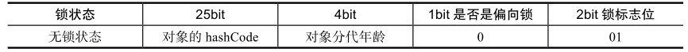

在运行期间，Mark Word里存储的数据会**随着锁标志位的变化而变化**。

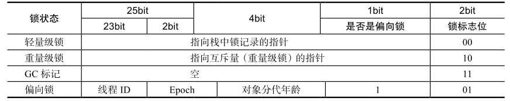

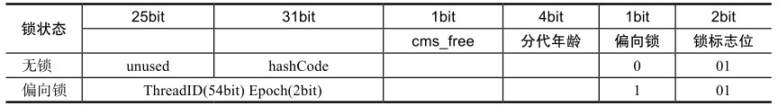

### Monitor

理解为一个同步工具或一种同步机制，通常被描述为一个对象。

因为：每一个Java对象就有一把看不见的锁，称为**内部锁或者Monitor锁**。——即对象带锁，如果存在并发操作该对象的情况，需要获取该锁。

而线程可能会访问很多共享对象，所以线程需要记录获得的这些对象和锁的信息——使用Monitor对象来存储

**Monitor是线程私有的数据结构**：monitor中有一个Owner字段存放拥有该锁的线程的唯一标识，表示该锁被这个线程占用。

线程种monitor相关的：

- 每一个线程都有一个可用monitor record列表，存放Monitor对象，一个上锁的对象对应一个monitor对象
- 同时还有一个全局的可用列表

所以：synchronized通过Monitor来实现线程同步，**Monitor是依赖于底层的操作系统的互斥锁（是重量级锁）**来实现的线程同步。

### 锁的状态转换

4个状态会随着竞争情况逐渐升级。**锁可以升级但不能降级**，目的是为了提高获得锁和释放锁的效率

#### 1. 无锁

没有对资源进行锁定，所有的线程都能访问并修改同一个资源，但同时只有一个线程能修改成功。

**CAS就是用无锁的思想实现的**（注意，不是无锁是CAS实现的，而是反过来的）

步骤：修改操作在循环内进行，线程会不断的尝试修改共享资源。多个线程同时修改该值，只有一个线程才能修改成功，而其他线程会不断尝试直到成功

无锁无法全面代替有锁，但无锁在某些场合下的性能是非常高的。

#### 2. 偏向锁

大部分情况下：锁不仅不存在多线程竞争，而且总是由**同一线程多次获得**。（但是还是存在并发的情况，所以还是需要锁的），所以为了**减少获取锁的代价**，提出偏向锁。

线程会自动获取锁，降低获取锁的代价。

步骤：当一个线程访问同步代码块并获取锁时，会在Mark Word里存储**锁偏向的线程ID**。在线程进入和退出同步块时不再通过CAS操作来加锁和解锁，而是**检测Mark Word里是否存储着指向当前线程的偏向锁**。

1. 如果标志字段存储当前线程ID，说明该线程已经获得过锁，那么可以再次进入（即，可能之前已经进入过一次临界区，然后执行完毕出去了，但是偏向锁不会主动放弃，还是指向它，那么需要再次进入时直接看MarkWord即可）
2. 如果检测失败，那么还需要看MarkWord的的偏向锁的标志：
   - 如果设置为1，表示是偏向锁，那么失败是由于其他线程已经占用该锁了，尝试使用**CAS将偏向锁指向当前线程**
   - 如果设置为0，表示是无锁，那么需要用CAS去竞争锁

——主要是由于在访问临界区时只需要简单的判断即可，而轻量级锁的获取和释放需要多次CAS原子操作。偏向锁只需要在**置换ThreadID的时候依赖一次CAS原子指令**即可。

##### 偏向锁的释放：

触发条件：偏向锁只有遇到其他线程**尝试竞争偏向锁**（即上面的2.1状态）时，持有偏向锁的线程才会释放锁，**线程不会主动释放偏向锁**（一旦持有，只有出现竞争才释放）

操作前提：需要等待**全局安全点**（在这个时间点上没有正在执行的字节码）

具体操作：

- 暂停拥有偏向锁的线程

- 检查持有偏向锁的线程是否活着：

  - 如果没有，将对象头设置成无锁状态，然后竞争的线程通过CAS竞争获得

  - 如果存活，看当前线程是否需要竞争锁（即仍然需要获取该锁）：

    - 如果需要竞争，那么升级为轻量级锁
    - 如果不需要竞争，那么另外一个线程获得偏向锁

    （Epoch表示该对象的偏向锁的撤销次数，如果次数>40，表示竞争次数过多，那么此对象不再适合用偏向锁，而下次再次撤销锁时，直接升级为偏向锁，而不进行判断是否需要竞争）

  如下图：

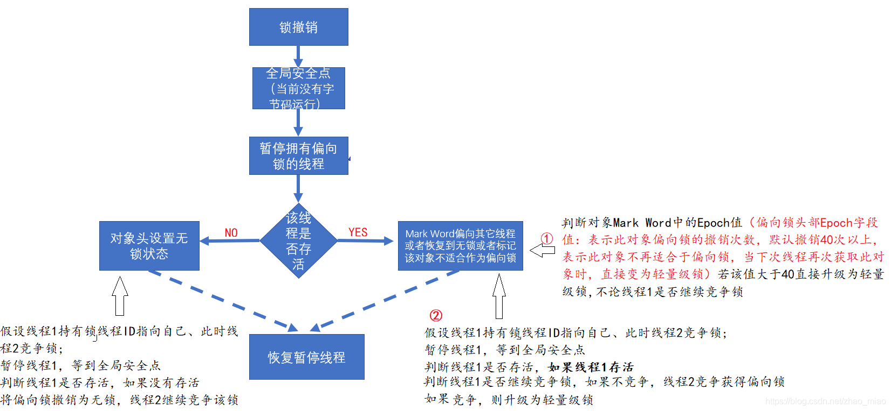

偏向锁在Java 6和Java 7里是默认启用的，可以手动关闭

#### 3. 轻量级锁

上面的，如果多个线程竞争获取偏向锁，就会自动升级为轻量级锁。其他线程会**通过自旋的形式尝试获取锁**，不会阻塞，从而提高性能。

##### 轻量级锁加锁

1. JVM会先在**当前线程的栈桢**中创建用于存储**锁记录**的空间，并将对象头中的Mark Word复制到锁记录中——官方称为Displaced MarkWord；

2. 线程尝试使用**CAS**将对象头中的Mark Word替换为指向锁记录的指针，并且将锁记录中的owner指向该对象的markword

   即互相指示：对象头的标志字段指向锁记录，而锁记录指向该标志字段

3. 如果成功，当前线程获得锁；

   如果失败，表示其他线程竞争锁，当前线程便尝试使用**自旋来获取锁。**

当自旋超过一定的次数，或者一个线程在持有锁，一个在自旋，又有第三个来访时，轻量级锁升级为重量级锁。

##### 轻量级锁解锁

会使用原子的CAS操作将Displaced Mark Word替换回到对象头。

如果替换成功：表示没有竞争；

如果替换失败：存在竞争（另一个线程已经将轻量级锁升级到重量级锁，所以标志位变化了），那么说明存在竞争，释放锁，并且唤醒所有在等待的线程，重新开始竞争。

#### 4. 重量级锁

由于轻量级锁下的自旋时间过长（自旋会造成CPU的浪费），多个线程竞争锁，导致锁升级。

锁标志的状态值变为“10”，等待锁的线程都会进入**阻塞状态**

#### 5. 总结：

偏向锁通过对比Mark Word解决加锁问题，从而避免使用CAS，只有在变换偏向对象时需要用到CAS;

轻量级锁是通过用CAS操作（指向MarkWord的指针是用CAS获得的）和自旋（获得锁失败，就自旋等待）来解决加锁问题

重量级锁是将除了拥有锁的线程以外的线程都阻塞。

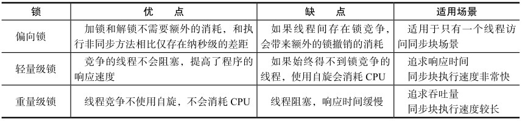

## 1.3 原子操作实现的基本原理

原子操作：不可被中断的一个或一系列操作。即即使出现并发情况也能保证结果的正确性。

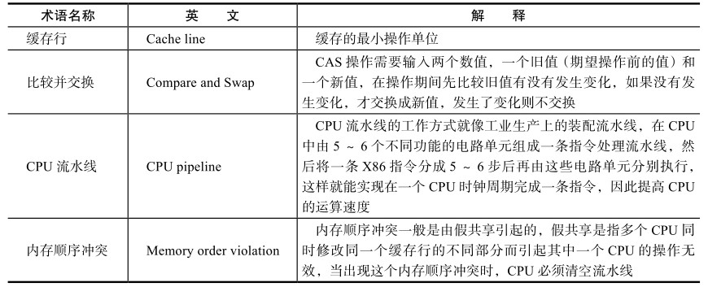

### 原子操作的实现

常用：基于对缓存加锁或总线加锁的方式来实现多处理器之间的原子操作

而处理器会自动保证基本的内存操作的原子性，即读取或者写入一个字节就是原子的，即该cpu在操作该字节，而其他cpu是不能访问该字节所在的内存地址。

- 使用总线锁保证原子性：

  如果多个处理器同时对共享变量进行读改写操作（i++就是经典的读改写操作，读取，改变值，写回），那么需要保证原子性就需要：锁定总线——

  使用处理器提供的一个LOCK #信号，当一个处理器在总线上输出此信号时，其他处理器的请求将被阻塞住，那么该处理器可以**独占共享内存。**——即锁定总线，导致整个CPU和整个内存的通信都锁定了

- 使用缓存锁保证原子性：

  总线锁定的开销比较大。

  频繁使用的内存会缓存在处理器的L1、L2和L3高速缓存里，那么原子操作就可以直接在处理器内部缓存中进行

  使用缓存锁定来保证原子性：内存区域如果被缓存在处理器的缓存行中，并且在Lock操作期间被锁定。当它执行锁操作回写到内存时，处理器不在总线上声言LOCK #信号，而是修改内部的内存地址，并利用它的缓存一致性机制来保证操作的原子性。

  缓存一致性机制，某个CPU将缓存行写回后，会通知其他CPU对该内存地址的缓存无效，需要重新读取。

# 2. Java内存模型

内存模型相关的基本概念；同步原语，主要介绍3个同步原语（synchronized、volatile和final）的内存语义及重排序规则在处理器中的实现。

重点：：重排序、顺序一致性的内存模型；同步原语

## 2.1基础知识

并发编程需要处理的 ：**线程同步 和 线程间通信**

- 线程的通信机制：共享内存、消息传递

  - 共享内存：共享程序的公共状态，通过读写内存中的公共状态进行隐式通信

  - 消息传递：线程之间发送信息，显式通信。

- 线程之间的同步：共享内存、消息传递

  - 共享内存：是显式进行同步的，需要指定某个方法or代码段需要在线程中互斥执行

  - 消息传递：由于只有消息产生了才能进行传递，才能接收。那么是隐式的同步

### 2.1.1 Java的内存抽象模型

**java的并发采用：共享内存模型**（显式的线程同步、隐式的进程间通信）

而根据Java中内存的布局：实例对象、静态变量、数组等都在堆内存中，堆内存是可以进行共享的。——那么会存在内存可见性的问题

而局部变量是存储在栈中的，是线程私有的，不能进行共享。——不存在内存可见性的问题

**java线程之间的通信由java内存模型控制，JMM决定一个线程对共享变量的写入何时对另一个线程可见。**

抽象看：线程之间的共享变量存储在主内存中；而每个线程都有一个私有的本地内存，是存储了这些共享变量的副本（而本地内存，实际上不存在，只是一个抽象概念，它包括：缓存、写缓冲区、寄存器和其他编译器的优化）

所以，线程的通信需要一个线程将数据写入到主内存，而另外一个线程在写入之后去主内存中读取。

如下图是Java的内存模型的抽象形式：


所以，进程间通信：实际上就就是将写的内容写回主内存，另外一个线程从主内存中读取。

### 2.1.2 重排序

主要是为了提高性能，所以编译器和处理器常对指令进行重排序。

1. **编译器优化的重排序**：在不改变**单线程的程序语义**的情况下，可以重排语句（注意，这边强调单线程，但不能保证不改变多线程的语义）——编译器重排序
2. **指令级并行的重排序**：流水线操作，只要指令之间不存在数据依赖，处理器可以改变指令的执行顺序——处理器重排序
3. **内存系统的重排序**：针对内存的读、写缓冲区，使得加载和存储操作看起来是乱序的，即有些数据不会立即写回，而是待一个合适的时机写回。所以这过程的执行看起来像是乱序——处理器重排序


对于1、2的重排序，如果两个指令存在数据依赖，那么不会进行重排序的

存在的问题：在多线程情况下**出现内存可见性问题**。

对于编译器重排序，可以禁止特定类型的重排序；对于处理器重排序，JMM会要求Java编译在生成指令时在**特定位置加入内存屏障**，从而禁止特定类型的处理器重排序（无法直接控制处理器重排，那么告诉处理器哪些地方不能重排即可）

针对内存系统的重排序——缓冲区：                                                                                                                                                                                                                                                                                                       

- 缓存区的作用：能够保证指令流水线的进行，可以避免由于需要向内存写入数据而产生的等待延迟——**暂时不写入**。并且按照批处理的形式刷新写缓冲区，可以合并同一内存地址的写操作——减少对内存总线的占用。
- 存在的问题：缓冲区是仅对处理器可见的，所以**存在可见性的问题**。即可能读的数据是未修改之前的数据，而由于写缓存其他线程并没有及时更新。
- 解决方法：为了保证内存可见性，java编译器会在合适的时候插入内存屏障

| 指令                            | 说明                                                         |
| ------------------------------- | ------------------------------------------------------------ |
| Load1; **LoadLoad**; Load2      | 读1一定发生在读2及其他读操作之前                             |
| Store1; **StroreStore**; Store2 | 写1一定刷新到主内存中，从而对写2及之后的操作可见             |
| Load1; **LoadStore**; Store2    | 读1一定在写2及其写操作之前                                   |
| Store1; **StoreLoad**; Load2    | 写1一定在读2及其他读操作前——**能够保证屏障之前的所有读、写操作完成后，才执行屏障后面的操作**<br />即，将屏障前的操作全部刷新到内存 |

- **全能屏障：store1; storeLoad; load2** ，即保证store1的数据对其他数据均可见。sotre1写入先于load2读取，storeload会保证在该屏障前的所有写入和读取指令均完成了，才开始屏障后的内存访问指令——现代处理器大部分均支持该内存屏障，但是其开销较大。

### 2.1.3 as-if-serial语义

含义：重排序的前提是——**单线程的执行结果不能改变**，所以对数据之间没有依赖的指令可能会进行重排序，但是对于有依赖的必须顺序执行。

所以，从上层来看，单线程中的代码就是按照编写的顺序**顺序执行的。**

——但是，重排序会对多线程造成影响。

### 2.1.4 重排序对多线程的影响

```java
class ReorderExample {
    int a = 0;
    boolean flag = false;
    public void writer() {				// 线程A调用
        a = 1; 					// 1
        flag = true; 			// 2
    }
    Public void reader() {				// 线程B调用
        if (flag) { 			// 3
            int i = a * a; 		// 4
            ……
        }
    }
}
```

理解：

1. 如果线程A中对1、2的执行顺序进行替换，由于1、2并没有存在依赖，所以满足as-if-serial语义，所以符合要求

   但是，如果在2、1执行中间，线程B调用，那么4的结果就是`i = 0`

   这个结果不符合我们的预期。——由于重排序引起的

2. 如果线程B中对3、4的执行顺序进行替换，它们存在**控制依赖**，存在控制依赖会影响指令的并行执行程度，所以处理器会进行**猜测**——我先预测其能进入，先执行了再说；计算结果临时保存到一个名为**重排序缓冲**的硬件缓冲中，如果为真就可以写入了。

   所以，在4、3之间插入了1、2执行，那么最后的结果`i = 0`，不符合预期

   （在单线程中，猜测是不会影响执行结果的，满足as-if-serial语义）

   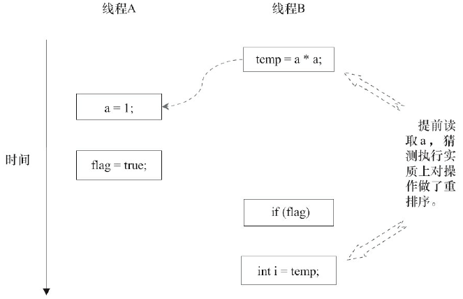

## 2.2 顺序一致性

顺序一致性内存模型是一种参考模型。

JMM能够保证：如果程序之前正确同步了，那么程序执行满足顺序一致性，即程序的执行结果和在一致性模型中的执行结果相同。

（如果没有正确同步，那么数据可能会存在竞争，即并发修改、读取的问题，所以不能保证和顺序一致性一样的执行结果）

顺序一致性有两大特性：

1. 一个线程中的操作是按照程序顺序进行的
2. 所有线程只能看到相同的唯一的执行顺序，所以需要保证每个操作都是原子性和可见性，那么它们看到的都一样

所以，在概念上：只有一个全局内存，内存通过一个开关连接不同的进程。（没有cache）


JMM（Java的实际内存模型）和顺序一致性模型的差异：

1. JMM单线程内的指令可能会进行重排序，即使已经进行加锁，锁内还是进行重排序（不会溢出范围）

   顺序一致性模型要求程序必须按照顺序执行，不能乱序

2. JMM如果未进行同步，那么执行顺序是无序的，且大家**看到的执行顺序是不一样的**——因为不满足内存可见性

   （即虽然在本次执行后，处理器执行的顺序是确定的，但是对于每个线程由于内存可见性，看到的顺序是不一定一样）

   而顺序一致性模型，由于能保证立即可见，所以即使没有同步，但是大家看到的顺序都是一致的

3. JMM不能保证64位的读写操作是原子性（顺序一致性能够保证所有读写操作是原子性的）

   原因：对于32位处理器，一次只能处理32位的数据，对于64位需要分为两个指令完成，那么就不能保证原子性

——所以，顺序一致性模型就是一个理想模型（JMM在保证正确性语义的情况下，尽可能进行优化）

## 2.3 volatile的内存语义的实现

volatile的重排序规则：

- volatile写之前的操作不能被重排序到之后——volatile写之前的操作必须全部完成，才能执行volatile写操作

  （volatile写后面的操作可以放到之前，其实只有普通的读写才允许）

- volatile读之后的操作不能被重排序到之前——volatile读完成了，才能开始执行后面的操作

  （volatile读前面的操作可以放到后面，其实只有普通的读写才行）

- volatile写和读之间是不能进行重排序的（即，需要按照程序顺序进行执行）

volatile的内存语义：

- 当写一个volatile变量时，**JMM会将该值写入主内存**（普通变量是写缓存中）
- 当读一个volatile变量时，JMM会将线程的本地缓存置为无效，而**直接从主内存中读取**

volatile的内存语义的实现：——**添加内存屏障**

编译器在生成字节码的时候，会**插入内存屏障来禁止volatile相关的重排序**

- **volatile的写操作：写操作前的指令不能重排在写之后**
- **volatile的读操作：读操作后的指令不能重排在读之前**
- **如果第一个操作是volatile写，第二个操作时读，那么一定是先写后读**

volatile的写之前插入StoreStore屏障——避免普通的写和volatile写互换（读没有涉及到内存变化，所以不需要）

volatile的写之后插入StoreLoad屏障——避免后面的volatile读/写和volatile写互换

volatile的读操作之后插入LoadLoad屏障——避免后面普通的读和volatile读互换

volatile的读操作之后插入LoadStore屏障——避免后面的普通的写和volatile读互换

——但是，编译器会根据实际情况进行优化，去除不必要的屏障，只需要满足上面的原则。

该屏障是对于所有平台来说，但是针对不同的底层处理器，还有不同的松紧度，**X86只会在最后插入一个StoreLoad屏障**，其他屏障均被忽略

因为x86只会对写读进行重排序，不会对读读、读写、写写进行重排序，所以只需要在volatile写之后插入一个StoreLoad屏障即可，所以volatile写的开销比读要大。

## 2.4 锁的内存语义的实现

锁的内存语义和volatile一致：

- 释放锁时，**JMM会将对应的共享变量的值写入主内存**
- 获取锁时，**JMM会将对应的缓存置为无效，从而需要直接从主内存中去读取锁**

可以通过源码发现，锁的底层是由AQS实现的。而AQS的核心就是`volatile int state;`，并且在并发场景下，是用CAS对值进行修改的。

volatile有3个内存语义；

CAS有2个内存语义：

- CAS含义：如果当前值等于预期值，那么就将值修改为给定值。
- 内存语义：**CAS前面和后面的任意内存均不能交换位置**——兼具volatile的读语义和写语义

CAS的底层实现：**添加Lock**（如果是单处理器，不需要）

而Lock能够：

1. 锁定总线 / 锁定内存
2. 禁止指令重排
3. 将写缓冲区的所有数据写回主内存

所以，**锁的底层就是兼具了volatile的特性和CAS的特性。**

## 2.5 final域的内存语义的实现

final修饰变量，就是表示该变量能且只能被初始化一次——**需要被初始化，且只能初始化一次。**

重排序的规则：

1. 在构造方法中，对final域的写入，和之后把该对象赋值给一个引用变量，它们之间不能重排序

   需要，先写final域，然后才能将初始化完成的对象赋值给引用变量

2. 第一次读一个有final域的对象引用，和第一次读这个final域，它们之间不能重排序

   即一定是先读对象引用，才能读final域

3. 如果final域存在引用对象，需要增加，在构造方法中对final对象的成员域的写入，和该包含有该final对象的对象赋值给引用变量，它们之间不能重排序——总结就是，对final修饰的对象进行赋值初始化，一定要发生在将该对象给一个引用变量引用之前

   即，final域的成员变量赋值也需要在构造方法中完成

针对规则1：**JMM会禁止将final域的写重排序到构造方法之外**：禁止编译器重排序到外面；添加内存屏障防止处理器重排序

`final FinalExample example = new FinalExample();`——那么在构造方法返回之前添加内存屏障，禁止重排序。

实现：在final域写之后，在return之前，加入StoreStore内存屏障。


这样就能保证正确的读到final域的值；

针对规则2：实际上读对象和读对象的final存在关联，所以一般的处理器不会重排序，但是还是有处理器会重排序，那么在这两者之间插入LoadLoad屏障。


### 对象引用的逸出

对于上面的final规则1、3，就是在**构造方法返回需要完成final域的初始化**。其实还隐藏了：**在构造方法内部，不能让被构造对象的引用对其他线程可见**——即，**在构造方法中不要存在对该对象的引用赋值**。

```java
public class FinalReferenceEscapeExample {
    final int i;
    static FinalReferenceEscapeExample obj;
    public FinalReferenceEscapeExample () {
        i = 1; 					// 1 写final域
        obj = this; 			// 2 对象引用溢出（1、2可能存在重排序）
    }
    public static void writer() {
        new FinalReferenceEscapeExample ();
    }
    public static void reader() {
        if (obj != null) { 			// 3
            int temp = obj.i; 		// 4
        }
    }
}
```

理解：

1. 如果1、2进行重排序，在并发过程中，线程A去执行writer，线程B执行reader，如果在2、1执行中间，线程B去执行，那么`obj!=null`满足，但是此时final还未进行初始化

在X86中，不会对两个写进行重排序，所以没有StoreStore屏障；而对存在间接依赖的操作也不会进行重排序，那么没有LoadLoad屏障。所以，对于X86来说，final没有任何屏障。

# 3. Java并发编程的基础

## 3.1 线程

### 3.1.1 线程概念 & Java中的线程

现代操作系统在运行一个程序时，会为其创建一个进程。例如启动一个Java进程，就会为其创建一个进程。

现代操作系统调度的最小单元是线程，一个进程里可以有多个线程，线程有独立的程序计数器、堆栈和局部变量，能共享进程的内存变量。

Java程序天生就是多线程程序，执行main()方法的是一个名称为main的线程。

可以通过代码查看普通的Java程序包含哪些线程：


1. Monitor Ctrl-Break：在idea中特有的线程。且debug启动的不会出现，只有run启动的会出现

   一般是埋坑的，有些调试的时候会发现线程个数不符合预期，那要考虑是否是在idea中特有的线程引起的

2. Attach Listener：监听各种请求的socket连接,把执行的操作扔给VM Thread

3. Signal Dispatcher：接受各种信号，交给JVM去处理发出这些信号的线程

4. Finalizer：调用对象的finalize方法的线程

5. Reference Handler：清除reference的线程

6. **main：用户程序的入口**

（`VM Thread`：**线程母体,最原始的线程**，单例，里面有个队列，存放各种的操作，它负责loop处理队列中的操作.（包括对其他线程的创建，分配和对象的清理，cms-mark等工作））

### 3.1.2 why引入多线程

1. **多核处理器——并行方面**

   现代处理器都配备了多核，所以为了充分利用资源

   将计算逻辑分配到多个处理器核心上，就会显著减少程序的处理时间

2. **更快的响应时间——并发方面**

   对于一些IO密集的程序，大部分时间都用在等待IO响应了，而其他任务得不到执行，所以引入多线程，可以在等待的期间去执行其他的任务

3. 更好的编程模型

   Java提供了一系列的模型，而程序员只需要关注如何解决问题，而不用考虑其他的问题。

### 3.1.3 线程优先级

Java线程中，通过一个整型成员变量priority来控制优先级，优先级的范围从1~10，默认是5，可以通过setPriority(int)方法来修改优先级。

**优先级高的线程分配时间片的数量要多于优先级低的线程**。

- 针对频繁阻塞（休眠或者I/O操作）的线程需要设置较高优先级
- 偏重计算（需要较多CPU时间或者偏运算）的线程则设置较低的优先级，确保处理器不会被独占。

但是注意：

线程优先级不能作为程序正确性的依赖，因为**操作系统可以完全不用理会Java线程对于优先级的设定**。

### 3.1.4 线程状态

归总是5个状态

| 状态                          | 描述                                                         |
| ----------------------------- | ------------------------------------------------------------ |
| new态                         | 线程刚被创建，还未调用start                                  |
| runnable状态（就绪态）        | 随时可以开始执行                                             |
| running（运行态）             | 获得CPU资源，可以开始运行（Java将runnable和running统称为一类） |
| blocked（阻塞状态，同步阻塞） | 线程阻塞于锁                                                 |
| waiting（等待状态）           | 需要等待其他线程做出一定动作，由其他线程notify才能唤醒       |
| time_waiting（超时等待）      | 如果在限定时间内没有被其他线程唤醒，可以超时后自行唤醒，到runnable状态 |
| terminated                    | 终止状态                                                     |

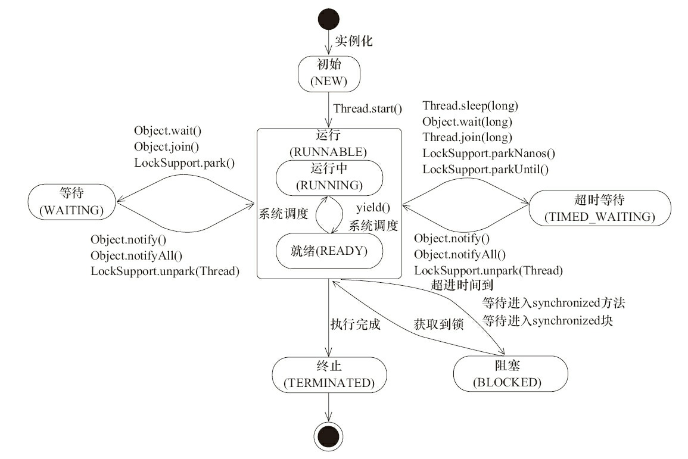

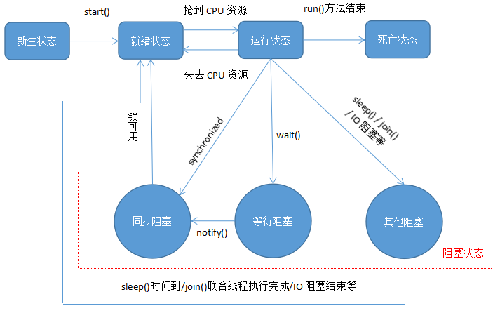

ps：阻塞在java.concurrent包中Lock接口的线程状态却是等待状态，因为java.concurrent包中Lock接口对于阻塞的实现均使用了LockSupport类中的相关方法。

### 3.1.5 Daemon线程——特殊线程

Daemon线程是一种支持性线程，它主要被用作**程序中后台调度以及支持性工作**。当一个Java虚拟机中**不存在非Daemon线程的时候，Java虚拟机将会退出**。

在线程调用start变成就绪态之前可以调用**Thread.setDaemon(true)**将线程设置为Daemon线程。

——只能在线程启动之前进行设置，而不能在启动之后。且，Daemon线程可以用户设置。

```java
public static void main(String[] args) {
    Thread thread = new Thread(new DaemonRunner(), "DaemonRunner");
    thread.setDaemon(true);			// setDaemon在start之前
    thread.start();
}
```

#### why需要设置Daemon线程

因为当**所有线程都运行结束时，JVM需要退出**，进程结束。那么如果**有一个线程没有退出，JVM就不会退出。**——所以，所有线程需要能够及时结束。

但是存在一种线程目的就是无限循环，例如，一个定时触发任务的线程。所以需要另外一个线程来强制该线程终止，这个就是Daemon线程。

而jvm中只存在Daemon线程时，jvm就会终止。jvm退出的时候，所有的Daemon线程必须要立即终止，所以Daemon的finally中的语句不一定会被执行到。

但是需要注意：守护线程**不能持有任何需要关闭的资源**，例如打开文件等，因为虚拟机退出时，守护线程没有任何机会来关闭文件，这会导致数据丢失。

### 3.1.6 线程的创建

如何构造一个线程：

#### 上层：

Java只有两种方式可以创建线程。

1. 继承Thread

   ```java
   public class Main extends Thread{		// 
       @Override
       public void run(){
           System.out.println("thread");
       }
       public static void main(String[] args){
           Main main = new Main();
           main.start();
       }
   }
   ```

   ——必须要使用`对象.start()`才能继承启动该线程，如果只是调用`run`方法，就是单纯调用一个方法，并没有启动一个线程

2. 实现`Runnable`接口

   ```java
   public class Main implements Runnable{
       @Override
       public void run(){
           System.out.println("thread");
       }
       public static void main(String[] args){
           Thread thread = new Thread(new Main());
           thread.start();
       }
   }
   ```

   ——


#### 底层：

均会去调用Thread的构造方法：都会默认去调用init的方法，init就是对线程初始化（初始化有点类似于OS中的）

```java
public Thread(ThreadGroup group, Runnable target, String name, long stackSize) {
    init(group, target, name, stackSize);
}
```

线程初始化操作：

主要进行一系列的赋值，而都是由其parent线程来进行空间分配的，而child线程继承了parent是否为Daemon、优先级和加载资源的contextClassLoader以及可继承的ThreadLocal

最后给该线程一个tid

```java
private void init(ThreadGroup g, Runnable target, String name, long stackSize) {
    init(g, target, name, stackSize, null, true);
}

private void init(ThreadGroup g, Runnable target, String name,
                  long stackSize, AccessControlContext acc,
                  boolean inheritThreadLocals) {
    if (name == null) {				// 必须要传递线程的名字，否则会抛出异常
        throw new NullPointerException("name cannot be null");			
    }

    this.name = name;

    Thread parent = currentThread();			// 新建线程的父线程是当前线程
    SecurityManager security = System.getSecurityManager();
    if (g == null) {				// 设置所属的线程组
        /* Determine if it's an applet or not */

        /* If there is a security manager, ask the security manager
               what to do. */
        if (security != null) {
            g = security.getThreadGroup();
        }

        /* If the security doesn't have a strong opinion of the matter
               use the parent thread group. */
        if (g == null) {
            g = parent.getThreadGroup();
        }
    }

    /* checkAccess regardless of whether or not threadgroup is
           explicitly passed in. */
    g.checkAccess();

    /*
         * Do we have the required permissions?
         */
    if (security != null) {
        if (isCCLOverridden(getClass())) {
            security.checkPermission(SUBCLASS_IMPLEMENTATION_PERMISSION);
        }
    }

    g.addUnstarted();

    this.group = g;					// 线程组设置
    this.daemon = parent.isDaemon();			// 将daemon、priority属性设置为父线程的对应属性
    this.priority = parent.getPriority();
    if (security == null || isCCLOverridden(parent.getClass()))
        this.contextClassLoader = parent.getContextClassLoader();
    else
        this.contextClassLoader = parent.contextClassLoader;
    this.inheritedAccessControlContext =
        acc != null ? acc : AccessController.getContext();
    this.target = target;
    setPriority(priority);
    if (inheritThreadLocals && parent.inheritableThreadLocals != null)
        this.inheritableThreadLocals =
        ThreadLocal.createInheritedMap(parent.inheritableThreadLocals);		// ——主要都是赋值父线程的
    /* Stash the specified stack size in case the VM cares */
    this.stackSize = stackSize;

    /* Set thread ID */
    tid = nextThreadID();			// 给新建的线程创建一个编号
}
```

——初始化线程完毕，在**堆内存**中等待着运行。

### 3.1.7 启动线程

当前线程（即parent线程）**同步告知Java虚拟机**，只要线程规划器空闲，应立即启动调用start()方法的线程。

### 3.1.8 中断（和OS不一样）

该中断和OS不一样，eg：场景：例如下载一个软件，期间不想下载了，选择取消，这个取消就是中断，那么该线程就需要终止。

概念：其他线程给该线程发一个信号，该线程收到信号后结束执行`run()`方法，使得该线程能立刻结束运行。即，提前结束线程

而信号通过**其他线程调用该线程的interrupt方法**，本质上就是设置中断标志位，而目标线程会去检测自身是否interrupted状态，如果是，就立刻结束运行。

注意：

1. **interrupt方法只是向线程发送中断请求，但是线程何时响应看代码**

2. 如果线程处于等待状态，然后又对其调用interrupt，会抛出**异常`InterruptedException`**

   所以，目标线程只要捕获到`join()`方法抛出的`InterruptedException`，就说明有其他线程对其调用了`interrupt()`方法，通常情况下该线程应该立刻结束运行。

相关方法：

- `thread.interrupt()`：其他线程希望指定的线程终止——就是这是对应的中断标志位

- `thread.isInterrupted()`：判断该线程是否被中断了

  而如果该线程已经处于terminated状态，那么不论是否发生中断，那么返回值都是false，就是非中断状态。

- `Thread.interrupt(xxx)`：对指定线程进行中断标志位复位

- 中断异常`InterruptedException`，当阻塞方法（同步阻塞、等待阻塞、其他阻塞）收到中断请求的时候就会抛出InterruptedException异常

  但是在抛出异常之前，Java虚拟机会先将该线程的中断标识位清除，然后抛出异常，那么再调用isInterrupted()方法将会返回false

  ——但是抛出该异常，说明有线程期待该线程被中断

### 3.1.9 挂起、恢复、停止

分别为suspend、resume、stop方法，非常“人性化”。但是这些API是过期的，不建议使用。

原因：

- suspend：将线程挂起，但是不释放线程所占有的资源，而是持有资源进行挂起，容易出现死锁的情况；
- stop：结束线程，但是不能保证线程占用的资源正常释放

——存在副作用，所以不建议使用，可以用wait/notify进行替换。

### 3.1.10 安全终止线程

即能够让程序正常走到最后，然后终止；也可以用中断安全终止。反正不能用stop终止。

## 3.2 线程间通信

多个线程能够相互配合完成工作，才能发挥最大的功能。

### 3.2.1 volatile 和 synchronized 关键字

**volatile能保证变量的可见性。**

对象：**针对共享变量**，但是每个变量都会对共享变量进行拷贝（目的是加速程序的执行，这是现代多核处理器的一个显著特性）。所以程序在执行过程中，一个线程**看到的变量并不一定是最新的**。

volatile可以用来修饰字段（成员变量），就是告知程序任何对该变量的访问均需要从共享内存中获取——保证每次查看结果都是最新的。但是，过多地使volatile是不必要的，因为它会降低程序执行的效率。

**synchronized保证互斥性和可见性**：线程在加锁时，先清空工作内存→在主内存中拷贝最新变量的副本到工作内存→执行完代码→将更改后的共享变量的值刷新到主内存中→释放互斥锁。

——synchronized的范围比volatile广

synchronized的基本原理：**使用了monitorenter和monitorexit指令**。同步方法则是依靠方法修饰符上的ACC_SYNCHRONIZED来完成的。本质就是尝试去获取monitor，而这个获取过程是排他的。

任意一个对象都拥有自己的监视器，如果需要同步调用，那么执行方法的**线程必须先获取到该对象的监视器**才能进入同步块或者同步方法。如果获取失败，那么将被阻塞在入口，进入阻塞状态，被挂到同步队列上，直到另外线程释放了该monitor后会将队列上的线程唤醒，然后重新尝试申请（？？？？是唤醒整个队列 or 队头？）

整个流程如下：

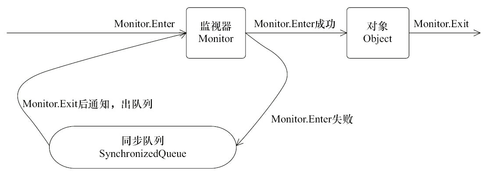

### 3.2.2 wait/notify机制

synchronzied解决了多线程的竞争问题，但是无法解决多线程的协调问题，配合工作。

使用该机制的原因：线程之间有数据进行传递，例如生产者-消费者，生产者改变某个值之后，消费者才能继续执行下去。但是，如何感知到该值发生变化呢？——用while循环，每隔一段时间检测一遍。但是存在问题：

- 间隔时间过长：**难以确保及时性**，不能及时判断资源已经来了，导致不必要的等待
- 间隔时间过短：**难以降低开销**，不断进行上下文切换，导致资源浪费

——Java通过内置的等待/通知机制，**是任意Java对象都具备**，因为是在Object类中实现的方法：是native方法

| 方法名            | 描述                                                         |      |
| ----------------- | ------------------------------------------------------------ | ---- |
| `wait()`          | 调用该方法的线程会进入等待状态，只有被其他线程通知 或者 被中断 才会返回，注意wait之后会**释放占用的资源** |      |
| `wait(long)`      | 超时等待，参数是ms为单位的，如果在限定时间内等到了通知或者中断，那么会提前返回；否则超时后也会返回 |      |
| `wait(long, int)` | 超时等待的粒度更细，单位为ns                                 |      |
| `notify()`        | 通知**一个**在对象上等待的线程，让其从wait方法中返回，但是只有获取了锁才能返回，如果获取失败了那么无法返回<br />唤醒哪一个，看OS，结果不一样 |      |
| `notifyAll()`     | 通知****在对象上等待的线程                                   |      |

#### 使用方法：

线程A调用了**对象O的wait()方法**进入等待状态，而另一个线程B调用了对象O的notify()或者notifyAll()方法

```java
public class WaitNotify {
    static boolean flag = true;
    static Object lock = new Object();
    public static void main(String[] args) throws Exception {
        Thread waitThread = new Thread(new Wait(), "WaitThread");
        waitThread.start();			// 先启动wait线程
        TimeUnit.SECONDS.sleep(1);
        Thread notifyThread = new Thread(new Notify(), "NotifyThread");		
        notifyThread.start();		// 后启动notify线程
    }
    static class Wait implements Runnable {
        public void run() {
            synchronized (lock) {		// 加锁，拥有lock的Monitor——wait线程一定会先持有该lock对象
                // 当条件不满足时，继续wait，同时释放了lock的锁
                while (flag) {
                    try {
                        System.out.println(Thread.currentThread() + " flag is true. wait");
                        lock.wait();			// 释放lock资源，然后进行等待
                    } catch (InterruptedException e) { }
                }
                // flag=false，条件满足时，完成工作
                System.out.println(Thread.currentThread() + " flag is false. running");
            }
        }
    }
    
    static class Notify implements Runnable {
        public void run() {
            synchronized (lock) {		// 加锁，拥有lock的Monitor
                // 获取lock的锁，然后进行通知，通知时不会释放lock的锁，
                // 直到当前线程释放了lock后，WaitThread才能从wait方法中返回
                System.out.println(Thread.currentThread() + " hold lock. notify");
                lock.notifyAll();
                flag = false;
                SleepUtils.second(5);
            }
            // 再次加锁
            synchronized (lock) {
                System.out.println(Thread.currentThread() + " hold lock again. sleep");
                SleepUtils.second(5);
            }
        }
    }
}
```

输出：

```
Thread[WaitThread,5,main] flag is true. wait
Thread[NotifyThread,5,main] hold lock. notify
Thread[NotifyThread,5,main] hold lock again. sleep		// 和下面的执行顺序可能会变化，与wait和notify线程的抢占结果相关
Thread[WaitThread,5,main] flag is false. running
```

理解：整个流程：

1. 首先wait线程是先执行的，此时只有main线程和wait线程，所以wait能够得到lock，并且默认flag是true，所以能够执行while里面的循环；执行输出，然后执行**`lock.wait()`**，然后**wait线程变成等待状态WAITING，挂在lock的等待队列上，**它会释放占有的对象，lock会被释放

2. 然后notify线程执行，由于wait线程在等待前，将资源释放了，所以lock又能获取成功。执行输出；然后，notify线程唤醒所有挂在lock上的线程**`lock.notifyAll()`**，那么**会将挂在等待队列上的线程放到同步队列上，变成BLOCKED状态**，但是因为无法获得lock资源，只有notify线程释放资源才能从wait中返回。

3. 然后notify释放了资源，wait线程能从wait返回，那么出现了抢占（wait和notify线程均抢占资源lock），然后输出就不确定了

   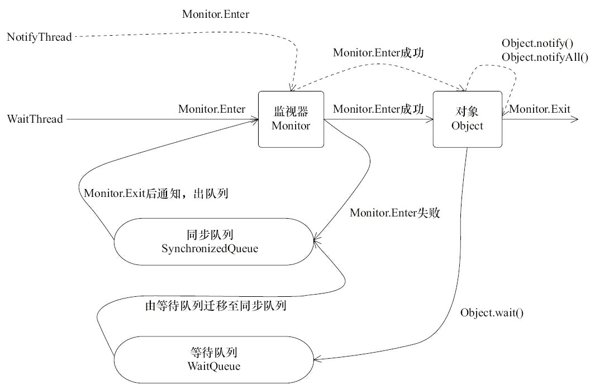

#### **要求：**

1. 在`synchronized`内部可以调用`wait()`使线程进入等待状态
2. 在`synchronized`内部可以调用`notify()`或`notifyAll()`唤醒其他等待线程
3. **必须在已获得的锁对象上调用`wait()`方法；**只有获得该对象的锁才能挂在该线程上，才能释放该对象（否则不存在这个概念）
4. 必须在已获得的锁对象上调用`notify()`或`notifyAll()`方法
5. **已唤醒的线程还需要重新获得锁后才能继续执行**

所以，消费者和生产者的wait/notify的逻辑：

```java
// 消费者
synchronized(对象){
    while(条件不满足){			//  即使被唤醒并调度回来，还会先进行判断
        对象.wait();
    }
    满足条件后的操作
}

// 生产者
synchronized(对象){
    改变条件
    对象.notifyAll();
}
```

### 3.2.3 管道输入和输出

管道输入/输出流，主要用于**线程之间的数据传输**，而传输的媒介为**内存**。

主要包括了如下4种具体实现：PipedOutputStream、PipedInputStream、PipedReader和PipedWriter（前两种面向字节，而后两种面向字符）

用法：

```java
public class Piped {
    public static void main(String[] args) throws Exception {
        PipedWriter out = new PipedWriter();			// 向管道写的对象
        PipedReader in = new PipedReader();				// 向管道读的对象
        // 将输出流和输入流进行连接，否则在使用时会抛出IOException
        out.connect(in);
        Thread printThread = new Thread(new Print(in), "PrintThread");
        printThread.start();
        int receive = 0;
        try {
            while ((receive = System.in.read()) != -1) {
                out.write(receive);
            }
        } finally {
            out.close();
        }
    }
    static class Print implements Runnable {
        private PipedReader in;
        public Print(PipedReader in) {
            this.in = in;
        }
        public void run() {
            int receive = 0;
            try {
                while ((receive = in.read()) != -1) {
                    System.out.print((char) receive);
                }
            } catch (IOException ex) {
            }
        }
    }
}
```

——在使用前必须先绑定`out.connect(in);`

### 3.2.4 thread.join()：默认带锁

线程A执行了`threadB.join()`语句，其含义是：当前线程A等待**threadB线程终止之后**才从threadB.join()返回

此外，还提供了`join(long millis)`和`join(long millis,int nanos)`两个具备超时特性的方法.

```java
public final synchronized void join(long millis) throws InterruptedException {	// 本质上就是调用带有超时等待的join方法
    long base = System.currentTimeMillis();
    long now = 0;

    if (millis < 0) {
        throw new IllegalArgumentException("timeout value is negative");
    }

    if (millis == 0) {			// 说明无限等待
        while (isAlive()) {		// 如果该线程存活，那么一直挂起
            wait(0);		// 0表示无限wait
        }
    } else {			// 表示超时等待，那么只有更新倒计时时间
        while (isAlive()) {	
            long delay = millis - now;		
            if (delay <= 0) {
                break;
            }
            wait(delay);			// 否则就等待一段时间
            now = System.currentTimeMillis() - base;
        }
    }
}
```

理解：

1. 如果某个线程调用`threadB.join()`之后，开始等待线程B，如果期间按其他线程调用该线程的interrupt方法，那么会抛出`InterruptException`异常——因为处于wait中
2. 这边的wait方法，本质上就是**`this.wait()`**，对象就是线程对象，而join方法本身就是synchronized的，所以能在里面执行，它必定已经获取到了`this`锁，所以wait之后，会释放this锁
3. join本质上，还是wait/notify实现的，当线程终止时，会调用线程自身的notifyAll()方法，会通知所有等待在该线程对象上的线程

### 3.2.5 ThreadLocal

#### 原理：

线程本地变量，是一个以**ThreadLocal对象为键、任意对象为值**的存储结构。就是将一个值和线程本身进行绑定。

概念：**每个线程都有同一个变量的独有拷贝**

实现上来说：**每个线程都有一个Map，类型为ThreadLocalMap**，所以调用下面的`set()`方法，实际上是在线程自己的Map里设置了一个条目，**键为当前的ThreadLocal对象，值为value**。

set()方法：

```java
public void set(T value) {
    Thread t = Thread.currentThread();
    ThreadLocalMap map = getMap(t);		// 获得线程的map
    if (map != null)
        map.set(this, value);		// 将值设置好
    else
        createMap(t, value);		// 如果map还未创建，就创建一个
}
```

get()方法：

```java
public T get() {
    Thread t = Thread.currentThread();
    ThreadLocalMap map = getMap(t);
    if (map != null) {
        ThreadLocalMap.Entry e = map.getEntry(this);		// 根据key获得value
        if (e != null) {
            @SuppressWarnings("unchecked")
            T result = (T)e.value;
            return result;
        }
    }
    return setInitialValue();			// 如果获取值失败，那么就去调用initialValue方法
}
```

总结：每个线程都有一个Map，对于每个ThreadLocal对象，调用其get/set实际上就是**以ThreadLocal对象为键读写当前线程的Map**

#### 使用：

有两个方法：

```java
public T get() {}			// 获取变量值
public void set(T value) {}		// 设置变量值
```

使用：

```java
ThreadLocal<Integer> local = new ThreadLocal<>();
local.set(200);
System.out.println(local.get());
```

主要是在多线程中，它们对同一个变量设置值，但是调用的时候值都是不一样的——**访问的虽然是同一个变量local，但每个线程都有自己的独立的值**。

还有两个常用的方法：

```java
protected T initialValue() {}		// 这个方法经常用来重写，那么
```

当调用get方法时，如果之前没有设置过，会调用该方法获取初始值，默认实现是返回null；如果set设置之后，又被remove删除掉了，再次调用get，会再调用initialValue获取初始值

```java
public void remove() {}				// 删除该值：
```

eg1：

```java
public class Profiler {
    // 第一次get()方法调用时会进行初始化（如果set方法没有调用），每个线程会调用一次
    private static final ThreadLocal<Long> TIME_THREADLOCAL = new ThreadLocal<Long>() {
        protected Long initialValue() {			// 初始值方法
            return System.currentTimeMillis();
        }
    };
    public static final void begin() {
        TIME_THREADLOCAL.set(System.currentTimeMillis());		// 设置初始值
    }
    public static final long end() {
        return System.currentTimeMillis() - TIME_THREADLOCAL.get();
    }
    public static void main(String[] args) throws Exception {
        Profiler.begin();			// 设置初始值
        TimeUnit.SECONDS.sleep(1);
        System.out.println("Cost: " + Profiler.end() + " mills");
    }
}
```

理解：主要用来计算经过的时间。即使中间其他线程调用过该ThreadLocal，该线程对应的值是不会变的

eg2：

提供上下文信息，eg：一个线程执行用户的请求，在执行过程中，很多代码都会访问一些共同的信息，比如请求信息、用户身份信息、数据库连接、当前事务等，如果需要将其作为参数进行传递就很麻烦，但是可以用ThreadLocal保存

```java
public class RequestContext {
    public static class Request { //...
    };
    private static ThreadLocal<String> localUserId = new ThreadLocal<>();
    private static ThreadLocal<Request> localRequest = new ThreadLocal<>();
    public static String getCurrentUserId() {
        return localUserId.get();
    }
    public static void setCurrentUserId(String userId) {
        localUserId.set(userId);
    }
    public static Request getCurrentRequest() {
        return localRequest.get();
    }
    public static void setCurrentRequest(Request request) {
        localRequest.set(request);
    }
}
```

## 3.3 线程池技术

why需要线程池：如果采用一个任务一个线程的方式，将会创建数以万记的线程，会使操作系统频繁的进行线程上下文切换、而线程创建和销毁都是需要资源的。

概念：线程池会预先创建若干个线程，且不能由用户直接对线程的创建进行控制。然后就能用这些固定的线程来完成无数的任务。

线程池的基本实现：P112/P212

工作线程获得`jobs`（任务列表）对象的锁，取出队首的任务开始执行；当jobs为空时，工作者线程`jobs.wait()`进入等待；

添加一个job到jobs后（jobs是共享变量，所以需要互斥的去获取，所以需要获得jobs对象的锁），然后`job.notify()`唤醒一个工作线程（只唤醒一个，不用唤醒全部，减少开销），当然只有在该释放jobs锁之后，工作线程才能变成执行态。

常用的Java Web服务器，如Tomcat、Jetty，在其处理请求的过程中都使用到了线程池技术。


# 4. 锁

绍Java并发包中与锁相关的API和组件

这些API和组件的使用方式和实现细节

注意**锁和synchronized是不同的**

- 功能上，都是用来实现同步的

- 但是使用上，**lock需要显式的获取和释放**；拥有了锁获取与释放的可操作性；可中断的获取锁以及超时获取锁等synchronized无法实现的功能

  ——lock是显式调用的，但是功能多样，扩展性好

在Java SE5之前，一直都是用synchronized来实现锁功能的，即实现互斥性。但是Java SE5之后，并发包中新增了Lock接口（以及相关实现类）用来实现锁功能。                          

## 4.1 Lock接口

lock更为灵活多样。

使用：

```java
Lock lock = new ReentrantLock();		// 创建锁对象
lock.lock();		// 上锁，然后下面一直到释放锁的部分都是互斥的
try{
    ....
}
finally{
    lock.unlock();
}
```

理解：

1. finally中释放锁，能够保证获取锁之后一定能够去释放，不论try中出现任何问题。
2. try中不能去获取锁，因为如果在获取锁（自定义锁的实现）时发生了异常，异常抛出的同时，也会导致锁无故释放。

Lock中提供了synchronized没有的功能：

| 特性               | 描述                                                       |
| ------------------ | ---------------------------------------------------------- |
| 尝试非阻塞的获取锁 | 如果尝试获取锁，如果成功获得了就持有锁；如果失败了也不阻塞 |
| 被中断地获取锁     | 获取到锁的线程能够响应中断，会抛出中断异常同时会释放锁     |
| 超时获取锁         | 在指定的截止时间获取锁，获取不到就直接返回了               |

## 4.2 AQS

这个之后的知识见《并发AQS理解》，《ReentrantLock源码阅读》

# 5. Executor框架

概念：书上说：**Java线程既是工作单元，又是执行机制**

工作单元：线程中的run方法，就是任务

执行机制：它本身就是收底层调度，是基本的调度单元，是一个执行单元。

Java将工作单元和执行机制相分离，**工作单元是Runnable/Callable；执行机制是Executor**

Executor的两级调度模式：在上层会将应用分解为多个任务，然后用Executor将其映射为固定数量的线程

​											   在下层会底层操作系统会将这些线程一一映射到硬件处理器上

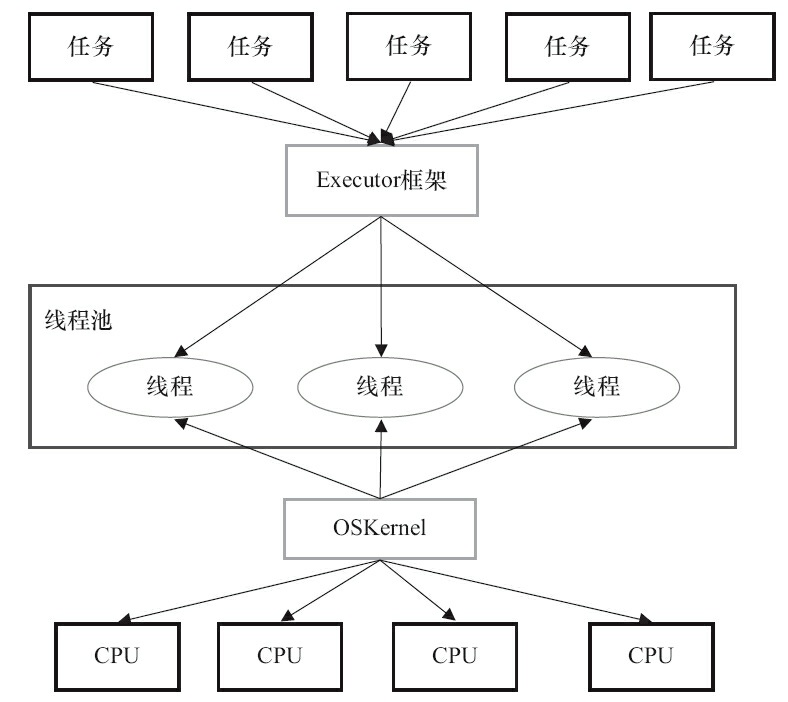

### 5.1 易混淆的概念

**Thread和Runnable的关系：接口和实现类的关系**，所以是实现关系

```java
public class Thread implements Runnable{}
```

线程的创建（2种方式）：

```java
// 方法1：实现
public Main implements Runnable{
    public void run(){
        System.out.println("Runnable方式创建线程")
    }
    public void main(String[] args){
        Main main = new Main();
        new Thread(main).start();
    }
}

// 方法2：继承
public Main extends Thread{
    public void run(){
        System.out.println("Thread方式创建线程");
    }
    public void main(String[] args){
        new Main().start();
    }
}
```

理解：

1. 从架构考虑，**具体的执行任务：run方法应该和线程的创建、运行机制等解耦合**，所以方法1更好；
2. 从性能考虑，线程创建、销毁耗时耗资源，Thread不能传入线程池，而Runnable方法可以调用线程池，用线程池中的线程去执行任务。即**Runnable就是任务，从线程池中的取出任意一个线程，把任务塞进去，用`task.run()`即可运行里面的任务**，而外面套的壳就是线程池中的线程。

runnable是不含有返回值的，thread的run方法也没有返回值；**Callable可以有返回值**

- Callable接口更像是Runnable接口的增强版，它能够捕获和抛出异常，并且还有返回值
- Future接口提供了一个实现类FutureTask实现类，FutureTaks类用来保存Call()方法的返回值
- 调用FutureTask的get()方法来获取返回值

### 5.2 Executor的结构

由3部分组成：

1. 任务：Runnable接口或Callable接口
2. 任务的执行：核心接口Executor，以及继承自Executor的**ExecutorService**接口
3. 异步计算的结果：接口Future和实现Future接口的FutureTask类

具体的类 or 接口：

- **Executor是一个接口，它是Executor框架的基础**，它将任务的提交与任务的执行分离开
  来。
- ThreadPoolExecutor是线程池的核心实现类，用来执行被提交的任务。
- ScheduledThreadPoolExecutor是一个ThreadPoolExecutor的实现类，可以在给定的延迟后运行命令，或者定期执
  行命令。ScheduledThreadPoolExecutor比Timer更灵活，功能更强大。
- Future接口和实现Future接口的FutureTask类，代表异步计算的结果。
- Runnable接口和Callable接口的实现类，都可以被ThreadPoolExecutor或ScheduledThreadPoolExecutor执行。

使用流程：

1. 主线程创建实现Runnable或者Callable接口的任务对象，Executor可以将Runnable对象封装为一个Callable对象，Executors.callable（Runnable task）
2. 然后可以把Runnable对象直接交给ExecutorService执行，也可以交给ExecutorService执行，ExecutorService.execute（Runnable
   command）/ Service.submit（Runnable task）（这个返回的是是FutureTask对象）
3. 主线程可以执行FutureTask.get()方法来等待任务执行完成

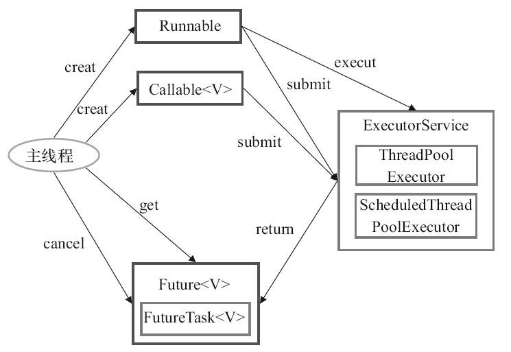

### 5.3 ThreadPoolExecutor

是**Executor框架的核心类**，就是线程池的实现类，具体在Part6里面有详细分析。

线程池的关键参数：

1. corePool：核心线程池的大小
2. maximumPool：最大线程池的大小
3. BlockingQueue：用来暂时保存任务的工作队列
4. RejectedExecutionHandler：当ThreadPoolExecutor已经关闭或ThreadPoolExecutor已经饱和时（达到了最大线程池大小且工作队列已满），execute()方法将要调用的Handler。

ThreadPoolExecutor有3个实现类：（即在此基础上的给的具体场景的实现API，就是上面4个参数的配置不同）

- FixedThreadPool
- SingleThreadExecutor
- CachedThreadPool

#### 5.3.1 FixedThreadPool：固定线程数的线程池

特点：**线程池中的线程数不会超过corePoolSize**

线程池运行流程：

1. 如果当前运行的线程数少于corePoolSize，则创建新线程来执行任务
2. 在线程池完成预热之后（当前运行的线程数等于corePoolSize），将任务加入LinkedBlockingQueue（无界的FIFO队列，实际上是有界的，Integer.MAX_VALUE）
3. 线程执行完1中的任务后，会在循环中反复从LinkedBlockingQueue获取任务来执行；当线程池中的线程数达到corePoolSize后，新任务将在无界队列中等待，因此线程池中的线程数不会超过corePoolSize。
4. 由于使用无界队列，那么不会拒绝任务（不会调用RejectedExecutionHandler.rejectedExecution方法）。

——适合于负载较重的服务器

#### 5.3.2 SingleThreadExecutor：单线程的Executor

总体流程和FixedThreadPool一样，但是corePoolSize是限制为1，有且只有一个线程。阻塞队列也是LinkedBlockingQueue

——能够保证顺序执行

#### 5.3.3 CachedThreadPool：可变线程数的线程池

corePoolSize = 0；

maximumPoolSize = Integer.MAX_VALUE；——可以申请无限的线程

blockingQueue = synchronizedQueue——同步队列

keepAliveTime = 60L，就是线程在等待任务空闲60s之后，线程就会被终止

所以当任务提交速度高于线程处理速度，那么会不断创建线程，直到线程池资源耗尽。但是，如果长期没有任务，那么会CacheThreadPool将不会消耗任何资源，因为没有线程

——适合较多异步短期任务的程序，or 负载较轻的服务器

#### 5.3.4 ScheduledThreadPoolExecutor：定时/延时运行任务

功能与Timer类似，但ScheduledThreadPoolExecutor功能更强大、更灵活。**Timer对应的是单个后台线程**，而**ScheduledThreadPoolExecutor可以在构造函数中指定多个对应的后台线程数**。

任务是：ScheduledFutureTask

主要包含3个成员变量：

1. long型成员变量time，表示这个任务将要被执行的时刻
2. long型成员变量sequenceNumber，被添加到ScheduledThreadPoolExecutor中的序号
3. long型成员变量period，任务执行的间隔周期

DelayQueue封装了一个PriorityQueue，排序是按照到期时间升序排列，如果到期时间一样，那么按照添加的序号排列

当调用ScheduledThreadPoolExecutor的scheduleAtFixedRate()方法或者scheduleWithFixedDelay()方法时，会向ScheduledThreadPoolExecutor的DelayQueue添加一个任务，然后当到期时就会从阻塞队列中出去执行，执行完成后又会被塞回来——是一个周期任务

获取任务：

1. 获取Lock
2. 获取周期任务
   1. 如果PriorityQueue为空，当前线程到Condition中等待，直到有任务了会被唤醒
   2. 如果PriorityQueue的头元素还未到期，到Condition中等待到time时间
   3. 如果头元素已经到期，那么获取头元素。且如果阻塞队列存在多个元素，就唤醒所有等待的线程（看它们等待的线程是否已经到期，如果未到期则继续等待）
3. 获取到任务后，释放Lock

加入队列：

1. 获取Lock
2. 添加任务：向队列中添加任务，如果任务为头结点，那么唤醒所有等待的线程（上面2.1中等待的线程）
3. 释放Lock

执行任务：

1. 线程1从DelayQueue中获取已到期的ScheduledFutureTask（DelayQueue.take()）
2. 线程1执行这个ScheduledFutureTask
3. 线程1修改ScheduledFutureTask的time变量为下次将要被执行的时间
4. 线程1把这个修改time之后的ScheduledFutureTask放回DelayQueue

——这个主要用于循环执行的任务，例如后台线程要执行的周期性任务

### 5.4 FutureTask

代表异步执行的结果。

FutureTask除了实现Future接口外，还实现了Runnable接口。因此，FutureTask**可以交给Executor执行，也可以由调用线程直接执行**（FutureTask.run()）

FutureTask有3种状态：

- 未启动：就只是创建，在被执行run之前一直都是未启动状态
- 已启动：被执行了，就进入已启动状态
- 已完成：正常的执行结束  or 被取消或异常结束

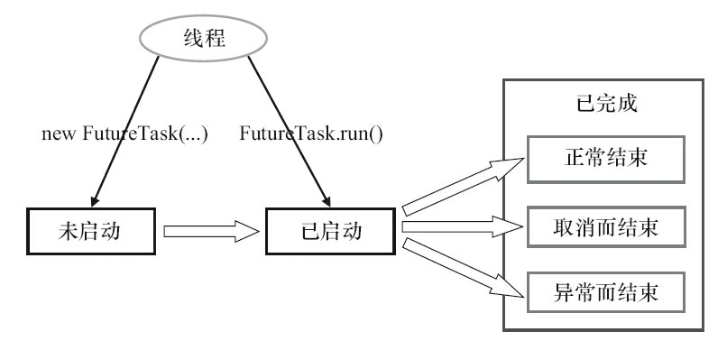

在3个状态中调用方法会有不同的表现：

调用futureTask.get()：

1. 在未启动时，调用get会被阻塞；启动时，也会被阻塞——因为还未出结果
2. 已完成时，调用会得到结果  or 异常

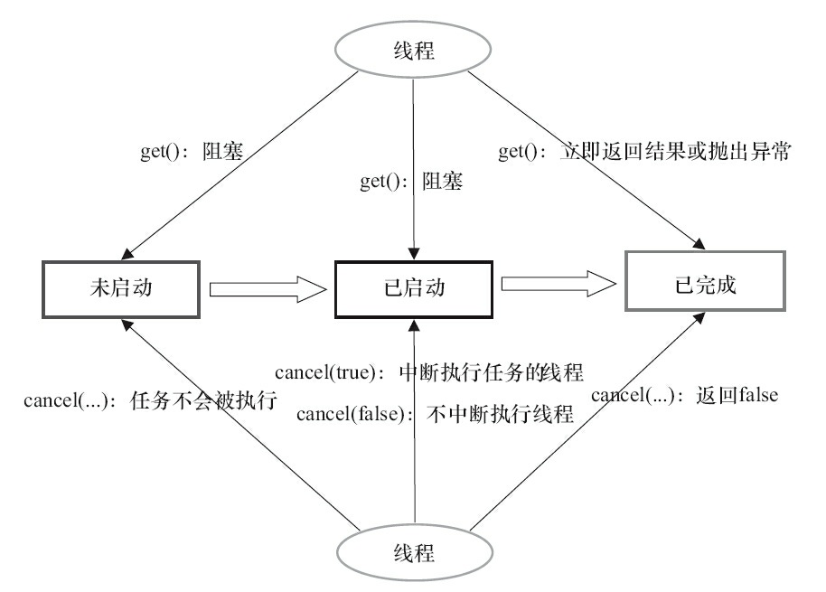

FutureTask是基于AQS实现的。

- FutureTask的acquire操作为get()/get（long timeout，TimeUnit unit）
- FutureTask的release操作包括run()方法和cancel（…）方法

# 6. Java中的线程池

这个不算是Java的数据结构，而是算是一个**并发框架**。线程池是应用场景最多的并发框架。

合理使用线程池有如下3个好处：

1. **降低资源消耗**

   能够复用线程，减少线程新建、销毁的操作开销

   线程太多会造成过分调度的情况。

2. **提高响应速度**

   有任务时，可以直接使用线程池中的线程，而不需要新建线程，等待线程初始化才能执行

3. **提高线程的可管理性**

   可以用线程池合理分配调度线程资源

4. 提供更多强大的功能

   线程池可进行拓展，开发人员可以在线程池的基础上增加功能，例如延时定时线程池，ScheduledThreadPoolExecutor，任务能够延期 or 定期执行

同样，在JUC中提供了一个API：**ThreadPoolExecutor**类。

## 6.1 线程池的概念

基于**池化思想**管理线程的工具。经常出现在多线程服务器中，如MySQL。

池化思想：将资源统一在一起管理，最大化收益最小化风险。

利用池化思想进行管理的，除了线程池，还有：

1. 内存池：实现申请内存块，到需要的时候直接给即可。能够减少碎片，加快申请速度
2. 连接池：预先申请数据库连接，到用到的时候直接进行即可。提高连接速度
3. 实例池：循环使用对象，减少线程初始化、回收时的消耗

## 6.2 ThreadPoolExecutor关系

下面是ThreadPoolExecutor的继承关系：


顶层接口Executor提供了一种思想：将**任务提交和任务执行进行解耦**。即用户只需要提供任务的具体执行方法，只需提供Runnable对象，具体给哪个线程执行、如何调度等不用关注。

ExecutorService接口增加了一些能力：（1）扩充执行任务的能力，补充可以为一个或一批异步任务生成Future的方法；（2）提供了管控线程池的方法，比如停止线程池的运行。

AbstractExecutorService则是上层的抽象类，将执行任务的流程串联了起来。

ThreadPoolExecutor：主要是要维护自身的生命周期，还要管理线程和任务，即如何将任务分发给线程，当任务多时如何处理线程的使用等。

下图是线程池的执行过程：


根本是**消费者 -- 生产者模式**

线程池的任务分为两部分：**线程管理 + 任务管理**

- 任务管理：生产者。

  任务提交之后，即产生了新的任务，那么线程池会选择：直接申请线程并执行任务；加入到队列中，等待分配线程执行；拒绝该任务

- 线程管理：消费者。当任务来了之后，线程就要处理任务。线程池会统一分配线程，线程执行完成后会继续分配任务执行。而线程没有任务时，就会被回收

1. 线程池如何维护自身状态。
2. 线程池如何管理任务。
3. 线程池如何管理线程。

## 6.3 线程池的生命周期管理

线程池运行的状态，不受用户控制，而是内部自行维护。

**线程池内部会维护两个值，而这两个值用一个变量维护**。

- 运行状态：runState
- 线程数量：workerCount

用一个原子类变量来维护：高3位为运行状态；低29位为线程数量。

```java
private final AtomicInteger ctl = new AtomicInteger(ctlOf(RUNNING, 0));

private static int ctlOf(int rs, int wc) { return rs | wc; }
```

优势：用一个变量去存储两个值，可避免在做相关决策时，出现不一致的情况，不必为了维护两者的一致，而占用锁资源。

因为在ThreadPoolExecutor中，常常需要同时判断两个状态

```java
private static final int CAPACITY   = (1 << COUNT_BITS) - 1;		// 低29位全为1
private static int runStateOf(int c)     { return c & ~CAPACITY; }		// 取最高3位——获得线程池运行状态
private static int workerCountOf(int c)  { return c & CAPACITY; }		// 取低29位——获得线程数量
```

运行状态有5种：运行态（默认）、关闭、停止中、空闲中、terminated

```java
private static final int COUNT_BITS = Integer.SIZE - 3;		// 29，要移动到最高位进行赋值
private static final int RUNNING    = -1 << COUNT_BITS;		// 运行态，能够接收新任务，也能处理阻塞的任务
private static final int SHUTDOWN   =  0 << COUNT_BITS;		// 关闭态，不能接收新任务，但是能处理已保存的阻塞任务
private static final int STOP       =  1 << COUNT_BITS;		// 不干活，停滞中
private static final int TIDYING    =  2 << COUNT_BITS;		// 所有任务完成，有效线程数（workCount=0）
private static final int TERMINATED =  3 << COUNT_BITS;		// 执行完terminated方法后进入
```


shutdown：表示线程不再接收新的任务，但是会将已经在队列中的任务全部处理完。当处理完会进入tidying状态

stop：线程立即停止，不再执行所有任务，包括正在执行和队列中等待执行的任务，直接将所有线程全部中断，然后进入tidying状态

## 6.4 任务管理⭐

### 6.4.1 任务调度

也就是ThreadPoolExecutor的整个的执行过程

所有任务的调度都是由execute方法完成的，主要是：检查现在线程池的运行状态、运行线程数、运行策略，从而决定接下来的流程，是创建新的线程去执行任务 or 放到缓冲队列中等待执行 or 直接拒绝

流程图如下：


执行过程如下：

1. 首先，判断线程池的状态，如果是Running状态才继续执行；如果是其他状态，直接拒绝
2. 判断当前线程数 < 核心线程数，即`workCount < corePoolSize`，那么可以创建一个新的线程直接执行该任务（需要获得全局锁，去创建新的线程）
3. 如果`workCount >= corePoolSize` && 阻塞队列未满，那么需要将任务放入阻塞队列，然后等待线程依次去执行
4. 如果`workCount >= corePoolSize` && 阻塞队列满了 && `workCount < maximumPoolSize`，那么可以再次创建新的线程去执行任务（需要获得全局锁，去创建新线程）
5. 如果`workCount >= maximumPoolSize` && 阻塞队列满了，只能拒绝该任务，会调用`RejectedExecutionHandler.rejectedExecution()`默认的处理方式是直接抛异常。

这样能够避免获得全局锁，当完成预热后，大部分execute的方法都是去执行步骤3（因为池中创建了足够多的线程可以来执行任务）

```java
public void execute(Runnable command) {
    if (command == null)
        throw new NullPointerException();
    int c = ctl.get();
    if (workerCountOf(c) < corePoolSize) {
        if (addWorker(command, true))		// 添加工作线程，直接执行任务
            return;
        c = ctl.get();
    }
    if (isRunning(c) && workQueue.offer(command)) {		// 尝试插入阻塞队列
        int recheck = ctl.get();
        if (! isRunning(recheck) && remove(command))	// 双重检查：可能线程池关了 or 线程死了，那么移除任务，并拒绝
            reject(command);
        else if (workerCountOf(recheck) == 0)		// 仍存活，但是如果此时线程全死了，那么创建一个线程
            addWorker(null, false);
    }
    else if (!addWorker(command, false))	// 队列满了，尝试创建新的线程，如果失败了，拒绝；如果成功了，那么直接使用
        reject(command);
}
```

### 6.4.2 任务缓冲

通过一个阻塞队列，实现线程管理和任务管理。

如果队列为空，那么线程会阻塞，等待阻塞队列非空再开始执行——实现线程管理

如果队列未满，且线程数不小于核心线程数，那么进行任务放入阻塞队列——实现任务管理

而且两者从两边开始执行，不直接关联，通过阻塞队列进行相连

不同队列可以实现不同的效果：

| 队列                | 描述                                                         |
| ------------------- | ------------------------------------------------------------ |
| LinkedBlockingQueue | 链表形式，FIFO，默认长度为Integer.MAX_VALUE                  |
| ArrayBlockingQueue  | 数组形式，FIFO，支持公平和非公平锁入队                       |
| SynchronousQueue    | 不存储元素的阻塞队列，每个put必须等待take操作，即任务来了，要等待一个线程来取<br />支持公平锁和非公平锁 |

在程序中，用`workQueue`表示阻塞队列

```java
private final BlockingQueue<Runnable> workQueue;
```

在调用ThreadPoolExecutor的时候，调用构造方法时需要传递阻塞队列对象

### 6.4.3 线程获取任务

主要是针对线程管理的


整个是一个自旋操作：

1. 获取线程池的运行状态，如果运行状态是关闭状态且没有任务要执行 或者 中断、空闲、terminate，那么将线程删除，返回null

2. 获得线程池的线程个数，是否允许线程超时等待，如果是线程个数太多，那么将线程删除，返回null

3. 如果线程允许超时等待，那么限定时间内取获得任务；如果不允许，就阻塞等待获取任务

   获取任务成功，就返回对应的任务

```java
private Runnable getTask() {
    boolean timedOut = false; // Did the last poll() time out?

    for (;;) {
        int c = ctl.get();
        int rs = runStateOf(c);

        // Check if queue empty only if necessary.
        if (rs >= SHUTDOWN && (rs >= STOP || workQueue.isEmpty())) {
            decrementWorkerCount();
            return null;
        }

        int wc = workerCountOf(c);

        // Are workers subject to culling?
        boolean timed = allowCoreThreadTimeOut || wc > corePoolSize;

        if ((wc > maximumPoolSize || (timed && timedOut))
            && (wc > 1 || workQueue.isEmpty())) {
            if (compareAndDecrementWorkerCount(c))
                return null;
            continue;
        }

        try {
            Runnable r = timed ?
                workQueue.poll(keepAliveTime, TimeUnit.NANOSECONDS) :
            workQueue.take();
            if (r != null)
                return r;
            timedOut = true;
        } catch (InterruptedException retry) {
            timedOut = false;
        }
    }
}
```

### 6.4.4 任务拒绝

这是一个线程池保护机制，当线程数量足够多时，且线程阻塞队列满时，就不再接收任务

```java
public interface RejectedExecutionHandler {
    void rejectedExecution(Runnable r, ThreadPoolExecutor executor);
}
```

——用户可以继承之后，自定义处理方案。

JDK提供了4种可选方案：


## 6.5 线程管理

线程池中的线程被称为Worker——工作线程

### 6.5.1 线程生命周期

Worker是ThreadPoolExecutor中实现的内部类，它用来掌握线程状态和维护线程生命周期

```java
private final class Worker extends AbstractQueuedSynchronizer implements Runnable{
    final Thread thread;		// 实例变量，就是实际的线程对象
    Runnable firstTask;		// 初始化的任务，默认为null，表示该线程一开始没有任务；非null，表示初始时有任务，需要先执行
}
```

#### 创建线程

**线程工厂**创建一个新的工作线程：最终它还是通过**new Thread()创建线程**的 

```java
Worker(Runnable firstTask) {
    setState(-1); // 禁止中断，是AQS中的state，将其设置为-1，表示没有获取锁
    this.firstTask = firstTask;
    this.thread = getThreadFactory().newThread(this);		// 创建新的线程
}

// 是Executor中的内部类DefaultThreadFactory，继承自线程工厂接口ThreadFactory
// 创建线程的实现：
public Thread newThread(Runnable r) {
    Thread t = new Thread(group, r,			// 本质上还是调用了new Thread()方法
                          namePrefix + threadNumber.getAndIncrement(),
                          0);
    if (t.isDaemon())
        t.setDaemon(false);
    if (t.getPriority() != Thread.NORM_PRIORITY)
        t.setPriority(Thread.NORM_PRIORITY);
    return t;
}
```

1. 同一个线程池的所有线程属于同一个线程组，也就是创建线程池的那个线程组。同时线程池的名称都是“pool-< poolNum >-thread-< threadNum >”，其中poolNum是线程池的数量序号，threadNum是此线程池中的线程数量序号。如果使用jstack的话很容易就看到了系统中线程池的数量和线程池中线程的数量

2. 默认将线程池中的所有线程都调为**同一个级别**，这样在操作系统角度来看所有系统都是公平的，不会导致竞争堆积。

3. 线程池中的所有线程默认都转换为**非后台线程**，这样**主线程退出时不会直接退出JVM，而是等待线程池结束**

   （JRE判断程序是否执行结束的标准是所有的前台执线程行完毕了，而不管后台线程的状态，所以如果设置为后台线程，那么主线程退出后，可能线程池中的部分线程还在执行却JVM已经关闭了）

理解：firstTask可以为null，就需要创建一个线程去执行任务列表中的任务，也就是非核心线程的创建

firstTask不为null，线程就会在启动初期立即执行这个任务，也就对应核心线程创建时的情况。


ps：核心线程和非核心线程：线程池在创建线程的时候没有对线程进行标记，而是**计数，如果当前线程数<corePoolSize，那么在座的都是核心线程**，如果超过了，那么就要对长时间不运行的线程进行回收。而**关键就是看线程是否存活**

#### 线程回收

如果线程长时间不运行，需要进行回收。线程池使用一张**Hash表去持有线程的引用**，这样可以通过添加引用、移除引用这样的操作来控制线程的生命周期。这个时候重要的就是如何判断线程是否在运行。

Worker是通过继承AQS，**使用AQS来实现独占锁这个功能**。没有使用可重入锁ReentrantLock，而是使用AQS，**为的就是实现不可重入的特性去反应线程现在的执行状态**。

机制：

1. lock方法一旦获取了独占锁，表示当前线程正在执行任务中。如果任务正在执行，那么该线程不会被回收
2. 如果线程没有获得锁，那么表示该线程还是空闲状态，那么可以中断该线程

时机：执行shutdown方法或tryTerminate方法时会调用interruptIdleWorkers，该方法会将空闲的线程中断掉，那么就能进行回收了

```java
// 存放工作线程的哈希集合
private final HashSet<Worker> workers = new HashSet<Worker>();

private void interruptIdleWorkers(boolean onlyOne) {
    final ReentrantLock mainLock = this.mainLock;
    mainLock.lock();			// 在锁内进行回收
    try {
        for (Worker w : workers) {		// 遍历所有工作线程
            Thread t = w.thread;
            if (!t.isInterrupted() && w.tryLock()) {	// 没有被中断，且能够获取到锁，那么说明该线程空闲
                try {
                    t.interrupt();				// 中断
                } catch (SecurityException ignore) {
                } finally {
                    w.unlock();				// 无论是否成功，都要讲锁释放掉
                }
            }
            if (onlyOne)		// 只尝试中断第一个线程，所以至多只中断一个（可能一个也没有）
                break;
        }
    } finally {
        mainLock.unlock();		// 最后要将可重入锁释放掉
    }
}
```


——本质上，就是尝试获取该线程的锁，如果获取成功，表示该线程没有在执行任务，处于空闲状态，那么返回true，该线程可被中断；如果获取失败，表示正在执行，不能中断回收。

具体的线程回收工作：

```java
private void processWorkerExit(Worker w, boolean completedAbruptly) {
    if (completedAbruptly) // 如果线程由于异常而导致的提前结束（正常结束是，线程获取不到任务了）
        decrementWorkerCount();

    final ReentrantLock mainLock = this.mainLock;
    mainLock.lock();			// 上锁环境中
    try {
        completedTaskCount += w.completedTasks;		// 记录线程的执行任务数
        workers.remove(w);			// 将线程从哈希集合中删除
    } finally {
        mainLock.unlock();
    }

    tryTerminate();			// 后面是线程池的自适应操作

    int c = ctl.get();
    if (runStateLessThan(c, STOP)) {
        if (!completedAbruptly) {
            int min = allowCoreThreadTimeOut ? 0 : corePoolSize;
            if (min == 0 && ! workQueue.isEmpty())
                min = 1;
            if (workerCountOf(c) >= min)
                return; // replacement not needed
        }
        addWorker(null, false);
    }
}
```

#### 线程增加

```java
private boolean addWorker(Runnable firstTask, boolean core) {
    retry:
    for (;;) {						
        int c = ctl.get();			// 获得线程当前状态
        int rs = runStateOf(c);

        // 如果线程停止 or 正在停止进行收尾，而该线程又没有任务添加的，那么不给增加
        if (rs >= SHUTDOWN &&
            ! (rs == SHUTDOWN &&
               firstTask == null &&
               ! workQueue.isEmpty()))
            return false;

        for (;;) {
            int wc = workerCountOf(c);
            if (wc >= CAPACITY ||				// 如果线程数量超过容量 or 限定的core数，那么不给添加
                wc >= (core ? corePoolSize : maximumPoolSize))
                return false;
            if (compareAndIncrementWorkerCount(c))		// 先设置新的线程数，成功就跳出外层循环，执行下面的
                break retry;
            c = ctl.get();  			
            // 到这，说明CAS失败。
            // 获取最新的线程池状态，如果状态改变，那么重新从外层循环开始执行
            if (runStateOf(c) != rs)
                continue retry;
            // 到这，说明CAS失败，但是线程池状态未变，那么尝试再次增加工作线程
        }
    }

    boolean workerStarted = false;
    boolean workerAdded = false;
    Worker w = null;
    try {
        w = new Worker(firstTask);		// 创建一个新的工作线程
        final Thread t = w.thread;
        if (t != null) {
            final ReentrantLock mainLock = this.mainLock;		// 加锁情况下运行
            mainLock.lock();
            try {
                // Recheck while holding lock.
                // Back out on ThreadFactory failure or if
                // shut down before lock acquired.
                int rs = runStateOf(ctl.get());			// 再次获取线程池状态

                if (rs < SHUTDOWN ||
                    (rs == SHUTDOWN && firstTask == null)) {
                    if (t.isAlive()) // 如果线程已经开始运行就抛出异常
                        throw new IllegalThreadStateException();
                    workers.add(w);
                    int s = workers.size();
                    if (s > largestPoolSize)
                        largestPoolSize = s;
                    workerAdded = true;
                }
            } finally {
                mainLock.unlock();
            }
            if (workerAdded) {
                t.start();
                workerStarted = true;
            }
        }
    } finally {
        if (! workerStarted)
            addWorkerFailed(w);
    }
    return workerStarted;
}
```

整体流程：


### 6.5.2 线程执行任务

```java
public void run() {
    runWorker(this);
}
```

```java
final void runWorker(Worker w) {
    Thread wt = Thread.currentThread();
    Runnable task = w.firstTask;		// 获取默认的任务，先执行它
    w.firstTask = null;			// 将默认任务清空
    w.unlock(); // allow interrupts
    boolean completedAbruptly = true;
    try {						// 里面就是在执行任务，直到获取不到任务
        while (task != null || (task = getTask()) != null) {	// 从阻塞队列中获取
            w.lock();			// 线程上锁，表示线程正在运行，就不会被中断
            if ((runStateAtLeast(ctl.get(), STOP) ||
                 (Thread.interrupted() &&
                  runStateAtLeast(ctl.get(), STOP))) &&
                !wt.isInterrupted())
                wt.interrupt();		// 如果线程池在stop状态，那么线程需要中断
            try {
                beforeExecute(wt, task);
                Throwable thrown = null;
                try {
                    task.run();				// 执行任务task是runnable类，直接执行run方法
                } catch (RuntimeException x) {
                    thrown = x; throw x;
                } catch (Error x) {
                    thrown = x; throw x;
                } catch (Throwable x) {
                    thrown = x; throw new Error(x);
                } finally {
                    afterExecute(task, thrown);
                }
            } finally {
                task = null;			// 清空该任务，help GC
                w.completedTasks++;		// 线程完成任务数++
                w.unlock();				// 释放非重入锁
            }
        }
        completedAbruptly = false;	
    } finally {
        processWorkerExit(w, completedAbruptly);	// 如果获取不到任务，那么跳出循环，然后销毁线程
    }
}
```

## 6.6 阻塞队列

### 6.6.1 定义

阻塞队列的定义：在队列的基础上，增肌了两个操作：**阻塞的插入，阻塞的删除**

阻塞插入：当队列满时，插入的线程将会被阻塞（普通队列满了，那么插入就会抛出异常 or false）

阻塞删除：当队列空时，插入的线程将被阻塞（普通队列为空，删除就抛出异常 or false）

经典场景：生产者消费者：生产者阻塞的插入，如果满了那么阻塞不再生产；消费者阻塞的删除，如果为空那么阻塞不再拿了

这两种阻塞提供了8种方法：

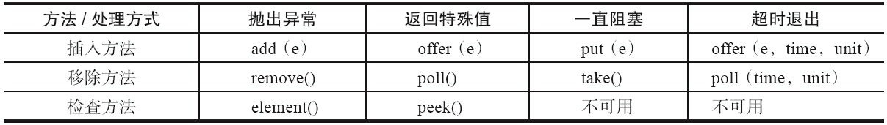

前两列和普通的一样，add/remove/element会抛出异常；offer/poll/peek只会返回true/false；

后两列不一样：put/take是一直阻塞；offer/poll会超时等待

### 6.6.2 Java API

| 队列                    | 描述                                                         |
| ----------------------- | ------------------------------------------------------------ |
| `ArrayBlockingQueue`    | 由数组结构组成的**有界**阻塞队列<br />FIFO原则；用ReentrantLock锁实现的并发操作 |
| `LinkedBlockingQueue`   | 由链表结构组成的**有界**阻塞队列<br />FIFO，默认最大长度为Integer.MAX_VALUE |
| `PriorityBlockingQueue` | 支持优先级排序的无界阻塞队列<br />优先级排序，默认是自然升序排列，还可以自定义比较器Comparator/实现对象的compareTo方法 |
| `DelayQueue`            | 使用**优先级队列**实现的无界阻塞队列<br />可以延时获取元素，只有延迟期满才能从队列种获取元素 |
| `SynchronousQueue`      | 不存储元素的阻塞队列，就是一个中介<br />每一个put操作都被阻塞，直到一个take操作过来，能支持公平访问，默认是非公平策略访问队列 |
| LinkedTransferQueue     | 由链表结构组成的无界阻塞队列<br />有两个方法tryTransfer()和transfer()，可以直接将生产者产生的内容给消费者，如果失败了，就将内容挂到队尾，并且直到消费者消费才返回 |
| `LinkedTransferQueue`   | 由链表结构组成的双向阻塞队列<br />可以在两端进行插入和删除操作，能够提高并发性能 |

### 6.6.3 实现原理

**使用通知模式**

```java
/** Condition for waiting takes */
private final Condition notEmpty;		// 如果队列为空时，消费者会挂在这个上面

/** Condition for waiting puts */
private final Condition notFull;		// 如果队列满时，生产者会挂在这个上面
```

会调用unsafe.park()方法，然后线程会进入waiting状态

## 6.7 参数配置 & 使用

线程池的关键参数：`corePoolSize、maximumPoolSize、workQueue`，所以改变线程池的表现，就从这3个参数改起。

根据[美团](https://tech.meituan.com/2020/04/02/java-pooling-pratice-in-meituan.html)做的统计，动态化线程池是效果最好的。

- 并行执行子任务，**提高响应速度**。这种情况下，应该**使用同步队列**，没有什么任务应该被缓存下来，而是应该立即执行
- 并行执行大批次任务，**提升吞吐量**。这种情况下，应该使用有界队列，使用队列去缓冲大批量的任务，队列容量必须声明，防止任务无限制堆积

在创建线程池的时候需要传递若干个参数：

```java
new ThreadPoolExecutor(corePoolSize, maximumPoolSize, keepAliveTime,
unit,runnableTaskQueue, handler);
```

1. 核心线程数、最大线程数

2. keepAliveTime：非核心线程数的保活时间，空闲线程最多能存活的时间

3. unit：时间的单位

4. runnableTaskQueue：任务阻塞队列，可以选择上面的阻塞队列

5. handler：饱和策略，拒绝时的处理方法，默认情况下是AbortPolicy，表示无法处理新任务时抛出异常。

   可选择：AbortPolicy：直接抛出异常；CallerRunsPolicy：只用调用者所在线程来运行任务；DiscardOldestPolicy：丢弃队列里最近的一个任务，并执行当前任务；DiscardPolicy：不处理，丢弃掉。

提交任务可以使用两个方法向线程池提交任务，分别为**execute()和submit()方法**：

- execute()方法用于提交不需要返回值的任务，所以无法判断任务是否被线程池执行成功
- submit()方法用于提交需要返回值的任务。**线程池会返回一个future类型的对象**，通过这个future对象可以判断任务是否执行成功，并且可以通过future的get()方法来获取返回值，get()方法会阻塞当前线程直到任务完成，而使用get（long timeout，TimeUnit unit）方法则会阻塞当前线程一段时间后立即返回，这时候有可能任务没有执行完。

调用线程池的shutdown或shutdownNow方法来关闭线程池，遍历线程池中的工作线程，然后逐个调用线程的interrupt方法来中断线程，所以无法响应中断的任务可能永远无法终止。

当所有的任务都已关闭后，才表示线程池关闭成功，进入到terminated状态。

线程监控：如果在系统中大量使用线程池，则有必要对线程池进行监控。

还参考了：

1. https://tech.meituan.com/2020/04/02/java-pooling-pratice-in-meituan.html

# ps：一些混淆的知识点

## 1. synchronized不可中断 & lock可被中断

不可中断的含义：**等待获取锁的时候不可被中断**，即没有获取到锁之前是不会响应中断的，**拿到锁之后可以被中断**。

本质上：`thread.interrupt()`，就只是给中断标志位赋值

所以存在如下情况：

- 该线程处于非阻塞状态

  只是将该线程的中断状态将被设为true，没有其他操作，需要线程代码中自行判断

- 该线程处于阻塞状态：调用了`wait`,`sleep`,`join`方法

  然后会从阻塞状态退出，然后抛出中断异常，并且将中断标志位恢复。

而ReentrantLock可被中断，即在等待锁过程中也可以被中断，但是必须是通过`ReentrantLock.lockInterruptibly()`来获取的锁（普通的lock是无效的）

`doAcquireInterruptibly`会让在等待队列中的线程不断地去获取锁，直到获取成功 or 被中断，如果尝试获取失败则还在等待队列中。

```java
private void doAcquireInterruptibly(int arg)
    throws InterruptedException {
    // 把线程放进等待队列
    final Node node = addWaiter(Node.EXCLUSIVE); 
    boolean failed = true;			// 标记是否成功拿到资源，默认是失败的
    try {
        // 自旋——直到获取锁 or 中断
        for (;;) {
            // 获取前置节点
            final Node p = node.predecessor();
            // 前置节点为头节点 && 当前节点获取到锁
            if (p == head && tryAcquire(arg)) {
                // 当前节点设为头节点
                setHead(node);
                p.next = null;  // 应用置null,便于GC
                failed = false;
                // 结束自旋
                return;
            }
            // 检查是否阻塞线程 && 检查中断状态
            if (shouldParkAfterFailedAcquire(p, node) &&
                parkAndCheckInterrupt())
                // 显式抛中断异常
                throw new InterruptedException();
        }
    } finally {
        if (failed)
            cancelAcquire(node);
    }
}     
```

——主要就是Interruptibly是在自旋等待时候还是会去判断是否设置中断标志位了，如果是，那么抛出异常

而如果获取到锁了，就跟synchronized一样由线程代码决定是否中断。

## 2. 多线程下的挂起区分

Thread.sleep()、Object.wait()、Condition.await()、LockSupport.park()

### Thread.sleep()和Object.wait()的区别：

- Thread.sleep()不会释放占有的锁，Object.wait()会释放占有的锁；

- Thread.sleep()必须传入时间，Object.wait()可传可不传，不传表示一直阻塞下去；

- Thread.sleep()到时间了会自动唤醒，然后继续执行；

- Object.wait()不带时间的，需要另一个线程使用Object.notify()唤醒；Object.wait()带时间的，假如没有被notify，到时间了会自动唤醒，因为前面释放了锁，所以如果有锁，那么需要去尝试获取锁：如果立即获取到了锁，线程自然会继续执行；二是没有立即获取锁，线程进入同步队列等待获取锁；

  ——这时被挂在了锁的等待队列上；而前面wait是挂在了条件队列上（wait不到条件时，就被挂起在条件队列上）

——**它们的最大的区别就是Thread.sleep()不会释放锁资源，Object.wait()会释放锁资源。**

### Thread.sleep()和Condition.await()的区别

Object.wait()和Condition.await()的原理比较类似

回答思路跟Object.wait()是基本一致的，不同的是Condition.await()底层是调用LockSupport.park()来实现阻塞当前线程的

并且，Condition.await()在阻塞当前线程之前还干了两件事，一是把当前线程添加到条件队列中，二是“完全”释放锁，也就是让state状态变量变为0，然后才是调用LockSupport.park()阻塞当前线程

### Thread.sleep()和LockSupport.park()的区别

- 从功能上来说，Thread.sleep()和LockSupport.park()方法类似，都是阻塞当前线程的执行，且**都不会释放当前线程占有的锁资源**；
- Thread.sleep()没法从外部唤醒，只能自己醒过来；
- LockSupport.park()方法可以被另一个线程调用LockSupport.unpark()方法唤醒；
- Thread.sleep()方法声明上抛出了InterruptedException中断异常，所以调用者需要捕获这个异常或者再抛出；
- LockSupport.park()方法不需要捕获中断异常；
- Thread.sleep()本身就是一个native方法；
- LockSupport.park()底层是调用的Unsafe的native方法；

### Object.wait()和LockSupport.park()的区别

- Object.wait()方法会释放锁；LockSupport.park()不会释放锁
- Object.wait()方法需要在synchronized块中执行；LockSupport.park()可以在任意地方执行；
- Object.wait()方法声明抛出了中断异常，调用者需要捕获或者再抛出；
- LockSupport.park()不需要捕获中断异常;
- Object.wait()不带超时的，需要另一个线程执行notify()来唤醒，但不一定继续执行后续内容；
- LockSupport.park()不带超时的，需要另一个线程执行unpark()来唤醒，一定会继续执行后续内容；
- **如果在wait()之前执行了notify()会怎样？抛出IllegalMonitorStateException异常**；
- **如果在park()之前执行了unpark()会怎样？线程不会被阻塞，直接跳过park()，继续执行后续内容；**

参考内容：

https://segmentfault.com/a/1190000020864747?utm_source=sf-related

## 3. 缓存一致性及MESI

问题引出：对于多处理器来说，每个处理器均存在一个cache，而如果一个内存地址的内容被多个cpu缓存，可能存在某个cpu修改了值，而只是更新到了自己的cache中（为了提高效率，并不会马上更新到内存中），但是对于其他cpu来说是不可见的，他们在使用该值的时候就会造成——**缓存不一致性**。——这会影响多线程程序的预期结果。

——**缓存一致性**