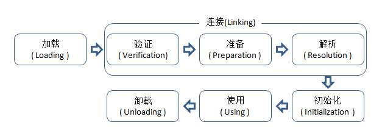

# Java面向对象PART1

# ——类的基础

引出：java定义了8种基本数据类型。那么其他的数据类型如何表示呢——**用类表示**

## 1. 类的基本概念

类可以是**函数的容器**，也可以表示**自定义的数据类型**。

### (1) 类的作用1：是函数容器

某个类**只是函数的容器**，即该类中没有定义任何新的数据类型

eg：Java API类中的Math类，就是包含了一系列的数学函数。如果要使用这些函数，可以使用**`Math.`**（不需要导包）

| 函数名          | 参数             | 返回值   | 作用                   |
| --------------- | ---------------- | -------- | ---------------------- |
| `Math.round()`; | float a/double a | int/long | 将浮点数四舍五入为整数 |
| ......          |                  |          |                        |

这些函数都有相同的修饰符：`public static`

- `public`，其他类可以使用，对其他类可见

  相对的是`private`，表示私有，**只能在同一个类内部才能被调用**，而在该类外面是不能使用的，对其他类屏蔽

- `static`：静态方法，也是类方法，**类方法可以直接通过类名进行调用，不需要创建实例**

  相对的是实例方法，**实例方法必须通过实例或对象调用**，即使用之前，必须创建实例，即：new xxx

```java
public static int abs(int a) {			// 注意修饰符，表明是类方法，且是公开使用的
	return (a < 0) ? -a : a;
}
```

why要区分public和private呢？

private可以防止一些方法被外部类误用，而调用者只需要关注public就可以，而不需要关注其如何实现的。

一些**私有变量可以通过`getter/setter`来获得值/设置值**，这个也是封装的思想之一，而有些私有变量是不允许外部进行修改的，只能在某些方法执行过程中修改

**通过private封装和隐藏内部实现的细节，避免被误操作——计算机程序的一种基本思维**

下面是Arrays类的函数定义，在使用的之前需要导包`import java.util.Arrays`<a name="arrays"></a>

| 函数名           | 参数                                                        | 返回值 | 作用                                                         |
| ---------------- | ----------------------------------------------------------- | ------ | ------------------------------------------------------------ |
| `Arrays.sort();` | int[] a(int fromIndex, int toIndex)（不同数据类型都实现了） | void   | 在原数组位置上排序，默认是升序排序<br/>（参数：还可以自定义比较方法Comparator<? super T> c） |
| ....             |                                                             |        |                                                              |

### (2) 类的作用2：是自定义的数据

类作为自定义的数据类型，就是除了那8种以外的其他类型。数据类型需要包括：**属性、该类型可以进行的操作**。属性可以分为：该类型本身有的属性和具体实例有的属性；操作可以分为：该类型本身有的操作和具体实例有的操作。

那么类作为自定义的数据类型有如下的4部分组成：

- 类型本身有的属性：**类变量**，又叫做静态变量/静态成员变量（成员变量1）
- 类型本身可以进行的操作：**类方法**，又叫做静态方法（成员方法1）
- 类型实例有的属性：**实例变量**（成员变量2）
- 类型实例可以进行的操作：**实例方法**（成员方法2）

*（对于具体类型，不一定有全部的4部分，eg：Arrays就只有类方法）*

#### 1. 类变量（静态变量/静态成员变量）

表示的是类型本身有的属性，**经常用来表示一个类型中的常量**（有点类似于C的宏定义、const）

eg：Math类中的类变量：`Math.PI`

必须要包含的修饰符是`static`：表示类变量

public代表其他类可见

**final：表示常量，即变量赋值之后就不能再修改了，可以避免误操作**（Java编译器会对final变量进行一些特别的优化）

```java
// 对外部类可以直接用Math.E/Math.PI，但是对其值不能修改
// 			——Cannot assign a value to final variable 'PI'
public static final double E = 2.7182818284590452354;	
public static final double PI = 3.14159265358979323846;
```

——对于常量，Java会将其存储在常量池中，而不是放在栈中

#### 2. 实例变量、实例方法

表示的是具体实例可以有的属性和操作，eg：int a;	=> int就是类型，而a就是实例（实际例子）

### (3) 类的举例（定义、使用）

```java
// 需要新建一个java文件，然后才能写该class代码——类似于，一个类就是一个文件
public class Point {		// public表明该类是外部可以访问到的，但是类一定是public的，不然没有创建的意义
    public int x;		
    public int y;			// 定义了两个实例变量，且是可以被外部类访问的，实例变量不能用static修饰（这样就变成类变量了）
    public double distanceToZero(){			// 定义了一个实例方法
        return Math.sqrt(x * x + y * y);
    }
}
```

1. 可以发现，**类的修饰符都是`public`，而不能是`private`**，因为类一定都能被其他类访问的，不然没有定义的意义。**类的修饰符可以没有——表示一种包级别的可见性，有的话也是public——全局可见性**。（当然，内部类又另说）
2. **实例方法可以直接访问实例变量，而不需要传参了**：实例方法是带有一个隐含的参数，该参数就能用来操作实例自己，从而操作实例变量——本质上也还是需要参数的
3. **类方法只能访问类变量，不能访问实例变量，可以调其他的类方法，但是不能调用实例方法**（因为实例方法需要创建对象，而类方法在使用的时候不需要创建对象，所以没有对象就不能调用实例方法，也不能访问实例变量）
4. **实例方法既能访问实例变量，也能访问类变量，可以调用实例方法，也能调用类方法**（因为类方法不需要创建对象就可以直接调用，那么创建对象了就更加能调用类方法和类变量了）

```java
// 在其他一个类里面
Point p = new Point();	// 创建一个对象（实例）
p.x = 2;
p.y = 3;
System.out.println(p.distanceToZero());
```

**解释：**（需要重点关注的）

```java
Point p = new Point();	// 创建一个对象（实例）
// 等价于如下：
Point p; 	// 先声明一个变量，是Point类型，只会分配存放位置的内存空间，但是还没有指向任何实际内容——称为引用类型变量——类似于C中的指针声明
p = new Point();	// 创建了一个实例，然后赋值给了变量p
// => 这句话有两个步骤
// ⭐1. 分配内存，用来存储新对象的数据，对象数据包括这个对象的属性，即x、y⭐
// ⭐2. 给实例变量设置默认值，int默认为0（如果有构造方法，还需要去调用构造方法给实例变量赋值）⭐
```

所以p就是引用类型变量

**在创建对象时，所有实例变量均会设置一个默认值**（和局部变量不一样，需要手动赋值），**类似于创建数组时，数组元素都有默认值**（默认值实际上是可以修改的）

- 数值类型变量的默认值为0/0.0
- boolean是false
- char是**'\u0000'**
- 引用类型变量的默认值为null，表示不指向任何对象

实例变量的使用：`<对象变量名>.<成员名>`；类变量的使用：`<类名>.<成员名>`

实例方法的使用：`<对象变量名>.<方法名>`；类方法的使用：`<类名>.<方法名>`

所以整个步骤和基本数据类型一致：定义数据（类数据类型特有的设置默认值） ->赋值 ->操作 

ps：实际上不能将实例变量声明为public，一般都将实例变量设置为private，而**应该通过调用实例方法来对实例变量进行操作**——因为实例方法可以对参数值进行检查和控制，防止误操作

——可以发现实例变量和实例方法都是通过创建的对象进行的，**通过对象来访问和操作其内部数据是一种基本的面向对象的思想**

### (4) 变量的默认值

之前说了，实例在创建的时候，会给实例变量创建存储空间，并且设置默认值，那么该默认值是可以修改的，有如下两种修改方式

```java
int x = 1;
int y;
{					// {} 整个被称为代码块
	y = 2;
}

static int one = 1;		// 类变量也可以自定义初始值
static int two;
static{					// static{}整个被称为静态代码块，在类加载的时候执行，且只执行一次
    two = 2;
}
```

在创建对象的时候，首先会调用**实例变量初始化、实例代码块初始化，然后才会执行构造方法**，具体见[ps:3](#3)

而对于静态变量（类变量），是在类加载的时候执行，在创建对象之前就已经执行一遍了（只会执行一遍）

### (5) private变量的含义、定义和使用方法

将实例变量变成private，在另外一个类里面的`p.x`和`p.y`均开始报错，因为现在的实例变量对其他类不可见了，所以不能直接调用

```java
public class Point {
    private int x;
    private int y;
    public void set(int x, int y){		// add
        this.x = x;			// 当前实例的实例对象x（左侧），被赋值为形参x的值（右侧），this是来消除两边的歧义的
        this.y = y;			// 否则的话，根据就近原则，就是形参赋值给形参，而实例变量值仍旧是0，0
    }
    public int getX(){	// add
        return this.x;
    }
    public int getY(){	// add
        return this.y;
    }
    public double distanceToZero(){
        return Math.sqrt(x * x + y * y);
    }
}
```

**this关键字，表示当前实例**（在此例子中，实际上可以将形参的名字修改为a、b或者其他，然后直接赋值x = a; y =b; 也不会产生歧义）

**`this();`**是用构造方法去调用另一个构造方法的，当然如果需要传参还有参数列表

### (6) 构造方法

前面(4)说了如何对变量修改默认值（其实就是赋初值），如何通过函数来修改变量的值（不是赋初值了）

那么更为规范的赋初值的方式——**构造方法**

```java
public Point(){			// 构造方法1
    this(1, 1);			// 其实就是去调用“构造方法2”——但是⭐这句话必须放在该构造函数的第一行⭐（也是避免误操作，防止自己定义的操作被覆盖了）
}
public Point(int x, int y){		// 构造方法2——更为常见和通俗的构造方法
    this.x = x;
    this.y = y;
}

// 使用构造方法
Point p = new Point(2, 3);
```

构造方法可以有多个，但是都需要满足如下条件：

- **名称固定，和类名一样**
- **没有返回值，也不能有返回值**，其实隐藏的返回值就是实例本身

——构造方法可以**重载**（**只能重载，不能重写**）

两个特殊的构造方法：

1. 默认的构造方法

   **每个类都需要一个构造方法**，用在new的时候，但是如果构造方法没有什么操作用户可以不定义，而是**Java编译会自动生成一个默认构造方法**，而这个默认的构造方法**本身没有具体操作——就是一个空函数**。但是用户一旦**自定义了一个构造方法（哪怕为空操作），Java编译器将不会提供默认构造方法**。因为编译器会认为用户需要自行构造方法，而不会再提供空的

2. 私有构造方法——修饰符是：private

   有三种原因：不希望给类创建实例；单例模式；只是给同类的其他构造方法使用，用来减少重复代码量，具体见[ps:1](#1)

### (7) 类和对象的生命周期

生命周期：类和对象在**内存**中的存活时长

对于类来说，**当第一次new类的对象时/通过类名访问类变量或类方法时**，Java就会将类加载进内存，为这个类分配一块空间（在方法区），主要是存储：**类的定义、类的变量、方法信息、类的静态变量（并做初始化）**。类一旦加载进内存后不会被释放，**生命周期直到程序结束**，**类只会加载一次**，那么静态变量在内存中只有一份

——**类只加载一次，一旦加载就活到程序结束**。具体见[ps:2](#2)

每次操作new对象，就产生一个对象。内存中会**存储该对象的实例变量值**。——实例变量看new的次数（即对象个数）

对象**在内存中存储实例变量值，还存储对应类的地址**（就是前面加载类到内存的地址），那么该对象能够直接访问到类的变量和方法代码

**对象的释放是通过Java的垃圾回收机制**（其实不完全是）。具体如下：

- 对象有两块内存，保存地址的部分**分配在栈中**，而保存实际内容的部分**分配在堆中**。
- 栈中的内存是入栈就会分配内存（栈顶指针-1），出栈就自动释放所占用的内存（栈顶指针+1）
- 堆中的内存是使用垃圾回收机制，即当没有活跃变量指向对象时，堆空间可能会被释放（具体释放时间看JVM）

### (8) 总结：

1. 关键字


2. 一种思维方式：通过类实现自定义的数据类型，封装该类型所具有的属性（变量）和操作（方法），隐藏实现细节（只提供外部接口），从而在高层次（类、对象层次，而不是基本数据类型和函数层次）考虑——是解决复杂问题的思维方式（复杂问题一层层化简成简单问题）

## 2. 类的组合

——有一点点类似于C语言的结构体，结构体里面还是可以嵌套结构体的

类的组合，就是类里面的属性（变量）可以是类

```java
// Line类的定义
public class Line {
    private Point start;		// 实例变量是两个类对象
    private Point end;
    public Line(Point start, Point end){		// 构造方法
        this.start = start;		// 因为这两个变量在这之前已经实例化了，所以可以直接赋值
        this.end = end;
    }
    public double length(){		// 本质上是调用point的实例方法
        return this.start.distanceToAnother(this.end);
    }
}

// Point.java
// Point类里面的实例方法
public double distanceToAnother(Point p){
    return Math.sqrt(Math.pow((x - p.getX()), 2) + Math.pow((y - p.getY()), 2));
}

// main函数的使用
public static void main(String[] args) {
    Point start = new Point(2,3);		// 实例化两个点
    Point end = new Point(3,4);
    Line line = new Line(start, end);	// 实例化一条线
    System.out.println(line.length());
}
```

看一下这几个实例对象在内存中的存储情况：


（由于都是对象，所以有两个地址，一个**保存实际内容的地址在栈中**，**保存实际内容的在堆中**）

——我们在对现实问题进行建模时，对概念分析有哪些属性、哪些行为，以及概念之间的关系，然后就针对概念定义一个类，并定义其方法、属性和类之间的关系（这个就涉及到了类的组合）

**类定义中，还能引用自己**。类似于递归调用

为啥能这样做呢？关键点在于：**实例变量不需要一开始就有值**，即变量可以为null，直到需要的时候再通过`setXXX`进行赋值

```java
// Person类
public class Person {
    private String name;
    private int age;
    private Person father;		// 自己引用自己
    private Person mother;
    private Person[] children;
    public Person(String name, int age){     // 构造方法
        this.name = name;
        this.age = age;
    }
}

// main函数里面
Person p1 = new Person("xiaowang", 24);
Person p2 = new Person("laowang", 56);
p1.setFather(p2);
System.out.println(p1.getFather().getName());
```


**类定义之间还能互相引用**：本质上是由于某些属性不用一开始就设置值，也不是必须设置（需要才设置，可以一直为null）

ps：如果类似于C语言要求在使用之前对每个变量均初始化，那么由于互相引用，就是a要b的值，而b也要a的值，那么永远也等不到了

```java
// 文件类
public class File {
    private String name;
    private Date createTime;
    private double size;
    private Folder parent;	// 调用了文件夹类
}

// 文件夹类
public class Folder {
    private String name;
    private Date createTime;
    private Folder parent;
    private File[] files;		// 调用了文件类
    private Folder[] subFolders;	// 调用了文件夹类
    
    public double totalSize(){
        double totalSize = 0;
        if(files != null){
            for(File f: files){
                totalSize += f.getSize();
            }
        }
        if(subFolders != null){
            for(Folder f: subFolders){
                totalSize += f.totalSize();	// 涉及到了递归调用
            }
        }
        return totalSize;
    }
}
```

类之间的组合关系在Java里面表现就是（互相）引用。但是逻辑上，有两种引用关系：包含（某个类从属于某个类，而不能用于其他，上下级关系）和单纯引用（类之间因为某些存在联系，但是实际上是独立存在的）

——总结：

类之间可以互相调用，本质上是由于类里的某些属性不必一开始就设置值，也不是必须设置

思想：通过类实现某个概念，而类的组合能够表达更为复杂的概念以及概念之间的关系

## 3. 代码的组织机制

问题引出：这么多代码，我们要如何组织才能避免命名冲突？如何使用第三方库？如何将各种代码和调用的库连接起来编译链接成一个完整的程序？

#### 3.1 包的概念——解决命名冲突

**Java中管理类和接口的方式——包**，类似于文件夹，类和接口都放在包内，包代表一个层次结构。

包有包名，以点号 . 来分隔上下级的层次关系，eg：String类，所在的包就是`java.lang.String`（java是上层包，lang是下层包）。**带完整包名的类名：完全限定名**，eg：java.lang.String

要注意：**同一个项目中，不可以有相同的包名（包括和引用的库的包名一样也不行）**，所以命名尽量不要和库一样——能够正常编译，但是运行时会有包冲突并且抛出异常：` java.lang.SecurityException: Prohibited package name: java.lang `

ps：**Java API中的所有类和接口都存放在java/javax下的，java是标准包，javax是扩展包**

##### 包的使用步骤：

- 声明类所在的包

  （没有声明，就存放默认包下——但是不建议）

  在文件的**最前面**（声明之前不能有除注释外的其他语句），**先声明包**

  注意：**包名必须和文件目录结构相匹配**，如果不匹配就会编译错误

  ```java
  package com.amyZhoucc;		// 声明了两级的包，上级为com，下级为amyZhoucc，合起来就是com/amyZhoucc
  ```

  Java中包名的命名惯例是：使用域名作为前缀，且是用域名的反序来定义包（因为域名是唯一的，不会存在包名的冲突）

  在包的机制下：**同一个项目的所有代码都有一个相同的包前缀，包前缀是唯一的，也不会和其他代码重合**，而项目内部继续细分子包，然后下面继续分——可以**方便模块化开发**

  ps：默认包，创建时没有将其放在指定的某个package中，默认包没有包名。

  ​		java默认包中的类可以实例化其它包中的public类，但是**其它包中的类是不能显式实例化默认包中的类**——因为，默认包没有包名，无法导入

- 通过包使用类

  同一个包下的类可以互相引用而不需要包名，如果是不同的包下，必须要通过包找到类从而引用。有两种方式：**通过类的完全限定名（地址全称）**；**将用到的类引入当前类**。

  ps：**java.lang下的包不需要导入可以直接使用**，eg：String类、System类

  ```java
  // 使用完全限定名——就是在调用该类的时候，前面要加上它的全部包名
  int[] arr= new int[]{3, 5, 1, 6, 2};
  java.util.Arrays.sort(arr);
  System.out.println(java.util.Arrays.toString(arr));
  
  // 类引入——就是在package之后improt需要的包
  // import需要放在package之后类定义之前
  import java.util.Arrays;
  public class Main {
      public static void main(String[] args) {
          int[] arr= new int[]{3, 5, 1, 6, 2};
          Arrays.sort(arr);			// 那么可以直接通过类名进行调用
          System.out.println(Arrays.toString(arr));
      }
  }
  ```

  ps：import操作，还可以一次性引入某个包的所有类，语法是用(.* ) ，eg：`import java.util.*;`但是这个包不能递归，**只导入了该包下的直接类，而不包含其嵌套包下的类**，例如`java.util.zip`包下面的类不会被导入。也不能嵌套引入：例如`java.util.*.*;`

  注意：在类中对其他类的引用必须是唯一的，不能引入重名的类，如果有，import只能引入一个，而**其他的必须要通过完全限定名使用**

  还有，有个静态导入，使用static关键字，可以导入指定类的public的类方法和类变量

  ——但是静态导入不能过多使用，因为不知道其所属的类

  ```java
  // public final static PrintStream out = null;
  import static java.lang.System.out;		// 导入的是个类变量
  public class Main{
      public static void main(String[] args){
          out.println("hello world");		// 可以直接使用out变量（还是需要些具体的类变量、类方法，但是不用写前面的包了）
      }
  }
  ```

- 包范围可见性

  **private（类内部可见） < 默认（包范围可见）<protected（子类可见+包范围可见）<public**

  注意这边的包范围是指，同一个直接包，而**子包下面的类并不能访问**

#### 3.2 jar包

**打包**，我们可以将自己写的代码分享给别人，也可以使用别人分享的代码——就是通过jar包

**打包的是编译后的代码**，而不是源代码。打包可以**将多个编译后的文件打包为一个文件**。

Java中，就是将一个或多个.class文件打包成一个.jar文件——这个就是jar包（.java文件编译之后就会产生一个.class文件）

具体打包指令：

```
jar -cvf <希望输出的包名>.jar 待打包的文件

// 举例
jar cvf test.jar points.class line.class  // 就会将两个文件打包成一个jar文件
jar cvf test.jar *			// 将当前目录下的所有文件都打包
jar cvf test.jar */.		// 打包多级目录

// -cvfm 是需要指定jar的清单文件的MANIFEST.MF
```

Java的类库和第三方库都是通过jar包形式提供的，如果要使用，将其加入类路径（classpath）即可

首先需要了解java文件是如何运行的

#### 3.3 程序的编译和链接

源代码 -> 运行的程序，主要有两步：编译（编译器完成）+ 运行（JVM完成）（具体看[《Java的额外知识》chap2](http://note.youdao.com/noteshare?id=9f8ab6eaf048c06b8c823ebe1c7f0b8c&sub=38FCCF96A0C74660A8B19E1140BA449E)）

编译是通过编译器将源代码.java文件变成.class的字节码——通过运行**javac指令**完成

运行是JVM（Java虚拟机）——通过运行**java指令**完成，它通过解析.class文件，然后将其转换为二进制代码，然后运行——所以，**java是边解释边运行的**

而**链接：就是在执行的时候，根据引用到的类加载相应的类对应的字节码，并且执行**。（因为除了开始要用到的那个类，就是指令`java MainApp`中指定的类，其他类都是需要用到的时候才会进行**链接**）

Java在编译和运行的时候，需要以**参数指定`classpath`，就是类路径**，它是用来**指示JVM如何搜索class**，就是知道要加载哪个类，那从哪里去加载该类呢？——这个就需要`classpath`了。

类路径可以有多个。Windows系统下，多个路径可以用`;`分隔；其他系统用`:`分隔

对于直接的class文件，路径就是class文件的根目录；对于jar包，路径就是jar包的完整名称（路径+jar包名）

```assembly
// 如下的路径下都存放了同名的类，会从前向后搜索匹配，找不到就下一个，全部找不到就报错
C:\work\project1\bin;C:\shared;"D:\My Documents\project1\bin"	// windows下面
/usr/shared:/usr/local/bin:/home/project/bin			// Linux下面
```

编译时：编译器会确定每个引用类的**完全限定名**，是根据`import+classpath`来确定的。所以存在：如果导入的是完全限定名，那么直接确定；如果是模糊导入，eg: import xxx.*，那么就需要找到对应的父包，然后在父包下面看是否存在需要的类。如果**多个模糊导入都存在相同的类名文件，会出现编译错误**。——import就是在此时确定完全限定名的

运行时：根据类的完全限定名进行查找并加载，寻找的方式就是在类路径中找。如果是**.class文件就在根目录下面找**；如果是**jar包，先解压后找**。——运行时，就只是根据完全限定名进行查找


# ps：本节相关知识

## 1. Java的私有构造函数

我们接触到的构造函数的权限修饰符都是public，比如，

```Java
public class Test {
    public Test() {
    ...
    }
}
```

构造函数的用途是创建一个类的实例。比如，

```Java
Test instance = new Test();
```

既然有public修饰符，那么private修饰符也能够作为构造函数的修饰符——那么构造函数就变成私有构造函数了。
而priavte的作用就是：只能在定义的类内部使用，而无法在其他类中使用，对于构造函数来说，那么**该类就无法在其他类中实例化了，对应的就无法在其他类中使用实例变量和实例方法了**。
存在即合理，那么私有构造函数的作用是什么呢？

### 1. 作用1：防止实例化

虽然某个类使用了私有构造函数（那么Java就不会自动生成默认构造函数，**默认构造方法是public的**），一定不能在其他类实例化该类，而**有些类就不能让其他类实例化自己**，比如Java的工具类，不希望被实例化，被用户滥用。而是希望静态访问其类变量和类函数，所以其构造函数就是私有的——即，常用在一些库API中，都是设定了一个私有构造方法（如果不写，就直接给一个默认的public的构造方法），从而不给创建实例化

```Java
public final class Math {

    /**
     * Don't let anyone instantiate this class.——不让实例化该类
     */
    private Math() {}
}
```

### 2. 作用2：单例模式

即类的对象有且只能有一个——单个实例
（单例模式，这是最初级的设计模式之一）

```Java
public class Singleton {

    private static Singleton instance;  // 一个私有的类变量，外部类不能访问
    
    private int x;      // 创建两个私有的实例变量
    private int y;
    
    private Singleton() {
        this.x = 1;
        this.y = 2;
    }

    public static Singleton getInstance() {
        if (instance == null)       // 如果已经调用过了，那么就直接返回
            instance = new Singleton(); // 调用私有方法
        return instance;
    }
}
```

单例模式主要有3个特点，

1. 类的内部有一个类的实例，并且为static类型（类变量，但是在未调用方法之前是未初始化的）
2. 构造函数为私有——外部类不能调用
3. 通过提供一个获取实例的方法，比如getInstance，该方法也为static类型（类方法）
   调用的时候，我们可以通过

```Java
Singleton instance = Singleton.getInstance();
```

来得到其实例化，而且每次调用，都是使用同一个实例

为什么要用单例模式呢？ 因为很多时候，我们只需要一个对象就可以了，不希望用户来构造对象，比如线程池，驱动，显示器等。如果把构造函数私有，那么所有程序在调用时，只会有同一个实例变量，不容易带来混乱。

### 3. 作用3：只是用来被其他构造函数调用

它只是作为中间函数，用来减少重复代码，用来被其他构造函数调用的，而不希望用户直接调用该构造函数（可能该构造函数还不是很完善等等）

## 2. 类的生命周期

Java文件编译后产生了一个或者多个.class文件（如果存在内部类，就会生成多个.class文件），这些Class文件中描述了类的各种信息，而只有将它们**加载到虚拟机才能起作用**。

类加载机制：虚拟机把描述类的数据从Class文件加载到内存，并对数据进行校验，转换解析和初始化，最终形成可以被虚拟机直接使用的Java类型的过程。

Java的性质：**类型的加载和连接都是在程序运行期间完成**，这样会在类加载时稍微增加一些性能开销，但是却能为Java应用程序提供高度的灵活性

这部分讲的是：类的加载和初始化时机、类的加载过程（类的加载方式没有提及），以及类加载之后的存活周期。

### 1. 类的生命周期

类的生命周期包括：从被加载到虚拟机内存中开始，到卸载出内存为止，即在内存中存在的时间，包括如下阶段：

1. 加载
2. 验证
3. 准备
4. 解析：以上3个部分统称为连接
5. 初始化
6. 使用
7. 卸载

注意：

1. 其中6个阶段的顺序是固定的，但是**解析阶段的顺序不一定**：它在某些情况下可以在初始化阶段之后再开始，这是为了支持Java语言的运行时绑定（也称为动态绑定或晚期绑定）
2. **必须按照这种顺序“开始”，但不是按部就班的“进行”或“完成”**，因为这些阶段通常都是**相互交叉地混合式进行的**，也就是说通常会在一个阶段执行的过程中调用或激活另外一个阶段。



### 2. 类的加载/初始化时机

即JVM何时加载class文件，何时初始化类的

#### 2.1 类的加载时机

虚拟机规范中并没有对此进行强制约束，这点可以交给虚拟机的具体实现来自由把握

#### 2.2 类的初始化时机

虚拟机规范指明 **有且只有五种情况**必须立即对类进行初始化（而这一过程自然发生在加载、验证、准备之后）：

1. 遇到new、getstatic、putstatic或invokestatic这四条字节码指令

   生成这四条指令的最常见的Java代码场景是：

   - 使用new关键字实例化对象的时候；
   - 读取或设置一个类的静态字段（被final修饰，已在编译器把结果放入常量池的静态字段除外）的时候；
   - 调用一个类的静态方法的时候

2. 使用java.lang.reflect包的方法对类进行反射调用的时候（不了解）

3. 当初始化一个类的时候，如果发现其父类还没有进行过初始化，则需要先触发其父类的初始化

   所以，类初始化时发现父类没有初始化，此时才会去给父类初始化，所以**父类的加载可能会发生在子类之后**。

4. 当虚拟机启动时，用户需要指定一个要执行的主类（包含main()方法的那个类），虚拟机会先初始化这个主类。

5. 当使用jdk1.7动态语言支持时，如果一个java.lang.invoke.MethodHandle实例最后的解析结果REF_getstatic,REF_putstatic,REF_invokeStatic的方法句柄，并且这个方法句柄所对应的类没有进行初始化，则需要先出触发其初始化（不了解）

ps：创建数组有所不同：即new array，指令触发的只是**数组类型本身的初始化，而不会导致其相关类型的初始化**，

eg：new String[]只会直接触发String[]类的初始化，也就是触发对`类[Ljava.lang.String`的初始化，而直接不会触发String类的初始化

——这五种场景中的行为称为对一个类进行 **主动引用**。除此之外，所有引用类的方式，都不会触发初始化，称为 **被动引用**。

被动引用的典型场景：

1. **通过子类引用父类的静态字段，不会导致子类初始化**

   ```java
   public class SSClass{				// 父父类
       ....
   }  
   public class SClass extends SSClass{		// 父类
       public static int value = 123;
       public SClass(){....}
   }
   
   public class SubClass extends SClass{		// 子类
       static int a;
   
       public SubClass(){....}
   }
   
   public class NotInitialization{				
       public static void main(String[] args){
           System.out.println(SubClass.value);		// 通过子类去引用父类的静态字段
       }
   }
   ```

   在每段设置桩点后，发现：子类没有初始化，父类初始化了（但是，构造方法并没有调用），父类的父类也相应的初始化了（遵循上面的初始化规则3）

2. **通过数组定义来引用类，不会触发此类的初始化**

   ```java
   public class NotInitialization{
       public static void main(String[] args){
           SClass[] sca = new SClass[10];		// 创建数组，数组元素的类型是父类对象
       }
   }
   ```

   接着上面的，并没有触发父类的（包括父父类的）类初始化，实际上是触发了`L包名.SClass`，就是一个数组类的初始化

3. **常量在编译阶段会存入调用类的常量池中，本质上并没有直接引用到定义常量的类，因此不会触发定义常量的类的初始化**

   ```java
   public class ConstClass{
       public static  final String CONSTANT = "hello world";
   }
   
   public class NotInitialization{
       public static void main(String[] args){
           System.out.println(ConstClass.CONSTANT);	// 调用类的静态常量
       }
   }
   ```

   没有触发类的实例化，编译阶段将此常量的值“hello world”存储到了NotInitialization常量池中

   ——即，在编译阶段就将要用到的常量导入到NotInitialization类的池中了，此时和ConstClass类没有啥关系了

### 3 类的加载过程

#### 1. 加载

虚拟机需要完成以下三件事情：

- **通过一个类的全限定名来获取定义此类的二进制字节流**（并没有指明要从一个Class文件中获取，可以从其他渠道，譬如：网络、动态生成、数据库等）；
- **将这个字节流所代表的静态存储结构转化为方法区的运行时数据结构**；
- 在内存中(对于HotSpot虚拟就而言就是方法区)**生成一个代表这个类的java.lang.Class对象**，作为方法区这个类的各种数据的访问入口；

加载阶段和连接阶段的部分内容（如一部分字节码文件格式验证动作）是**交叉进行的，加载阶段尚未完成，连接阶段可能已经开始**，但这些夹在加载阶段之中进行的动作，仍然属于连接阶段的内容，这两个阶段的**开始时间仍然保持着固定的先后顺序**。

#### 2. 验证（连接1）

目的：为了确保Class文件的字节流中包含的信息符合当前虚拟机的要求，并且不会危害虚拟机自身的安全

完成4个阶段的检验动作：

- 文件格式验证：验证字节流是否符合Class文件格式的规范(例如，是否以魔术0xCAFEBABE开头、主次版本号是否在当前虚拟机的处理范围之内、常量池中的常量是否有不被支持的类型)
- 元数据验证：对字节码描述的信息进行语义分析，以保证其描述的信息符合Java语言规范的要求(例如：这个类是否有父类，除了java.lang.Object之外)；
- 字节码验证：通过数据流和控制流分析，确定程序语义是合法的、符合逻辑的;
- 符号引用验证：确保解析动作能正确执行。

——验证阶段是非常重要的，但不是必须的，它对程序运行期没有影响。

#### 3. 准备（连接2）

目的：**正式为类变量(static 成员变量)分配内存并设置类变量初始值（零值）的阶段**，这些变量所使用的内存都将在**方法区中进行分配**。

仅包括类变量，而不包括实例变量，实例变量将会在对象实例化时随着对象一起**分配在堆中**（局部变量存放在栈中）

——此时，类变量的值都是JVM给的默认值

如果类变量是final的，那么编译器在编译时就会为value生成ConstantValue属性，并在**准备阶段**虚拟机就会根据ConstantValue的设置将变量设置为指定的值

——所以，准备阶段结束，非final的类变量分配的内存空间，设置了默认值（在方法区）；final变量分配了内存空间，给了指定的值（默认值在常量池）

#### 4. 解析（连接3）

虚拟机将**常量池内的符号引用替换为直接引用**的过程。解析动作主要针对类或接口、字段、类方法、接口方法、方法类型、方法句柄和调用点限定符7类符号引用进行。

#### 5. 初始化（类加载过程的最后一步）

前提：只有前面2.2指定的初始化时机到来时，才能进行初始化，否则不会主动进行初始化的。

eg：`Class.forName("A",false,this.getClass().getClassLoader())`：false是指明了装载类的过程中，不进行初始化，只将类装载到JVM内存中。

到了初始化阶段，才真正开始执行类中定义的java程序代码(字节码)。

**初始化阶段是执行类构造器`<clinit>()`方法的过程**。`<clinit>()`方法是由编译器自动收集类中的所有类变量的赋值动作和静态语句块static{}中的语句合并产生的，编译器收集的**顺序是由语句在源文件中出现的顺序**所决定的。

——所以，静态代码块中的变量必须在之前定义过了。

注意：

1. 类构造器是隐式调用的；
2. 类构造器`<clinit>()`对于类或者接口来说**并不是必需的**，如果一个类中没有静态语句块，也没有对类变量的赋值操作，那么编译器可以不为这个类生产类构造器`<clinit>()`。
3. 虚拟机会保证一个类的类构造器<clinit>()在多线程环境中被正确的加锁、同步，如果多个线程同时去初始化一个类，那么只会有一个线程去执行这个类的类构造器<clinit>()，其他线程都需要阻塞等待（如果初始化耗时，那么该阻塞会很长），直到活动线程执行<clinit>()方法完毕。且其他线程不需要再次初始化该类了——**在同一个类加载器下，一个类型只会被初始化一次**

### 4. 注意的坑

**实例初始化不一定要在类初始化结束之后才开始初始化**

即在类初始化的时候，可以进行实例初始化。

eg：

```java
public class StaticTest {
    public static void main(String[] args) {
        staticFunction();
    }

    static StaticTest st = new StaticTest();		// 静态变量，需要去创建一个实例变量

    static {   //静态代码块
        System.out.println("1");
    }

    {       // 实例代码块
        System.out.println("2");
    }

    StaticTest() {    // 实例构造器
        System.out.println("3");
        System.out.println("a=" + a + ",b=" + b);
    }

    public static void staticFunction() {   // 静态方法
        System.out.println("4");
    }

    int a = 110;    // 实例变量
    static int b = 112;     // 静态变量
}
// >> 2 3 a=110,b=0 1 4
```

理解：可以发现，在静态变量初始化时，需要创建该类的实例对象——允许在**类初始化结束前创建实例对象**

所以在该类初始化的时候，按照代码顺序进行初始化，首先就看到了`static StaticTest st = new StaticTest();`，所以转而去创建实例了

所以，该类的构造器的内容实际上如下：

```java
<clinit>(){
    System.out.println("2");		// 实例初始化代码块
    a = 110;			// 实例变量初始化
    System.out.println("3");			// 实例构造方法的
    System.out.println("a=" + a + ",b=" + b);
    st = 该实例变量地址值
    System.out.println("1");
    b = 112;
}
```

——所以，输出结果是如上的，且在实例构造方法中，静态变量 = 0，因为还未初始化完全。

进阶：

在程序的最后添加一句：

```java
static StaticTest st1 = new StaticTest();
```

——即，在最下面的再次创建一个实例变量，赋值给一个静态变量

打印顺序：

```
// >> 2 3 a=110,b=0 1 2 3 a=110,b=112 4
```

注意，类只初始化一次，而对象每次创建都需要初始化。

参考：[这篇博客](https://blog.csdn.net/justloveyou_/article/details/72466105)

## 3. Java对象创建过程

上面讲的是：类加载的时机、类加载的步骤、类的生命周期。下面讲的是：**类的实例化的步骤**

Java要求：一个对象在可以被使用之前必须要被正确地初始化

在实例化一个对象时，JVM首先会检查相关类型是否已经加载并初始化，如果没有，则JVM立即进行加载并调用类构造器完成类的初始化。在类初始化过程中或初始化完毕后，根据具体情况才会去对类进行实例化。（而如果类在初始化的时候，遇到了需要类实例化，那么会先去实例化）

### 1. 对象的创建时机

触发对象创建的行为：

1. new关键字：显式调用构造方法来创建对象

   ——在Java规范中被称为 : **由执行类实例创建表达式而引起的对象创建**

2. 反射机制

3. Clone方法

4. 反序列化

**[待补充](https://blog.csdn.net/justloveyou_/article/details/72466416)**

### 2. 创建过程

#### 第一步：分配内存（堆中）

当一个对象被创建时，虚拟机就会为其分配内存来存放对象自己的实例变量及其从父类继承过来的实例变量(即使这些从超类继承过来的实例变量有可能被隐藏也会被分配空间)。**在为这些实例变量分配内存的同时，这些实例变量也会被赋予默认值(零值)。**

——在分配空间时，会给一个默认值（JVM机制决定的）

#### 第二步：初始化

内存分配完成后，就看代码中的设定了，存在3类对象初始化结构：**实例变量初始化、实例代码块初始化、构造函数初始化**

1. **实例变量初始化**：eg：`private int a = 2;`，这个就是实例变量初始化

2. **实例代码块初始化**：就是一段代码

   ——实例变量初始化和实例代码块初始化是同等级的，即**顺序执行**，那么规定了**不允许顺序靠前的实例代码块初始化在其后面定义的实例变量**，即该变量还未定义不能进行初始化

   ——实际上，如果我们**对实例变量直接赋值或者使用实例代码块赋值，那么编译器会将其中的代码放到类的构造函数中去**，并且**这些代码会被放在对超类构造函数的调用语句之后，构造函数本身的代码之前**。（Java要求构造函数的第一条语句必须是超类构造函数的调用语句，以保证所创建实例的完整性)

3. **构造函数初始化**：发生在最后，且第一句一定是调用超类的构造方法语句或者是调用其他重载的构造方法，如果既没有调用其他的构造函数，也没有显式调用超类的构造函数，那么编译器会为我们自动生成一个对超类构造函数的调用

如果**在构造方法中调用另一个构造方法，只允许在被被调用方法中调用超类构造方法**：

```java
public class Test{
    public Test(){
        super();
    }
    public Main(int a){
        super();	
        this();			// Error:Constructor call must be the first statement in a constructor
        int b = a;
    }
}
```

理解：

1. super(); 和this(); 在一个构造方法中只能出现一个，因为都要求是构造方法的首句

   所以为了解决该问题，将super()放在被调用的构造方法中，那么流程变成了this() -> super()->父类的构造方法内容

   所以，还是父类的构造方法先执行

所以，实例化对象就是一个**递归的过程**：

实例化一个类的对象前，首先准备实例化该类的父类，如果该类的父类还有父类，那么准备实例化该类的父类的父类，依次递归直到递归到Object类，此时，首先实例化Object类，再依次对以下各类进行实例化，直到完成对目标类的实例化，而在对每个类实例化的时候，遵循：**先依次执行实例变量初始化和实例代码块初始化，再执行构造函数初始化**。


eg：

```java
class Foo {
    int i = 1;

    Foo() {				// 父类的构造方法
        System.out.println(i);             
        int x = getValue();
        System.out.println(x);            
    }

    {
        i = 2;
    }

    protected int getValue() {
        return i;
    }
}

//子类
class Bar extends Foo {
    int j = 1;

    Bar() {
        j = 2;
    }

    {
        j = 3;
    }

    @Override
    protected int getValue() {		// 重写了父类的方法
        return j;
    }
}

public class ConstructorExample {
    public static void main(String... args) {
        Bar bar = new Bar();
        System.out.println(bar.getValue());        
    }
}
//>> 2 0 2
```

理解：首先，是分配实例对象的内存空间（包括自身的变量和从父类那边继承得到的变量）；接着就开始初始化：可以将对象初始化整合成如下：

```java
// 父类构造方法：
Foo() {
    i = 1;
    i = 2;
    System.out.println(i);
    int x = getValue();			
    System.out.println(x);
}

// 子类的构造方法：
Bar() {
    Foo();
    j = 1;
    j = 3;
    j = 2;
}
```

而getValue又根据多态的性质，而是调用子类的方法，而子类此时才给了j一个默认的值，所以结果为0

——所以，创建对象的整个流程：**父类的类构造器<clinit>() -> 子类的类构造器<clinit>() -> 父类的成员变量和实例代码块 -> 父类的构造函数（两者可以整合成父类构造方法） -> 子类的成员变量和实例代码块 -> 子类的构造函数（两者也可以整合）**

