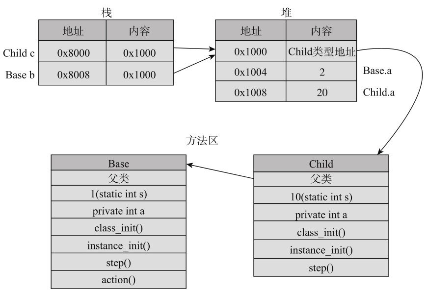
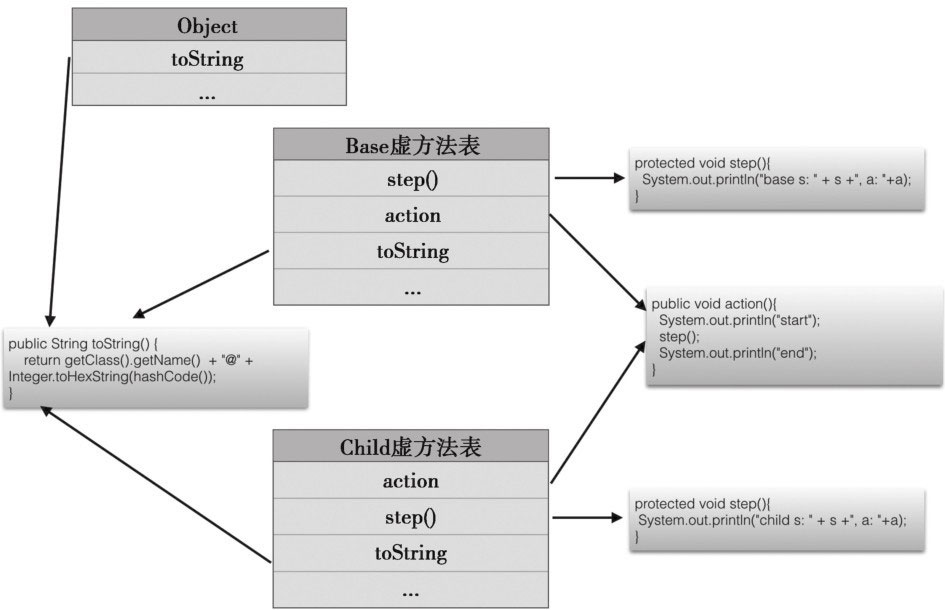

## Java面向对象PART2

## ——类的继承

类之间可以组合，还可以**分类**——从某个根开始不断向下细分，形成一个层次分类体系

分类的形象举例：生物界能分为植物界、动物界，而动物又能继续细分下去，就是一个层次分类体系。

而计算机中对象的分类关系表示为**继承**（更细的类继承自大类）。继承中，有**父类、子类**之分（又称，基类和派生类），父类和子类是相对的（不是绝对的）

继承：子类继承了父类的属性和方法，**父类有的属性和方法子类都有**（但是父类私有的方法和属性都没法继承）（类似于老虎继承自动物，那么就有动物的特性了），并且**子类可以增加其特有的**属性和方法（类似于老虎有斑纹，是动物没有的属性）

## 1. 基本概念

### （1）根父类Object

平时在写的时候，没有涉及到父类子类继承，实际上，**每个类都有一个父类Object**，该类没有定义属性，但是定义了一系列方法，如下：这些方法都不要额外导入包，就可以直接使用的，并可以对其进行重写


例如：getClass()：获得该对象的类名，是Class类的实例对象——完全限定名，是实例方法，eg：`obj.getClass();——class java.lang.Object`

toString方法：

```java
// Object
public String toString() {
	// 获得当前对象的类名，后面是返回对象的hash值——默认都是对象的内存地址值，并且是按16进制返回的
	return getClass().getName() + "@" + Integer.toHexString(hashCode());
}
```

子类可以将该方法**重写**：就是定义和父类一样的方法（同方法名、同传参），但是具体的实现是不同的，这用来反映不同的实现。

```java
// 在Point类中重写toString方法，体现其特色
@Override
public String toString(){
    return "(" + x + ", " + y + ")";
}
```

举例：图形类，下面有子类圆形类、直线类，直线类下面还有带箭头的直线类

```java
// Shap类
public class Shape {
    private static final String DEFAULT_COLOR = "black";	// 注意必须是static（类变量）
    private String color;
    public Shape(){
        this(DEFAULT_COLOR);	// 直接调用下面的构造函数
    }
    public Shape(String color){
        this.color = color;
    }
    public String getColor() {
        return color;
    }
    public void draw(){
        System.out.println("draw shape");
    }
}

// Circle类
public class Circle extends Shape{		// 注意extends
    private Point center;		// Circle特有的属性，类的组合
    private double r;
    public Circle(Point center, double r){	// 注意构造方法只初始化了circle特有的属性
        this.center = center;
        this.r = r;
    }
    @Override
    public void draw(){
        System.out.println("draw circle at " + center.toString() +
                           " whit r = " + r + 
                           ", using color: "+ getColor());
    }
    public double getArea(){		// 子类特有的方法
        return Math.PI * r * r;
    }
}

// Line类
public class Line extends Shape{
    private Point start, end;		// Line特有的属性
    public Line(Point start, Point end, String color){
        super(color);			// 注意super
        this.start = start;
        this.end = end;
    }
    public Point getStart(){
        return start;
    }
    public Point getEnd(){
        return end;
    }
    @Override
    public void draw(){
        System.out.println("draw line from " + start.toString() +
                           " to " + end.toString() + 
                           ", using color: "+ super.getColor());	// 注意super
    }
    public double length(){
        return start.distanceToAnother(end);
    }
}

// ArrowLine类
public class ArrowLine extends Line{
    private boolean startArrow;
    private boolean endArrow;
    // 注意构造函数
    public ArrowLine(Point start, Point end,String color, 
                     boolean startArrow, boolean endArrow)
    {
        super(start, end, color);
        this.startArrow = startArrow;
        this.endArrow = endArrow;
    }
    @Override
    public void draw(){
        super.draw();
        if(startArrow) System.out.println("draw start arrow");
        if(endArrow) System.out.println("draw end arrow");
    }
}
```

在代码中的知识点：

1. 子类继承，使用了`extends`（注意有s！！！）关键字，一个类最多只能有一个父类

2. 子类不能直接访问父类的**私有属性和方法**，但是能通过public的方法间接访问该内容。eg：circle不能直接访问父类的color，但是可以通过`getColor()`访问。同样，子类无法继承父类的private属性和方法

3. 但是，**子类继承了父类的非私有属性和方法**，比如子类能够使用`getColor()`

4. 并且，在执行子类的构造方法时，会**先执行父类的构造方法**，后执行子类自己的构造方法

   调用父类构造方法分为：显式和隐式的

   所以，存在如果父类只定义了需要传参的构造方法，那么子类必须显式调用父类的方法，即super(xxx)；而如果父类存在无参构造方法/没有构造方法，那么子类可以选择不写，编译器会自动调用无参构造方法，而如果子类显式调用了，就会去执行指定的构造方法。

   ——子类的构造方法执行之前，一定会先执行父类的（这是一个递归过程）

5. super关键字，是指代父类的，可以调用父类的构造方法，访问父类的属性和方法——特定调用父类的方法（而不是隐式的）

   注意的是：

   - 在子类的构造方法中，如果可以用`super(xxx)`调用父类的构造方法，要放在第一行（和this一样，this和super必须都出现在第一行，所以它们只能出现一个）
   - `super.xxx`可以调用父类的方法，如果**子类不存在对该方法的重写，可以直接使用**；如果存在重写（就是冲突），而又想去调用父类的方法，必须用super
   - **super只能引用父类非私有的属性和方法**

   和this类似，但是本质上又有区别：

   **this引用对象**，而该对象是实际存在的，**this可以做参数、做返回值等**；但是**super只能是关键字，不能做参数or返回值**，它只是告诉编译器要调用父类的方法或属性

6. 注意：因为在使用子类的构造函数时，会默认调用父类的构造函数，如果父类不存在空参数的构造函数，那么子类必须要显式去调用父类的构造函数，即`super(xxx)`；如果存在，那么就会去默认调用空参数的构造函数即可

7. 

### （2）继承的优势之一：统一处理不同子类对象（多态）

可以将每个对象都当作父类对象，然后**调用方法就会默认去调用子类的重写方法**（如果有重写的话，没有就调用父默认父类的对象）

```java
// 图形管理类
public class ShapeManager {
    private static final int MAX_NUM = 10;
    private Shape[] s = new Shape[MAX_NUM];		// 构建一个Shape对象数组
    private int shapeNum = 0;
    public void addShape(Shape shape){			// 向数组里面添加shape对象
        if(shapeNum < MAX_NUM){
            s[shapeNum++] = shape;
        }
    }
    public void draw(){					// 调用对象的draw方法
        for(int i = 0; i < shapeNum; i++){
            s[i].draw();		// 会根据对象的具体类，来调用特定的方法（可能是重写的，或者默认的）
        }
    }
}


ShapeManager sm = new ShapeManager();// 建父类对象

Point center = new Point(2, 3);
double r = 4.0;
Circle circle = new Circle(center, r);
sm.addShape(circle);

Point start = new Point(1,2);
Point end = new Point(2, 4);
Line l = new Line(start, end, "red");
sm.addShape(l);

Point alStart = new Point(3,4);
Point alEnd = new Point(6,8);
ArrowLine al = new ArrowLine(alStart, alEnd, "green", false, true);
sm.addShape(al);

sm.draw();
```

一些概念：

1. 可以看到，我们将**子类对象赋值给父类引用变量**——**向上转型**（转换为父类型），比如`circle、l`等对象赋值给shape变量

2. **父类型变量shape可以引用任何子类型对象**——**多态**，就是**一种类型的变量能够引用多种实际类型的对象**。

   多态的概念：程序中定义的引⽤变量所指向的具体类型和通过该引⽤变量发出的⽅法调⽤在编程时并不确定，⽽是在程序运⾏期间才确定

   变量shape有两种类型：

   - 静态类型：类型Shape，本来定义的类型

   - 动态类型：实际引用的对象类型

     那么动态类型下调用动态类型对应的方法，就是**动态绑定**

   why出现多态和动态绑定？
   
   $\because$构建对象的代码（对象的定义，例如Circle对象定义的地方）和操作对象的代码（对象的使用，例如ShapeManager）不在同一个文件中实现，而操作代码只知道操作的对象的父类型，而不需要知道具体有哪些子类型

——**多态和动态绑定也是计算机的一种重要思维方式，使得操作对象的程序不需要关注对象的实际类型，而统一处理不同的对象，但是又能实现每个对象的特有行为**

——总结：


## 2. 继承的细节

### （1）构造函数

前面已经注意到了，调用子类去创建子类实例的时候，会去调用子类的构造函数，而**子类的构造函数会先去调用父类默认的构造函数**

那么如果父类不存在默认构造函数呢（已经自定义了一个带参数的构造函数）？——需要**显式的调用父类某个构造函数**，用`super(xxx)`，否则就会编译错误

特殊情况——这个只会出现在很恶心的细节考试里面：

```java
public class Base {			// 基类
    public Base(){			// 构造函数里面调用了一个可被重写的函数
        test();
    }
    public void test(){
        System.out.println("base");
    }
}

public class Child extends Base{		// 子类
    private int a = 123;
    public Child(){			// 构造函数首先会去调用父类的构造函数
    }
    public void test(){		// 重写了父类的public方法
        System.out.println(a);
    }
}

// main函数里面：
Child child = new Child();
child.test();

// 输出：
0
123
```

考点：多态 + 父类构造方法 + 实例变量的初始化时机

概括就是：父类的构造函数里面调用了可被重写的方法，而该方法又被子类给重写了，那么在子类调用构造函数时，会去调用父类默认的构造函数，而父类的构造函数要调用**被子类重写的方法**，**此时子类的实例变量的赋值语句和构造方法还未被执行**，所以输出为0

——这不是一个好方法！**父类构造函数调用的函数应该private方法**。

### （2）重名与动态绑定

复习：如果子类重写父类的方法（非private），那么在子类对象调用该方法时，会**动态绑定**——就是执行该重写的方法而不是父类的方法。（其实重写就是重名，类之间存在相同名字的变量、方法等，但是实现不同）

——实例方法都是动态绑定，子类不管静态类型如何，都是去调用子类的重写方法

重名的情况：——以下针对**实例变量、静态方法、静态变量也是可以实现重名的情况**

1. 如果是private变量和方法，那么不存在问题——因为只能在类里面访问private变量和方法

2. 如果是public变量和方法

   - 如果是在**类里面访问**，比如类里面的一个函数去访问该方法、该变量，**那么就是当前类的**。但是子类可以super显式的访问父类的同名

   - 如果是在类外面访问，就需要看调用的静态类型是啥

     - 如果静态类型是父类，那么访问父类的方法和变量（这边的静态类型我的理解是：引用变量的类型）
     - 如果静态类型是子类，那么访问子类的方法和变量

     ——这个就是**静态绑定**（就是访问到的是变量的静态类型，在赋值操作的左边类型）

     ```java
     // 基类
     public class Base {
         public static String baseS = "static base"; // 静态变量
         public String s = "base";       // 实例变量
         public static void BaseFun(){
             System.out.println("base static fun");
         }
         public void BaseFun2(){
             System.out.println("base fun2");
         }
     }
     
     // 子类
     public class Child extends Base{
         public static String baseS = "static child";	// 重名（类似于重写）
         public String s = "child";		// 重名
         private int a = 12;
         public static void BaseFun(){		// 重名
             System.out.println("child static fun");
         }
         public void BaseFun2(){			// 重写（实例方法）——动态绑定的
             System.out.println("child fun2");
         }
     }
     
     // main
     Child c = new Child();	// 静态类型为Child类
     Base b = c;		// 静态类型为Base类——通过b访问的就是父类的对象、方法了（除了实例方法）
     
     System.out.println(c.baseS);	// 调用静态变量：static child
     System.out.println(c.s);	// 调用实例变量：child
     c.BaseFun();		// 调用静态方法：child static fun
     c.BaseFun2();		// 调用实例方法：child fun2
     
     System.out.println(b.baseS);	// static base
     System.out.println(b.s);	// base
     b.BaseFun();		// base static fun
     b.BaseFun2();		// 调用实例方法：child fun2（动态绑定）
     
     Base base = new Base();
     System.out.println(base.baseS);		// static base
     System.out.println(base.s);	// base
     base.BaseFun();		// base static fun
     base.BaseFun2();	// base fun2——因为就是父类对象，所以不可能去调用子类的方法or变量
     ```

     ps：静态变量or方法都可以直接通过类名来调用，也可以通过实例对象访问（实例对象访问本质上还是找了该对象的实际类，然后再通过该类进行的访问）

     **静态绑定在编译阶段完成；动态绑定在运行时才完成**

     **实例变量、静态变量、静态方法都是通过静态绑定的**

### （3）重载和重写的区别

重写：之前接触到的实例方法就是重写操作

​			特点是：子类和父类的方法完全一样：方法名、方法参数、方法返回值都是一样的；就是**实现不一样（内部不一样）**。且在父子两个类中存在的；存在多态、动态绑定的情况

**重载：方法名称一样，但是参数不一样**——可能参数个数、类型、顺序不同。可以只在**一个类中**出现重载情况。

那么出现的问题是：对于同一个方法名有不同的实现，那么在参数调用的时候是如何选择（执行哪个方法）的呢？

当出现多个重载方法时，首先按照参数类型进行匹配——**寻找所有重载版本中最匹配的，然后再选择进行动态绑定的**

举例：

```java
// 基类
public class Base {
    public void sum(int a, int b){
        System.out.println("base fun");
    }
}
// 子类
public class Child extends Base{
    public void sum(long a, long b){
        System.out.println("child fun");
    }
}
// main方法调用
Child c = new Child();
int a = 2, b = 3;
c.sum(a, b);		// base fun——因为int类型和基类方法更匹配，所以选择基类的

long d = 3, e = 4;
c.sum(d, e);		// child fun——因为long类型和子类方法更匹配，所以选子类的
```

### （4）父子类型转换

前提：子类的对象可以赋值给父类的引用变量——向上转型

那么也存在向下转型：但是有条件的——**父类引用变量实际的引用对象必须是子类对象or子类对象的子类**——那么能将该父类的引用变量赋值给子类的变量。

举例：

```java
Base b = new Child();
Child c = (Child)b;		// 强转成功

Base d = new Base();
Child e = (Child)d;		// 强转失败——因为d的动态类型就是Base

// 关键字instanceof，可以判断b是否属于Child类型，返回值是true（是）/false（不是）
b instanceof Child;	
```

instanceof：只要是该类的对象，该类子类的对象也返回true

即：e instanceof Base >> true

### （5）继承访问权限（关键字：protected）

复习：

- public表示该变量/方法可被外部类访问（任何地方均能直接访问，如果是静态的话那就是类名+静态名；如果是成员变量or方法，那么创建对象之后再通过对象名+成员变量名/方法访问）
- private表示该变量/方法只能被类内部访问（即使创建了对象，也不能通过对象名+变量or方法名进行访问——因为不在类的内部）
- default（默认）表示包内可见，就是同一个包内能通过类名（针对静态的变量or方法）/对象名访问

现在增加一个关键字**protected**——表示**不能被外部类访问，但是能被子类（即使子类在其他包内）访问**。并且变量和方法都能**包内可见**。

具体来说：

- 基类的protected成员是包内可见的，也包括在同一个包内的子类
- 如果子类和基类不在同一个包内，那么子类可以**访问从基类那边继承得到的protected成员，但是不能访问基类的protected成员**

——关键是要确定：该protected成员出自哪个地方，然后其可见性范围，然后再判断其可行性。

[发现宝藏，可以看看有醍醐灌顶之效，尤其时面对clone场景](https://www.cnblogs.com/liuleicode/p/4946248.html)，[详见ps](#4)

```java
public class Base {
    protected int currentStep;
    protected void step1(){}
    protected void step2(){}
    public void action(){
        this.currentStep = 1;
        step1();
        this.currentStep = 2;
        step2();
    }
}

public class Child extends Base {
    protected void step1(){
    	System.out.println("child step " + this.currentStep);
    }
    protected void step2(){
    	System.out.println("child step " + this.currentStep);
    }
}
```

这个是protected常用的一个场景。

**设计模式之一：模板方法——父类只提供了一个模板方法，子类来具体实现，而protected就是在里面常见。**

### （6）可见重写性

容易忽视的一点：重写时，**子类重写的方法的可见性>父类方法的可见性**，即：如果父类方法是public，那么子类的方法必须是public；父类的方法是默认的，那么子类的方法至少是default/public；以此类推——子类方法的权限可以升级，但是不能低于

原因：父类和子类的关系，是从属关系，父类表示更广泛，而子类细节更多，类-似于”动物-老虎“的关系，**子类属于父类，所以子类要能支持父类所有的对外行为**，所以就是**` is a`**的关系，eg：老虎 is a 动物。

可见性变小了，那么支持的对外行为变少了——逻辑上不允许

### （7）防止继承（关键字：final）

前提：明确，final和public/protected/default/private，是不同方向的，后者是指示了可见性；而final指示的是可修改权限

final修饰的类——那么**该类整个不让其他类继承**——通过关键字：final实现，加了关键字final的类就无法被继承

```java
public final class Father {	// 整个类不能被继承
}
```

ps：final也能用在变量、方法上

- 修饰方法

  不允许子类在继承的时候被覆盖（即不能重写等），类的**private方法会被隐式地指定为final方法**

  所以，父类的实例方法不能被重写；父类的静态方法不能被覆盖

  但是均能继承，即可以通过子类对象去调用final修饰的实例方法，通过子类去调用final修饰的静态方法。

- 修饰变量

  用在此的最多，**如果修饰的是基本数据类型变量，那么一旦初始化就不能更改；如果修饰的是引用类型变量，那么初始化之后不能指向其他对象**

   

   

## 3. 继承实现的基本原理（未完）

首先明确：

一个类的信息主要包括如下：

1. 静态变量
2. 类初始化代码
   - 静态初始化代码块，eg: `static{ System.out.println(xxx); xxx}`
   - 定义静态变量时的赋值语句，eg: `public static int a = 2;`
3. 静态方法
4. 实例变量
5. 实例初始化代码
   - 实例初始化代码块，eg: `{System.out.println(xxx); xxx}`
   - 定义实例变量时的赋值语句，eg: `int a = 2;`
   - **构造方法**
6. 实例方法
7. **父类信息引用**

类加载过程：**分配内存，仅包括静态变量，并且会给默认值 -> 父类的类构造器<clinit>() -> 子类的类构造器<clinit>() ->实例化分配内存，给实例变量默认值 -> 父类的成员变量和实例代码块 -> 父类的构造函数（两者可以整合成父类构造方法） -> 子类的成员变量和实例代码块 -> 子类的构造函数（两者也可以整合）**

内存分为栈和堆

- 栈存放临时变量

- 堆存放运行时动态分配的对象，eg：new的对象的内容就在此

- 方法区：尽管所有的方法区在逻辑上是属于堆的一部分，**可以看作是一块独立于Java堆的内存空间**。

  方法区主要存放的是类信息，包括静态变量、方法、类相关的信息

### 1. 对象创建

栈中存放的是临时变量，即引用变量，指向的是对象的内存首地址

堆中存放的是对象内容，是在new的时候开辟了一块内存块来存放。**对象头会存放实际类的信息，即类信息的地址（方法区中）**

方法区中存放的是类的信息，类之间如果有继承关系，则会互相链接



### 2. 方法调用

eg：

```java
public class Base {
    protected void step(){
        System.out.println("base s: " + s +", a: "+a);
    }
    public void action(){
        System.out.println("start");
        step();
        System.out.println("end");
    }
}

public class Child extends Base {
    protected void step(){
        System.out.println("child s: " + s +", a: "+a);
    }
}

public static void main(String[] args) {
    Child c = new Child();
    c.action();
}
```

子类对象调用实例方法action，实际执行时步骤如下：

1. 查看c的对象类型，找到Child类型，在Child类型中找action方法，如果有，直接执行子类的方法；发现没有，到父类中寻找；
2. 由于子类没有重写action方法，于是在父类Base中找到了方法action，开始执行action方法；
3. action先输出了start，然后发现需要调用step()方法，就**从Child类型开始寻找step()方法**；
4. 在Child类型中找到了step()方法，执行Child中的step()方法，执行完后返回action方法；
5. 继续执行action方法，输出end。

——寻找要执行的实例方法的时候，是**从对象的实际类型信息开始查找的，找不到的时候，再查找父类类型信息**。

——这样就是动态绑定的流程

但是，在大型程序中（Android中）继承的层次比较深，那么调用的方法可能位于很上层的一个类中，那么需要不断地递归查找，执行效率很慢——大多数系统使用一种称为**虚方法表**的方法来优化调用的效率

虚方法表：类加载的时候为每个类创建一个表，记录该类的对象所有动态绑定的方法（包括父类的方法）及其地址，但一个方法只有一条记录，**子类重写了父类方法后只会保留子类的**



### 3. 变量访问

**对变量的访问是静态绑定的，无论是类变量还是实例变量**。

## 4. 继承是把双刃剑

继承的优点：Java的类库、API中使用继承，我们能够使用基类和基础公共代码，并且对其进行继承、重写等以满足特殊的需要。

### （1）继承会破坏封装

封装就是隐藏实现的细节，只提供接口——就是说我只需要知道如何用，至于细节不需要知道——**程序设计的第一原则**，函数是封装、类是封装。

但是继承不只是使用而且可能会**重写该封装的函数，就会影响其封装的效果**。$\because$父子类之间可能存在着实现细节的依赖，导致不得不在子类重写方法的时候关注其内部实现；而父类修改代码的时候也需要考虑到子类的实现效果是否会发生变化。

对于子类而言，如果父类修改实现细节，那么子类的功能实现可能会被破坏（封装失败）；对父类而言，子类继承并重写了，对于父类本身无影响，但是失去了修改父类内部实现的自由性。

```java
public class Base {
    private static final int MAX_NUM = 1000;
    private int[] arr = new int[MAX_NUM];	// 定义一个长度为1000的数组
    private int count;			// 当前数组使用计数
    public void add(int number){		// 数组尾部增加一个数
        if(count<MAX_NUM){
        	arr[count++] = number;
        }
    }
    public void addAll(int[] numbers){		// 将另外一个数组中的所有数都加入到该数组中
        for(int num : numbers){		
        	add(num);			// 调用add封装
        }
    }
}

public class Child extends Base {
    private long sum;		// 计算数组元素和
    @Override
    public void add(int number) {		// 重写add方法
        super.add(number);				// 使用父类的add单元素方法
        sum+=number;			// 并重新计算和
    }
    @Override
    public void addAll(int[] numbers) {		// 重写addAll方法
        super.addAll(numbers);			// 使用父类的addAll方法——注意会去调用add方法
        for(int i=0;i<numbers.length;i++){
        	sum+=numbers[i];			// 计和
        }
    }
    public long getSum() {
    	return sum;
    }
    public static void main(String[] args) {
        Child c = new Child();
        c.addAll(new int[]{1,2,3});			// 12- error
        System.out.println(c.getSum());
	}
}
```

结果是12，因为子类在使用addAll的时候去调用了父类的addAll，而父类addAll调用了add方法，而子类的add被重写了，就去动态绑定了重写的方法，所以就是加了两遍1、2、3

抽象来说：子类重写中调了父类的方法（super），父类调用过程中发现子类重写了函数中调用到的方法，动态绑定了子类另一个重写的方法（去执行子类的方法，而不是原来父类实现的逻辑了），然后**父类的封装就被破坏了**。

——所以，子类要知道父类的实现方法才能正确的进行重写 

而如果父类对`addAll`和`add`进行实现修改的话——不改变其效果，eg：addAll不使用add方法，子类的实现效果就又会变化。

——父子之间存在着**实现细节的依赖**，所以子类不能随意重写父类方法、父类方法也不能随意修改实现。

——**子类需要知道父类的可重写方法之间的依赖关系，并且父类不能随意改变**，eg：`addAll`和`add`之间的关系

——并且**父类不能随意增加非final方法**，因为父类增加，子类也都会继承，而子类存在不同的逻辑，**需要重写该方法才能保证逻辑正确性**。

总结：**对于子类而言，通过继承实现是没有安全保障的，因为父类修改内部实现细节，它的功能就可能会被破坏；而对于基类而言，让子类继承和重写方法，就可能丧失随意修改内部实现的自由**。

### （2）继承没有体现“is-a”原则

原因是：父类有的属性不一定都适用于子类（应该是在设计是，没有兼顾到所有情况）；子类重写的方法不一定符合父类的预期（不受父类控制）

eg：鸟类有一个属性`fly()`，而企鹅也是鸟类，但是没有`fly()`属性；企鹅这个类可能针对`fly()`这个属性实现了游泳等行为

——所以，如果想统一处理不同子对象，即都用同一个父类引用对象表示，那么会引起混乱（有父类的方法，但是行为可能不符合要求）

### （3）如何处理

1. **使用final**

   - 避免继承类，那么父类就能随意修改内部实现，那么不用担心一个父类引用变量实际指向了完全不符合行为预期的子类对象）
   - 避免重写方法，父类就能随意修改该方法的实现

2. 优先**使用组合**而非继承，在类里面使用其他类的对象，那么无细节依赖。存在的问题是：子类对象不能当作基类对象统一处理。——使用接口解决

3. 正确使用继承

   - 有父类，自己来使用子类

     => 重写的方法不能改变本来的预期行为，特别是方法之间的依赖

     => 阅读修改说明，再来修改子类

   - 写父类给别人用

     =>需要抽象出真正公共的属性作为父类

     =>将一些不能重写的方法设置为final（可以调用但是不能继承）

     => 写说明文档，说明可重写方法的实现机制和方法的依赖性；如父类要修改会影响到子类的地方需要指明

   - 父类、子类全包

# ps：本章相关知识

## 1. 子类的继承范围

继承比较有争议的是：继承到底能不能继承父类的private、final方法

Java官方文档：*A subclass inherits all of the public and protected members of its parent, no matter what package the subclass is in. If the subclass is in the same package as its parent, it also inherits the package-private members of the parent. You can use the inherited members as is, replace them, hide them, or supplement them with new members:*

即，子类能够继承父类的所有public、protected方法（不论父子类是否在同一个包下），而default在父子类同一个包下的时候，也能被继承。那么private方法和属性是不能被继承的。

但是，从内存的角度来说：**子类拥有父类所有的方法和属性**，但是父类的private方法和属性只能拥有不能被访问

拥有的证据：子类实例对象在创建的时候需要去调用父类的构造方法，那么子类就拥有父类的完整内容

## 2. 子类和父类的方法

这边的继承，都是指那些public、protected，即不存在上面的争议的

### 构造方法

**子类不能继承父类的构造方法**，即构造方法，不能被重写，只能被重载

所以子类和父类的构造方法是没有关系的，子类的构造方法才需要去显式/隐式的去调用父类的构造方法，而不是像多态那样

### 实例方法

**子类可以继承父类的实例方法**。

子类的和父类的实例方法存在关联，即重写，存在多态的情况（根据实际的对象类型来选择性的调用方法）

子类对父类的实例变量可以覆盖，不称为重写。

### 静态方法

**子类可以继承父类的静态方法、变量**

但是，子类的静态方法和父类的静态方法没有直接关系，即子类中可以定义和父类完全一样的静态方法，那么父类的方法以及变量就会被覆盖，但是称不上override

——**静态方法不存在重写**

如果子类中也定义了和父类一样的静态方法、变量，子类会去调用自己实现的，而不是调用父类的

eg：

```java
public class Base {
    public static void Fun(){
        System.out.println("father");
    }
}

public class Child extends Base{
    public static void Fun(){
        System.out.println("son");
    }
    public static void main(String[] args){
        Child.Fun();							// >> son
    }
}
```

而如果，子类没有重复的，那么就去调用父类的方法，即输出father

静态方法不会被重写的原因：静态方法、变量在编译之后所分配的内存会一直存在（不会被回收），直到程序退出内存才会释放这个空间所有使用该方法的都是指向了同一块内存。

## 3. 重载 & 重写

- 重载就是同样的⼀个方法能够根据**输入数据**的不同，做出不同的处理

  ——方法名一样，但是参数不同（个数、类型等不同）

- 重写就是当**子类继承自父类**的相同方法，输入数据一样，但要做出有别于父类的响应时，你就要覆盖父类的方法。即外貌不可变，内在可以变

  ——出现在继承的子类中的

定义：

**重载：发生在编译期**。**方法名必须相同**，参数类型不同、个数不同、顺序不同，方法返回值和访问修饰符可以不同（其他都可以不同）

——但是要注意的，重载的方法的**参数必然要有不同**，否则就会认为是同一个方法


——任何方法都可以重载，最常见的就是一个类中有多个构造方法，那么这几个构造方法就是重载。

编译器会自动选择最匹配的重载方法来调用——**重载解析**

重写：发⽣在运⾏期。是⼦类对⽗类的允许访问的⽅法的实现过程进⾏重新编写。

规则：

1. 返回值类型、⽅法名、参数列表必须相同，**抛出的异常范围⼩于等于⽗类**（可以减少或删除，⼀定不能抛出新的或者更⼴的异常），**访问修饰符范围⼤于等于⽗类**。

2. 如果⽗类⽅法访问修饰符为 **private/final/static 则⼦类就不能重写该⽅法**，但是被 static修饰的⽅法能够被再次声明。

   实际上，静态方法是通过类来调用的，且static方法不参与继承，所以没有参与继承就没有重写这个说法

   所以，静态方法可以被继承（即直接Son.staticFun()是合法的），但是不能被重写

   如果父类中有一个静态的方法，子类也有一个与其外观完全一样的方法，并且也有static关键字修饰，那么该子类的方法会把原来继承过来的父类的方法隐藏，即两个静态方法是无关的，那么也不存在多态的性质。

3. **构造⽅法⽆法被重写**

总结表格：

| 区别点     | 重载                     | 重写                                   |
| ---------- | ------------------------ | -------------------------------------- |
| 发生范围   | 同一个类中               | 父子类之间                             |
| 参数列表   | 必须存在不同             | 必须一样                               |
| 返回类型   | 可以有不同（也可以相同） | 必须一样                               |
| 异常       | 可以存在不同             | 可减少或没有，但是不能多异常           |
| 访问修饰符 | 可以存在不同             | 可以扩大访问范围                       |
| 发生阶段   | 编译时                   | 运行时                                 |
| 构造方法   | 可以                     | 不可以                                 |
| 普通方法   | 可以                     | 可以（静态方法、变量不存在重写这一说） |


## 4. protected关键词的深入理解

书上，将关于**protected**很简单：它的访问权限比default大一些，不仅能对包内类可见，还对子类可见。这边做一个详细的解释

1. 当在和protected关键字修饰的成员同一个包内，通过实例化，然后对象名.成员名就能够进行访问（同defalut，同包内均可见）

2. 当不在同一个包内，只有继承了该类（类中包含protected成员）称为其子类，才能使用**子类继承到的protected成员，且只能在子类中使用**，但是**不能访问其父类的成员**，eg: super.xxx(编译不通过)；在子类中建一个父类对象，然后调用protected成员（编译不通过） 

   （原因是，从父类继承，子类就可以**获得了父类方法的地址信息并把这些信息保存到自己的方法区**，这样就可以通过子类对象访问自己的方法区从而间接的访问父类的方法， 继承产生了自己能访问的方法表包括父类的保护区域（实例方法），并**无权限访问父类对象的方法表中保护区域**，就是只能通过自己的对象去访问自己的方法表中保护区域来调用已继承的方法）

场景1：

```java
// 同包内
// 前提clone是java.lang.Object的protected方法——该方法能在同包的java.lang和子类访问
class MyObject{}    // 默认继承了java.lang.Object

public class Test{  // 默认继承了java.lang.Object
    public static void main(String[] args){
        MyObject obj = new MyObject();
        obj.clone();    // compile error
    }
}
```

编译错误的原因：虽然MyObject和Test都是继承自同一个类的子类，但是不能在一个子类中访问另一个子类的protected方法。
$\because$ Object和Test不在同一个类中（不符合条件1），而Test里面调用的是MyObject的clone方法（不符合条件2，如果Test是调用自己继承的方法，那就是可行的）

场景2：

```java
// 同包内：
public class MyObject {
    protected Object clone() throws CloneNotSupportedException{	// 重写了父类的方法
        return super.clone();
    }
}

public class Test{		// 和上面的非继承关系，都是默认继承java.lang.Object
    public static void main(String[] args) throws CloneNotSupportedException{
        MyObject obj = new MyObject();
        obj.clone();		// compile OK
    }
}
```

编译通过的原因：**MyObject重写了clone的方法——原方法被覆盖了**，那么Test和MyObject在同包内（符合条件1），那么可以Test可以通过创建对象然后调用

场景3：

```java
// 异包内
public class MyObject {			// 父类
    protected Object clone() throws CloneNotSupportedException{	// 重写了父类的方法
        return super.clone();
    }
}

public class Test extends MyObject{		// 子类
    public static void main(String[] args) throws CloneNotSupportedException{
        MyObject obj = new MyObject();
        obj.clone();			// compile Error
        Test test = new Test();
        Test.clone();		// compile OK
    }
}
```

两个文件是异包，所以不符合条件1；但是存在继承关系，第一个clone错误的原因是：子类不能在异包的条件去访问父类的clone函数；但是子类可以访问自己继承到的clone方法，所以第二个通过

ps：clone用来复制对象，是分配一个和源对象一样的大小空间，然后在该空间内**创建一个新的对象**。（和单纯的赋值是不一样的，只是创建了一个新的引用对象，然后引用的内容都是同地址的）——**clone是浅拷贝**：创建一个新对象，如果属性是基本类型，那么拷贝基础类型的值；如果是引用类型，那么**拷贝的就是内存地址**

clone是在java.lang.Object中实现的，是**protected**修饰的，在其他类对其进行重写的时候能够将其覆盖为**public**

eg： vector覆盖了clone，所以vector能够直接使用clone

重写clone()方法时，通常都有一行代码**super.clone();**——缺省行为，因为首先要把父类中的成员复制到位，然后才是复制自己的成员。

pps：深拷贝会拷贝所有的属性，包括对象和其所引用的对象一起拷贝（不再是拷贝内存地址，而是拷贝其内容）

## 5. final关键字的总结

1. final修饰的类不能被继承，final类中的所有成员方法都会被隐式的指定为final方法；
2. final修饰的方法不能被重写；
3. final修饰的变量是常量，如果是基本数据类型的变量，则其数值一旦在初始化之后便不能更改；如果是引用类型的变量，则在对其初始化之后便不能让其指向另一个对象。

使用final方法的原因：

- 把方法锁定，以防任何继承类修改它的含义；
- 效率。在早期的Java实现版本中，会将final方法转为内嵌调用。（现在的Java版本已经不需要使用final方法进行这些优化了）

**类中所有的private方法都隐式地指定为final。**

## 6. static关键字

static 关键字主要有以下四种使用场景：

1. 修饰成员变量和成员方法: 被 static 修饰的成员属于类，不属于单个这个类的某个对象，被类中所有对象共享，可以并且建议通过类名调用。被static 声明的成员变量属于静态成员变量，**静态变量 存放在 Java 内存区域的方法区**。调用格式：`类名.静态变量名` `类名.静态方法名()`

2. 静态代码块: 静态代码块定义在类中方法外, 静态代码块在非静态代码块之前执行(静态代码块—>非静态代码块—>构造方法)。 该类不管创建多少对象，**静态代码块只执行一次.**

3. **静态内部类（static修饰类的话只能修饰内部类，不同类不能用）：** 静态内部类与非静态内部类之间存在一个最大的区别: 非静态内部类在编译完成之后会**隐含地保存着一个引用，该引用是指向创建它的外围类**，但是静态内部类却没有。没有这个引用就意味着：1. 它的创建是不需要依赖外围类的创建。2. 它不能使用任何外围类的非static成员变量和方法。

   ——静态内部类是完全独立的，只不过代码位置在该类文件里面

4. **静态导包(用来导入类中的静态资源，1.5之后的新特性):** 格式为：`import static` 这两个关键字连用可以指定导入某个类中的指定静态资源，并且不需要使用类名调用类中静态成员，可以直接使用类中静态成员变量和成员方法。

   eg：

   ```java
   //将Math中的所有静态资源导入，这时候可以直接使用里面的静态方法，而不用通过类名进行调用
   //如果只想导入单一某个静态方法，只需要将*换成对应的方法名即可
   import static java.lang.Math.*;//换成import static java.lang.Math.max;具有一样的效果
   public class Demo {
       public static void main(String[] args) {
           int max = max(1,2);
           System.out.println(max);
       }
   }
   ```

## 7. static代码块和非static代码块

相同点： 都是在构造方法执行之前执行，在类中都可以定义多个，定义多个时**按定义的顺序执行**

不同点：

- 静态代码块在非静态代码块之前执行
- 静态代码块只执行一次；非静态代码块每次创建对象都需要执行一次
- **非静态代码块可在普通方法中定义(不过作用不大)；而静态代码块不行**


