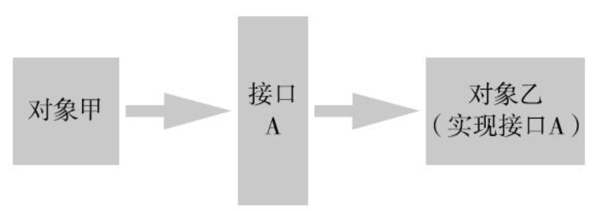
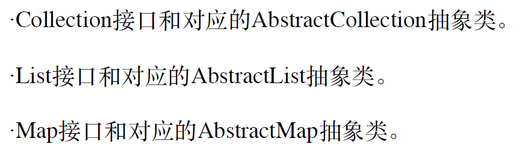
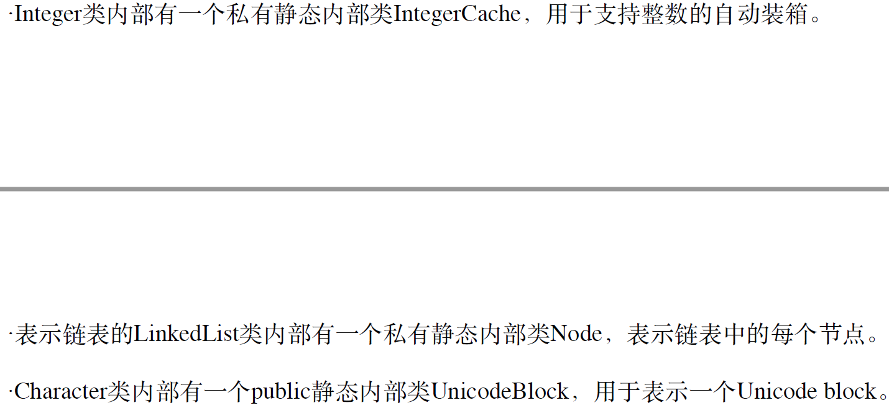
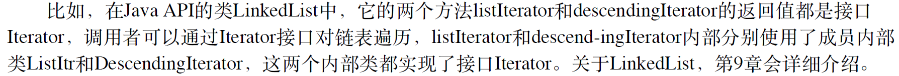

# Java面向对象PART3

# ——类的扩展

前情：Java有8种基本数据类型；其他的数据类型都是通过**类、类之间的组合、类的继承**来实现了引用数据类型，从而表达各种对象。

本章主要讲：接口、抽象类、内部类、枚举（类C语言的enum）

## 1. 接口

之前都将类看作数据类型，然后在该数据类型下还实现了一些操作。但是还存在情况：**并不在乎类型，而在乎是否实现了某些功能**——有某种能力

$\therefore$那些不在乎类型，而在乎能力的（实现某个具体方法）场景，可以用接口

### （1）定义接口

概念定义：**接口就是声明了一组能力（方法），但是自己并没有实现**——只是一个约定/协议

接口涉及两方对象：一方实现该接口，另一方使用该接口，**双方对象不直接依赖，而通过接口间接交互**



eg：USB接口，它规定了USB设备都需要实现的能力，而计算机是通过USB接口来使用这些USB设备的，两者不直接依赖。

Java定义：关键字：**interface**来声明接口，后面紧跟接口名

```java
public interface Mycomparable{
    int compareTo(Object other);	// 参数是Object对象，返回值是-1表<；0表=；1表>
}
```

分析：

1. interface来声明接口（和class对应），前面的**修饰符一般都是public**（如果是private表示其他都不可见，那么该接口并无意义）

   所以格式是：`public interface 接口名{}`

2. 接口里面**声明了一个方法**，但是没有方法体（Java8之前不给实现），接口不需要添加修饰符，**默认就是`public abstract`**

   所以，声明的方法格式为：`(public abstract) 返回值 函数名（参数列表）;`

=> 接口本身的定义并没有实现什么，而是要看实现者和调用者

### （2）实现者、调用者

类去实现接口——表示该对象有该接口所表示的能力

```java
public class Point implements Mycomparable{		// 表示实现接口
    private int x;
    private int y;
    public Point(int x, int y){
        this.x = x;
        this.y = y;
    }
    public double distanceToZero(){
        return Math.sqrt(x*x+y*y);
    }
    public int compareTo(Object other){		// 实现接口中声明的方法
        // 如果类型不匹配，就抛出异常
        if(!(other instanceof Point)) 
            throw new IllegalArgumentException();     
        Point otherPoint = (Point) other;       // 将Object对象强转为Point对象
        double distance = distanceToZero();
        double other_distance = otherPoint.distanceToZero();
        if(distance - other_distance < 0) return -1;
        else if(distance - other_distance == 0) return 0;
        else return 1;
    }
}
```

分析：

1. 类可以实现某个接口，表示该类对象有该接口所要求的能力，实现就需要紧跟类名之后添加`implements 接口名`，**类可以实现多个接口**（表示类对象有多种能力），接口之间通过`,`分隔

   所以格式如下：`public class 类名 implements 接口名1, 接口名2{}`

2. 既然定义了类中实现了某个接口，那么**一定要在类内部实现接口中声明的所有方法**。注意**修饰符（因为接口默认是public abstract，所以实现一定要是public）、返回值、函数名、参数都需要一致**

接口使用：**接口不能直接new一个接口对象**，对象只能通过类来创建（即**接口无法被实例化，但是可以被实现**）。但是**可以声明接口类型的引用变量**，来**引用实现接口类的对象**

如果一个类实现了多个接口，那么它能被多个接口变量引用。

但是该**接口变量只能调用接口方法**（而不是实际类对象有的方法）

```java
Mycomparable a = new Point(2, 3);// 可以引用实现接口功能的对象
Mycomparable b = new Point(4, 5);
a.compareTo(b);			// 通过接口去调用
```

但是，上面的接口调用并不能很好的反映接口的作用。

接口有用的地方：某些方法实现并不知道具体的对象类型，而是统一对Object对象（实现了某些接口功能）进行操作。 如下：

```java
public class CompUtil {
    // 求出数组中的最大值——可以针对任何Mycomparable类型的对象处理
    public static Object max(Mycomparable[] objects){	// 对实现了接口的对象数组操作
        if(objects == null || objects.length == 0) return null;
        Object max_value = objects[0];	// 对于所有元素都统一当对象处理（而无指定实际的类对象）
        for(int i = 1; i < objects.length; i++){
            if(objects[i].compareTo(max_value) > 0)	// 调用接口方法
                max_value = objects[i];
        }
        return max_value;
    }
    public static void main(String[] args){
        Point[] points = new Point[]{
                new Point(1, 2), new Point(2, 3), new Point(3, 4),
                new Point(4, 5), new Point(5, 6)};
        System.out.println(CompUtil.max(points));
    }
}
```

——该类就是针对**接口的编程**——对接口的使用，不关心具体的类型，统一当作Mycomparable对象处理。实现了对**任意Mycomparable接口类型的某个操作**

——**针对接口而非具体的对象类型进行编程，是计算机程序的重要思维**

优点：**代码复用**，不同类型的对象可以使用同一套代码；

​	  	 **降低耦合，提高灵活性**。使用和实现通过接口间接交互。使用者只在乎接口本身，那么实现者可以修改接口实现而不会影响使用者；

### （3）接口细节

一些接口小概念

1. 接口变量

   接口中可以定义变量，默认是`public static final`类型（公开静态常量变量），可以不写明。可以通过类名直接使用：

   ```java
   public interface Test{
       public static final int a = 0;	// 修饰符可以不写，默认就是这个
   }
   ```

2. 接口继承

   **接口可以继承其他接口，并且可以继承多个接口**，格式如下：

   ```java
   public interface interface1 extends interface2, interface3{		// 可继承多个接口
       
   } 
   ```

3. 类继承和接口可以同时存在

   即类可以extends继承一个父类，之后又implements多个接口，格式如下：

   ——需要注意：继承只能有一个，实现可以有多个。且**extends要在implements之前**。格式如下：

   ```java
   public class Son extends Father implements interface1, interface2{
      
   }
   ```

4. 使用instanceof来判断一个对象是否实现了某个接口

   ```java
   Point p = new Point(2, 3);
   if(p instanceof Mycomparable){
       System.out.println("comparable");
   }
   ```
   
   ——继承中，如果类存在继承，那么 **son的实例 instanceof Father = true;** 如果存在接口和对应实现关系，那么 **实现类的实例 instanceof Interface = true**

### （4）接口代替继承

继承的优势：代码复用+利用动态绑定和多态来统一处理多种子类对象

组合：复用代码，但是不能统一处理

接口：能统一处理对象，但是接口本身没有实现代码所以无法代码复用

那么组合+接口就能实现继承的功能。

eg：——不用担心破环封装，Base和Child里面两个函数是独立的两个实现，细节无交叉

```java
public interface AddFun{
    void add(int number);
    void addAll(int[] numbers);
}

public class Base implements AddFun{	// 实现了接口
    
}

public class Child implements AddFun{	// 实现了接口，能够统一处理
    Base base;		// 组合使用Base对象——使用Base方法（代码复用）
    xxx
}
```

### （5）Java8和Java9的接口增强

Java8之前接口中所有方法只能声明不能实现，Java8允许实现：两类方法——**静态方法和默认方法**，两种方法均能在接口中有实现

1. 静态方法：修饰符static就是静态方法（普通方法默认是`public abstract`）

   ```java
   public interface Mycomparable {
       public static void test(){
           System.out.println("static interface function");
       }
   }
   ```

   **可以直接通过`接口名 . 方法名`调用**——这样静态方法和普通方法就能写在同一个接口中，eg：Comparator接口就多了静态方法；而在Java8之前，相关的静态方法往往定义在单独的类中，eg：Collection接口就单独实现了一个类Collections来存放静态方法

2. 默认方法：**显式写明`default`**，因为默认是`public abstract`

   ```java
   public interface Mycomparable {
       default void test2(){
           System.out.println("default function");
       }
   }
   ```

   默认方法自带实现，而实现类对这些方法也可以**重新实现，也可以不改变**。地位和普通方法一样，不能通过接口直接使用。

   目的：函数式数据处理需求，主要是**为了方便给接口增加功能**

   存在一种场景：该接口增加一个方法，那么实现该接口的所有类都需要添加关于该方法的实现——工作量太大；而现在存在默认方法，**接口增加了方法，而类不一定需要去实现**（存在于函数式数据处理中，需要给接口增加新方法）

   Java8中默认方法、静态方法都需要public；但是Java9允许private——主要是为了在接口中给多个静态/默认方法提供代码复用（但是又不希望给外部使用）

=> 总结：接口针对的场景是：关心是否有某个功能，而不是类型；针对接口编程是重要的程序思维，它能够代码复用；减少代码耦合，提高灵活性，分解复杂问题的工具（将复杂问题分解为小问题，而小问题之间的耦合性尽量少，独立性强，那么更有助于解决问题）。

## 2. 抽象类

是类的特殊形式。

就是抽象的类，和具体类相对比得到的。**具体类能够有直接对应的对象，而抽象类没有具体对应的对象**，只是表达抽象的概念——所以抽象类一般是具体类的父类，eg：Shape类：抽象，表达的是图形这一类的概念；Circle类：具体的，表达圆这一对象。

### （1）抽象方法和具体使用

定义：**本身不知道如何实现**（太过于抽象，只知道有这么一个功能，而无实际的对象可供操作），**只有子类才知道如何实现**，eg：Shape类中的perimeter()方法：图形有计算周长的功能，但是需要对应具体的图形；Circle类就能够具体计算了。

抽象方法只有声明没有实现，具体方法有实现

```java
public abstract class AbstractMycomparable {		// 抽象类
    public abstract int compareTo(Object other);		// 抽象方法
}
```

分析：

1. 定义抽象类/抽象方法的关键词是：**abstract**（可以发现，接口的普通方法默认就是public abstract）

2. **定义了抽象方法的类必须被定义为抽象类**；定义了抽象类，内部可以没有抽象方法，且抽象类中可以有具体方法、实例变量（能够被继承使用）等

3. 抽象类和具体类的区别在于：**抽象类不能创建对象**，即不能new一个抽象对象。但是可以创建抽象引用变量，来引用具体类的对象（继承了即可使用）——这点和接口也类似（不能实例化，但是能引用）

4. 一个类在继承抽象类后，**必须要实现所有的抽象方法**（除非自己也声明为抽象类），注意实现时：返回值、函数名、参数列表必须一致——这点和接口也类似（必须要将所有的普通接口全部实现）

   ```java
   public class Point extends AbstractMycomparable{		// 继承抽象类
       private int x;
       private int y;
       public Point(int x, int y){
           this.x = x;
           this.y = y;
       }
       public double distanceToZero(){
           return Math.sqrt(x*x+y*y);
       }
       public int compareTo(Object other){		// 实现抽象方法
           if(!(other instanceof Point)) throw new IllegalArgumentException();     // 如果类型不匹配，就抛出异常
           Point otherPoint = (Point) other;       // 将Object对象强转为Point对象
           double distance = distanceToZero();
           double other_distance = otherPoint.distanceToZero();
           if(distance - other_distance < 0) return -1;
           else if(distance - other_distance == 0) return 0;
           else return 1;
       }
   }
   
   AbstractMycomparable a = new Point(2, 3);		// 抽象类变量引用具体类对象
   AbstractMycomparable b = new Point(4, 5);
   System.out.println(a.compareTo(b));
   ```

### （2）why要用抽象类

为啥定义一个普通的类，而该类中如果不知道如何实现某个方法就直接不写实现体即可，为啥还需要单独拎出来？

$\because$虽然从语法上抽象类不是必须的。但这是Java提供的语法工具。需要**引导使用者正确的使用一些类和方法，减少误用**。

如果将该方法定义为抽象方法，那么*子类在继承的时候就知道必须要实现它*（否则，编译器会报错）；而如果是普通类定义了空方法体，那么从编译角度不会出现，只有在运行时调试才能发现（问题隐蔽，不易发现）

如果使用抽象类，由于不能创建对象，限定使用者只能用实现的子类创建对象，而不会对实现不完整的抽象类创建（编译器会提示错误）；而如果是普通类，那就能直接创建了

=>$\therefore$抽象类和抽象方法，是Java提供的防错机制，防止使用不完整的方法、类

### （3）抽象类和接口

<a name="diff&same"></a>

相同之处在于：

- 内部都可能存在抽象方法（等待子类实现，也可能不存在）；
- 在子类继承or实现时，必须将所有的抽象方法均实现了；
- 均不能创建对象

不同：

- 抽象类**能定义实例变量**（接口和抽象类均能定义静态变量、静态方法、实例方法），本质上还是一个类；
- 一个类能实现多个接口，但是只能继承一个类

抽象类和接口一般是互相配合使用的：**接口声明能力；抽象类提供默认实现，实现部分or全部的能力**。所以一个接口一般对应有一个抽象类：



所以对于具体类来说，既可以实现接口的所有方法——工程量较大，但是当类已经有其他父类继承的话，只能用实现接口的方法；也可以继承抽象类，然后根据需要重写方法——代码可以复用

**抽象类也可以implement接口——可选择全部实现、部分实现、一个都不实现（在抽象类里面甚至不用写明未实现的抽象方法，直接交给子类去实现抽象方法即可）**，子类继承的话，**本质上就是`public class Son extends AbstractFather implements interface1`——必须实现父类未实现的接口；可以选择重写父类实现的方法**

eg：

```java
public abstract class AbstractAdder implements IAdd {		// 抽象类实现了接口，实现了部分功能
    @Override
    public void addAll(int[] numbers) {
        for(int num : numbers){
            add(num);
        }
    }
}


public class Base extends AbstractAdder {// 子类继承抽象类，必须要实现接口的全部功能（父类已经实现的可以不管 or 重写）
    private static final int MAX_NUM = 1000;
    private int[] arr = new int[MAX_NUM];
    private int count;
    @Override
    public void add(int number){
        if(count<MAX_NUM){
            arr[count++] = number;
        }
    }
}
```

所以整个逻辑是：接口定义功能，抽象类提供默认实现，从而方便子类实现接口（本质上还是子类实现某些功能需要）

[关于abstract关键字的辨析——有助于理解接口和抽象类](#1)

## 3. 内部类

之前涉及到的（目前在写的）类都是单独一个源文件的，即单独建一个.java文件，并且文件名和类名一致——一个类就是一个文件——称为**外部类**

一个类还能放在另一个类的内部——称为**内部类**

内部类的使用场景：**一个类只与某个类关系密切，而与其他类关系不大，那么可以定义在该类内部**

eg：LinkedList、HashMap中的`class Node`

=>从而实现**对外的完全隐藏**（将其设置为private），可以有**更好的封装性**，代码实现上也更为简洁。并且内部类可以**直接访问外部类的私有变量**

内部类是Java编译器的概念，**JVM都会将内部类处理成一个单独的类**，生成一个独立的.class文件——所以，一个**内部类最终都可以被替换为一个独立的类**

### （1）静态内部类

和外部类的静态方法、静态变量地位一样，且带有关键字**static**

```java
public class Outer {       // 外部类
    private static int a = 2;
    /*************************/
    static class Inner{			 // 静态内部类，关键字static
        private static int aa = 4;
        private int b = 5;
        public static void inStaticFun(){
            System.out.println("outer_a:" + a);		// 直接访问外部类的静态变量/方法
        }
        public void inFun(){
        }
    }
    /************************/
    public void test(){
        Inner inner = new Inner();		// 直接创建静态内部类的实例，然后访问
    }
}

// 其他类中使用静态内部类
Outer.Inner inner = new Outer.Inner();
```

静态内部类和普通的类没有区别，除了放置的位置在一个类内部以外。

静态内部类，可以有自己的静态变量、静态方法、实例变量、实例方法、构造方法（**普通类有的，全部都有**）

静态内部类和其外部类联系并不是很大。

- 内部类可以**直接访问外部类的静态变量、方法**（即使是private的，这个直接是和普通的类变量被访问做比较的），不需要带上外部类名（当然带上也不会报错），但是**不能直接访问实例变量和方法**（**可以在内部类里面创建外部类对象**，然后进行访问——就是普通的访问方式）

- 在外部类中**直接**通过创建内部类的实例对象，然后被使用，而不是能直接使用静态内部类的实例变量or方法（这个直接是和下面的间接做比较的）；外部类可以使用`内部类名.静态变量/方法名`访问内部类的静态变量or方法（和普通的类一样）

- 在其他地方使用静态内部类（内部类没有设置private），那么需要带上外部类名，即`外部类.静态内部类`

  eg：**`Outer.Inner inner = new Outer.Inner();`**

静态内部类的实现：

（大概是如此的逻辑，可能不是完全一致，我在IDEA中运行发现class文件中内部类还是在外部类里面；但是如果在命令行中运行，就会生成一个单独的class文件）

```java
// Outer.class文件
public class Outer {
	private static int shared = 100;
	public void test(){
		Outer$StaticInner si = new Outer$StaticInner();		// 创建静态内部类对象
		si.innerMethod();
	}
    // 但在我这里看不到这个方法（可能被隐藏了吧）
	static int access$0(){		// 自动生成一个非private静态方法来访问其private静态变量
		return shared;
	}
    ...
    ...（还存在内部类的代码）
}

// Outer$StaticInner.class文件
public class Outer$StaticInner {	// 内部类名被修改了：外部类$内部类，表示和外部类的关系
	public void innerMethod() {
		System.out.println("inner " + Outer.access$0());	// 通过非private方法访问
	}
}
```

分析：

1. 内部类在编译的时候，会被单独当作一个类，单独创建一个类文件，但是类名会变化**`外部类名$内部类名`——从而表明类之间的关系**
2. 虽然说，外部类可以直接通过`new 内部类名()`来创建对象，但是编译之后发现，还是需要`new 外部类$内部类()`——因为分为两个文件了，不过这个步骤是编译器帮助我们完成的
3. 因为静态内部类可以直接使用外部类的静态变量和方法（即使是private的），而编译之后在两个文件中，那么不符合**私有变量不能被外部类访问**条件，那么自动在外部类中生成一个**非private的方法供内部类调用**（对其他类应该是不可见的？？？未求证）

使用场景：与外部类关系密切，但是不依赖于其他类，可以定义为静态内部类

eg：



### （2）成员内部类

在前面的基础上，**少了`static`修饰**。

和静态内部类的区别：

1. 成员内部类可以访问外部类的**静态变量、静态方法、实例变量、实例方法**

   如果外部类变量和方法（和内部类变量和方法）重名的话，需要用到`外部类.this.xxx`指定，否则根据就近原则，选择内部类的方法or变量

2. 成员内部类中，**不能创建静态变量、静态方法**（不是一个完整的类了），但是如果是**final修饰的变量可以允许是static，因为被final修饰的变量被当成是常量**（但是final static修饰的方法还是不被允许的——表示不能被继承）

   => why不能创建静态变量/方法呢？

   *$\because$因为对外来说，成员内部类必须和外部类的实例绑定才能使用，而不能独立于外部类使用。但是静态变量/方法一般是独立使用的，所以成员内部类不适合有静态变量/方法。如果有需要的话，可以在外部类中创建静态变量/方法*

3. 成员内部类被外部类使用时，同静态内部类——直接创建对象即可

4. 成员内部类使用外部类对象时，同静态内部类——直接创建对象即可

5. 成员内部类被其他类使用时：**首先要创建外部类对象，然后利用该实例对象，创建内部类对象**

   ```java
   Outer outer = new Outer();
   Outer.Inner inner = outer.new Inner();	// 引用对象还是Outer.Inner，只不过new的方式变化了
   ```

   => 这点，感觉成员内部类更像是**外部类的一个*实例变量***，只有外部类对象创建后才能存在实例变量的使用

   ​	 静态内部类更像是，*静态变量*角色，不用创建外部类的对象就能直接通过外部类名使用

使用举例：

```java
public class Outer {
    private static int a = 2;
    private int b = 3;
    class Inner{				// 成员内部类
        final static int c = 6;		// 可以允许final修饰的变量是static的——当作常量
        public void inFun(){		// 只能有实例方法/变量
            System.out.println(a);
            System.out.println(b);
            Outer.this.fun();		// 显式调用外部类方法——因为出现重名
        }
        public void fun(){		// 和外部类中的方法重名
            System.out.println("inner fun");
        }
    }
    public void fun(){
    }
    public void test(){
        Inner inner = new Inner();		// 可以直接创建内部类实例对象
        inner.inFun();
    }
}

// 其他类使用内部类
Outer outer = new Outer();
Outer.Inner inner = outer.new Inner();		// 关联创建
```

编译之后：

```java
// Outer.class
public class Outer {			
	private int a = 100;
    private void action() {
    	System.out.println("action");
    }
    public void test() {
        Outer$Inner inner = new Outer$Inner(this);
        inner.innerMethod();
    }
    static int access$0(Outer outer) {// 会创建两个静态方法，给内部类使用外部类的private变量/方法
    	return outer.a;
    }
    static void access$1(Outer outer) {	// 是要带参数的——因为调用的是实例方法（调用静态方法无）
    	outer.action();
    }
}

// Outer$Inner.class
public class Outer$Inner {
    final Outer outer;		// 我的编译结果没有这个
    public Outer$Inner(Outer outer){		// 构造方法会传入一个外部类对象
    	ths.outer = outer;		// 会去创建一个外部类实例，我的编译结果：this.this$0 = var1;
    }
    public void innerMethod() {
        System.out.println("outer a " + Outer.access$0(outer));//传参：this.this$0
        Outer.access$1(outer);
    }
}
```

可以发现：编译之后，**Inner类在构造函数中会去创建一个Outer对象**，然后通过该对象去访问Outer的实例变量、方法

使用场景：内部类和外部类关系密切，内部类需要访问外部类的**实例变量、实例方法**——那么就适合

eg：一些方法的返回值可能是某个接口，为了返回该接口，该类就用成员内部类实现该接口，该内部类可以设置为private，对外完全隐藏。



=> 

```java
// LinkedList的内部类汇总：
private class ListItr implements ListIterator<E>{	//LinkedList里面定义了一个成员内部类
    
}

private class DescendingIterator implements Iterator<E> {		// 成员内部类，且实现接口
    
}

private static class Node<E> {		// 定义了一个私有静态内部类
    
}

static final class LLSpliterator<E> implements Spliterator<E> {	// 静态内部类
    
}
```

### （3）方法内部类

字面意思：在方法中定义了一个类——那么**只能在定义的方法中使用该类**。

- 方法内部类能够直接访问：静态变量、静态方法——不需加任何的参数or附加条件

  **如果它所在的方法是实例方法，那么还能访问外部的实例变量、实例方法**。

  **如果是所在的是静态方法，那么只能访问静态变量、方法**。

- 方法内部类能够定义：实例变量、实例方法

  不能定义：静态变量、静态方法

- 方法内部类中，还能直接访问：方法中的局部变量 和 方法参数（这些变量**不用显式定义为final**，书中是这样的，但是实践之后并不需要，实际上**编译器会将方法内部类用到的局部变量or方法参数设置为final**）


使用如下：

```java
public class Outer {
    private static int a = 1;
    private int b = 2;
    private static void staticFun(){
        System.out.println("static fun");
    }
    public void fun(int param){
        final String str = "hello";	// 显式定义为final，就被处理成常量，会直接替换变量名
        /************方法内部类的定义**************/
        class Inner{
            int c = 3;			// 只能定义实例变量or方法
            void test(){
                staticFun();
                System.out.println(param);		// 可以使用方法的变量or参数
                System.out.println(str);
            }
        }
        /***************************************/
        /************方法内部类的使用*************/
        Inner inner = new Inner();		// 方法内部类只能在方法内部使用
        inner.test();
    }
}
```

编译器编译之后的结果：

```java
// Outer.class
public class Outer {
    private static int a = 1;
    private int b = 2;
    public Outer() {		// 添加默认的构造方法
    }
	private static void staticFun(){
        System.out.println("static fun");
    }
    public void fun(final int var1) {		// 由于fun的参数被方法内部类使用，所以设置为final
        class Inner {
            int c = 3;
            Inner() {
            }
            void test() {
                System.out.println(var1);
                System.out.println("hello");	// 直接替换
            }
        }
        Inner var3 = new Inner();
        var3.test();
    }
}

// 方法内部类——单独生成一个文件
class Outer$1Inner {
    int c;
    // 不再是一个默认构造函数，而是传了一个Outer对象、方法内部的参数和局部变量=>用到才传，不用到默认不传
    Outer$1Inner(Outer var1, int var2, String var3) {
        this.this$0 = var1;
        this.val$param = var2;	// 是val$参数名
        this.val$str = var3;
        this.c = 3;
    }

    void test() {
        Outer.access$000();		// Outer应该生成了一个public方法给Inner去调用私有的变量or方法
        System.out.println(this.val$param);
        System.out.println("hello");
    }
}
```

可以发现：

- 和成员内部类一样，都是在Inner类中去实例化一个Outer对象，然后通过使用该对象来访问Outer的实例方法、变量；

- 而方法内部的局部变量和参数，都是在构造函数中传参的（用到才传，不用到就不用传），并且会将**该变量设置为final**；

- 如果显式定义了final的变量（不论是方法内部，还是成员变量or静态变量）会被当成常量，在编译的时候就会直接给实际值（而不是变量名）

- why方法中的变量和参数使用时，会被定义为final

  可以发现，在Inner构造方法中，会对其进行传参，所以实际上**Inner使用的是自己的局部变量**，而不是外部参数——只是值传递（浅拷贝），将其定义为final表示不可修改（实际上修改也没有用）——类似于C的函数参数传递

  =>而由于是值传递，所以在**方法内部类对这些变量or参数修改不影响其原本的值**——如果要修改就要传递引用类型变量，不修改地址，就修改里面的值

——实际上，方法内部类可以用成员内部类实现，然后方法中实例化该成员内部类对象，如果需要使用方法参数/局部变量等可以通过值传递

——但是方法内部类限定了本方法使用，有更好的封装性能。

### （4）匿名内部类

比前面的类定义更为简单，匿名内部类：没有单独的类定义，在**创建对象的同时定义类**。

格式如下：

```java
new 父类(参数列表){	
    // 实现部分
}

new 父接口(参数列表){
    // 实现部分
}
```

分析：

1. 匿名内部类定义（创建），都是**new**开头，表示创建对象
2. new后面紧跟父类/接口，并且对其进行传参到构造方法（匿名内部类本身不含构造方法，都是调用父类的构造方法）
3. 匿名内部类只能**被使用一次**，用来创建一个对象，没有名字、没有构造方法（但是可以调用父类的构造方法）。可以定义实例变量、方法，可以有初始化代码块（起到构造方法的作用，但是只能有一个，而构造函数可以有多个）
4. 匿名内部类可以：访问外部类的所有变量、方法，也可以访问方法的局部变量、参数

=> 所以**匿名内部类实际上是继承/实现某个类/接口**，在这个里面重写了方法（如果可以直接使用该父类，那么不需要构建类了，直接声明即可）

举例：

```java
// 抽象类
abstract class Son{
    int x, y;
    public Son(int x, int y){		// 构造方法
        this.x = x;
        this.y = y;
    }
    public abstract void eat();
}

public class Outer {
    public void test(int x2, int y2) {
        System.out.println("test");
        Son son = new Son(x2, y2) {			// 调用抽象类，实现了抽象方法
            @Override
            public void eat() {		// 重写方法
                System.out.println(this.x + ", "+ this.y);
                System.out.println("no name eating");
            }
        };
        son.eat();		// 创建对象后调用对象的实例方法
    }
}
```

编译之后：（外部类被忽略了）

```java
class Outer$1 extends Son {		
    Outer$1(Outer var1, int var2, int var3) {		// 用到的方法中的局部变量、参数
        super(var2, var3);
        this.this$0 = var1;
    }
    public void eat() {
        System.out.println(this.x + ", " + this.y);
        System.out.println("no name eating");
    }
}
```

分析：

1. 匿名内部类也会生成一个独立的class类文件，由于没有名字，所以就是`外部类名$数字编号`，eg：`Outer$1`
2. 会有一个构造方法：里面包含外部类对象（用来调用外部类的方法、变量），传递用到的参数（所有方法的局部变量or参数）
3. 匿名内部类能做的，方法内部类都能做，只不过如果对象只创建一次，并且不需要构造函数来传参（这边传参传给的是父类），可以使用匿名内部类

用处：调用方法时，需要一个接口参数，此时可以使用一个匿名内部类，来实现一个自定义的方法

eg：方法中传递接口参数——实现接口的方法

```java
String[] strs = new String[]{"i", "Hello", "I"};
// sort方法的传参：可以接受一个数组、一个comparator接口参数
// public static <T> void sort(T[] a, Comparator<? super T> c) 
Arrays.sort(strs, new Comparator<String>(){	// comparator接口，
	@Override
	public int compare(String o1, String o2) { // 有一个方法compare用来比较两个对象，自定义实现
		return o1.compareToIgnoreCase(o2);
    }
});
```

——compare是回调函数

eg：还能用于事件处理程序中，用来响应某个事件：

```java
Button bt = new Button();
// 该button的实例方法：addActionListener需要的传参是一个接口ActionListener，而我们需要去实现里面的方法
bt.addActionListener(new ActionListener(){
	@Override
	public void actionPerformed(ActionEvent e) {
    	System.out.println("implements");
    }
});
```

——actionPerformed是回调函数

=>**将程序分为保持不变的框架，和针对具体情况可变的逻辑，通过回调函数（通过实现接口功能）来协作，是计算机程序的常见操作**——匿名内部类就是实现回调接口的一种简便方式

## 4. 枚举

概念类似于C的枚举数据类型，还是有些不同。

枚举：顾名思义，它的取值有限，可以全部列出来（类可以实现枚举效果，但是单独一个枚举类型更为直观、安全、简洁）

#### （1）基础

定义：

关键字：**enum**

```java
public enum Size {				// 将类的class修改为enum，代表枚举类型
    SMALL, MEDIUM, LARGE// 枚举的值一般都是大写字母（代表常量），值之间通过','分隔，如果只有这些可以无分号
}
```

——枚举类型可以单独建一个文件，也可以实现在其他类内部（注意是类内部，而不能在class外面定义）

使用：

```java
Size size = Size.LARGE;		// 声明一个Size类型的变量size，右边类似于类的类变量使用方法

size.toString();	//>> LARGE toString()返回的是字面值，String类型
size.name();		//>> LARGE name()返回的也是字面值，String类型
size.toString() == size.name();		//>> true

size == Size.LARGE;			// 枚举变量可以通过==/equals比较
size.equals(Size.LARGE);

size.ordinal();		//>> 2 枚举值，返回的是int类型（表明声明时的顺序），从0开始计算
size.compareTo(Size.MEDIUM);		//>> 1 可以和其他值进行比较，返回值是-1/0/1

Size.valueOf("LARGE");		//>> LARGE 根据输入的字符串，得出对应的枚举值，如果不存在会报错

for(Size size1: Size.values()){		// values()返回的是枚举类型的数组——包含所有的枚举值
	System.out.println(size1);		//>>SMALL MEDIUM LARGE
}
```

所以枚举可以使用的函数有：

| 函数名         | 返回值       | 作用                                                         |
| -------------- | ------------ | ------------------------------------------------------------ |
| toString()     | String       | 枚举值的字面值                                               |
| name()         | String       | 枚举值的字面值                                               |
| equal(xxx)     | boolean      | 枚举值之间比较                                               |
| ordinal()      | int          | 枚举值声明顺序值（从0开始计算）                              |
| compareTo(xxx) | int(-1/0/1)  | 和其他枚举值比较大小，比较ordinal()值大小                    |
| valueOf(xxx)   | 枚举类型     | 根据输入的String类型，返回对应的枚举类型<br />（不存在会报错）=> 静态方法 |
| values()       | 枚举类型数组 | 返回的是枚举类型的所有枚举值                                 |

枚举变量可以和其他变量一样用在任何位置：方法参数、类变量、实例变量等。还能用于`switch`语句中

eg：

```java
switch(size){
    case SMALL: break;	// 注意这边不能带类型前缀，直接是枚举值本身
    case MEDIUM: break;
    case LARGE: break;
}
```

Java5之前是不支持枚举的，那么就定义一个类，然后设置静态整型变量来代表枚举类型，类似于`public static final int SMALL = 0;`

=> 但是枚举类型：

- 更为简洁：只需要写有哪些枚举值，而不需要定义`public static final`这样
- 更为安全：一个枚举变量**只会有null和枚举值**，而不可能有其他值，但是如果用整型变量，值就无法控制
- 且自带很多的方法

枚举类型实际上会被转换为一个类，继承了`java.lang.Enum`类：

```java
private final String name;		// name实例变量——string
public final String name() {	// name/toString两个方法一样
	return name;
}
public String toString() {
	return name;
}
private final int ordinal;		// ordinal实例变量——int
public final int ordinal() {
	return ordinal;
}
// 构造方法是protected类型：同包和子类可见
protected Enum(String name, int ordinal) {	// 构造方法：需要传递name和ordinal两个实例变量
	this.name = name;
	this.ordinal = ordinal;
}

public final boolean equals(Object other) {		// 比较两个枚举对象是否一样
	return this==other;
}
public final int compareTo(E o) {		// 比较枚举值大小
	Enum<?> other = (Enum<?>)o;
	Enum<E> self = this;
	if (self.getClass() != other.getClass() && // optimization
		self.getDeclaringClass() != other.getDeclaringClass())
		throw new ClassCastException();
	return self.ordinal - other.ordinal;
}
public static <T extends Enum<T>> T valueOf(Class<T> enumType,
                                                String name) {
	T result = enumType.enumConstantDirectory().get(name);
	if (result != null)
        return result;
	if (name == null)
		throw new NullPointerException("Name is null");
    throw new IllegalArgumentException(
            "No enum constant " + enumType.getCanonicalName() + "." + name);
}
```

以上的枚举类型转换成普通类的结果（表示一个大致意思）

```java
public final class Size extends Enum<Size> {		// 继承类Enum
	public static final Size SMALL = new Size("SMALL",0);	// 定义静态对象
	public static final Size MEDIUM = new Size("MEDIUM",1);
	public static final Size LARGE = new Size("LARGE",2);
	private static Size[] VALUES = new Size[]{SMALL,MEDIUM,LARGE};	// 保存所有对象
    private Size(String name, int ordinal){		// 私有构造方法——给上面的使用（本质上调用父类的构造函数）
    	super(name, ordinal);
    }
    public static Size[] values(){		// values函数，——返回一个新数组，存放size的所有数
        Size[] values = new Size[VALUES.length];
        System.arraycopy(VALUES, 0, values, 0, VALUES.length);
        return values;
    }
    public static Size valueOf(String name){
    	return Enum.valueOf(Size.class, name);	// 去调用父类的方法，还要传类的类型信息
    }
}
```

分析：

1. Size是final类，表示该类不能被继承。Enum<Size>是父类，<Size>表示泛型
2. 存在一个私有的构造方法，不公开，只是内部的静态变量使用，用来创建枚举类对象。且该**静态变量是final类型**，不能被修改
3. `values()`方法，是编译器添加的；且有一个数组`VALUES[]`，维护所有的枚举值——values()就是拷贝该数组内容
4. `valueOf()`方法，本质上是去调用父类的方法，注意还需要传递`Size.class`，表示类的类型信息
5. 一般在使用中，枚举变量会被转换成对应的**类变量值**，而在switch中，枚举值会被转换成`ordinal`值（int类型）

=>所以，枚举本质上还是类，只不过编译器附带做了很多工作（所以说，Java的基本数据单位就是类）

#### （2）应用场景

枚举类型中，还会带有关联的实例变量、方法等

```java
public enum Size {		// 枚举
    SMALL("s", "xiaohao"), MEDIUM("M","zhonghao"), LARGE("L", "dahao");
    private String abbr;		// 定义了两个实例变量
    private String chinese;
    private Size(String abbr, String chinese){		// 定义私有的构造方法——给上面的对象用
        this.abbr = abbr;
        this.chinese = chinese;
    }
    
    public String getAbbr() { return abbr;}
	public String getChinese() { return chinese;}
    
    public static Size fromAbbr(String abbr){
        for(Size size: Size.values()){
            if(size.getAbbr().equals(abbr))
                return size;
        }
        return null;
    }
}

```

分析：

1. 注意：枚举值需要**放在最上面定义，且之间用`,`间隔，最后用`;`和其他分隔**

2. 发现，枚举的构造方法内**不能初始化静态变量**，**只能初始化实例变量**（普通类可以初始化静态变量）

   （因为，枚举值是在类加载初始化阶段最早被调用的——因为静态类型变量是按照文本顺序初始化的，而枚举类型位于类的最前面，那么会去调用构造方法。此时在枚举值下面的静态变量还未初始化，所以不能在构造方法中使用）

3. 可以定义实例变量、方法，类变量（不能在构造方法中）、方法

转换成普通类定义如下：

```java
public final class Size extends Enum<Size> {
    public static final Size SMALL = new Size("SMALL",0, "S", "小号");
    public static final Size MEDIUM = new Size("MEDIUM",1,"M","中号");
    public static final Size LARGE = new Size("LARGE",2,"L","大号");
    private String abbr;
    private String title;
    // 构造方法变化
    private Size(String name, int ordinal, String abbr, String title){
        super(name, ordinal);	// 调用父类构造方法
        this.abbr = abbr;		// 子类特有的方法
        this.title = title;
    }
// other
}
```

ps：枚举值通常会关联一个标识符`id`，唯一表示一个枚举值，一般用int表示。不推荐用默认的ordinal的值——因为其编号是按照定义的顺序来的，那么如果要在枚举中增加一个枚举值，所有的值都有可能发生变化。所以要保证**id和枚举值保持不变**，那么就是增加一个实例变量`id`，然后构造函数定义，创建的时候传参即可	


# ps：本章额外知识

## 1. Abstract关键字注意

<a name="1"></a>

分析发现：abstract和private、static、final是不能同时存在的

abstract只能和public、protected一起使用

1. abstract和private

   private是私有的，即只能在类内部使用。而被abstract修饰的方法是需要子类去实现的——所以，修饰为private是无意义的。private类不能被外部；而private不会去修饰类（一个类不能被外部使用，那定义该类还有什么意义呢）

2. abstract和static

   static下的静态方法，静态方法意味着可以直接通过`类名.方法名`使用，而abstract修饰的方法是没有方法体，等待子类去实现的，那么直接调用也没有意义（是个空方法）

3. abstract和final

   final表达的是，该方法不能被重写or继承，而abstract方法就是要被继承和重写才存在实际意义的，所以不符合

4. abstract和public、protected

   后两个都是可见范围修饰符，和abstract没有逻辑上的冲突，所以可以使用

抽象类和接口的区别：

1. 关键字不同，抽象类本质上还是类，所以是`public abstract class XXX`; 接口是`public interface XXX`
2. 一个类只能继承一个抽象类（准确说是只能继承一个类），但是能实现多个接口
3. **抽象类可以有构造方法**（用来继承时调用，因为存在实例变量），但是接口中不能有
4. **抽象类中的抽象方法的访问类型可以是：public、protected**；而接口的抽象方法只能是：public abstract
5. 抽象类中的静态变量的访问类型可以随意，但是接口中的变量只能是`public static final`（默认即这样）
6. 抽象类中可以有实例变量，而接口中的变量只能是静态变量

但是都能有：静态变量、静态方法、实例方法（接口中的实例方法是要用关键字`default`修饰的，可以在子类中重写也可以不）

## 2. 嵌套接口

类似于内部类的，现在将定义再确认一下：

规定：

- 接口可以嵌套在类/其他接口中，即类中含有一个接口（内部接口），接口中再包含一个接口

- 类中嵌套接口时，嵌套接口可以是常规的4种访问形式

  ——被定义为private的嵌套接口只能在所在的类被实现，可以被实现为public的类也可以被实现为private的类

- 接口中嵌套接口时，**该嵌套接口必须是public的类型**（与接口都是public类型决定的）

  ——在实现外部接口时，不必实现该嵌套接口（可以单独创建一个类去实现该嵌套接口，形如：`class TestClass implements Test.innerInterface`）

  ——能够提供给外部接口的实现类创建内部类使用

  

  

why使用嵌套接口：

- 嵌套接口只会在该接口中使用
- 有利于封装
- 有更好的可读性和维护性

在 Java 类库中一个典型的嵌套接口的例子是 `java.util.Map` 以及 `Java.util.Map.Entry`——就是我学习嵌套接口的来源。

**嵌套接口默认强制是** `static`——所以嵌套接口都是静态嵌套接口

why 强制是static类型的？

static 关键字用于方法、域与作用于接口和类有着不同的含义。**当 static 作用于内部类时，用于强调内部类的实现细节相对于外部类独立**，比如说想要创建嵌套类对象并不需要外部类的对象。

**而嵌套接口也是类似，接口本身就是抽象的集合，不会依赖于外部接口也不与特定类相关，所以只要类实现了该接口的方法，那么就是实现了接口**，所以为了表达这个思想，就默认嵌套接口为static类型

所以，**可以认为嵌套接口和外部接口区别并不大，嵌套接口主要提供了一层内外的逻辑关系**：内作为外的一个功能组成，且并不希望直接暴露给外部。但是这种封装是不彻底的，因为嵌套接口默认且只能使用 public 修饰。

参考内容

https://cloud.tencent.com/developer/article/1585264

## 3. 抽象类和接口（美团面试）

主要回答的切入点：

1. 抽象类和接口的概念，里面的内容
2. 两者的相同点
3. 两者的不同点，还可以补充设计思想的区别：抽象类和实现类之间是存在父子关系的，而接口和实现类可以没有关系，能表示有该接口的功能
4. 两者的相互配合：eg：AbstractList和List等

回答：

1. 接口是公开的，不能有私有的方法或变量，接口中的所有方法都没有方法体，通过关键字interface实现。

   抽象类是可以有私有方法或私有变量的，通过把类或者类中的方法声明为abstract来表示一个类是抽象类，被声明为抽象的方法不能包含方法体。抽象类的子类为父类中所有抽象方法的具体实现，否则也是抽象类。

   接口可以被看作是抽象类的变体，接口中所有的方法都是抽象的，可以通过接口来间接的实现多重继承。接口中的成员变量都是static final类型，由于抽象类可以包含部分方法的实现，所以，在一些场合下抽象类比接口更有优势。

**不同点**

（1）从内容来说：接口只有方法体、1.8之后可以有静态方法、default方法、1.9之后可以有private的实例方法，而抽象类可以有定义与实现，方法可在抽象类中实现。

（2）从使用上来说：实现接口的关键字为implements，继承抽象类的关键字为extends。一个类可以实现多个接口，但一个类只能继承一个抽象类。所以，使用接口可以间接地实现多重继承。

（3）从设计思想上：接口强调特定功能的实现，而抽象类强调所属关系。

（4）从修饰符上：接口成员变量默认为public static final，必须赋初值，不能被修改；其所有的成员方法都是public、abstract的。抽象类中成员变量默认default，可在子类中被重新定义，也可被重新赋值；抽象方法被abstract修饰，不能被private、static等修饰。

（5）接口被用于常用的功能，便于日后维护和添加删除，而抽象类更倾向于充当公共类的角色，不适用于日后重新对立面的代码修改。功能需要累积时用抽象类，不需要累积时用接口

[参考](#diff&same)

why需要有抽象类？ 接口的优点的基础上 + 防止使用不完整的类（抽象类对于父类未实现的方法必须要求实现）