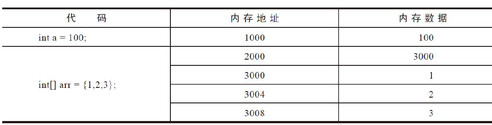
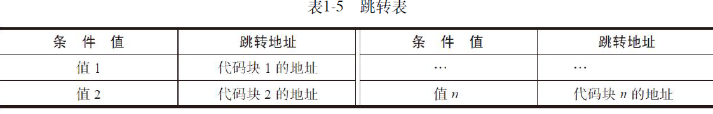
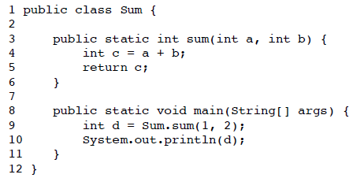
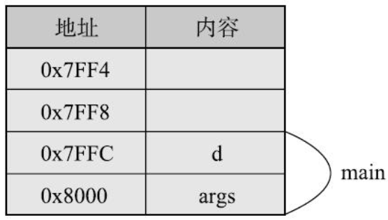
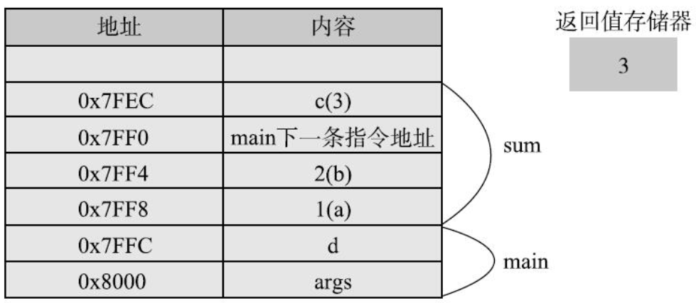
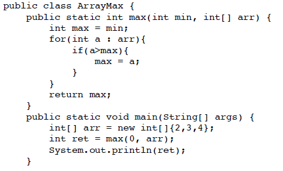
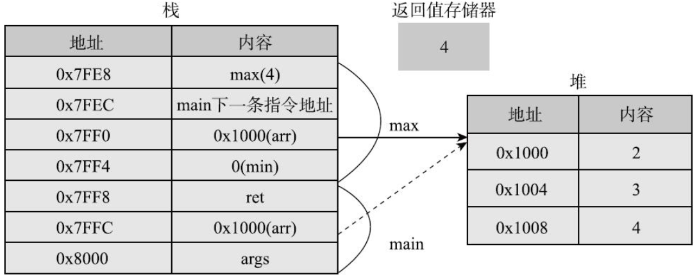

# JAVA基础知识

主要是对数据类型

## （一）数据类型

数据类型：主要用于对数据进行**归类**

变量名：数据放到内存中的某个位置，为了方便找到和操作数据，**对这个位置起个名字**，那么Java能够通过该名字来找到该变量的位置，并对其进行操作。

### 1. 基本数据类型（8种、4类）

java数据类型：

最大8字节，最小1字节

| 数据类型 | 种类                                                    | 默认值 |
| -------- | ------------------------------------------------------- | ------ |
| 整型     | byte（1字节）/short（2字节）/int（4字节）/long（8字节） | 0      |
| 浮点型   | float（4字节）/double（8字节，表示范围、精度更高）      | 0.0    |
| 字符型   | char（**单个字符**，2字节）                             | ‘\0'   |
| 布尔型   | boolean（Java规范中没有明确规定）                       | false  |

（在给long型赋值时，需要**额外加L/l**，即 `long a = 233333333333333L`）

（在给float型赋值是，需要**额外加F/f**，即 `float b = 333.33F`，**因为java中默认小数类型为double**。并且，如果左边定义是float，而右边又没有显式注明是float类型，即仅一个数字，那么**会报错**，由高到低无法强转，eg：float f = 0.1;❌）

（整数也可以直接赋值给float/double）

（字符型是只能存放一个字符的，**可以是中文字符/英文字符**，赋值时用**单引号**，eg：char c = '大';）

对于常量数字：可以用最常见的**十进制表示**，也可以**用十六进制表示（在前面加0x/0X即可）**，eg: 0x16 =22；可以**用二进制表示（在前面加0b/0B）**（Java7开始允许）

（Java规范中没有明确boolean的大小，但是JVM规范指出boolean当做int处理，boolean数组当做byte数组处理，此时boolean长度为1字节，总结，boolean的长度取决于虚拟机）

（char本质上是一个固定占用两个字节的无符号正整数，这个正整数**对应于Unicode编号**。char只能表示Unicode编号**在65536以内的字符**，而不能表示超出范围的字符，char有多种赋值方式：

```java
char c = 'A'			// 赋值字符常量
char c = '马'			// 赋值中文字符
char c = 39532			// 对应的Unicode编号值赋给变量
char c = 0x9a6c			// 16进制的unicode编号值
char c = '\u9a6c'		// 按Unicode字符形式
```

）

### 2. 对象类型

**java除了以上的基本数据以外，其他都是对象类型**，这是由于java的面向对象特性决定的。（有一点点类型于c的结构体）

*eg：学生的信息*

- *姓名：char的数组*
- *学号：int的数组*
- *年龄：整型*
- *性别：char*
- *分数：浮点型/整型*

#### （1）数组类型

有**3种定义数组**的方式，如下：

需要注意的是：java的`[]`紧跟基础数据类型之后的，eg：**`int[]`**；创建数组需要`new`，eg：`new int[]` ,数组的表示用`{}`括上。

```java
int[] arr1 = {1, 2, 3};				// 定义时赋值，数组用{}限定
int[] arr2 = new int[]{1, 2, 3, 4};		// 定义时赋值，并且右侧用new创建新的数组
int[] arr = new int[5];				// 仅定义，定义之后默认值为0/0.0/0.0f/false/'\0'，之后需要逐个赋值
```

**数组不能一边给定长度一边赋值**，即使赋值数目和长度一样

eg： `int[] arr = new int[5]{1,2,3,4,5}`❌

**数组长度可以动态确定，但是确定后就不能改变**

**数组属性**：

```java
int len = arr.length;			// 注意后面没有括号!!!
```

**数组内存的形式**：

基本数据变量，内存只分配一个内存空间

数据类型，内存分配两个内存空间，一个**存放 数据存放的空间的首地址**，数据存放的空间是连续的一个内存块

eg：



=> 目的：**为了数组之间可以直接赋值**

eg：`arr1 = arr2`，**实际上就是arr2的内存地址赋值给了arr1**，eg：arr2指向的地址为2000，2000存放的数据是3000，而3000起始的地址就是存放实际的内存数据；经过赋值操作之后，arr1指向的地址变为2000——**实际上，数组内部没有变化**

## （二）基本运算

### 1. 算数运算

和C语言一致，+、-、*、/、%、++、--（加减乘除取模自加自减）

需要注意的是：取模运算（%），主要适用于 **整数、字符类型**（小数就不行）。其他运算对于所有数值类型和字符类型均适合。

实际上，%对于浮点数也是可以用的，只不过结果也是浮点数：10.0 % 7 = 3.0

-还能放在变量前面，表示 **改变变量值的符号**。eg：-a

**一些注意事项**

1. 注意表示范围

   eg：两个大数的乘法，很有可能上溢出

   ```java
   int a = 2147483647 * 2; // 会溢出的，2^32-1
   long a = 2147483647 * 2;	// 先按照int计算，溢出后再赋值
   long a = 2147483647 * 2L;		// 将其中一个数表示为long，那么在运算时，会强制类型转换为long和long的乘法
   ```

   两个整数的除法，默认是舍去小数部分的，除非将其中一个数强制类型转换为float/double类型

   ```java
   double a = 10 / 4; 	// a=2.0，是double类型的
   double a = 10 / (double)4;		// a = 2.5
   ```

2.  %的盲区

   %有在不同的语言中，含义不同，有表示取模的（python）、取余的（c/c++/java）

   取模和取余的不同之处，对于负整数进行运算的不同（正整数结果都一样）

   - **取余运算：跟被除数符号一样**，eg: -7 %3 = -1; 7%-3 = 1; **-7%-3 = -1**;
   - 取模运算：跟除数符号一样

   并且，%是支持浮点型的

   int float double之间可以相互取余，int和int取余得到int，**包含double的取余结果是double**，单精度浮点和整型取余时结果是单精度浮点（float）；

### 2. 比较运算

和C语言的一致。

注意的是，对于普通变量来说，`==`是比较两个的值是否一样；即`a = 2; b = 2; a==b`的答案就是1。而**数组如果进行`==`比较，那么就是判断两个数组名是不是指向同一个数组，而不是判断两个数组的内容是否一样。**

```java
int[] arr4 = new int[]{1,2,3,4};		// arr4指向的是一个地址
int[] arr5 = new int[]{1,2,3,4};		// arr5指向的是另一个地址
System.out.println(arr4 == arr5);		// false，由于指向的地址不同
arr5 = arr4;			// 数组赋值
System.out.println(arr4 == arr5);		// true，由于指向的是同一个地址
```

如果实在需要比较数组中的元素是否一致，需要逐个比较

注意 `==`和 equals的区分，见[JAVA面试真题整理](#3)

### 3. 逻辑运算

&、|、!、**^**（与、或、非、异或）

&&、||（短路与、短路或）

短路与、短路或和与、或的区别在于：当&&/||前面的部分已经能够判断出结果，那么后面的部分就不计算了；但是，&/|都会计算后面的结果

eg:

```java
boolean a = true;
int b = 0;
boolean flag = a || b++>0;		// flag得到结果为true，而b++不会运算，则b=0
boolean flag = a | b++>0;		// flag得到的结果为true，而b++会运算，则b=1
```

## （三）条件执行

### 1. 基础知识

if...else... ,和C语言一致

1. 需要注意的是如果关键字后面没有括号，只会执行紧跟关键字后面的一句指令，而后面的指令默认是条件外的指令，什么情况下均会执行.

   建议所有if后面都有大括号

2. if/else if.../else, else if是**前面的条件不满足之后的继续进行判断**

   ```java
   if(score > 60){			
   	return "及格";
   }else if(score > 80){		// else if前提是< 60,所以这个写法是错误的
       return "良好";
   }else{
   	return "优秀";
   }							// 将优秀\良好\及格判断顺序对换就可以了
   ```

switch 和C语言一致,使用的前提,是当if...else的判断很多时,可以使用switch来优化代码

表达式的值和case的value进行匹配, 然后选择哪个case中的代码块执行

```java
switch(表达式){
	case value1: codeblock1;break;	// 后面可以紧跟一组代码块，并且可以不加大括号
	case value2: codeblock2;break;
	...
	case valuen: codeblockn;break;
	default: codeblock;
}
```

**表达式的值可以是: byte/short/int/char/String/enum**

（byte/short/int/char/enum本质上就是整数，**String也会被转换为整数**（通过hashCode的方法转换为整数，那么可能存在哈希碰撞，即不同的string但是有一样的hashcode，所以跳转之后会根据string的内容再次进行比较判断，即**使用hashCode来选择，通过equals来进行验证**），但是不能支持long，因为跳转表的存储空间为32位，容不下long）

且value1~valuen不要求是排序的，编辑器会自动排序。

### 2. 实现原理

if...else会转换成跳转指令，有条件跳转 + 无条件跳转

switch看具体系统实现：如果分支比较少，那么就和if...else一样，转换为跳转指令。如果分支较多，**使用跳转指令会进行很多次比较运算**，效率较低，使用**跳转表**



有点类似于python字典的每一条数据：条件值——key，跳转地址就是——value

并且**该跳转表是有序的，按照条件值进行排序**，那么可以使用二分查找。如果值是连续的，还会进行特殊的优化——**变成一个数组**，O(1)的时间复杂度就可以找到。（如果不是连续的，但是比较密集，差的不多，那么也会优化为数组型的跳转表）

## （四）循环

有四种：while、do/while、for、foreach，前面三个和C语言一致，foreach是java区别于C有的

**foreach不是关键字——即不存在foreach该指令**，而是对for用特殊的格式，从而称呼为foreach

格式： for( : )，冒号前面是循环中的每一个元素，**需要指定该元素的类型，和名称**；冒号后面是需要遍历的数组或者集合——适用场景：**遍历**数组/集合的情况——foreach的语法更为简洁

```java
int[] arr = {1, 2, 3, 4};
for(int element: arr){
	codeblock
}
```

## （五）函数

### 1. 基础知识

整体来说，和C没有啥差别

函数可以减少重复的代码和分解复杂操作。eg：将一个二分排序写成单独的函数，每次要排序只需要调用即可，而不需要自己重复写，同时也将排序问题简化为调用的问题，去处理其他的问题。

函数格式：需要注意的是，**修饰符**（C也有修饰符，但学的时候没注意，所以掌握不好，且Java和C有不同地方）

```java
修饰符 返回值类型 函数名字(参数类型 参数名字, ...){
    代码段;
    return 返回值;
}
eg:
public static int main(String[] args){			// public static 均是函数修饰符
    ....
    return 0;
}
```

函数定义：不会执行代码；函数定义时声明的参数，类似于定义变量

函数调用：函数会被执行；函数调用时传递的参数，类似于给变量赋值

**Java中函数需要放在一个类中**（和C的差别所在），类中可以有多个函数——一般称为方法

如果该类中有一个`main`方法，那么在运行程序时，**编译器会寻找含有main函数的类，然后从该main函数开始运行**

函数可以调用同一个类中的其他函数（方法），也可以调用其他类中的函数（方法）

——注意，java的方法中**只有值传递**

### 2. 注意的点

1. 数组传参（和C一致）

   基本类型的传参是值传递，修改不改变原值；传递数组是传递的数组的存储位置，修改是影响数组实际内容的。

2. **可变长度的参数**（和C不一样的）

   就是传参的个数不定

   语法：**在数据类型后面加三个点...**，再跟上变量名（注意，还是需要有数据类型的）

   限制：**可变长度的参数最多只能有一个，且必须位于参数列表的最后**

   可变长度的参数可以看成是**数组**。

   ```java
   // 本函数主要实现了求最大值的
   public static int max(int a, int ... b){	// 数据类型 ... name，只能有一个可变参数，且要放在参数列表的最后
       int max = a;
       for(int i = 0; i < b.length; i++){		// 可变参数可以看成一个数组（不定长的数组），有数组的特性——arr.length——求数组的长度
           if(max < b[i]) max = a[i];
       }
       return max;
   }
   ```

   实际上，Java处理时就是将该可变长参数转换为数组参数，即如果max(0, 1, 2, 3, 4) => max(0, new int[]{1, 2. 3, 4})

3. 返回值个数

   返回值最多只能有一个（可以没有，即return;（在函数返回值类型为void的时候））

   如果需要多个返回值，可以用一个数组进行返回

   如果需要返回多个类型的值，可以定义一个对象，然后返回该对象

4. 函数的重名（和C有些区别）

   不同的类（即不同的文件之间），函数名可以重复

   相同的类，函数名可以重复，但是**参数不能完全一样**——要么参数个数不同，要么参数个数相同但是至少一个参数数据类型不同

   ——称为函数重载，主要用于实现的意义一样，但是使用的场景/方向不同

   eg：

   ```java
   public static double max(double a, double b);
   public static float max(float a, float b);
   public static int max(int a, int b);
   public static long max(long a, long b);
   ```

5. 调用匹配（C不知有没有）

   就是在调用函数时，如果需要传参，**需要对传递的参数和声明的函数类型进行匹配，但是不要求完全一样**，可以进行自动类型转换，并寻找最匹配的函数——只要可以进行类型转换，就能进行匹配调用（除非无法转换）

   eg：

   ```java
   System.out.println(max('a', 'b'));		// 会将两个字符转换成int类型，所以去调用上面的第3个函数
   ```

### 3. 函数调用的基本原理

计算机系统一般使用**栈**来存放函数调用过程中用到的数据：参数、返回地址、函数内定义的局部变量

（栈先进后出，一般都从内存的高位向低位扩展）

eg：



在还没有调用sum函数之前，只有两个参数需要存放，如下图：



调用该函数之后：需要**将调用的参数入栈，将返回地址入栈**（就是sum函数执行完毕，返回main函数的地址需要保存），然后跳转到sum函数，需要保存一个局部变量c。**返回值是专门保存到了返回值存储器中**。该函数调用完毕后，纷纷出栈，然后返回到上图状态。



针对数组操作有点不同：



数组存放的位置是单独开辟的一个**堆**空间，在main函数的**栈中是存放了数组的起始位置**（主要是由于数组需要随机存储，所以需要一块连续的地址空间存放，所以从**堆中申请了一块内存**用来存放数组）

（可以直观的发现，main函数和max函数使用的数组都是指向同一个数组起始地址，所以对其内容进行操作，数组的内容是会发生变化的）



堆的空间内容是不受栈的变化而变化的（值可能会改变），但是如果栈对应的函数结束，而没有其他的函数在使用该数组了，那么Java的垃圾回收机制会回收该堆，从而释放该空间

针对递归函数，栈的形态又发生了变化


可以看到存放了前面递归函数的返回地址，直到最后一个函数获得了返回值之后，开始一级一级的返回


总结：所以可以看出，每次调用都需要分配栈空间来存放参数、返回地址、局部变量，并且在调用和返回时需要入栈和出栈，这些都是消耗。

而且，如果**递归深度过深**，那么会抛出异常：**java.lang.StackOverflowError——栈溢出**

| 栈存放                 | 堆存放                                               |
| ---------------------- | ---------------------------------------------------- |
| 局部变量               | 数组的实际内容（从堆中申请一块内存块存放，地址连续） |
| 返回地址               |                                                      |
| 指向数组起始地址的变量 |                                                      |

1. 返回值是专门保存到了返回值存储器