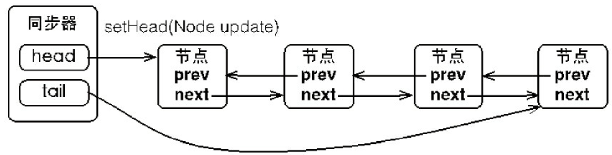

# 并发AQS理解

## 概述

Java中的大部分同步类（Lock、Semaphore、ReentrantLock等）都是基于AQS

eg：**ReentrantLock的底层实现是基于CAS+AQS**

AQS：AbstractQueuedSynchronizer：抽象队列同步器。AQS是提供了一种原子式同步状态、阻塞、唤醒线程功能及队列模型的简单框架。

1. AQS基于**模板方法**模式的。使用时候需要继承同步器并重写指定的方法。AQS工作时使用的是提供的模板方法，在这些模板方法中调用子类重写的方法

   eg：tryAcquire、tryRelease，在公平锁和非公平锁中表现不同。

2. AQS本身没有任何同步接口，而是定义了同步状态获取、释放的方法给自定义的同步组件使用，所以AQS能够支持独占式的，也可以支持共享式的。

3. 锁是面向使用者的，隐藏了实现细节；AQS是面向锁的，屏蔽底层的线程排队、等待唤醒等操作

ps：ReentrantLock：显式锁，底层AQS + CAS；synchronized：隐式锁，监视器模式


AQS整个调用栈：（ReentrantLock就是在第一层）


## 1. AQS的原理

总体思路：

- 如果被请求的共享资源空闲，那么就将当前请求资源的线程设置为有效的工作线程，将共享资源设置为锁定状态；
- 如果共享资源被占用，就需要一定的**阻塞等待唤醒机制**来保证锁分配。这个机制主要用的是**CLH队列的变体实现的**，将暂时获取不到锁的线程加入到队列中。

CLH：是单向链表，AQS中的队列是CLH变体的**虚拟双向队列**（FIFO）。

AQS是通过将每条请求共享资源的**线程封装成一个节点**来实现锁的分配。AQS使用一个**volatile的int类型的成员变量来表示同步状态**，通过内置的**FIFO队列**来完成资源获取的排队工作，通过**CAS**完成对State值的修改。

下面是每个节点的属性：

下面介绍一下队列中每个节点的属性和部分方法：

| 方法和属性值                  | 含义                                                  |
| ----------------------------- | ----------------------------------------------------- |
| **`volatile int waitStatus`** | **等待状态标志位**，表示当前节点在队列中的状态        |
| **`volatile Thread thread;`** | 表示处于该节点的线程——如果为null，表示虚节点          |
| `volatile Node prev;`         | 前驱指针                                              |
| `volatile Node next;`         | 后继指针                                              |
| Node nextWaiter;              | 指向下一个处于CONDITION状态的节点（这个指针不多介绍） |
| `predecessor()`               | 返回前驱节点，没有的话抛出npe                         |

线程有两种锁的模式：

- SHARED：线程按照共享的模式等待锁
- EXCLUSIVE：按照独享的模式等待锁

ps：**变量waitStatus：共有4种取值**

- 0：初始化默认的值
- CANCELLED：1，在同步队列中等待的线程**等待超时或被中断**，线程获取锁的**请求已经取消了**，节点一旦进入该状态就不会再变化成其他状态
- SIGNAL：-1，当前线程thread1占有锁，队列中的head的后继节点处于等待状态，如果当前线程释放锁，它就能马上得到锁了
- CONDITION：-2，表示节点在等待队列中，节点线程等待唤醒（与Condition相关，该标识的结点处于等待队列中，结点的线程等待在Condition上，当其他线程调用了Condition的signal()方法后，CONDITION状态的结点将从等待队列转移到同步队列中）
- PROPAGATE：-3，当前线程处在SHARED情况下，该字段才会使用，与共享模式相关，在共享模式中，该状态标识结点的线程处于可运行状态。

AQS的同步状态：state：

用来表示临界资源的获取锁的情况

```java
private volatile int state;			// 注意是volatile，保证内存可见性
```

AQS队列同步器的数据结构：



每次线程获取锁失败，都会加入到队尾，所以是一个FIFO的队列

由于存在多个线程并发加入同步队列，所以执行队尾插入操作也是用CAS方法

## 2. AQS模板方法

模板方法：使用者继承AQS，并且重写AQS指定的方法。然后通过调用AQS提供的模板方法，而模板方法在使用的时候会回调使用者重写的方法。

eg：`acquire()`方法：

```java
// ReentrantLock.java中尝试获取锁，会去调用AQS的acquire方法
final void lock() {
    if (compareAndSetState(0, 1))
        setExclusiveOwnerThread(Thread.currentThread());
    else
        acquire(1);
}

// AQS方法中的实现，会调用tryAcquire方法，该方法在AQS只是提供了一个默认实现，需要子类重写
public final void acquire(int arg) {
    if (!tryAcquire(arg) &&
        acquireQueued(addWaiter(Node.EXCLUSIVE), arg))
        selfInterrupt();
}

// ReentrantLock.java中重写AQS的tryAcquire方法
protected final boolean tryAcquire(int acquires) {
    return nonfairTryAcquire(acquires);
}
```

——这个就是模板方法的作用。

同步器中可以进行重写的方法：（如果这些方法未被重写，那么调用的是AQS默认方法，返回的是`UnsupportedOperationException`**方法不支持**异常）

| 方法                                          | 描述                                        |
| --------------------------------------------- | ------------------------------------------- |
| `protected boolean tryAcquire(int arg)`       | 独占式获取锁，查询当前状态并且用CAS尝试设置 |
| `protected boolean tryRelease(int arg)`       | 独占式释放锁，设置state状态                 |
| `protected int tryAcquireShared(int arg)`     | 共享式                                      |
| `protected boolean tryReleaseShared(int arg)` | 共享式                                      |
| `protected boolean isHeldExclusively()`       | 是否在独占模式下被线程占用                  |

模板方法：

| 方法                                                         | 描述                                                         |
| ------------------------------------------------------------ | ------------------------------------------------------------ |
| `public final void acquire(int arg)`                         | 独占式获取锁，如果获取成功就返回；获取失败线程加入同步队列，会去调用`tryAcquire`方法 |
| `public final void acquireInterruptibly`                     | 可响应中断式的独占获取锁，如果期间被中断，那么会抛出InterruptException并返回 |
| `public final boolean tryAcquireNanos(int arg, long nanosTimeout)` | 设定超时等待时间，超时未得到锁就直接返回false                |
| `public final void acquireShared(int arg)`                   | 共享式获取锁                                                 |
| ....                                                         | 同上面                                                       |
| `public final boolean release(int arg)`                      | 独占式释放锁，并且会唤醒第一个等待的线程                     |
| `public final boolean releaseShared(int arg)`                | 共享式释放锁                                                 |
|                                                              |                                                              |

根据ReentrantLock来说，是在内部定义了一个Sync/NonfairSync的静态内部类，而该类继承了AQS方法

在ReentrantLock中定义了一个实例方法——`private final Sync sync;`使用的时候只需要`sync.release()`即可：

```java
public void unlock() {
    sync.release(1);		// 这个之后就是上面的流程了
}
```

参考文章：

https://tech.meituan.com/2019/12/05/aqs-theory-and-apply.html

## 3. Condition

类似于synchronized配合使用的wait/notify方法，**condition是配合lock使用的：await/signal**，在await和signal之前需要获取锁。如果await是挂在指定的对象上的.

eg：

```java
private Condition notEmpty = lock.newCondition();
lock.lock();
try{
   	....
    notEmpty.signal(); / notEmpty.await();
    ....
}finally{
    lock.unlock();
}
```

等待队列是一个FIFO队列。每个节点都是复用了AQS的Node静态内部类。而在更新FIFO队列时，可以不用CAS，因为在调用`await/signal`方法时，都是已经获得了锁。

### await

当前线程进入等待队列，并且会释放锁，线程状态从运行态变成等待态。

而如果**想要返回，必须要能够获得之前的锁**

从同步队列角度看：await就是将同步队列的head节点移动到了condition的等待队列（head节点就是获得锁的节点，head.next才是队首节点）

```java
public final void await() throws InterruptedException {
    if (Thread.interrupted())						// 判断中断，如中断直接抛出异常返回
        throw new InterruptedException();
    Node node = addConditionWaiter();		// 加入等待队列
    int savedState = fullyRelease(node);	// 释放锁，会唤醒同步队列中的后继节点
    int interruptMode = 0;
    while (!isOnSyncQueue(node)) {		// 如果被signal唤醒，node是已经在同步队列中了，所以能跳出循环
        LockSupport.park(this);			// 挂起到当前对象——就是condition对象
        // 到这边，说明被唤醒，调度回来了
        if ((interruptMode = checkInterruptWhileWaiting(node)) != 0)	// 如果在等待期间被中断，那么跳出
            break;
    }
    // 尝试获取锁
    if (acquireQueued(node, savedState) && interruptMode != THROW_IE)
        interruptMode = REINTERRUPT;
    if (node.nextWaiter != null) // clean up if cancelled
        unlinkCancelledWaiters();
    if (interruptMode != 0)
        reportInterruptAfterWait(interruptMode);
}
```

可以发现，默认的await方法是会响应中断的。并且它是从同步队列中移除，重新创建一个新的节点加入到等待队列中的

所以，**一个同步器（eg：ReentrantLock），可以存在多个等待队列 + 1个同步队列**

### signal

```java
public final void signal() {			// 唤醒等待线程	
    if (!isHeldExclusively())			// 前提是：需要能够获得锁
        throw new IllegalMonitorStateException();
    Node first = firstWaiter;
    if (first != null)		
        doSignal(first);
}

private void doSignal(Node first) {
    do {
        if ( (firstWaiter = first.nextWaiter) == null)	// 更新第一个等待线程
            lastWaiter = null;
        first.nextWaiter = null;
    } while (!transferForSignal(first) &&
             (first = firstWaiter) != null);
}

final boolean transferForSignal(Node node) {
	// 
    if (!compareAndSetWaitStatus(node, Node.CONDITION, 0))
        return false;

	// 将p移动到同步队列
    Node p = enq(node);
    int ws = p.waitStatus;
    if (ws > 0 || !compareAndSetWaitStatus(p, ws, Node.SIGNAL))
        LockSupport.unpark(node.thread);		// 然后唤醒该线程
    return true;
}
```


# ps：补充知识

## 1. LockSupport工具

在阻塞和唤醒线程的时候，都会用到LockSupport工具类来完成。所以LockSupport也是构建同步组件的基础工具。

对应的方法：

| 方法                                                         | 描述                             |
| ------------------------------------------------------------ | -------------------------------- |
| **`public static void park(Object blocker)`**                | 阻塞当前线程，挂到指定对象上     |
| **`public static void unpark(Thread thread)`**               | 唤醒指定线程                     |
| `public static void parkNanos(Object blocker, long nanos)`   | 限定时间挂起，超时返回           |
| `public static void parkUntil(Object blocker, long deadline)` | 限定ddl（1970开始到ddl的毫秒数） |

其内部还是调用了native的方法。

## 2. unsafe方法

在CAS中、park等都是利用了unsafe的方法