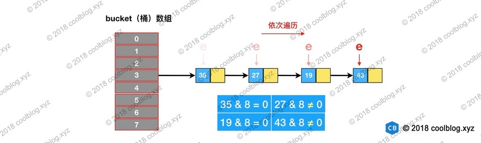

# HashMap源码分析

搞清楚HashMap，首先需要知道HashMap是什么，即它的存储结构-字段；

其次弄明白它能干什么，即它的功能实现-方法

一些特性：

- **HashMap 允许 null 键和 null 值，在计算哈键的哈希值时，null 键哈希值为 0。**即，null键存储在index=0的地方
- HashMap 并**不保证键值对的顺序**，即在进行某些操作后，键值对的顺序可能会发生变化。
- HashMap 是**非线程安全**类，在多线程环境下可能会存在问题。
- JDK 1.8 中引入了红黑树优化过长的链表

ps：hashMap和hashSet基本等效，除了：HashMap是不同步的，且允许为null；HashSet要求里面的结点不重复，且没有键值对的概念

Hashtable，实现原理与HashMap类似，但是不允许键、值出现null，**内部通过synchronized实现了线程安全**，所以并发性能并不好。

**不需要并发安全的场景中，推荐使用HashMap；高并发的场景，用ConcurrentHashMap**

## 1. 总体了解

从实现的结构上，HashMap用：**数组 + 链表 + 红黑树（一定情况下触发的）**

java存放数据是一个Node数组：又称hash桶数组。里面每个结点都是Node类型

```java
transient Node<K,V>[] table;
```

ps：Hash桶数组，即每个index实际上都对应一个桶，该桶内存放的不是一个元素，而是多个（链表形式串起来的），一个就称为哈希桶。将哈希桶一个个排列在一起，**桶底**可以用数组的**每一个下标**来去做，下标就是对应的哈希值。那么就构成了哈希桶。

——实际上就是数组 + 链表，数组的每个结点实际上都是链表的首地址

Node是HashMap实现的内部类：

它实现了`Map.Entry`接口，该接口是Map接口的一个内部接口

```java
static class Node<K,V> implements Map.Entry<K,V> {
    final int hash;			// 用来定位数组的索引位置，就是该点值的哈希值，直接存储加快速度
    final K key;			// 键值对
    V value;
    Node<K,V> next;			// 指示下一个结点

    Node(int hash, K key, V value, Node<K,V> next) {		// 构造方法
        this.hash = hash;
        this.key = key;
        this.value = value;
        this.next = next;
    }

    public final K getKey()        { return key; }
    public final V getValue()      { return value; }
    public final String toString() { return key + "=" + value; }

    public final int hashCode() {	// 获得该节点的哈希值——key的hash值和value的hash值的异或,所以每一个结点也是有哈希值的
        return Objects.hashCode(key) ^ Objects.hashCode(value);
    }

    public final V setValue(V newValue) {			// 修改值
        V oldValue = value;
        value = newValue;
        return oldValue;
    }

    public final boolean equals(Object o) {			// 判断两个node结点是否一样
        if (o == this)			// 先比较是否指向同一个对象
            return true;
        if (o instanceof Map.Entry) {		// 再比较类型是否一致
            Map.Entry<?,?> e = (Map.Entry<?,?>)o;		// 再强制类型转换成指定的类型
            if (Objects.equals(key, e.getKey()) &&		// 比较键值对，同时相等才算
                Objects.equals(value, e.getValue()))
                return true;
        }
        return false;
    }
}
```

理解：上面的方法都是final类型，即不可被重写的

如图就是hashMap的实际存储情况：


这个就是哈希表。哈希表为解决冲突，可以采用**开放地址法**和**链地址法**等来解决问题。

Java中**HashMap采用了链地址法**：就是**数组加链表**的结合。在每个数组元素上都一个链表结构，当数据被Hash后，得到数组下标，把数据放在对应下标元素的链表上。

ps：开放地址法：当有冲突的时候，尝试去找一个空闲的位置插入，而不再遵循计算得到的哈希值。

## 类头

```java
public class HashMap<K,V> extends AbstractMap<K,V>
    implements Map<K,V>, Cloneable, Serializable {}
```

继承自`AbstractMap`抽象类，实现了接口：Map（关注的），Cloneable, Serializable。

Map接口定义的方法：

```java
int size();		// 求当前容量
boolean isEmpty();		// 判断map是否为空

boolean equals(Object o);
int hashCode();
```

```java
boolean containsKey(Object key);		// 判断指定的键是否存在
boolean containsValue(Object value);		// 判断指定的value是否存在（需要遍历）

V get(Object key);		// 根据键获得对应的值
V put(K key, V value);		// 键值对存入map
void putAll(Map<? extends K, ? extends V> m);		// 将map对应的内容全部放入当前的map中
V remove(Object key);		// 根据键删除对应的键值对
void clear();			// 清空
```

```java
Set<K> keySet();			// map中键的集合
Collection<V> values();		// value的集合
Set<Map.Entry<K, V>> entrySet();		// 键值对的集合
```

```java
// 嵌套接口——代表一条键值对
interface Entry<K,V> {
    K getKey();
    V getValue();
    V setValue(V value);
    boolean equals(Object o);
    int hashCode();
    ....(默认方法)
}
```

还有几个默认方法。

`keySet(), values(), entrySet()`返回的都是**视图**，不是复制的值，**基于返回值的修改会直接修改Map自身**

## 静态变量

```java
static final int DEFAULT_INITIAL_CAPACITY = 1 << 4; // 默认的容量大小，即哈希桶数组的长度为16
static final int MAXIMUM_CAPACITY = 1 << 30;	// 最大的容量，即最大存放的元素个数
static final float DEFAULT_LOAD_FACTOR = 0.75f;		// 默认的负载因子
static final int TREEIFY_THRESHOLD = 8;			// 链表变成红黑树的门限
static final int UNTREEIFY_THRESHOLD = 6;		// 红黑树变回链表的门限
static final int MIN_TREEIFY_CAPACITY = 64;		// 最小转换时的容量
```

理解：

1. 当链表长度超过8时，不一定能马上转换成红黑树，而是需要当前哈希表的容量也超过64后才行，否则优先选择扩容

   8：是经过计算得到的，链表太长查找时间太慢；链表太短就进行转换，terrify有代价，且耗的空间变大，所以需要做个时间和空间上的均衡，经过概率论计算：8 个键值对同时存在于同一个桶的概率只有 0.00000006

2. 负载因子：调低负载因子时，HashMap 所能容纳的键值对数量变少（即同样的数组长度下，因子越小，越少的元素个数就能触发扩容；因子越大，需要很多元素才能触发扩容）。扩容时，重新将键值对存储新的桶数组里，键的键之间产生的碰撞会下降，链表长度变短，增删改查等操作的效率将会变高——拿空间换时间

   ——一般情况下，我们用默认值

factor * capacity

## 实例变量

```java
transient Node<K,V>[] table;		// 哈希表
transient Set<Map.Entry<K,V>> entrySet;		
transient int size;
transient int modCount;			// 修改次数记录（用来处理并发）
int threshold;				// 设置的阈值，超过该值就需要扩容
final float loadFactor;				// 负载因子
```

需要记住的是：阈值可以通过容量和负载因子计算出来：threshold = capacity * loadFactor

负载因子：是可以修改的，**也可以大于1**，但是建议不要轻易修改，除非情况非常特殊

## 构造方法

4种构造方法：

```java
public HashMap() {			// 默认构造方法
    this.loadFactor = DEFAULT_LOAD_FACTOR; // all other fields defaulted
}

public HashMap(int initialCapacity) {
    this(initialCapacity, DEFAULT_LOAD_FACTOR);
}

public HashMap(int initialCapacity, float loadFactor) {			// 对输入的数据进行判断
    if (initialCapacity < 0)
        throw new IllegalArgumentException("Illegal initial capacity: " +
                                           initialCapacity);
    if (initialCapacity > MAXIMUM_CAPACITY)
        initialCapacity = MAXIMUM_CAPACITY;
    if (loadFactor <= 0 || Float.isNaN(loadFactor))
        throw new IllegalArgumentException("Illegal load factor: " +
                                           loadFactor);
    this.loadFactor = loadFactor;
    this.threshold = tableSizeFor(initialCapacity);	// 如果设置初始容量的话，得到的值都是2的幂次
}

public HashMap(Map<? extends K, ? extends V> m) {		// 将另一个 Map 中的映射拷贝一份到自己的存储结构中来
    this.loadFactor = DEFAULT_LOAD_FACTOR;
    putMapEntries(m, false);
}
```

主要工作：设置一些值：主要就是 loadFactor 和 threshold

而传参可以有：

- loadFactor：负载因子，可以自行定义负载因子
- 初始容量 initialCapacity，主要是用来设定阈值threshold

辅助方法：

```java
static final int tableSizeFor(int cap) {
    int n = cap - 1;		
    n |= n >>> 1;
    n |= n >>> 2;
    n |= n >>> 4;
    n |= n >>> 8;
    n |= n >>> 16;
    return (n < 0) ? 1 : (n >= MAXIMUM_CAPACITY) ? MAXIMUM_CAPACITY : n + 1;
}
```

主要作用：找到大于或等于 cap 的最小2的幂。所以，可以发现得到的数组的长度是2的幂次

## 实例方法

### 1. 查找

流程：先定位键值对所在的桶的位置，然后再对链表或红黑树进行查找

使用方法：`int val = hashMap.get(2);`

```java
public V get(Object key) {			// 通过key得到该键对应的值
    Node<K,V> e;
    return (e = getNode(hash(key), key)) == null ? null : e.value;
}

final Node<K,V> getNode(int hash, Object key) {
    Node<K,V>[] tab; Node<K,V> first, e; int n; K k;
    if ((tab = table) != null && (n = tab.length) > 0 &&
        (first = tab[(n - 1) & hash]) != null) {		// 1. 进行一些错误判断；获得key对应的链表头
        if (first.hash == hash && // 2. 首先判断链表头的hash值是否一样，再判断key是否是同一个对象or key的值一样
            ((k = first.key) == key || (key != null && key.equals(k))))
            return first;
        if ((e = first.next) != null) {		// 3. 如果 first 是 TreeNode 类型，则调用红黑树查找方法
            if (first instanceof TreeNode)
                return ((TreeNode<K,V>)first).getTreeNode(hash, key);
            do {				// 遍历链表去中查找
                if (e.hash == hash &&
                    ((k = e.key) == key || (key != null && key.equals(k))))
                    return e;
            } while ((e = e.next) != null);
        }
    }
    return null;
}
```

理解：

1. `(n - 1) & hash`，hash是计算得到的key的哈希值；n是哈希数组的长度，是2的幂次，所以n-1，就是后面全为1。所以公式的含义是：hash值对n取余，即等价于`hash % n`，由于取余速度比较慢，所以做了对应的优化
2. 

```java
static final int hash(Object key) {			// 计算键的哈希值，主要用来定位key在的哈希表的index
    int h;
    // 如果键是null，则直接是数组头；否则就是key的哈希值和哈希值的高16位相与
    return (key == null) ? 0 : (h = key.hashCode()) ^ (h >>> 16);
}
```

理解：

1. 由于哈希表允许键存在null，且null的key，放在数组开头

2. `(h = key.hashCode()) ^ (h >>> 16)`：key的哈希值和哈希值的高16位相与

   why：不直接采用key的哈希值呢？

   需要和getNode配合着看，`(n - 1) & hash`用来获取index，当n比较小的时候，hash只是和低位的1做操作，而hash的高位并没有参与运算，**导致了计算结果只与低位信息有关，高位数据没发挥作用**，所以将高16位和低16位进行运算，那么**加大低位信息的随机性，变相的让高位数据参与到计算**;

   此外：通过移位和异或运算，可以让 hash 变得更复杂，进而影响 hash 的分布性，使得较差的hashCode也能有较好的hash效果。

3. 看结点是否是我们需要的需要比较：先计算出index，定位到结点所在的链表；链表上，先比较hash值是否一样，只有一样再比较是否是同一个对象 还是 key的值是否一样（这两个满足一个即可）

### ps：遍历

一般遍历用到的是：

```java
for(Map.Entry<Integer, Integer>entry: hashMap.entrySet()){
    int key = entry.getKey();
    int value = entry.getValue();
}

// 或者：
for(Integer key: hashMap.keySet()){}
for(Integer value: hashMap.values()){}
```

在编译的时候会被转成：迭代器

```java
Set keys = map.keySet();		// 
Iterator ite = keys.iterator();
while (ite.hasNext()) {			// 如果存在next
    Object key = ite.next();	// 那么就去找next
    // do something
}
```

步骤如下：

1. 先要获取键集合`KeySet`对象
2. 再通过 KeySet 的迭代器`KeyIterator`进行遍历，KeyIterator 类继承自`HashIterator`类，核心逻辑也封装在 HashIterator 类中

keySet对象的实现：

```java
transient Set<K>        keySet;		// 实例变量

public Set<K> keySet() {
    Set<K> ks = keySet;
    if (ks == null) {			// 如果keySet不存在，就新建一个KeySet对象
        ks = new KeySet();
        keySet = ks;			// 并且更新实例变量
    }
    return ks;
}

final class KeySet extends AbstractSet<K> {
    public final int size()                 { return size; }
    public final void clear()               { HashMap.this.clear(); }		// 就是清除整个哈希表
    public final Iterator<K> iterator()     { return new KeyIterator(); }
    public final boolean contains(Object o) { return containsKey(o); }
    public final boolean remove(Object key) {
        return removeNode(hash(key), key, null, false, true) != null;
    }
    public final Spliterator<K> spliterator() {
        return new KeySpliterator<>(HashMap.this, 0, -1, 0, 0);
    }
    public final void forEach(Consumer<? super K> action) {
        Node<K,V>[] tab;
        if (action == null)
            throw new NullPointerException();
        if (size > 0 && (tab = table) != null) {
            int mc = modCount;
            for (int i = 0; i < tab.length; ++i) {
                for (Node<K,V> e = tab[i]; e != null; e = e.next)
                    action.accept(e.key);
            }
            if (modCount != mc)
                throw new ConcurrentModificationException();
        }
    }
}
```

keySet的迭代器实现：

1. HashIterator 在初始化时，会先遍历桶数组，从index = 0开始找到第一个包含链表节点引用的桶

```java
final class KeyIterator extends HashIterator
    implements Iterator<K> {
    public final K next() { return nextNode().key; }
}


abstract class HashIterator {
    Node<K,V> next;        // 下一个要访问的结点（在遍历链表时存放的是链表的下一个结点；在遍历index存放的是下一个非空的index的头结点）
    Node<K,V> current;     // current entry
    int expectedModCount;  // for fast-fail
    int index;             // current slot

    HashIterator() {			// 初始化时
        expectedModCount = modCount;
        Node<K,V>[] t = table;
        current = next = null;
        index = 0;
        if (t != null && size > 0) { // 找到第一个存在结点的index
            do {} while (index < t.length && (next = t[index++]) == null);
        }
    }

    public final boolean hasNext() {
        return next != null;
    }

    final Node<K,V> nextNode() {			// 既可以遍历链表，又可以遍历数组
        Node<K,V>[] t;
        Node<K,V> e = next;
        if (modCount != expectedModCount)
            throw new ConcurrentModificationException();
        if (e == null)
            throw new NoSuchElementException();
        // 直到当前链表遍历到最后才有可能进去
        if ((next = (current = e).next) == null && (t = table) != null) {
        	// 寻找下一个包含链表节点引用的桶
            do {} while (index < t.length && (next = t[index++]) == null);
        }
        return e;
    }

    public final void remove() {
        Node<K,V> p = current;
        if (p == null)
            throw new IllegalStateException();
        if (modCount != expectedModCount)
            throw new ConcurrentModificationException();
        current = null;
        K key = p.key;
        removeNode(hash(key), key, null, false, false);
        expectedModCount = modCount;
    }
}
```

——根据代码可以发现：多次对 HashMap 进行遍历时，遍历结果顺序都是一致的（结果确定性），但这个顺序和插入的顺序一般都是不一致的（因为需要进行hash计算和插入，插入的位置不确定，而遍历是从index为0开始的，所以肯定顺序不同）

总结：实现了迭代器Iterator，采用`fail-fast`机制，即在迭代过程中如果使用外部的remove等方法修改了map的结构，那么就会触发CME异常，除非使用迭代器自带的remove方法（算是陷阱，逻辑上不一样就会触发异常）。而对并发修改操作，迭代器会直接抛出异常，不会继续执行下去（主要目的）。

——但是，**迭代器并不能保证检测出全部的：非同步的并发修改情况**，只是尽可能抛出存在的CME异常，因此这个只用来检测bug，而不能用来编写程序通过依赖该抛出的异常来保证程度的正确性。

### 2. 添加

流程如下：


```java
public V put(K key, V value) {
    return putVal(hash(key), key, value, false, true);
}

final V putVal(int hash, K key, V value, boolean onlyIfAbsent, boolean evict) {
    Node<K,V>[] tab; Node<K,V> p; int n, i;
    if ((tab = table) == null || (n = tab.length) == 0)	// 1. 如果数组为空/长度为0，就先扩容
        n = (tab = resize()).length;
    if ((p = tab[i = (n - 1) & hash]) == null)	// 2. 计算key的hash值对应的index，如果该index不存在结点，直接插入；且此时的p指向的是index的链表头
        tab[i] = newNode(hash, key, value, null);
    else {				// 3. 如果对应的index已经存在结点
        Node<K,V> e; K k;
        if (p.hash == hash &&				// 3.1 如果链表头就是重复的key，那么直接覆盖
            ((k = p.key) == key || (key != null && key.equals(k))))
            e = p;			// 直接覆盖
        else if (p instanceof TreeNode)			// 3.2 如果是红黑树，就调用红黑树的插入方法
            e = ((TreeNode<K,V>)p).putTreeVal(this, tab, hash, key, value);
        else {
            // 3.3 对链表进行遍历，且统计长度
            for (int binCount = 0; ; ++binCount) {
                if ((e = p.next) == null) {		// 3.3.1 如果遍历到尾巴了，都没有找到重复的key，那么再最后插入结点
                    p.next = newNode(hash, key, value, null);
                    if (binCount >= TREEIFY_THRESHOLD - 1) // 如果链表长度大于或等于树化阈值，则进行树化操作
                        treeifyBin(tab, hash);
                    break;
                }
                if (e.hash == hash &&			// 3.3.2 当前链表包含要插入的键值对，终止遍历
                    ((k = e.key) == key || (key != null && key.equals(k))))
                    break;
                p = e;
            }
        }
        if (e != null) { // e表示是否是重复插入，如果存在重复插入，即key完全一样
            V oldValue = e.value;
            // onlyIfAbsent 表示是否仅在 oldValue 为 null 的情况下更新键值对的值，可配置
            if (!onlyIfAbsent || oldValue == null)
                e.value = value;
            afterNodeAccess(e);
            return oldValue;
        }
    }
    ++modCount;				// 记录修改了
    if (++size > threshold)			// 结点个数超过阈值，扩容
        resize();
    afterNodeInsertion(evict);
    return null;
}
```

理解：

1. 如果数组是为空的，那么先初始化桶数组 table，可以发现**table 被延迟到插入新数据时再进行初始化**
2. 查找要插入的键值对是否已经存在，存在的话根据条件判断是否用新值替换旧值
3. 如果不存在，则将键值对链入链表中，并根据链表长度决定是否将链表转为红黑树
4. 判断键值对数量是否大于阈值，大于的话则进行扩容操作

ps：需要记住：**允许存储的key是null的，value也可以是null**

### 3. 扩容（包含初始化，jdk1.8改进了）

hashMap中桶数组的长度均是2的幂，阈值大小为桶数组长度与负载因子的乘积

扩容方法：HashMap 按当前桶数组长度的2倍进行扩容，阈值也变为原来的2倍

```java
final Node<K,V>[] resize() {
    Node<K,V>[] oldTab = table;
    int oldCap = (oldTab == null) ? 0 : oldTab.length;	// 获取原数组长度：如果数组不存在，设置为0；当前数组长度
    int oldThr = threshold;		// 当前阈值
    int newCap, newThr = 0;		// 新容量和新阈值
    if (oldCap > 0) {			// 如果不为空，说明已经初始化过了
        if (oldCap >= MAXIMUM_CAPACITY) {		// 如果旧容量已经超过上限，那么阈值设置为整型最大值——不扩容
            threshold = Integer.MAX_VALUE;
            return oldTab;
        }
        // 如果扩容之后的值不超过最大上限，当前容量要超过16，2倍扩容，阈值也扩2倍——扩容之后还是阈值可能会溢出
        else if ((newCap = oldCap << 1) < MAXIMUM_CAPACITY &&
                 oldCap >= DEFAULT_INITIAL_CAPACITY)
            newThr = oldThr << 1; // 更新为2倍旧阈值
    }
    else if (oldThr > 0) // oldcap=0, oldThr>0，没有初始化过，但是有设置阈值，则将容量更新为阈值，调用 HashMap(int) 和 HashMap(int, float) ——表示初始化
        newCap = oldThr;
    else {               // oldcap=0, oldThr=0——表示初始化
        newCap = DEFAULT_INITIAL_CAPACITY;		// 默认的初始化值16
        newThr = (int)(DEFAULT_LOAD_FACTOR * DEFAULT_INITIAL_CAPACITY);		// 更新阈值（用容量 * 负载因子计算）
    }
    if (newThr == 0) {				// 出现了阈值溢出，那么按照容量*负载因子计算
        float ft = (float)newCap * loadFactor;
        newThr = (newCap < MAXIMUM_CAPACITY && ft < (float)MAXIMUM_CAPACITY ?
                  (int)ft : Integer.MAX_VALUE);
    }
    threshold = newThr;				// 更新最新的阈值
    @SuppressWarnings({"rawtypes","unchecked"})
    Node<K,V>[] newTab = (Node<K,V>[])new Node[newCap];		// 新建一个数组，桶数组的初始化也是在这里完成的
    table = newTab;
    if (oldTab != null) {			// 如果旧的桶数组不为空，则遍历桶数组，并将键值对映射到新的桶数组中
        for (int j = 0; j < oldCap; ++j) {		// 从0开始遍历
            Node<K,V> e;
            if ((e = oldTab[j]) != null) {			// index下存在结点
                oldTab[j] = null;
                if (e.next == null)			// 且有且只有这一个结点
                    newTab[e.hash & (newCap - 1)] = e;		// 重新计算index
                else if (e instanceof TreeNode)
                    ((TreeNode<K,V>)e).split(this, newTab, j, oldCap);// 重新映射时，需要对红黑树进行拆分
                else { // 表示链表形式，且存在多个结点
                    Node<K,V> loHead = null, loTail = null;		// 指向仍在该index上
                    Node<K,V> hiHead = null, hiTail = null;		// 不在该节点上的
                    Node<K,V> next;
                    do {
                        next = e.next;
                        if ((e.hash & oldCap) == 0) {		// 因为扩容是2倍，所以多影响了一位，一位是1or0，所以链表上的结点只存在是在当前index，不在当前index的
                            if (loTail == null)
                                loHead = e;
                            else
                                loTail.next = e;
                            loTail = e;						// 按照原先顺序，构成一个链表	
                        }
                        else {			// 不在当前index上的
                            if (hiTail == null)
                                hiHead = e;
                            else
                                hiTail.next = e;
                            hiTail = e;
                        }
                    } while ((e = next) != null);
                    if (loTail != null) {		// 存在仍在当前index上的，那么将lo链表挂上
                        loTail.next = null;
                        newTab[j] = loHead;
                    }
                    if (hiTail != null) {
                        hiTail.next = null;
                        newTab[j + oldCap] = hiHead;		// 挂到新的上面
                    }
                }
            }
        }
    }
    return newTab;
}
```

注意：扩容是新建一个两倍的数组，然后将里面的所有链表都放在了新的数组里面，即引用变化

扩容：**特别耗性能的操作**，所以当程序员在使用HashMap的时候，估算map的大小，初始化的时候给一个大致的数值，避免map进行频繁的扩容。

理解：

1. 容量的问题：

   | 条件                       | 覆盖情况                            | 备注                                                         |
   | -------------------------- | ----------------------------------- | ------------------------------------------------------------ |
   | oldCap > 0                 | 桶数组 table 已经被初始化           |                                                              |
   | oldCap == 0&& 0oldThr > 0  | threshold > 0，且桶数组未被初始化   | 调用 HashMap(int) 和 HashMap(int, float) 构造方法时会产生这种情况，<br />此种情况下 newCap = oldThr，newThr 在第二个条件分支中算出 |
   | oldCap == 0 && oldThr == 0 | 桶数组未被初始化，且 threshold 为 0 | 调用 HashMap() 构造方法会产生这种情况。                      |

2. 扩容之后，需要重新计算在hash表中的位置，但是**组内节点相对位置保持不变，且最多分散到两个index上**

   并且由于遵循数组容量是2的倍数，所以每次扩容之后，每个index上的链表上的元素只存在两种可能：0：仍在该index上，1：不在index上（且它们的新位置一样，都是index + oldCap）

   具体原理是：eg：

   扩容前，cap=16

   

   ——在同一个index上，因为受影响的只有低4位

   扩容后，cap=32，受影响的变成低5位，那么可能存在两种情况

   

   所以整个流程如下：

   

   

   

3. **JDK 1.8 版本下 HashMap 扩容效率要高于之前版本**。如果大家看过 JDK 1.7 的源码会发现，JDK 1.7 为了防止因 hash 碰撞引发的拒绝服务攻击，在计算 hash 过程中引入随机种子。以增强 hash 的随机性，使得键值对均匀分布在桶数组中。在扩容过程中，相关方法会根据容量判断是否需要生成新的随机种子，并重新计算所有节点的 hash。而在 JDK 1.8 中，则通过引入红黑树替代了该种方式。从而避免了多次计算 hash 的操作，提高了扩容效率。

### 4. 删除

```java
public V remove(Object key) {
    Node<K,V> e;
    return (e = removeNode(hash(key), key, null, false, true)) == null ?
        null : e.value;
}

final Node<K,V> removeNode(int hash, Object key, Object value,
                               boolean matchValue, boolean movable) {
    Node<K,V>[] tab; Node<K,V> p; int n, index;
    if ((tab = table) != null && (n = tab.length) > 0 &&	// 排除特殊情况
        (p = tab[index = (n - 1) & hash]) != null) {		// 定位到删除节点的index
        Node<K,V> node = null, e; K k; V v;
        if (p.hash == hash &&			// 链表头判断，如果是就直接找到了
            ((k = p.key) == key || (key != null && key.equals(k))))
            node = p;
        else if ((e = p.next) != null) {		// 如果不是头结点，就遍历整个链表
            if (p instanceof TreeNode)			// 如果是红黑树就按照红黑树处理
                node = ((TreeNode<K,V>)p).getTreeNode(hash, key);
            else {					// 遍历链表，直到找到
                do {
                    if (e.hash == hash &&
                        ((k = e.key) == key ||
                         (key != null && key.equals(k)))) {
                        node = e;
                        break;
                    }
                    p = e;				// 下一次，p是前一个结点，e是当前结点
                } while ((e = e.next) != null);
            }
        }
        if (node != null && (!matchValue || (v = node.value) == value ||
                             (value != null && value.equals(v)))) {
            if (node instanceof TreeNode)
                ((TreeNode<K,V>)node).removeTreeNode(this, tab, movable);
            else if (node == p)			// 如果要删除的是头结点，那么更新头结点
                tab[index] = node.next;
            else
                p.next = node.next;		// 如果是中间结点，前后两个结点连接即可
            ++modCount;			// 记录修改了
            --size;				// 修改size
            afterNodeRemoval(node);
            return node;
        }
    }
    return null;
}
```

还有一个clear方法，就是将每个index的内容全部清掉。GC会对没有引用的链表回收。

```java
public void clear() {
    Node<K,V>[] tab;
    modCount++;
    if ((tab = table) != null && size > 0) {
        size = 0;
        for (int i = 0; i < tab.length; ++i)
            tab[i] = null;
    }
}
```

### 5. 红黑树相关（链表树化、红黑树链化、扩容拆分）

不涉及到红黑树的实现等，只是讲整体思路：

#### 链表树化

树化时机：`TREEIFY_THRESHOLD = 8; && MIN_TREEIFY_CAPACITY = 64;`只有链表长度超过8，且当前哈希表中的容量超过64，那么才能进行树化。任何一个不满足，都优先进行扩容

（原因：相较于容量较大的情况，数组容量比较小时，键值对节点 hash 的碰撞率可能会比较高，所以应该优先扩容，而如果容量已经达到一定程度，还碰撞情况严重，就考虑用红黑树来降低遍历时间；同时，桶容量较小时，扩容会比较频繁，扩容时需要拆分红黑树并重新映射。所以在桶容量比较小的情况下，将长链表转成红黑树是一件吃力不讨好的事）

树化的代码：

```java
static final int TREEIFY_THRESHOLD = 8;

/**
 * 当桶数组容量小于该值时，优先进行扩容，而不是树化
 */
static final int MIN_TREEIFY_CAPACITY = 64;

static final class TreeNode<K,V> extends LinkedHashMap.Entry<K,V> {
    TreeNode<K,V> parent;  // red-black tree links
    TreeNode<K,V> left;
    TreeNode<K,V> right;
    TreeNode<K,V> prev;    // needed to unlink next upon deletion
    boolean red;
    TreeNode(int hash, K key, V val, Node<K,V> next) {
        super(hash, key, val, next);
    }
}

/**
 * 将普通节点链表转换成树形节点链表
 */
final void treeifyBin(Node<K,V>[] tab, int hash) {
    int n, index; Node<K,V> e;
    // 桶数组容量小于 MIN_TREEIFY_CAPACITY，优先进行扩容而不是树化
    if (tab == null || (n = tab.length) < MIN_TREEIFY_CAPACITY)
        resize();
    else if ((e = tab[index = (n - 1) & hash]) != null) {
        // hd 为头节点（head），tl 为尾节点（tail）
        TreeNode<K,V> hd = null, tl = null;
        do {
            // 将普通节点替换成树形节点
            TreeNode<K,V> p = replacementTreeNode(e, null);
            if (tl == null)
                hd = p;
            else {
                p.prev = tl;
                tl.next = p;
            }
            tl = p;
        } while ((e = e.next) != null);  // 将普通链表转成由树形节点链表
        if ((tab[index] = hd) != null)
            // 将树形链表转换成红黑树
            hd.treeify(tab);
    }
}

TreeNode<K,V> replacementTreeNode(Node<K,V> p, Node<K,V> next) {
    return new TreeNode<>(p.hash, p.key, p.value, next);
}
```

TreeNode 继承自 Node 类，所以 TreeNode 仍然包含 next 引用，所以即使树化了，但是链表的链接还存在


#### 拆分

扩容后，红黑树节点也需要重新映射，即判断这些结点是否需要换位置，如果需要就将这些结点取出，而剩余的结点重新构成一棵树or链表

思路是：可以先把红黑树转成链表，之后再重新映射链表即可。但是由于前面保存了链表的连接，所以直接通过链表形式遍历即可（按照链表的扩容方式分成两个链表即可），然后将分离的两个链表分别挂到对应的index上。

```java
// 红黑树转链表阈值
static final int UNTREEIFY_THRESHOLD = 6;

final void split(HashMap<K,V> map, Node<K,V>[] tab, int index, int bit) {
    TreeNode<K,V> b = this;
    // Relink into lo and hi lists, preserving order
    TreeNode<K,V> loHead = null, loTail = null;
    TreeNode<K,V> hiHead = null, hiTail = null;
    int lc = 0, hc = 0;
    /* 
     * 红黑树节点仍然保留了 next 引用，故仍可以按链表方式遍历红黑树。
     * 下面的循环是对红黑树节点进行分组，与上面类似
     */
    for (TreeNode<K,V> e = b, next; e != null; e = next) {
        next = (TreeNode<K,V>)e.next;
        e.next = null;
        if ((e.hash & bit) == 0) {
            if ((e.prev = loTail) == null)
                loHead = e;
            else
                loTail.next = e;
            loTail = e;
            ++lc;
        }
        else {
            if ((e.prev = hiTail) == null)
                hiHead = e;
            else
                hiTail.next = e;
            hiTail = e;
            ++hc;
        }
    }

    if (loHead != null) {
        // 如果 loHead 不为空，且链表长度小于等于 6，则将红黑树转成链表
        if (lc <= UNTREEIFY_THRESHOLD)
            tab[index] = loHead.untreeify(map);
        else {
            tab[index] = loHead;
            /* 
             * hiHead == null 时，表明扩容后，
             * 所有节点仍在原位置，树结构不变，无需重新树化
             */
            if (hiHead != null) 			// 如果新链表长度超过6，那么还是构成一棵树
                loHead.treeify(tab);
        }
    }
    // 与上面类似
    if (hiHead != null) {
        if (hc <= UNTREEIFY_THRESHOLD)
            tab[index + bit] = hiHead.untreeify(map);		// 移动到其他index+bit处，且变回链表
        else {
            tab[index + bit] = hiHead;
            if (loHead != null)
                hiHead.treeify(tab);			// 移动到index+bit处，还是构建一棵树
        }
    }
}
```

——扩容之后，红黑树的拆分是重新开始搭树，而不是删除部分的

#### 红黑树链化

主要出现在链表结点变少了，而达到了重新链化的阈值，于是需要将树节点变成Node结点，其余不用变动（因为本身保留了链表的特性，所以直接转换即可）

```java
final Node<K,V> untreeify(HashMap<K,V> map) {
    Node<K,V> hd = null, tl = null;
    // 遍历 TreeNode 链表，并用 Node 替换
    for (Node<K,V> q = this; q != null; q = q.next) {
        // 替换节点类型
        Node<K,V> p = map.replacementNode(q, null);
        if (tl == null)
            hd = p;
        else
            tl.next = p;
        tl = p;
    }
    return hd;
}

Node<K,V> replacementNode(Node<K,V> p, Node<K,V> next) {
    return new Node<>(p.hash, p.key, p.value, next);
}
```

参考：

1. https://tech.meituan.com/2016/06/24/java-hashmap.html
2. https://segmentfault.com/a/1190000012926722


# HashMap的使用

效率：基本操作：**put/get（通过key的查找）的时间复杂度为O(1)**，前提是，分散性较好。

由于哈希表好用，可以在O(1)时间根据key找到指定的value，所以使用频率很高。

下面总结hashMap的使用方式：（方便记忆）

## 1. 初始化

首先导包：

```java
import java.util.HashMap;
```

创建实例对象：

需要指定键值对的类型，必须是引用类型，而不是基本数据类型：

```java
HashMap<Integer, String>hashMap = new HashMap<>();
```

## 2. 增 / 改

用put，且需要传入两个参数：key、value

```java
hashMap.put(key, value);
```

如果该结点已经存在，那么会覆盖原来的，即将value换成最新的

## 3. 查

用get，通过key来获得value：

```java
hashMap.get(key);
```

ps：遍历哈希表：注意遍历的顺序是乱序的

一般用forEach

```java
for(Map.Entry<Integer, Integer>entry: hashMap.entrySet()){		// entry得到的是完整的键值对
		int key = entry.getKey();
		int value = entry.getValue();
}

for(Integer key: map.keySet()){
    System.out.println(key);
}

for(String value: map.values()){
    System.out.println(value);
}
```

可以获得当前哈希表中元素个数：

```java
hashMap.size();
```

还有两个常见的方法：

判断哈希表中是否存在key或者value，返回值是boolean，常用在判断中

```
hashMap.containsKey(key);				// 直接通过key定位到index，然后查链表，效率较高
hashMap.containsValue(value);			// 只能通过遍历O(N)

hashMap.isEmpty();			// 判空，直接通过size判断即可
```

注意如果在遍历的时候进行删除，需要注意不能触发fail-fast

只能用迭代器：

```java
Iterator<Integer> it = hashMap.keySet().iterator();
while(it.hasNext()){			// 遍历key的集合
    if(it.next() == 5){
        it.remove();		// 会将这个键值对删除
    }
}
```

其他的利用上面的遍历方法都会抛出CME

## 4. 删

用remove：通过key来删除

```java
hashMap.remove(key);
```

ps：清空哈希表：

```java
hashMap.clear();
```

# HashMap的线程安全性

在多线程使用场景中，应该尽量避免使用线程不安全的HashMap，而使用**线程安全的ConcurrentHashMap**

HashMap是线程不安全的举例：https://coolshell.cn/articles/9606.html

该例子：主要是两个线程并发插入一个结点到哈希表，并且哈希表处于临界扩容状态，所以每个线程添加元素后都会触发扩容情况

一个线程在扩容的时候，被暂停上下文切换到另一个线程进行扩容，另一个线程扩容完成；而前一个线程运行到重新映射阶段，并且由于jdk1.7的重映射是将一个个结点不断插入到新映射的index中，且采用头插法，所以存在**死循环**的风险（而jdk1.8是将旧index的链表分为两个链表，遍历完成后批量转移，相对位置一直不变，且使用头插法。当然这样的作法，还需要2的幂长度才能保证）

这个主要是针对jdk1.7，jdk1.8已经修改了代码，所以不一定能复现

# ps：面试考点

## 1. table 被声明为 transient

transient 表示易变的意思，在 Java 中，被该关键字修饰的变量不会**被默认的序列化机制序列化**。

HashMap 并没有使用默认的序列化机制，而是通过实现`readObject/writeObject`两个方法自定义了序列化的内容。这样做是有原因的，因为hashMap中存放的是键值对，而只要我们把键值对序列化了，我们就可以根据键值对数据重建 HashMap。有的朋友可能会想，序列化 table 不是可以一步到位，后面直接还原不就行了吗？这样一想，倒也是合理。但序列化 table存在着两个问题：

1. table 多数情况下是无法被存满的，序列化未使用的部分，**浪费空间**
2. 同一个键值对在**不同 JVM 下，所处的桶位置可能是不同的**，在不同的 JVM 下反序列化 table 可能会发生错误。

以上两个问题中，第一个问题比较好理解，第二个问题解释一下。HashMap 的`get/put/remove`等方法第一步就是根据 hash 找到键所在的桶位置，但如果键没有覆写 hashCode 方法，计算 hash 时最终调用 Object 中的 hashCode 方法。但 **Object 中的 hashCode 方法是 native 型的**，不同的 JVM 下，可能会有不同的实现，产生的 hash 可能也是不一样的。也就是说同一个键在不同平台下可能会产生不同的 hash，此时再对在同一个 table 继续操作，就会出现问题。

## 2. HashMap中的为什么hash的长度为2的幂

有两个原因：方便取余运算，提高均匀分布的概率降低碰撞

取余：`hash & (n - 1)`

并且n是2的幂次，n-1是低位全为1，所以hash在低位不相同，那么一定能分布到不同的位置，而如果n是其他值则不一定：

10：1010 9：1001，那么对于hash值为：xxx1101 和xxx1011——