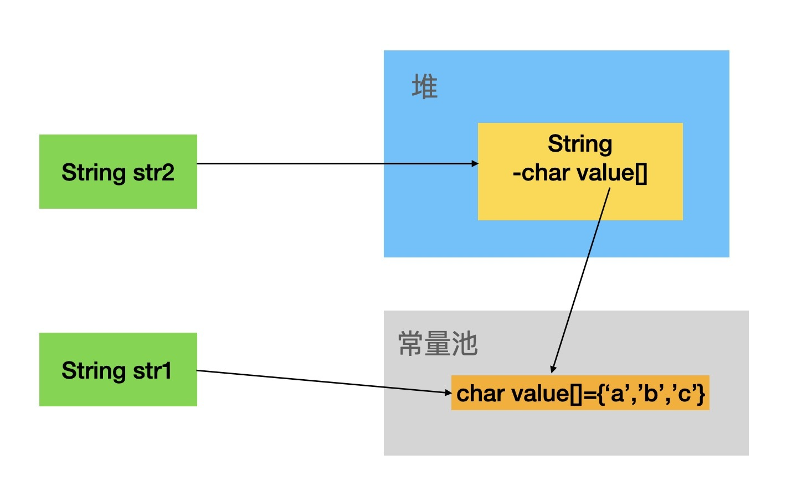

# String类源码阅读

首先需要了解的重点：

- String **字符串是常量，其值在实例创建后就不能被修改**，但字符串缓冲区支持可变的字符串，因为缓冲区里面的不可变字符串对象们可以被共享。

## 1. 类头

final表示禁止继承；

没有父类对象（默认继承Object类）

实现了3个接口：表示可序列化、**可比较**（表示同类型的对象可以通过该方法进行比较）、

```java
public final class String
    implements java.io.Serializable, Comparable<String>, CharSequence {}
```

### 接口：

要有比较能力

```java
public interface Comparable<T> {
    public int compareTo(T o);
}
```

规定了字符串需要有的能力

```java
public interface CharSequence {
	int length();
    char charAt(int index);		// 获得指定下标的字符
    CharSequence subSequence(int start, int end);
	public String toString();
    public default IntStream chars() {....}		//jdk1.8之后新增的接口默认方法s
    public default IntStream codePoints() {...}	//jdk1.8之后新增的接口默认方法
}
```

## 2. 实例变量

```java
private final char value[];	// 存在一个字符数组来表示字符串，注意是final——不可修改的
private int hash;			// 用来缓存string生成的hash值
private static final long serialVersionUID = -6849794470754667710L;	// 用来反序列化的
```

理解：

1. value变量被final修饰，说明一旦被赋值就不能被修改，即该变量不能指向另一个变量（针对引用类型）

   ps：这边需要注意，只是说**不能修改引用，但是数组内部的值还是可以改变**，但是由于**没有对外的方法可以修改数组内部的值，所以对外来说string类型的变量就是创建之后不可被修改**


## 3. 构造方法

构造方法：（还有其他的构造方法）

### 3.1 空参数

```java
public String() {
    this.value = "".value;		// ""也是string类型，所以将该对象的value赋值给新string对象的value
}
```

使用：

```java
String s = new String();
s = "hello";			// "hello"是在常量池中
```

看本质：

1. new的时候，创建了一个新的string对象s1，将地址赋值给引用对象s
2. ”hello“是在常量池中创建的，赋值给一个新的string对象s2
3. 新的s2的对象将引用赋值给s

——整个过程中，有**两个string对象**被创建，最后**s修改了引用，而没有修改原来引用对象的内容**

（和包装类很类似，表面上看可以直接修改里面的值，实际上只是修改了引用，eg：Integer i = new Integer("123"); i = 12;——自动调用了valueOf，变成了）

### 3.2 带参构造方法

传递一个string对象

```java
public String(String original) {		// 传递了一个string对象
    this.value = original.value;		// 将char数组和hash值都传递过去了
    this.hash = original.hash;
}
```

传递一个char数组——注意是将内容赋值给value，而不是value直接修改引用

```java
public String(char value[]) {
    this.value = Arrays.copyOf(value, value.length);	//将传过来的char数组拷贝至value数组里面
}

public String(char value[], int offset, int count) {		// 指定拷贝char数组的部分放到value数组里面
    if (offset < 0) {
        throw new StringIndexOutOfBoundsException(offset);
    }
    if (count <= 0) {
        if (count < 0) {
            throw new StringIndexOutOfBoundsException(count);
        }
        if (offset <= value.length) {		// 如果count长度<=0，那么传递一个空字符串即可（同无参构造方法）
            this.value = "".value;
            return;
        }
    }										
    // Note: offset or count might be near -1>>>1.
    if (offset > value.length - count) {
        throw new StringIndexOutOfBoundsException(offset + count);
    }		
    // 以上主要对参数的一些判断——offset是否合法（>=0），count是否合法，是否会越界
    this.value = Arrays.copyOfRange(value, offset, offset+count);	// 赋值指定范围的数组
}
```

字节数组初始化，里面是指定的编码，可以用来转换为char类型的字符

注意：这边是单独建了一个数组，赋值之后将数组首地址赋值给value引用对象

```java
public String(int[] codePoints, int offset, int count) {		// 是int类型的数组
    if (offset < 0) {
        throw new StringIndexOutOfBoundsException(offset);
    }
    if (count <= 0) {
        if (count < 0) {
            throw new StringIndexOutOfBoundsException(count);
        }
        if (offset <= codePoints.length) {
            this.value = "".value;
            return;
        }
    }
    // Note: offset or count might be near -1>>>1.
    if (offset > codePoints.length - count) {
        throw new StringIndexOutOfBoundsException(offset + count);
    }
    // 以上主要判断参数是否合法

    final int end = offset + count;

    // 计算数组的长度
    int n = count;
    for (int i = offset; i < end; i++) {
        int c = codePoints[i];
        if (Character.isBmpCodePoint(c))
            continue;
        else if (Character.isValidCodePoint(c))
            n++;
        else throw new IllegalArgumentException(Integer.toString(c));
    }

    // 创建一个新的数组，赋值，然后将value指向该引用对象
    final char[] v = new char[n];

    for (int i = offset, j = 0; i < end; i++, j++) {
        int c = codePoints[i];
        if (Character.isBmpCodePoint(c))
            v[j] = (char)c;
        else
            Character.toSurrogates(c, v, j++);
    }

    this.value = v;
}
```

还有指定编码形式的：

```java
String(byte bytes[], Charset charset)
String(byte bytes[], String charsetName)
String(byte bytes[], int offset, int length, Charset charset)
String(byte bytes[], int offset, int length, String charsetName)
```

 bytes 字节流是**使用 charset 进行编码**的，想要将他转换成 unicode 的 char[] 数组，而又保证不出现乱码，那就要指定其解码方式

使用StringBuffer的：

```java
public String(StringBuffer buffer) {
    synchronized(buffer) {			// 使用synchronized，满足多线程并发操作
        this.value = Arrays.copyOf(buffer.getValue(), buffer.length());
    }
}
```

使用StringBuilder的：

```java
public String(StringBuilder builder) {
    this.value = Arrays.copyOf(builder.getValue(), builder.length());
}
```

——一般不会这么用，而是先用StringBuilder/StringBuffer，最后完成之后调用它们的toString方法进行转换

如果不考虑线程安全，优先选择StringBuilder

## 4. 实例方法

### 4.1 equals()

判断两个对象是否相等，重写Object的方法

把握关键：String比较的是里面的值，会一个一个进行比较

流程：

1. 先看是否指向同一个对象，如果是同一个对象，就直接返回true
2. 不是指向同一个对象，看类型是否匹配，即传入的是String类型，不是返回false
3. 是同一个类型，将Object强制类型转换为String，然后比较value数组的长度，长度不一致直接false
4. 长度一致的情况下，对两个value数组逐位判断。

```java
public boolean equals(Object anObject) {
    if (this == anObject) {			// 判断是否指向同一个对象，即地址是否一致
        return true;
    }
    if (anObject instanceof String) {		// 对象类型是否是String
        String anotherString = (String)anObject;	// 强制类型转换
        int n = value.length;
        if (n == anotherString.value.length) {		// 判断长度是否一样，一样的前提下才逐位判断
            char v1[] = value;
            char v2[] = anotherString.value;
            int i = 0;
            while (n-- != 0) {
                if (v1[i] != v2[i])
                    return false;
                i++;
            }
            return true;
        }
    }
    return false;
}
```

### 4.2 hashCode()

计算当前对象的哈希值。

```java
public int hashCode() {
    int h = hash;
    if (h == 0 && value.length > 0) {	// 表示未计算过hash值，且字符串长度不为0
        char val[] = value;

        for (int i = 0; i < value.length; i++) {
            h = 31 * h + val[i];
        }
        hash = h;
    }
    return h;
}
```

本质上：$s[0]*31^(n-1) + s[1]*31^(n-2) + ... + s[n-1]$，一个多项式来计算hash值（可以发现前面的字符权重更大）

为啥选31，见[包装类源码ps](#)，主要就是减少冲突。

### 4.3 intern()方法

```java
public native String intern();

// 用法：
String s = new String("124");			// 在堆中创建的
String s2 = s.intern();		// 将s指向的对象加入到常量池，并且把这个引用给s2
System.out.println(s2 == s);		// false，两个的存储地方不一样

// 用法2：
String s = "234";		// 给的是常量，所以直接在常量池中
String s2 = s.intern();		
```

就是将当前对象加入到常量池中常量池中有当前String的值，就返回这个值，如果没有就加进去，返回这个值的引用。

why：`String s = "123"; String s2 = new String("123");`，前者是在常量池中，后者是在堆中分配内存

因为前者在编译期已经确定，后者在运行时才确定。

### 4.4 +/+=运算符

Java编译器提供的功能：String字符串添加操作可以直接通过+/+=实现，但是一般编译中会将其**转换为StringBuilder，+/+=操作会转换成append**

| 创建方式                      | 对象个数 | 引用指向   |
| ----------------------------- | -------- | ---------- |
| String a="wustor"             | 1        | 常量池     |
| String b=new String("wustor") | 1        | 堆内存     |
| String c=new String()         | 1        | 堆内存     |
| String d="wust"+"or"          | **1**    | 常量池     |
| String e=a+b                  | 5        | **堆内存** |

### 4.5 valueOf()方法

类似于包装类的valueOf（将字符串转换成对应的包装类对象），

而String的valueOf就是调用包装类的toString方法

```java
public static String valueOf(int i) {
    return Integer.toString(i);
}
```

### 4.6 toString()方法

```java
public String toString() {
    return this;
}
```

——本质就是调用自己。

### 4.7 toCharArray()

功能：将字符串转换成字符数组

```java
public char[] toCharArray() {
    // 不用Arrays.copyOf，主要原因是初始化顺序的问题
    char result[] = new char[value.length];
    System.arraycopy(value, 0, result, 0, value.length);	// 将value数组全部复制到result数组
    return result;
}
```

如果修改成用`Arrays.copyOf()`会出现，初始化失败`Error occurred during initialization of VM`

分析：`System.initProperties`在初始化系统属性时需要处理一些字符串。初始化时，它可能会调用`String.toCharArray`从这些字符串中获取char数组。如果是调用`Arrays.copyOf`，但在此时，尚未加载/初始化`Arrays`。而System.arraycopy是native不需要输入class initializing request（不知道是否正确）

——总结就是加载顺序的问题

ps：Arrays.copyOf()内部也还是调用了`System.arraycopy()`

参考：https://www.coder.work/article/63390

### 4.8 indexOf()

有多种重载方法：

```java
public int indexOf(String str);		// 查询str在当前string对象的起始地址
public int indexOf(String str, int fromIndex);		// 指定从string的何时开始算
static int indexOf(char[] source, int sourceOffset, int sourceCount,
            String target, int fromIndex);			// 指定string的何时开始算，到何时结束
static int indexOf(char[] source, int sourceOffset, int sourceCount,
            char[] target, int targetOffset, int targetCount,
            int fromIndex);				// 并且也指定target的何时开始何时结束

static int indexOf(char[] source, int sourceOffset, int sourceCount,
            char[] target, int targetOffset, int targetCount,
            int fromIndex) {
    if (fromIndex >= sourceCount) {
        return (targetCount == 0 ? sourceCount : -1);
    }
    if (fromIndex < 0) {
        fromIndex = 0;
    }
    if (targetCount == 0) {
        return fromIndex;
    }		
    // 以上是参数合法性判断

    char first = target[targetOffset];
    int max = sourceOffset + (sourceCount - targetCount);

    for (int i = sourceOffset + fromIndex; i <= max; i++) {
        /* Look for first character. */
        if (source[i] != first) {
            while (++i <= max && source[i] != first);
        }

        /* Found first character, now look at the rest of v2 */
        if (i <= max) {
            int j = i + 1;
            int end = j + targetCount - 1;
            for (int k = targetOffset + 1; j < end && source[j]
                 == target[k]; j++, k++);

            if (j == end) {
                /* Found whole string. */
                return i - sourceOffset;
            }
        }
    }
    return -1;
}
```

### 4.9 compareTo：比较字符串大小

从前向后比，遇到第一个不一样的就进行比较。如果一直都一样就比长短，如果长度一样，那么就是相等的

- `>0`，当前对象大
- <0，当前对象小
- =0，一样

```java
public int compareTo(String anotherString) {
    int len1 = value.length;
    int len2 = anotherString.value.length;
    int lim = Math.min(len1, len2);
    char v1[] = value;		// 1是自己，2是对方
    char v2[] = anotherString.value;

    int k = 0;
    while (k < lim) {
        char c1 = v1[k];
        char c2 = v2[k];
        if (c1 != c2) {
            return c1 - c2;
        }
        k++;
    }
    return len1 - len2;
}
```

### 4.10 trim：修剪字符串

就是将字符串最前面和最后后面的空格全部删除，然后

```java
public String trim() {
    int len = value.length;
    int st = 0;
    char[] val = value;    /* avoid getfield opcode */

    while ((st < len) && (val[st] <= ' ')) {
        st++;
    }
    while ((st < len) && (val[len - 1] <= ' ')) {
        len--;
    }
    // 如果确定需要截取，那么去获得子串（就是创建一个新的字符串）；如果不需要截取直接返回当前对象
    return ((st > 0) || (len < value.length)) ? substring(st, len) : this;
}
```

### 4.11 subString()：获取子字符串

可以只指定起始，那么就是从起始到结束

也可以指定起始和结尾，那么就是截取部分

——本质就是创建新的字符串对象

```java
public String substring(int beginIndex, int endIndex) {			// [)
    if (beginIndex < 0) {
        throw new StringIndexOutOfBoundsException(beginIndex);
    }
    if (endIndex > value.length) {
        throw new StringIndexOutOfBoundsException(endIndex);
    }								// 判断传参
    int subLen = endIndex - beginIndex;			// 确定截取的长度
    if (subLen < 0) {
        throw new StringIndexOutOfBoundsException(subLen);
    }
    return ((beginIndex == 0) && (endIndex == value.length)) ? this
        : new String(value, beginIndex, subLen);			// 如果参数就是现在的开头和结尾并并不截取；否则，创建一个新的字符串对象
}
```

# String常用方法：

## 1. 创建

```java
String s = new String(xxx);

String s = "hello";
```

## 2. 查

```java
s.length();			// 求字符串长度——直接获取字符数组的长度
s.isEmpty();		// 判空，看是否是""字符串
```

```java
s.charAt(2);		// 获取指定位置的字符——value数组索引即可O(1)
```

```java
s.subString(3, 6);		// 截取字符串[)
s.getBytes()			// 获取字节数组
```

## 3. 改

```
s.toCharArray();		// 转换成字符串
```

```java
s.toUpperCase();		// 可以将string里面所有字符的变成大写
s.toLowerCase();		// 可以将string里面所有的字符变成小写
```

## 4. 删

```java
s.trim();		// 去掉起始和结尾的空格
```

根据匹配给定的正则表达式来拆分字符串：

**注意：** **.** 、 **$**、 **|** 和 ***** 等转义字符，必须得加` \\`。

**注意：**多个分隔符，可以用 **|** 作为连字符。

```java
String[] strs = s.split(正则表达式分隔符, 分隔的份数);	
String[] strs = s.split(正则表达式分隔符);
```

参考：

1. https://juejin.cn/post/6844903508911587342

# ps：面试考点

## 1. new String()创建几个对象 & +相关

```java
String str1 = "abc";		// 直接赋值，在常量池中
String str2 = new String("abc"); // 调用构造方法
```

直接赋值：**等于是创建0个或1个对象**。常量池中已经存在了“abc”，那么不会再创建对象，直接将引用赋值给str1；如果常量池中没有“abc”，那么创建一个对象，并将引用赋值给str1。

new：**创建1个或2个对象**。"abc"本质上还是一个字符串，也需要新建(新建在常量池上)，首先看常量池中是否存在“abc”，如果不存在“abc”这个字符串，则会先在常量池中创建这个一个字符串；然后再执行new操作，会在堆内存中创建一个存储“abc”的String对象，对象的引用赋值给str2。——所以如果"abc"存在，那么创建一个堆上的对象；如果不存在，创建两个对象，一个常量池中，一个堆中



eg1:

```java
String str = "abc" + "def";
```

编译器优化，合并。只创建一个对象

在编译时已经被合并成“abcdef”字符串，因此，只会创建1个对象。并没有创建临时字符串对象abc和def，这样减轻了垃圾收集器的压力。

```java
String s1= "a";		// 常量池
String s2= "bc";
String str= s1 + s2;		// 合并的abc是常量池中的，且会在堆中创建一个对象存储abc
```

创建4个对象，3个在常量池中，1个在堆中

eg3：

```java
String str = "abc" + new String("def");
```

编译器会优化成：

```java
String s = new String("def");
String str = new StringBuilder().append("abc").append(s).toString();
```

所以第一行生成2个，第二行："abc"1个， StringBuilder1个，一共4个，"defabc"1个，在堆中

参考：https://cloud.tencent.com/developer/article/1686226