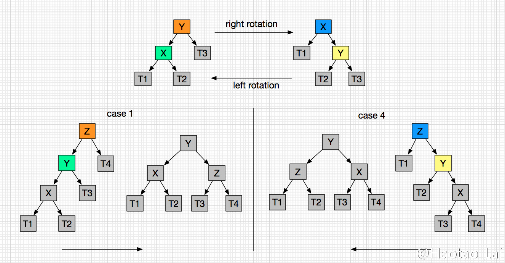
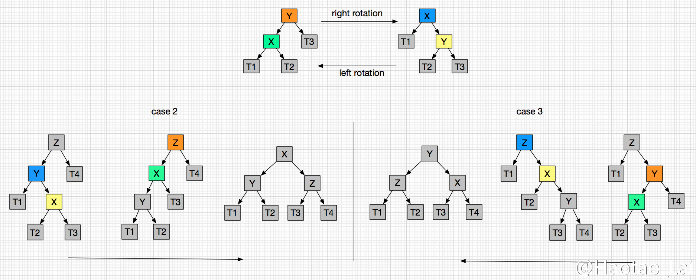
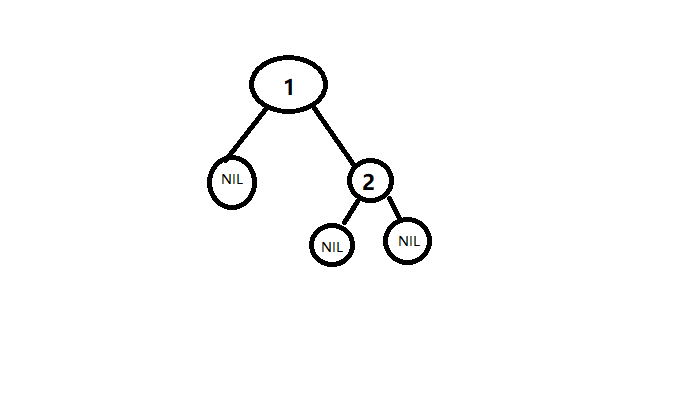

# 数据结构

# ——红黑树

## 1. 基础知识

### 1.1 二叉搜索树（BST）

又称为有序二叉树/排序二叉树

二叉搜索树在满足二叉树的基础上，还需满足如下条件：

- 若任意节点的左子树不空，则左子树上所有节点的值均小于它的根节点的值；——即左边均小于根节点
- 若任意节点的右子树不空，则右子树上所有节点的值均大于它的根节点的值；——即右边均大于根节点


优势：二叉查找树相比于其他数据结构的优势在于查找、插入的[时间复杂度](https://zh.wikipedia.org/wiki/时间复杂度)较低。为$O(logN)$

缺陷：会根据输入的先后顺序构建二叉树，如果输入的本身是一个升序数组，那么二叉树会**退化成单链表**，查找效率最坏会降低为 `O(n)`

——这就是**二叉搜索树的不平衡性**

所以，我们需要在此基础上进行改进：

ps：对于二叉搜索树，不存在重复节点，因为只会匹配第一个值一样的节点，不需要存在重复节点了。

针对二叉查找树的增、改、查都比较简单，递归找到适合的位置即可

```java
/*这里可能会修改根节点指针，所以采用二级指针传递
任意左右子树也是二叉查找树，也有相应的“根节点”*/
bool insertNode(BinaryTree **ppBinaryTree, int value)
{
	if (NULL == ppBinaryTree)
		return false;
 
	if (NULL == *ppBinaryTree)    //空树及递归终止条件
	{
		*ppBinaryTree = createTreeNode(value);  //创建树节点插入
		assert(NULL != *ppBinaryTree);
		return true;
	}
	else
	{   //插入值小于其根节点键值，遍历左子树
		if (value < (*ppBinaryTree)->value)
			return insertNode(&(*ppBinaryTree)->left_child, value);
 
		//插入值大于其根节点键值，遍历右子树
		else if (value > (*ppBinaryTree)->value)
			return insertNode(&(*ppBinaryTree)->right_child, value);
 
		//重复元插入，直接返回
		else
			return false;
	}
}
```

而二叉树的删除：比较麻烦，因为删除的位置不确定，且删除之后还需要维护二叉搜索树的特性，有如下情况：

- 删除节点为叶子节点即没有左右儿子：直接删除即可

- 删除节点只有左孩子：直接用左孩子代替

- 删除节点只有右孩子：直接用右孩子代替

- 删除节点左右孩子均存在：**右子树的最小的数据代替**该节点的数据（即**该子树的中序遍历的第一个节点，即后继节点**），并递归地删除那个右子树的最小节点

  （因为，节点的右子树的值均大于左子树的值，所以右子树的最小值既小于右子树的其他值，又大于左子树的所有值，符合作为新的根）
  
  当然也可以选择左子树的最大数据来代替，即中序遍历的前一个结点，前驱结点
  
  步骤：先找到最大or最小，与要删除的结点进行替换，那么要删除的结点肯定在最底层，要么为：
  
  - 叶子结点：变成情况1
  - 非叶子节点：如果选择左边最大，那么它最多只会有左孩子，所以变成情况2；如果选择右边最小，那么它最多只会有右孩子，所以变成情况3

具体实现看：https://mp.weixin.qq.com/s?__biz=MzA4NDE4MzY2MA==&mid=2647521508&idx=1&sn=ff0751a1a49a48450757b53978fcbef8&chksm=87d247e7b0a5cef1f5f581cfa843b68021a51e979ee49b2b947cf394c613b4701ac07a8e8a76&cur_album_id=1338152221988585473&scene=189#rd

### 1.2 平衡二叉树（AVL）

在BST的基础上的改进。是一种自平衡的树。

在BST的基础上，还要求：**左右子树的高度差不超过1**，那么能保证不会退化成链表

AVL树的**查找稳定**，查找、插入、删除的时间复杂度都为O(logN)，但是由于要维持自身的平衡，所以进行插入和删除结点操作的时候，需要对结点进行**频繁的旋转**。

#### 平衡因子：

平衡因子：某个结点的左子树的高度减去右子树的高度得到的差值；

而平衡因子就是监督二叉树是否是AVL树的指标：**AVL树就是平衡因子的绝对值不超过1**

判断过程：递归计算树的左右节点的高度，看他们的差值是否在1以内。

引起非平衡的情况：进行插入或者删除操作，就会触发**二叉树的再平衡**。

难度在于如何进行**二叉树的平衡化**：

#### AVL的再平衡操作：

有两大基础操作： **左旋和右旋**。左旋，即是逆时针旋转；右旋，即是顺时针旋转。这种旋转在整个平衡化过程中可能进行一次或多次，这两种操作都是从**失去平衡的最小子树根结点**开始的(即离插入结点最近且平衡因子超过1的祖结点)。

而非平衡情况存在4种：**LL、RR、LR、RL**，分别表示：左子树的节点引起的非平衡，右子树的右节点引起的非平衡，左子树的右节点引起的非平衡，右子树的左节点引起的非平衡，前两种需要一次旋转才能平衡；后两种需要两次旋转才能平衡。

下面看一下具体图形场景：

右旋、左旋的代码实现：（基本旋转代码）

```java
/*
struct Node {
    int             data;		// 数据
    int             height;		// 以它为根节点的树深度
    struct node     *left;
    struct node     *right;
}
typedef struct Node AVLNode;
*/
AVLNode rightRotate(AVLNode root){			// 传的参就是失去平衡的最小子树根节点
    AVLNode newRoot = root.left;		// 最新的根节点就是节点的左孩子
    AVLNode temp = newRoot.right;		
    newRoot.right = root;
    root.left = temp;			// 左孩子的右孩子需要插入到根节点下，作为根节点新的左孩子
    root.height = Math.max(root.left.height, root.right.height);
    newRoot.height = Math.max(newRoot.left.height, newRoot.right.height);		// 注意要更新这两个节点的高度值，且顺序不能变，因为此时的根节点变成了newRoot，而原来的root变成该节点的右孩子，所以要先计算右孩子的高度，后才能计算根的高度
    return newRoot;
}

AVLNode leftRotate(AVLNode root){			// 和上面是对称操作
    AVLNode newRoot = root.right;
    AVLNode temp = newRoot.left;
    newRoot.left = root;
    root.right = temp;
    root.height = Math.max(root.left.height, root.right.height);
    newRoot.height = Math.max(newRoot.left.height, newRoot.right.height);
    return newRoot
}
```

下面是针对LL和RR情况的判断和重平衡操作：



```java
AVLNode rebalanced(AVLNode root)
  balancedFactor = getBalancedFactor(root);					// 计算平衡因子，L-R
  if(factor > 1 && getBalancedFactor(root->left) > 0) // 非平衡了，且左子树的高度差为1（左子树的左子树深度更深）LL，所以右旋即可
      return rightRotate(root);					
    
  else if(factor < -1 && getBalancedFactor(root->right) <= 0)	// 非平衡了，且右子树的高度差为-1（即右子树的右子树深度更深），RR，所以左旋
      return leftRotate(root);      // RR
}
```

还存在LR、RL的情况：

本质思想就是将LR转换成LL（用左旋），然后再旋转；RL同理。



```java
AVLNode rebalanced(AVLNode root) {
	balancedFactor = getBalancedFactor(root);
    if(balancedFactor > 1 && getBalancedFactor(root->left) < 0){	// LR情况
        root.left = leftRotate(root.left);			// 先对根节点的右孩子左旋，出现LL情况，然后再右旋
        return rightRotate(root);
    }
    else if(balancedFactor < -1 && getBalancedFactor(root.right) > 0){		// RL情况
        root.right = rightRotate(root.right);
        return leftRotate(root);
    }
}
```

将上面4种情况进行合并就能完整的写出`rebalanced()`的代码了。

#### 插入节点：

```java
void treeInsert(AVLNode* rootptr, int value){		// 传参是地址的地址，那么可以直接更新内部的数据
    AVLNode newNode;			// 要创建的新节点，是地址
    AVLNode* root = *rootptr;	
	
    // 递归终止条件
    if(root == NULL) {				// 当前节点为根节点，是可以作为覆盖的节点——即数据就插在这里
        newNode = malloc(sizeof(node_t));		// 初始化该节点
        assert(newNode);		// 值为null，表示申请失败

        newNode.data = value;
        newNode.left = newNode.right = NULL;
        *rootptr = newNode;		// 更新地址节点
    } else if(root.data == value) {			// 如果该值已经存在，那么不需要重复添加了
        return;
    } else {
        if(root.data < value)			// 大于当前节点的值，那么会插入右子树中
            treeInsert(&root.right,value);		// 递归调用
        else
            treeInsert(&root.left,value);
    }
	
    newNode.height = max(height(rootptr->left), height(rootptr->right)) + 1;		// 需要更新每一层的树的高度
    treeRebalance(root);			// 除非是创建新节点，不然每次都会判断该节点的树是否平衡，不平衡就旋转
}
```

#### 删除节点：

——遵循的就是二叉查找树的删除规则，然后重建树的平衡

```java
void treeDelete(AVLNode *rootptr, int data)		// 根节点指针
{
    AVLNode toFree; // 保存要释放的节点，用来释放该空间
    AVLNode *root = rootptr;

    if(root) {
        if(root->data == value) {				// 找到了当前要删除的节点
            if(root->right) {
                root->data = treeDeleteMin(&(root->right));
            } else {
                toFree = root;
                *rootptr = toFree->left;
                free(toFree);
            }
        } else {				// 没匹配，就根据节点值去左右子树里面找
        if(root->data < value)
            treeDelete(&root->right,value);
        else
            treeDelete(&root->left,value)
        }

        treeRebalance(root);
    }
}
```

缺点：对于平衡要求太严，一般插入或者删除都会引起旋转来调整，所以性能不是很好

### 1.3 B树


## 2. 红黑树

规则：

红黑树是一种结点带**有颜色属性**的BST，但它在二叉查找树之外，还有以下要求：

1. 节点是红色或黑色。

2. **根是黑色。**

3. 所有叶子都是黑色（叶子是NIL节点）。

4. 每个红色节点必须有两个黑色的子节点。（从每个叶子到根的所有路径上不能有两个连续的红色节点。）

5. 从任一节点到其每个叶子（即NIL）的所有路径都包含相同数目的黑色节点

   =>从规则5可以得出：**如果一个节点存在黑色子节点，那么该节点一定有两个节点**。

   因为如果不满足上面条件，那么该节点存在一个子节点为NIL节点，而非NIL节点下面的NIL节点的路径一定 > 直接的NIL节点

   eg: 即为一个反例

   

ps：叶子节点不是我们常规理解的叶子，而是NIL节点，即值为null的节点


红黑树不是一个完美的AVL树，它是**满足黑色完美平衡的**（因为需要满足规则5）——根据科学家的研究，只需要是满足上面5个条件的红黑树就是**趋近于平衡状态的**（不需要知道原理）

红黑树实现规则的基本操作：**变色、左旋、右旋**

黑树由于在插入和删除结点时都会进行变色旋转等操作，在符合红黑树条件的情况下，即使一边子树全是黑色结点，另一边子树全是红黑相间，两子树的高度差也不会超过一半。一棵有 n 个结点的红黑树**高度至多为 `2log(n+1)`**，查找效率最坏为 **`O(log(n))`**。

### 查找

因为不会改变红黑树的结构，所以很简单，就是二叉查找树的查找过程

### 插入

找到插入的位置，再平衡

首先需要明白：**插入的节点一定要设置为红色**，因为插入黑色一定会破坏红黑树的平衡性，而红色不一定会破坏，eg：插入的位置的父节点是黑色的，那么还是平衡的。

有如下几个场景：

1. 树为空树

   将该节点插入作为根节点，且颜色修改为黑

2. 插入的key已经在树中存在——发生冲突

   找到该冲突节点，覆盖原来的节点，并将颜色修改为同样颜色即可（不会修改该树的结构）

3. 插入节点的父节点为黑色

   由于插入的节点是红色的，而父节点是黑色的，满足规则，且路径上的黑节点没有增加，那么不会破坏平衡

   

4. 插入节点的父节点为红色

   首先明白，在插入之间是平衡的，所以父节点为红色，那么爷爷节点一定是黑色的

   由于插入的节点也是红色，所以出现**红红相连**。

   1. 存在叔叔节点，且叔叔节点也为红

      那么将父节点和叔叔节点均修改为黑色，且将爷爷节点修改为红色。将爷爷节点设置为当前节点，向上递归修改

      

      如果爷爷的父节点为黑色，那么达到平衡；如果爷爷节点的父节点为红色，那么根据规则4的3种小情况，递归修改，一直到根/父节点为黑色的情况

   2. 存在叔叔节点，且颜色为黑 / 叔叔节点不存在

      1. 父节点是爷爷节点的左孩子
         - 如果插入节点是父节点的左孩子，那么出现LL双红

           将父节点设置为黑色，将爷爷节点设置为红色，然后以爷爷节点为根进行右旋（父节点为根节点，爷爷节点为父节点的右孩子）

         

         - 如果插入节点是父节点的右孩子，那么出现LR双红

           然后先进行以父节点为根的左旋，然后变成LL双红

           然后步骤同4.2.1.1

           

      2. 父节点是爷爷节点的右孩子

         是上面的对称操作

         - 如果插入节点是父节点的右孩子，那么出现RR双红

           将父节点设置为黑色，将爷爷节点设置为红色，然后以爷爷节点为根进行左旋（父节点为根节点，爷爷节点为父节点的左孩子）

           

      - 如果插入节点是父节点的左孩子，那么出现RL双红

        先以父节点为根进行右旋，然后变成RR双红

        然后步骤同4.2.2.1

        

所以出现双红相连，那么先看叔叔节点，然后选择是4.1还是4.2，如果选择4.2（叔叔节点为黑色），那么看双红相连是LL、LR、RR、RL，然后选择旋转方式

eg：


7要插入到8的左边，而8是红色的，所以出现了红红相连 -> 然后看7的叔叔节点，发现也是红色的，所以用4.1：

- 将爷爷节点15变成红色，
- 父节点和叔叔节点全部从红色变成黑色，所以达到状态2

然后以爷爷节点15为当前节点，15的父节点是红色的，所以出现了红红相连 -> 所以看15的叔叔节点，发现是黑色的，所以用4.2 -> 15的父节点是爷爷节点的左孩子，所以用4.2.1 -> 而15是父节点的右孩子，所以是LR模式，用4.2.1.2：

- 先转换成LL模式，不变颜色，所以15变成父节点，5变成15的左孩子，此时达到了LL双红，达到状态3
- 再使用4.2.1.1，需要注意的是：**5是当前节点，15是父节点，19是爷爷节点**，所以15变成黑色，19变成红色，然后以19为基准右旋，15变成爷爷节点，5和19变成它的子节点，这个就是状态4、5、

最后，发现遍历到根，所以递归结束，达到平衡

ps：如果调整到最后，发现根结点为红色，而其他均已经调整过了，即下面的每个到叶子结点的路径均实现黑色平衡，那么将根结点直接调整为黑色。

### 删除

首先看：确定待删除节点有几个孩子，如果有两个孩子，不能直接删除该节点。需要该节点的前驱（中序遍历的前驱，即该节点左子树中最大的节点）或者后继（中序遍历的后继，该节点右子树中最小的节点），然后将左子树的最大 or 右子树的最小替换为被删除的结点（颜色不动，即**颜色不跟结点走**，颜色跟着位置，那么该红黑树仍保证高度平衡），接下来就是以该结点为树，进行删除

——所以，即使删除结点左右孩子都存在，**最终都会退化到删除结点是叶子结点或者是只有一个孩子的情况**，且最终删除的位置一定在树的底部了

所以，我们可以将问题简化为：**被删除结点是叶结点或者仅有一个孩子的情况。**

v：要被删除的结点，u：要替换的结点

1. u/v存在一个红色结点：它们肯定是相邻的，所以两个里面肯定只有一个为红色，那么将u设置为黑色，然后替换，v被删除

   eg：u是红色：那么v一定是黑色，所以为了维护高度平衡，所以u要变成黑色然后升级

   

   u是黑色，那么是v是红色，因为是到最底层了，所以只有可能是u是nIL/单节点（没有构成树），且v的另外一个还是是nIL，所以实际上，替换之后，v的另外一个孩子就不存在了

   

2. u和v都是黑色

   1. 


## 为什么不用平衡二叉树作为底层实现

那是因为平衡二叉是高度平衡的树, 而每一次对树的修改, 都要 rebalance, 这里的开销会比红黑树大。

使用场景：

- AVL要求严格高度平衡，查找效果更好所以适合在查找为主的场景
- rbTree高度要求不严格，所以适合在插入和删除为主的场景

空间占用：

- AVL要求每个结点存储平衡因子，O(N)
- rbTree只需要根据key的符号位来存储红黑色的信息，eg：正表示黑，负表示红，不需要额外空间

速度：

- AVL：树的高度1.44 lg(n + 2)，所以查找较快
- rbTree：树的高度2log(n+1)（不完全正确，是根据红黑交替的情况来），查找较慢


参考和图来自：

1. https://www.jianshu.com/p/65c90aa1236d
2. https://zhuanlan.zhihu.com/p/34899732
3. https://www.bilibili.com/video/BV1UJ411J7CU?p=2
4. https://linuxstyle.blog.csdn.net/article/details/88939297?utm_medium=distribute.pc_relevant.none-task-blog-BlogCommendFromMachineLearnPai2-4.control&dist_request_id=1328602.68898.16152547117679767&depth_1-utm_source=distribute.pc_relevant.none-task-blog-BlogCommendFromMachineLearnPai2-4.control
5. https://zhuanlan.zhihu.com/p/145006031