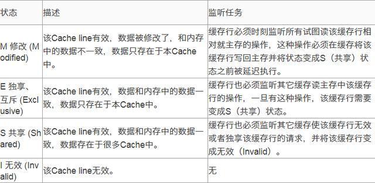

# Java内存模型和线程

感觉这部分是对Java并发的一个底层的补充，所以并发主要内容还是见[并发](https://github.com/amyZhoucc/CS/blob/main/java/Java%E5%9F%BA%E7%A1%80%E7%9F%A5%E8%AF%86/Java%E5%B9%B6%E5%8F%91%E7%9F%A5%E8%AF%86.md)。

ps: Amdahl定律：系统通过**并行化和串行化的比重**来描述多处理器系统获得的运算加速的能力。

​	  摩尔定律：处理器**晶体管数量**和运行效率之间的发展关系。

并发应用场景：服务端需要同时对多个客户端提供服务，那么每个任务都会对应一个线程去执行，如何能够保证任务（线程）之间的有序性，就是并发的主要任务。**衡量服务性能：每秒处理事务数TPS**

注意：这边的内存模型，是指**对内存/cache读写访问的抽象模型**，而不是指前面的Java相关数据的具体存储结构。

## 1. 物理计算机的并发问题

主要是，硬件上的并发问题可以类推到JVM上，所以需要了解一下。

### 缓存一致性

背景：主要是引入了cache，cache是为了调和处理器的计算速度和存储设备的通信速度的几个数量级的差距。所以，现代操作系统，引入了一层或者多层的处理器高速缓存。

cache主要是用来作为内存和处理器之间的缓冲：运算需要的数据复制到缓存中进行使用，更新完成之后写回主内存。

引入的问题：缓存一致性：**每个处理器有自己的cache，却又共享主内存（共享内存多核系统），那么会存在缓存不一致的情况，当修改的是同一个内存块的内容时，就会发生内存不一致**。——出现在多处理的设备中（单处理器不存在该问题）

所以为了保证一致性，各个处理器访问缓存时都遵循一些协议，在**读写时要根据协议来进行操作，这类协议有MSI**等。

所以，硬件的内存遵循以下结构：


#### ps: 缓存一致性协议MESI

保证缓存一致性有如下两种方法：

- 基于侦听形式的高速缓存一致性协议（或侦听协议）

  依赖于一个总线或者类总线形式的网络连接

  单个处理器核的私有缓存所发出的所有请求会被广播到系统中所有的其它处理器核的私有缓存中

  ——会影响整个系统的扩展性

- 基于目录结构的高速缓存一致性协议（或目录协议）

**MESI协议缓存状态：**



M表示更新了，但是尚未同步到主内存中。那么如果其他cache需要读取（监听读），需要等待该变量被更新到主内存中之后才能读取

E表示独占，就是该变量只有一个cache缓存了，且未修改过（如果发现多个cache缓存了（监听），那么会变成S）

S表示共享，未修改过，且有多个cache缓存该值

I表示无效，如果其他cache修改了值，要求独占该cache内容，那么会变成invalid

——这边的意思是：cpu不仅会嗅探总线上发生的事情，也会嗅探对应共享变量的缓存行，看数据是否修改，如果修改就变成invalid（而不是在写回主内存的时候进行嗅探），而如果其他cache需要用到该值时，当前cache才会将前面M的数据写回主内存（然后从M-E），然后其他cache才会从内存中读取（I-S）

参考：https://cloud.tencent.com/developer/article/1548942

### 乱序执行优化

为了运算单元被充分利用，所以会对输入代码进行**乱序排序**，就是在保证结果一样的情况下，对指令顺序进行重组。而如果一个任务依赖的是另一个计算任务的中间值，那么就会存在问题

对应的，Java中也存在**指令重排序优化**

——所以cache、乱序执行既是优化，又会带来隐患。

## 2. Java内存模型

### 2.1 主内存和工作内存

内存模型，主要关注：**在JVM中将变量存储到内存、从内存中取出变量的具体细节。**

注意：这边的变量是指共享变量，而不是线程私有栈中的局部变量。它包括了**实例字段、静态字段和构成数组对象的元素**，但是不包括局部变量与方法参数。

eg：引用类型，对象本身是在Java对中的，所以是”变量“，而reference本身就是在线程栈中的。

Java内存模型规定：**所有变量需要存储在主内存中**（这边的主内存和物理上的主内存不一样，这边的主内存只是虚拟机内存的一部分）

每个线程还有一个**工作内存**（类似于cache），工作线程是保存了该线程所使用的变量的主内存的副本（对于副本，可能是对某个用到的对象的用到的某些字段进行复制，可能不会复制整个对象），**对变量的操作都在工作内存中，不能直接操作主内存**。	


可以发现和物理的内存结构很像。

类比：主内存就对应着物理设备上的物理内存；工作内存就对应着存储器和cache。

### 2.2 内存的交互操作

主要针对主内存到工作内存的拷贝；工作内存到主内存的同步操作

有8种操作：

- lock/unlock：对于主内存变量，一个线程将其锁定，那么其他线程将无法使用该变量
- read + load：对于主内存变量，将其传输到工作内存中；对于工作内存变量，将传输的变量放到工作内存中（必须配合使用）
- use：对于工作内存变量，将变量值给执行引擎
- assign：对于工作内存变量，将执行引擎的给的值赋值给工作内存变量
- store/write：read+load的反操作（必须配合使用）

### 2.3 完整理解volatile

是最轻量级的同步机制

volatile主要保证了：**可见性 和 有序性**。但是**不能保证原子性**。

可见性：一个线程修改了一个变量的值，那么其他线程能够立即得知最新的值。能够保证缓存一致性

不能保证原子性：在并发下，volatile不能保证线程安全。更具体地，对于单个读/操作，是能够保证原子性的；对于复合操作i++，是不能保证的

eg：经典的例子：`volatile i = 0; i++;`：

```java
public class VolatileTest {
    public static volatile int race = 0;
    public static void increase() {
        race++;
    }
    private static final int THREADS_COUNT = 20;
    public static void main(String[] args) {
        Thread[] threads = new Thread[THREADS_COUNT];
        for (int i = 0; i < THREADS_COUNT; i++) {
            threads[i] = new Thread(new Runnable() {
                @Override
                public void run() {
                    for (int i = 0; i < 10000; i++) {
                        increase();
                    }
                }
            });
            threads[i].start();
        }
        // 等待所有累加线程都结束
        while (Thread.activeCount() > 1)
            Thread.yield();
        System.out.println(race);
    }
}
```

理解：`race++;` = 取出race，然后对race做增加操作，然后根据volatile的要求，将race写回内存。——并且只是字节码就不能保证原子性，如果转换成指令更加不能：

```java
public static void increase();
Code:
Stack=2, Locals=0, Args_size=0
0: getstatic #13; // 取出race
3: iconst_1
4: iadd
5: putstatic #13; // 写回内存
8: return
....
```

而**volatile只能保证race取出是最新的**，然后放到操作栈栈顶，但是在做增加操作时，（可能被其他线程打断，再次调度回来后）可能其他线程已经修改了内存中的值，但是执行的时候还是从栈顶读取，那么该操作的数已经过时，然后再该变量写回内存，已经是旧的值。

所以，volatile只能用在如下两种场景：

1. 变量运算并不依赖变量当前的值，或只有一个线程能够修改变量的值

   eg：i++，运算需要依赖之前的值，那么不符合要求

2. 变量不需要其他的状态变量共同参与不变约束

eg：合适的场景：

```java
volatile boolean shutdownRequested;
public void shutdown() {
    shutdownRequested = true;
}
public void doWork() {
    while (!shutdownRequested) {
        // 代码的业务逻辑
    }
}
```

有序性：**volatile能够禁止指令重排优化**

eg：DCL的单例模式：

```java
private static volatile Singleton singleInstance;		// 注意是需要volatile修饰的		
public Singleton getInstance(){
    if(singleInstance == null){						// 第一次检测，如果检测为null，那么尝试获得锁去申请对象
        synchronized(Singleton.class){
            if(singleInstance == null){				// 再次判断
                singleInstance = new Singleton();
            }
        }
    }
    return singleInstance;
}
```

主要问题发生在赋值`singleInstance = new Singleton();`中，它不是原子操作，实际上由多个指令共同组成：对象初始化、引用对象赋值等，如果将这两个顺序调换，单线程下的结果一样，但是对于多线程，如果先赋引用后初始化，那么存在其他线程看到`singleInstance!=null`，就使用了这个未初始化的变量。而volatile是禁止指令重排的（与该变量相关的指令禁止重排），所以**它能够保证这边先初始化后赋值**，所以volatile是必要的

```java
0x01a3de0f: mov $0x3375cdb0,%esi 	;...beb0cd75 33
									; {oop('Singleton')}
0x01a3de14: mov %eax,0x150(%esi) 	;...89865001 0000
0x01a3de1a: shr $0x9,%esi 			;...c1ee09
0x01a3de1d: movb $0x0,0x1104800(%esi) ;...c6860048 100100  赋值操作
0x01a3de24: lock addl $0x0,(%esp) 	;...f0830424 00	lock修饰的空操作（IA32不允许lock修饰nop）
									;*putstatic instance
									; - Singleton::getInstance@24
```

——可以看到最后执行了`lock addl $0x0,(%esp)`，后面的加其实就是一个空操作，前面lock，默认有**内存屏障的效果**，即到这边前面操作必须都完成，主要原因是：lock会将**之前的修改写入内存**，写入也会导致其他处理器的缓存无效，从而实现了volatile的内存可见性。

### 2. happens-before原则

Java语言天然存在着一种原则：**happens-before原则**，这个是JMM设计者实现时控制好的。

**通过happens-before原则，可以判断并发操作环境下，对数据的操作是否存在竞争，线程是否安全**。而如果满足该原则，则不存在竞争，线程安全。如果不满足，那么需要自行加锁来实现线程安全。

概念：happens-before：是指两个操作的偏序关系

eg：A 先行发生于 B，那么表示**A操作产生的影响将会被B操作观察到**。这边的影响是指：修改了共享内存的值、发送了消息、调用了方法。

eg：

```java
// 以下操作在线程A中执行
i = 1;
// 以下操作在线程B中执行
j = i;
// 以下操作在线程C中执行
i = 2;
```

理解：假定 A的操作 happens-before B操作，那么执行之后j=1

在此A先行发生于B的基础上，加入了线程C，而C与B没有先行关系（那么C操作产生的影响不会被B观察到），那么B读取到的i的值是不确定的，可能是1，可能是2。所以是非线程安全的

JMM给定的happens-before原则，即没有同步器也能保证两个操作的串行执行，而如果操作无法从规则中推导出来，就不能保证顺序性

1. **程序次序规则**：在一个线程内，按照控制流顺序，写在前面的语句一定 先行发生于 后面语句

   （但是，不能保证前一行在时间上一定执行的比后一行早，如果不存在关系，则还是可以重排序的）

   ```java
   // 同一个线程内
   int i = 0;
   int j = i;		// 两者存在关系，能够保证顺序性
   ```

2. 监视器锁规则：一个锁的unlock操作，一定 先行发生于 后面对同一个锁的lock操作

   ——这边要是**同一个锁**

   后面是一个时间概念

3. volatile变量规则：对一个volatile变量的写操作 先行发生于 后面对它的读操作

   后面是一个时间概念

4. 线程启动规则：Thread.start()操作一定 先行发生于 该线程的所有操作

5. 线程终止规则：线程中的所有操作一定 先行发生于 对线程的终止检测，即threadB.join()，Thread.isAlive()之后的操作都是发生在线程执行完成之后

6. 线程中断规则：对线程interrupt()方法的调用先行发生于被中断线程的代码检测到中断事件的发生

7. 对象终结规则：一个对象的初始化完成（构造函数执行结束）先行发生于它的finalize()方法的开始。

8. 传递性：A先行发生于B，B先行发生于C，则A先行发生于C

注意：**先行发生原则 和 时间先后顺序没有因果关系**。

```java
// 以下操作在同一个线程中执行
int i = 1;
int j = 2;
```

它们满足第一条程序次序规则（i赋值先行发生于j），但是它们的执行顺序可能是互换的，但是不会违背先行发生原则

```java
private int value = 0;
pubilc void setValue(int value){		// 线程A调用
    this.value = value;
}
public int getValue(){			// 线程B调用
    return value;
}
```

在时间上，线程A先调用方法，线程B后调用方法，但是由于不满足先行发生原则，不能保证线程安全。可以加上synchronized/volatile修饰该变量。


