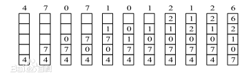

# [146. LRU 缓存机制](https://leetcode-cn.com/problems/lru-cache/)


这个是面试高频题LRU。

题目本身并不难，是一个设计题，如果第一次遇到，且在限定时间内确定数据结构并且完全编写出来，还是有一定难度的；而如果已经写过一次，那么再次写难度会降低很多。

我觉得最关键是：明确数据结构

LRU：最近最少使用，即当内存容量不够时，我们需要将部分页面置换出去，那么如何选择呢——**选择最近最少被用到的页面，将它踢出去。**



所以有如下规则：

1. 如果使用了某个页面，在表中存在，那么可以直接获得该页面，并且由于最近使用过，所以需要将其放在头部
2. 如果使用某个页面，表中不存在，发出缺页中断
3. 缺页中断会去找页面，找到页面之后，需要将该页面插入到表中。如果表没有满，那么直接将该页面插入到头部，因为最近使用过它了
4. 如果表满了，那么将尾部（最少使用的）踢出，然后将待插入的页面放到头部

我们要做的就是模拟这个流程。

主要需要实现两个方法：

1. get：获取指定的页面，如果页面不存在就返回-1；如果页面存在就返回页面信息，且将页面放在最前面
2. put：将页面插入：如果该页面存在更新里面的内容；如果页面不存在就要插入，如果当前表已经满了，那么将最后面（最近最不常使用的）页面丢出去，然后将该页面插入。

而根据方法：页面有key-value，key唯一代表一个页面；value页面内容

要求：O(1)时间内get：包括查找 + 移动

​			O(1)时间内put：包括查找 + 移动 + 删除

查找需要O(1)的：数组和哈希表：但是数组的插入和删除不方便；哈希表满足随机查找

插入和删除需要O(1)的：链表，且为了方便删除和插入，我们要用**双向链表**。

所以想到哈希表和链表配合使用，Java中存在类**LinkedHashMap，实现了链表 + 哈希表**

但是，我们想自己实现：

先建一个双向链表的结点类：——这个类不是一次就写好的，而是将基本的实例变量 + 构造方法写出来，后面用到某个方法再补上

```java
class Node{                 // 结点
    int key;
    int value;
    Node prev, next;		// 双向链表
    public Node(){}             // 构造方法——用来构造头尾结点
    public Node(int key, int value){        // 构造普通结点
        this.key = key;
        this.value = value;
    }
    public void setValue(int value){    // 允许修改value
        this.value = value;
    }
    public int getKey(){
        return this.key;
    }
    public int getValue(){
        return this.value;
    }
}
```

哈希表：

```java
private HashMap<Integer, Node> hashMap;		// key-key,value-node
```

那么能通过key，直接找到需要的结点，然后就能获取需要的值了。

链表初始化：

```java
 private Node head, tail;
 
// 构造方法中的部分代码
 {
     head = new Node();
     tail = new Node();
     head.next = tail;		// 链表初始化时，首和尾直接连接
     tail.prev = head;       // 首尾都存在，所以没有必要完全相连
 }
```

根据上面搭建好的数据结构，然后就可以逐步写实现代码了，可以边写边添加需要的方法

```java
class LRUCache {
    class Node{                 // 结点
        int key;
        int value;
        Node prev, next;
        public Node(){}             // 构造方法——用来构造头尾结点
        public Node(int key, int value){        // 构造普通结点
            this.key = key;
            this.value = value;
        }
        public void setValue(int value){    // 允许修改value
            this.value = value;
        }
        public int getKey(){
            return this.key;
        }
        public int getValue(){
            return this.value;
        }
    }

    private HashMap<Integer, Node> hashMap;
    private int capacity;
    private int len;        // 记录当前元素个数
    private Node head, tail;

    public LRUCache(int capacity) {
        hashMap = new HashMap<>();
        len = 0;
        this.capacity = capacity;
        head = new Node();
        tail = new Node();
        head.next = tail;
        tail.prev = head;       // 首尾都存在，所以没有必要完全相连
    }
    
    public int get(int key) {
        if(!hashMap.containsKey(key)) return -1;    // 不存在该节点
        else{               // 存在该结点，获取要提取到最前
            Node cur = hashMap.get(key);

            cur.prev.next = cur.next;
            cur.next.prev = cur.prev;       // 从当前位置删除

            cur.next = head.next;       // 插入到head结点之后
            cur.prev = head;
            head.next = cur;
            cur.next.prev = cur;
            return cur.getValue();
        }
    }
    
    public void put(int key, int value) {
        if(hashMap.containsKey(key)){       // 如果结点已经存在，更新值，且放到最前面
            Node dNode = hashMap.get(key);
            dNode.setValue(value);
            dNode.prev.next = dNode.next;
            dNode.next.prev = dNode.prev;       // 从当前位置删除

            dNode.next = head.next;       // 插入到head结点之后
            dNode.prev = head;
            head.next = dNode;
            dNode.next.prev = dNode;
            return;
        }
        if(len == capacity){         // 要删除，且超过容量，先删除
            Node dNode = tail.prev;     // 获得要被删除的结点
            dNode.prev.next = dNode.next;
            dNode.next.prev = dNode.prev;
            hashMap.remove(dNode.getKey());     // 从哈希表中删除
            len--;
        }
        Node cur = new Node(key, value);        // 新建一个结点
        hashMap.put(key, cur);
        cur.next = head.next;       // 插入到head结点之后
        cur.prev = head;
        head.next = cur;
        cur.next.prev = cur;
        len++;
        return;
    }
}

/**
 * Your LRUCache object will be instantiated and called as such:
 * LRUCache obj = new LRUCache(capacity);
 * int param_1 = obj.get(key);
 * obj.put(key,value);
 */
```

——关键就是：数据结构的确认：用哈希表 + 双向链表

参考：

1. https://leetcode-cn.com/problems/lru-cache/solution/lru-ce-lue-xiang-jie-he-shi-xian-by-labuladong/

由于没有阅读过LinkedHashMap的源码，所以一开始难度比较大。后面应该会分析一下该源码内容