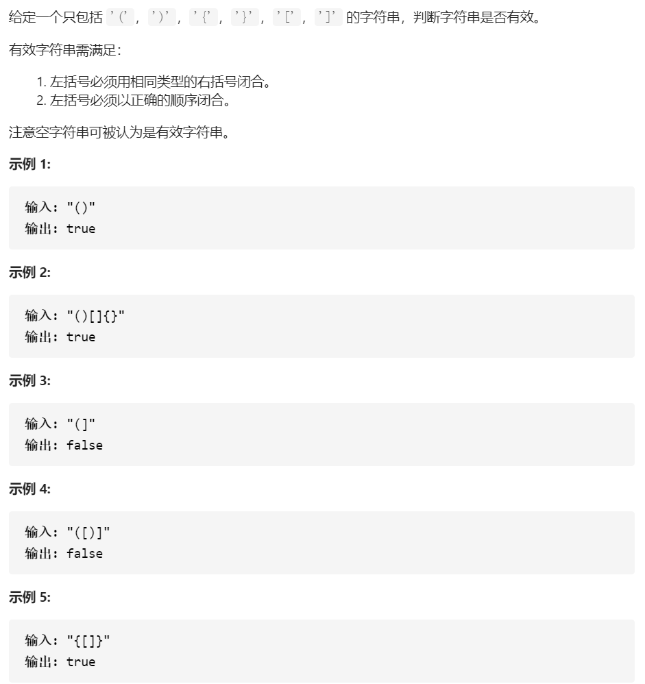

# [20. 有效的括号](https://leetcode-cn.com/problems/valid-parentheses/)

一刷：之前一直很害怕遇到括号匹配的问题，有些:shit:该吃迟早要吃，看到竟然是简单题！看了提示，如果利用**栈**，这个题就真的很简单了。遍历字符串，如果当前是左侧符号，就压入栈；如果是右侧符号，那么就出栈，看是否匹配，因为要匹配，必须要在对应深度进行匹配。



```java
import java.util.*;


public class Solution {
    /**
     * 
     * @param s string字符串 
     * @return bool布尔型
     */
    public boolean isValid (String s) {
        // write code here
        if(s == null) return true;
        Stack<Character>stack = new Stack<>();
        for(int i = 0; i < s.length(); i++){
            if(s.charAt(i) == '(') stack.push(')');
            else if(s.charAt(i) == '{') stack.push('}');
            else if(s.charAt(i) == '[') stack.push(']');
            else{
                if(!stack.isEmpty()&&stack.peek() == s.charAt(i)) stack.pop();
                else return false;
            }
        }
        return stack.isEmpty();
    }
}
```

二刷，是在[牛客](https://www.nowcoder.com/practice/37548e94a270412c8b9fb85643c8ccc2?tpId=188&tags=&title=&diffculty=0&judgeStatus=0&rp=1&tab=answerKey)上，好家伙直接0测试通过，主要问题是，需要考虑第一次就出现]的情况，**即栈为空，然后只剩下右边进行匹配的情况。**

入栈和匹配的技巧前面已经说过了，所以不再赘述。

```java
import java.util.*;


public class Solution {
    /**
     * 
     * @param s string字符串 
     * @return bool布尔型
     */
    public boolean isValid (String s) {
        // write code here
        if(s == null) return true;
        Stack<Character>stack = new Stack<>();
        for(int i = 0; i < s.length(); i++){
            if(s.charAt(i) == '(') stack.push(')');
            else if(s.charAt(i) == '{') stack.push('}');
            else if(s.charAt(i) == '[') stack.push(']');
            else{
                // 这句易错
                if(!stack.isEmpty()&&stack.peek() == s.charAt(i)) stack.pop();
                else return false;
            }
        }
        return stack.isEmpty();
    }
}
```

