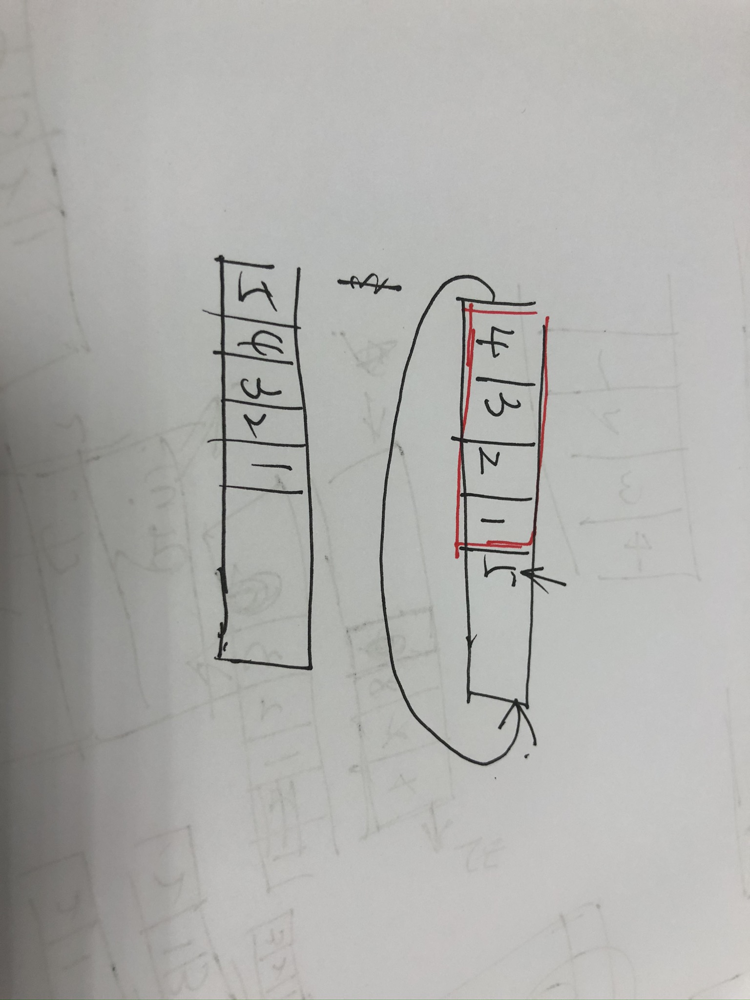

# [232. 用栈实现队列](https://leetcode-cn.com/problems/implement-queue-using-stacks/)

《栈实现队列》也是剑指的题：


想要实现该题目并不难，但是要简要且高效的实现比较难。

我们可以发现：栈是FILO，后进先出，那么我们只需要把栈中的元素全部pop，放到另一个栈中，那么该栈就是按照队列顺序排列的了

所以我们设置两个栈：一个栈为主栈：专门用来加入数据；一个栈为副栈：专门用来取出数据的。

并且我们发现，主栈将n个数据弹出放到副栈，那么在副栈全部弹出之前，我们都可以直接通过该副栈pop数据和查询数据

所以，对于一个数据，从进到出整个过程，只会出现2次入栈、2次出栈。所以，总的时间复杂度为O(4N)，一共有n次入队操作，n次出队/查询操作，所以均摊就是O(2)=O(1)，所以实现了常量级的均摊时间复杂度

```java
class MyQueue {
    Stack<Integer> stack1;      // 针对加入
    Stack<Integer> stack2;     // 针对取出
    /** Initialize your data structure here. */
    public MyQueue() {
        stack1 = new Stack<>();
        stack2 = new Stack<>(); 
    }
    
    /** Push element x to the back of queue. */
    public void push(int x) {			// 队列添加
        stack1.push(x);
    }
    
    /** Removes the element from in front of queue and returns that element. */
    public int pop() {			// 队列弹出
        if(stack2.isEmpty()){			// 如果副栈为空，那么将主栈的现有数据全部昂到副栈
            while(!stack1.isEmpty()){
                stack2.push(stack1.pop());
            }
        }
        return stack2.pop();
    }
    
    /** Get the front element. */
    public int peek() {			// 查询队列头结点
        if(stack2.isEmpty()){
            while(!stack1.isEmpty()){
                stack2.push(stack1.pop());
            }
        }
        return stack2.peek();
    }
    
    /** Returns whether the queue is empty. */
    public boolean empty() {
        return stack1.isEmpty() && stack2.isEmpty();
    }
}

/**
 * Your MyQueue object will be instantiated and called as such:
 * MyQueue obj = new MyQueue();
 * obj.push(x);
 * int param_2 = obj.pop();
 * int param_3 = obj.peek();
 * boolean param_4 = obj.empty();
 */
```

ps：这样运行效率不高，主要是出栈用的是while循环，判断当前栈是否为空，实际上可以实现获取stack的size，避免每次函数调用，能加快运行效率

可以看：https://leetcode-cn.com/problems/implement-queue-using-stacks/solution/yong-zhan-shi-xian-dui-lie-by-leetcode/的图解

# [225. 用队列实现栈](https://leetcode-cn.com/problems/implement-stack-using-queues/)


由于受前面的惯性思维，一定要用2个队列

而队列不管如何出队入队，一定是按照固定顺序的，而不会出现上面逆序的情况。所以我的思路是：两个队列交替存储，一个时刻是存在至少一个队列为空的情况。

```java
class MyStack {
    Queue<Integer> queue1;
    Queue<Integer> queue2;
    /** Initialize your data structure here. */
    public MyStack() {
        queue1 = new LinkedList<>();
        queue2 = new LinkedList<>();
    }
    
    /** Push element x onto stack. */
    public void push(int x) {
        if(empty() || !queue1.isEmpty()){			// 如果全为空 or queue2为空，那么选择queue1存储
            queue1.offer(x);     // 队尾插入
        }
        else{
            queue2.offer(x);		// queue1为空，那么存储在queue2
        }
    }
    
    /** Removes the element on top of the stack and returns that element. */
    public int pop() {
        if(!queue1.isEmpty()){			// 说明存储在queue1中，将queue1除了最后一个结点都全部移动到queue2
            int size = queue1.size();
            for(int i = 0; i < size - 1; i++){
                queue2.offer(queue1.poll());
            }
            return queue1.poll();
        }
        else{					// 同理
            int size = queue2.size();
            for(int i = 0; i < size - 1; i++){
                queue1.offer(queue2.poll());
            }
            return queue2.poll();
        }
    }
    
    /** Get the top element. */
    public int top() {
        int res = 0;
        if(!queue1.isEmpty()){		// 同pop，只不过最后一个结点不pop，也还是存放在另外一个queue中
            int size = queue1.size();
            for(int i = 0; i < size; i++){
                if(i == size - 1)
                    res = queue1.peek();
                queue2.offer(queue1.poll());
            }
        }
        else{
            int size = queue2.size();
            for(int i = 0; i < size; i++){
                if(i == size - 1)
                    res = queue2.peek();
                queue1.offer(queue2.poll());
            }
        }
        return res;
    }
    
    /** Returns whether the stack is empty. */
    public boolean empty() {
        return queue1.isEmpty() && queue2.isEmpty();
    }
}

/**
 * Your MyStack object will be instantiated and called as such:
 * MyStack obj = new MyStack();
 * obj.push(x);
 * int param_2 = obj.pop();
 * int param_3 = obj.top();
 * boolean param_4 = obj.empty();
 */
```

——但是，这样是最暴力的解法，主要的问题在于，top()操作也会引起整个队列的移动，我们希望一个队列能够按照栈的形式存储，那么队首就是栈顶

稍微优化，我们还是交替存储数据，只不过，我们将**移动设定在引用变量的切换**上，**移动发生在数据的入栈上**：

```java
class MyStack {
    Queue<Integer> queue1;          // 存储
    Queue<Integer> queue2;          // 接收
    /** Initialize your data structure here. */
    public MyStack() {
        queue1 = new LinkedList<>();
        queue2 = new LinkedList<>();
    }
    
    /** Push element x onto stack. */
    public void push(int x) {		// 入栈
        queue2.offer(x);			// queue2指向的是空队列
        int size = queue1.size();
        for(int i = 0; i < size; i++){			// 将queue1的数据全部移动到queue2中
            queue2.offer(queue1.poll());
        }
        Queue<Integer> temp = queue2;		// queue1\queue2的引用对象互换，queue1一直指向存储（stack形式的数据）
        queue2 = queue1;
        queue1 = temp;
    }
    
    /** Removes the element on top of the stack and returns that element. */
    public int pop() {
        return queue1.poll();
    }
    
    /** Get the top element. */
    public int top() {
        return queue1.peek();
    }
    
    /** Returns whether the stack is empty. */
    public boolean empty() {
        return queue1.isEmpty();
    }
}

/**
 * Your MyStack object will be instantiated and called as such:
 * MyStack obj = new MyStack();
 * obj.push(x);
 * int param_2 = obj.pop();
 * int param_3 = obj.top();
 * boolean param_4 = obj.empty();
 */
```

还能再优化成一个队列，可以发现：核心是当有数据入栈时，就需要将之前存储的数据出队再入队，而频繁的出队入队并不会改变数据间的相互位置——即一组数据不论如何出队入队操作，只要完整执行整个循环，次序都不变

而我么只需要将最后入队的不动，将这前面的数据全部循环出队入队操作，那么整个就逆序了。对每次入栈操作都这么做，那么队列中存放的就是栈的形式——队头是栈顶，队尾是栈底



```java
class MyStack {
    Queue<Integer> queue;
    /** Initialize your data structure here. */
    public MyStack() {
        queue = new LinkedList<>();
    }
    
    /** Push element x onto stack. */
    public void push(int x) {
        int size = queue.size();
        queue.offer(x);
        for(int i = 0; i < size; i++){
            queue.offer(queue.poll());
        }
    }
    
    /** Removes the element on top of the stack and returns that element. */
    public int pop() {
        return queue.poll();
    }
    
    /** Get the top element. */
    public int top() {
        return queue.peek();
    }
    
    /** Returns whether the stack is empty. */
    public boolean empty() {
        return queue.isEmpty();
    }
}

/**
 * Your MyStack object will be instantiated and called as such:
 * MyStack obj = new MyStack();
 * obj.push(x);
 * int param_2 = obj.pop();
 * int param_3 = obj.top();
 * boolean param_4 = obj.empty();
 */
```

总结：用栈实现队列上，比较直观，并且是需要用2个栈才能有效的实现；用队列实现栈，比较不直观，技巧性较强，需要把握住每次入栈时都需要调整好队列的内容这个角度去思考，就能想到该方法