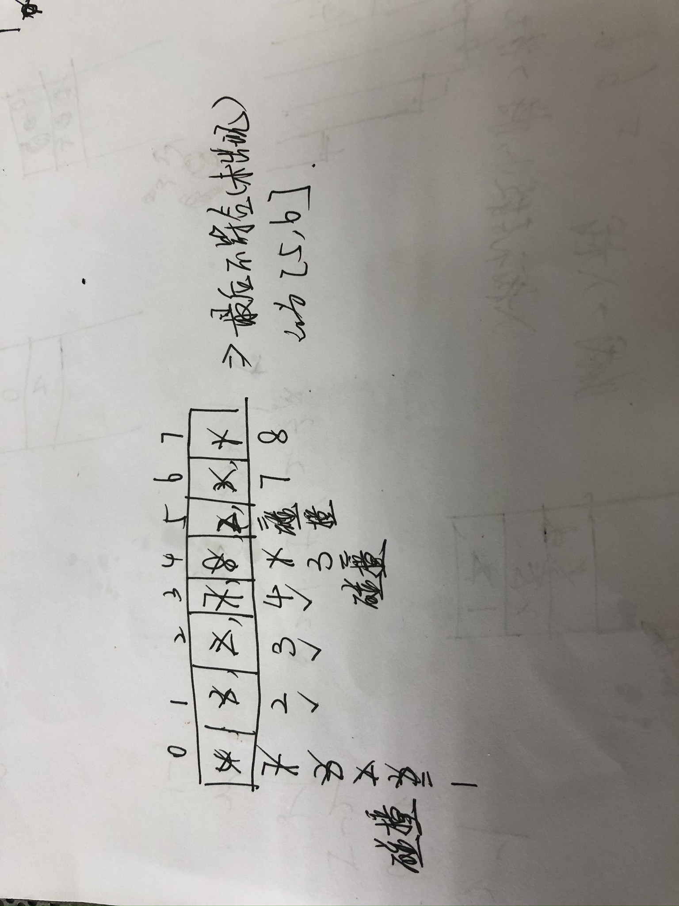

# [448. 找到所有数组中消失的数字](https://leetcode-cn.com/problems/find-all-numbers-disappeared-in-an-array/)


## 1. 使用额外空间

可以想到用HashSet，遍历数组将所有的内容，放在set中，最后遍历[1,n]，看哪些数字没有出现

## 2. 原地修改

题目要求：不使用额外空间——不能用哈希表等存储；复杂度为O(N)，那么就是常量次遍历。

我的方法：一个萝卜一个坑（初始思路来自哪里找不到了）

想反例：如果正好是1~n个数字，有且仅出现一次，那么经过遍历之后一定能顺序排列，即1-1，2-2，...n-n（注意这边的index是从1开始的）

如果存在数字重复，那么一定有数组不存在的，数字重复那么在对应位置插入的时候会碰到碰撞：插入了相同的数字。

eg：3-3, 5-3，把index=5中的3插入到index=3，发现index=3已经存在匹配的3，所以3一定存在重复，

那具体步骤：



```java
class Solution {
    public List<Integer> findDisappearedNumbers(int[] nums) {   // 一个萝卜一个坑
        int len = nums.length;
        for(int i = 0; i < len; i++){
            while(nums[i] != i + 1){		// while循环，将值放入到对应的index中
                int temp = nums[i];
                if(nums[i] == nums[temp - 1]){      // 发生冲突
                    break;
                }
                nums[i] = nums[temp - 1];
                nums[temp - 1] = temp;
            }
        }
        List<Integer> res = new ArrayList<>();
        for(int i = 0; i < len; i++){
            if(nums[i] != i + 1) res.add(i + 1);
        }
        return res;
    }
}
```

[官方题解](https://leetcode-cn.com/problems/find-all-numbers-disappeared-in-an-array/solution/zhao-dao-suo-you-shu-zu-zhong-xiao-shi-d-mabl/)给的方法是：遍历数组，在遇到数x的时候，让nums[x - 1]的值增加n，那么增加之后，值一定超过n。所以对于未出现的数字，那么它对应的index里面的值一定在[1,n]范围内的：具体见[题解](https://leetcode-cn.com/problems/find-all-numbers-disappeared-in-an-array/solution/zhao-dao-suo-you-shu-zu-zhong-xiao-shi-d-mabl/)

参考：

1. https://leetcode-cn.com/problems/find-all-numbers-disappeared-in-an-array/solution/shou-hua-tu-jie-jiao-huan-shu-zi-zai-ci-kzicg/
2. https://leetcode-cn.com/problems/find-all-numbers-disappeared-in-an-array/solution/zhao-dao-suo-you-shu-zu-zhong-xiao-shi-d-mabl/

# [442. 数组中重复的数据](https://leetcode-cn.com/problems/find-all-duplicates-in-an-array/)


本题就是上面一题的改编，稍微分析一下内核都是一样的

但是这个要求记录重复出现的数字，且由于重复只能出现2次，那么必须要避免重复碰撞——上面的解法会出现重复碰撞

所以，当出现碰撞的时候我们给其中一个设置为特殊的值0，当出现0的时候本次循环结束

```java
class Solution {
    public List<Integer> findDuplicates(int[] nums) {
        List<Integer> res = new ArrayList<>();
        for(int i = 0; i < nums.length; i++){
            while(nums[i] != i + 1){
                int temp = nums[i];
                if(temp == 0) break;		// 当前值为0，那么无法更别人交换
                if(nums[temp - 1] == temp){		// 发生碰撞，不交换，并且把当前结点的值设置为0，循环结束，看下一个结点
                    res.add(temp);
                    nums[i] = 0;
                    break;
                }
                else{			// 未发生碰撞，所以可以交换
                    nums[i] = nums[temp - 1];
                    nums[temp - 1] = temp;
                }
            }
        }
        return res;
    }
}
```

——这个方法是兼容前面一题的。

# [剑指 Offer 03. 数组中重复的数字](https://leetcode-cn.com/problems/shu-zu-zhong-zhong-fu-de-shu-zi-lcof/)


原理同上，也是一个萝卜一个坑的策略：——比上面的更加简单，只需要找到一个重复出现的数字即可返回

```java
class Solution {
    public int findRepeatNumber(int[] nums) {
        for(int i = 0; i < nums.length; i++){
            while(nums[i] != i){
                int temp = nums[i];
                if(nums[temp] == temp) return temp;	// 说明有两个位置都出现了temp值，temp重复了
                nums[i] = nums[temp];
                nums[temp] = temp;
            }
        }
        return -1;		// 结束循环均没有出现重复
    }
}
```

当然也可以用hashSet来存储，然后一次遍历即可。


# [41. 缺失的第一个正数](https://leetcode-cn.com/problems/first-missing-positive/)


我觉得，本题的难度就是发现该题是上面题目的变型，本质还是一个萝卜一个坑。

（看到困难题就害怕了，所以没有解出来，其实有很多解法）

先分析：要求是找到没有出现的最小正整数，还是找缺失的数字，只不过这边没有限制数组中的元素大小。

找没有出现的最小正整数，我们可以知道，如果**该数组严格从1开始递增，那么N长度的数组，数组元素范围为[1, N]，此时最小缺失的是N+1**.

而如果不按照这种情况，那么最小缺失的数一定<=N

## 哈希表解法

所以常规解法：将数组元素存放到hashSet中，然后**遍历1~N的数字**（关键），看是否出现，如果没有出现，那么该数字就是最小未出现的正整数。

```java
class Solution {
    public int firstMissingPositive(int[] nums) {
        HashSet<Integer> hashSet = new HashSet<>();
        for(int num: nums){
            hashSet.add(num);
        }
        for(int i = 1; i <= nums.length; i++){
            if(!hashSet.contains(i)) return i;
        }
        return nums.length + 1;
    }
}
```

这个解的时间复杂度O(N)，空间复杂度O(N)

我们可以将空间复杂度优化一下

## 双指针

我们可以先排序，然后用二分查找来1~N的数字，如果未找到，那么就是缺失的数字

```java
class Solution {
    private int binarySearch(int[] nums, int target){			// 二分查找
        int left = 0, right = nums.length - 1;
        while(left <= right){
            int mid = left + (right - left) / 2;
            if(nums[mid] > target) right = mid - 1;
            else if(nums[mid] < target) left = mid + 1;
            else return mid;
        }
        return -1;
    }
    public int firstMissingPositive(int[] nums) {
        if(nums.length == 0) return 1;
        Arrays.sort(nums);
        for(int i = 1; i <= nums.length; i++){			// 从1开始遍历
            int res = binarySearch(nums, i);
            if(res == -1) return i;
        }
        return nums.length + 1;
    }
}
```

时间复杂度不符合：O(NlogN)

——这两种方法的核心：明确从1开始遍历。

## 一个萝卜一个坑

找第一个缺失的数字，那么如果不缺失就是N+1，而缺失的原因：出现了负数 or 出现了重复

——找缺失，也就是找重复

那么还是可以采用上面的找消失的数字的方法。

而对于负数和超过N的数字，可以选择直接跳过而不参与移动。

```java
class Solution {
    public int firstMissingPositive(int[] nums) {
        int len = nums.length;
        for(int i = 0; i < len; i++){
            while(nums[i] != i + 1){
                int temp = nums[i];
                if(temp <= 0 || temp > len || nums[temp - 1] == temp) break;		// 待交换的值太小、太大、目标位置上已经存在该值了
                nums[i] = nums[temp - 1];
                nums[temp - 1] = temp;
            }
        }
        for(int i = 0; i < nums.length; i++){		// 本质上就是从1开始遍历找是否出现该数字
            if(nums[i] != i + 1) return i + 1;			// 查找一遍
        }
        return len + 1;
    }
}
```

理解：

1. 根据[题解](https://leetcode-cn.com/problems/first-missing-positive/solution/tong-pai-xu-python-dai-ma-by-liweiwei1419/)，**原地解法本质上就是自己建的一个hashSet**，每个index都是直接对应一个index-1的值
2. 但是这题复杂的是，没有控制数组元素的范围，所以需要将超过范围的数字都忽略掉
3. 并且，还会出现重复，所以重复的数字也需要忽略

——这题本质上，**是对上面的题目的扩展，扩展了数组元素的范围**

参考：

1. https://leetcode-cn.com/problems/first-missing-positive/solution/tong-pai-xu-python-dai-ma-by-liweiwei1419/