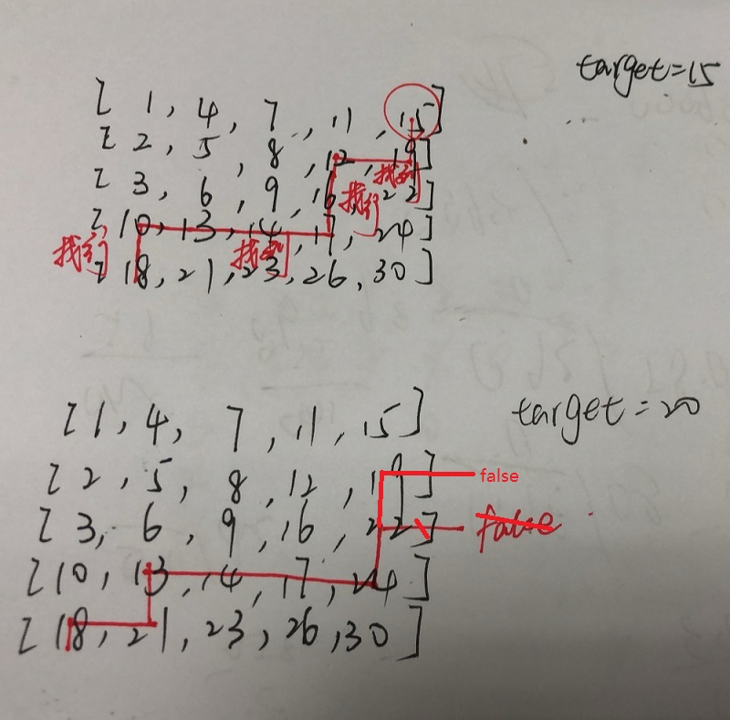

# [剑指 Offer 04. 二维数组中的查找](https://leetcode-cn.com/problems/er-wei-shu-zu-zhong-de-cha-zhao-lcof/)

第一轮、第二轮：数组

第三轮：数组操作


这个就是一个简单的二维数组的操作：从左下角开始遍历，先找行，再找列。

- 找到首行小于`target`的值
- 然后开始从该行开始遍历列，找到第一个大于`target`的值
- 然后重复步骤1，再重复步骤2，直到越界 or 找到需要的值




```java
class Solution {
    public boolean findNumberIn2DArray(int[][] matrix, int target) {
        int i = matrix.length - 1, j = 0;
        while(i >= 0 && j < matrix[0].length){			// 越界判断
            while(i >= 0 && matrix[i][j] > target)i--;		// 找行，找到第一行小于target
            if(i < 0) return false;		// 如果跳出循环是因为越界，则直接返回false
            if(matrix[i][j] == target) return true;		// 找到target了
            while(j < matrix[0].length && matrix[i][j] < target)j++;		// 找列，找到第一列大于target
            if(j >= matrix[0].length) return false;
            if(matrix[i][j] == target) return true;
        }
        return false;
    }
}
```

