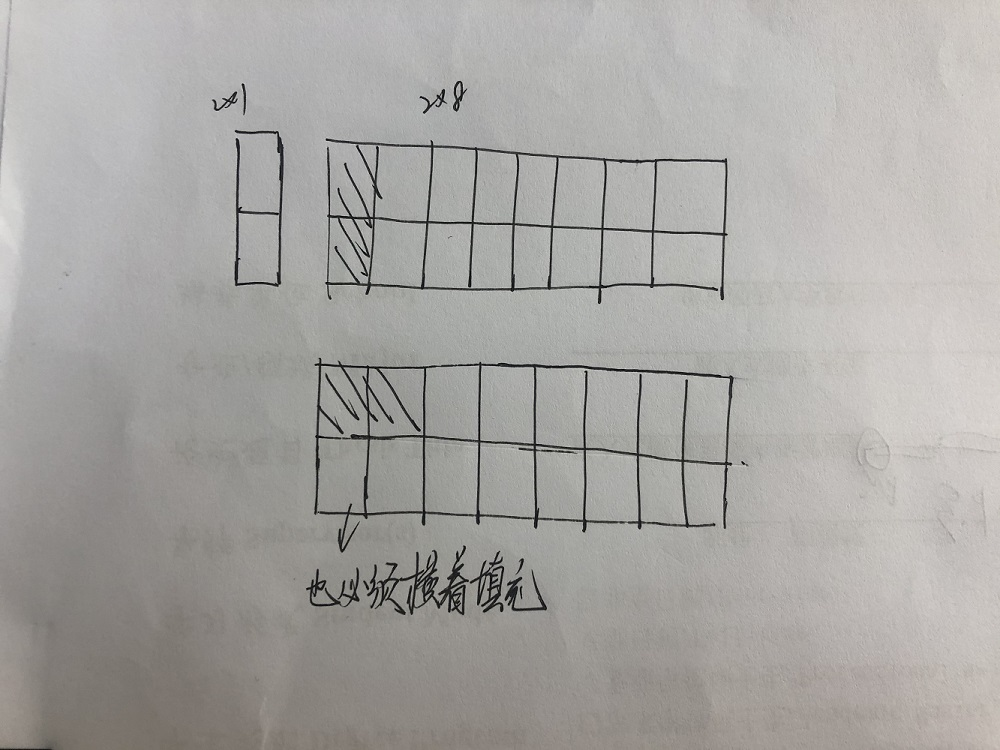

# [剑指 Offer 10- I. 斐波那契数列](https://leetcode-cn.com/problems/fei-bo-na-qi-shu-lie-lcof/)

简单的动态规划：连递推方程式都给出了，然后求解即可：


本题一开始是很典型的递归题目，但是会发现，每次递归都会进行重复计算。

eg：f(4) = f(3) + f(2)，而f(3)再递归，=f(2) + f(1)，f(2)又需要递归，而f(4)分解的f(2)也需要递归，其实他们的解是一样的，但是不断进行重复求解了。

这个时候，我们可以用迭代的方法，可以发现分解到最后都是要从f(0)、f(1)开始计算的，所以我们自底向上求解。

例如求f(4)，我们可以先获得f(0), f(1), 从而得出f(2)，从而得出f(3)，从而得出f(4)

迭代（朴素的动态规划思想）

```java
class Solution {
    public int fib(int n) {
        if(n <= 1) return n;
        int first = 0; 
        int second = 1;
        for(int i = 2; i <= n; i++){
            int temp = (first + second) % 1000000007;
            first = second;
            second = temp;
        }
        return second;
    }
}
```

递归+备忘录：

```java
class Solution {
    private int dfs(int n, HashMap<Integer, Integer>store){
        if(n <= 1) return n;
        if(store.containsKey(n)) return store.get(n);	// 如果之前计算过就可以直接返回了

        int res = (dfs(n - 1, store) + dfs(n - 2, store)) % 1000000007;//没有计算过就递归计算，并且将值保存下来
        store.put(n, res);
        return res;
    }
    public int fib(int n) {
        return dfs(n, new HashMap<Integer, Integer>());
    }
}
```

# [剑指 Offer 10- II. 青蛙跳台阶问题](https://leetcode-cn.com/problems/qing-wa-tiao-tai-jie-wen-ti-lcof/)

这个就是对上面题目的应用，我们要发现题目的本质就可以求解了：


一开始没发现也没关系，我们可以进行分析：第n个台阶，我们可以从n-1跳一步上；我们可以从n-2跳两步上。而n-1要如何上呢——两步或者一步；n-2也是如此。一直到第2个台阶，可以从1台阶跳一步上，可以直接跳两步上；而第1个台阶只有一个上法，跳一步。

——所以，就变成了f(n) = f(n - 1) + f(n - 2) f(1) = 1, f(0) = 1

```java
class Solution {
    public int numWays(int n) {
        if(n <= 1) return 1;
        int first = 1;
        int second = 1;
        for(int i = 2; i <= n; i++){
            int temp = (first + second) % 1000000007;
            first = second;
            second = temp;
        }
        return second;
    }
}
```

扩展：

用2*1的小矩形，覆盖更大的矩形，问用8个无重叠的覆盖一个2 * 8大矩形有多少种解法

——本质上还是斐波那契数列。

首先画图：



可以发现，有两种填充方式：横着或者竖着，

- 首先按照竖着填充，那么剩下的2*7该如何填充；
- 按照横着填充，那么下面那一行只能跟着横着填充，那么是剩下的2*6该如何填充

——最后还是一个斐波那契数列

