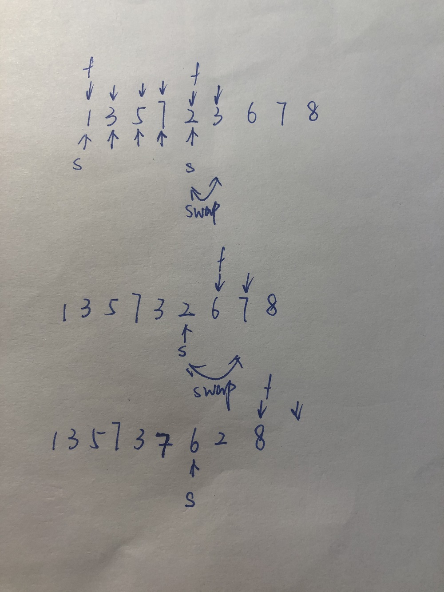

# [剑指 Offer 21. 调整数组顺序使奇数位于偶数前面](https://leetcode-cn.com/problems/diao-zheng-shu-zu-shun-xu-shi-qi-shu-wei-yu-ou-shu-qian-mian-lcof/)


做到这个题的时候，觉得很像是快排的partition的解法：

其实本质上也是，就是通过一次遍历，将奇偶数组做一个划分。

```java
class Solution {
    public int[] exchange(int[] nums) {
        int left = 0, right = nums.length - 1;
        while(left <= right){
            while(left <= right && nums[left] % 2 == 1) left++;
            while(left <= right && nums[right] % 2 == 0) right--;   // 直到找到一个左侧的偶数，右侧的奇数
            if(left <= right){
                int temp = nums[left];
                nums[left] = nums[right];
                nums[right] = temp;
                left++;
                right--;
            }
        }
        return nums;
    }
}
```

另一种partition的解法：

```java
class Solution {
    public int[] exchange(int[] nums) {
        int fast = 0, slow = 0;     // slow指向奇偶的分界线，就是slow前一个一定为奇数
        while(fast < nums.length){
            if(nums[fast] % 2 == 1){            // 找到奇数，就将该结点塞入到slow那边
                int temp = nums[slow];
                nums[slow] = nums[fast];
                nums[fast] = temp;
                slow++;
            }
            fast++; 
        }
        return nums;
    }
}
```



可以发现，在初始时，如果前面几个都是奇数，那么不断进行自己和自己交换的情况，直到遇到偶数，**slow就一直指向奇数后面的第一个偶数，即奇偶的分界线**，slow一定能保证其前面的数一定是奇数；而fast指向最新遍历到的数，如果遇到偶数就跳过，因为偶数本来就应该在后面，如果遇到奇数，就将slow和fast的内容交换位置，即偶、奇交换，那么变成奇、偶，并且i所处的已经变成奇数，所以i++，指向下一个位置。划分完成后，slow就是分界线。

参考：

https://leetcode-cn.com/problems/diao-zheng-shu-zu-shun-xu-shi-qi-shu-wei-yu-ou-shu-qian-mian-lcof/solution/ti-jie-shou-wei-shuang-zhi-zhen-kuai-man-shuang-zh/