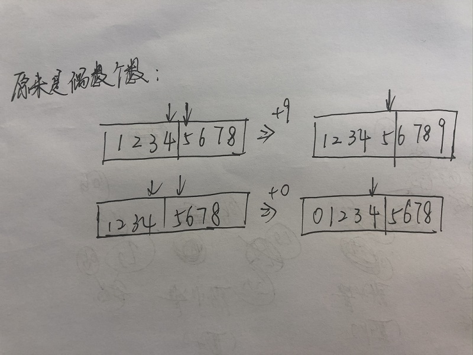

# [剑指 Offer 41. 数据流中的中位数](https://leetcode-cn.com/problems/shu-ju-liu-zhong-de-zhong-wei-shu-lcof/)


在看优先队列源码的时候，看到了PriorityQueue的常用地方，其中讲到了topK问题，和求中值问题。之前topK已经整理过了，而求中值也是考点。

题目要求：在数据流中（就是数据长度不确定，随时都可能要在此长度上求其中值），由于数据长度未定，所以不能用数组，然后排序求中值；也不能维护一个有序的集合，然后每次插入都是查找合适的位置——时间复杂度O(logN)的时间查找，O(N)的时间插入。我们需要随时维护中值，即随时能够求出中值。

利用两个堆，一个最大堆、一个最小堆：

- 最大堆：即**根是最大的，用来存放前一半的数**
- 最小堆：即**根是最小的，用来存放后一半的数**

那么，中值一定出现在它们的堆顶上。

本题的难度是如何利用这两个堆：

**设定如果出现数据是奇数个，从最大堆的堆顶获取，那么最大堆个数要多一个；如果数据出现是偶数个，从两个堆中分别取堆顶，求平均值，两个堆个数一样。**

- 堆数据是奇数个，最大堆多1个，那么+1，变成偶数个，要给最小堆一个，那么 可以**先将数据加入到最大堆，然后将堆顶给最小堆**，即将前半部分的最大值给最小堆，符合要求；

  **[最大堆] -> [最小堆]**

- 堆数据是偶数个，两个堆个数一样，那么+1，那么最大堆的数要多一个，但是**不能单纯的将数据加入到最大堆**，因为数据可能属于后半部分，那么中位数是最小堆的堆顶；而如果数据属于前半部分，那么堆顶就是最大堆的堆顶，那么可以**先将数据加入到最大堆，然后将堆顶给最小堆，然后将最小堆的堆顶给最大堆**——那么，插入的数据就在前半部分和后半部分全部经过一遍，能确定它的具体位置——如果它大，那么只会在后半部分，如果它小，那么会回到前半部分

  **[最大堆] -> [最小堆] -> [最大堆]**



实现：

```java
class MedianFinder {
    PriorityQueue<Integer> maxHeap;
    PriorityQueue<Integer> minHeap;
    int totalCount;
    /** initialize your data structure here. */
    public MedianFinder() {
        maxHeap = new PriorityQueue<>((x, y)->(y-x));
        minHeap = new PriorityQueue<>();
        totalCount = 0;
    }
    
    public void addNum(int num) {
        totalCount++;
        maxHeap.offer(num);		// 先最大堆，后最小堆，最后看情况是否要去最大堆
        minHeap.offer(maxHeap.poll());
        if((totalCount & 1) == 1) maxHeap.offer(minHeap.poll());
    }
    
    public double findMedian() {
        if((totalCount & 1) == 0){
            return ((double)maxHeap.peek() + minHeap.peek()) / 2;
        }
        else return maxHeap.peek();
    }
}

/**
 * Your MedianFinder object will be instantiated and called as such:
 * MedianFinder obj = new MedianFinder();
 * obj.addNum(num);
 * double param_2 = obj.findMedian();
 */
```

之前做过该题，能够容易记住用什么数据结构，但是较为难的是理解为啥要最大堆和最小堆之间的抛来抛去。

这次终于明白了。

说白了，就是一个**数据一定要在最大堆和最小堆中过一遍，才能确定它到底在前半部分还是后半部分**，才确定中位数的位置

参考：

1. https://leetcode-cn.com/problems/shu-ju-liu-zhong-de-zhong-wei-shu-lcof/solution/mian-shi-ti-41-shu-ju-liu-zhong-de-zhong-wei-shu-y/

