# 计算机网络

网络：是能够将主机连接起来，就构成了一个网络

互联网：将不同的网络连接起来，所以**互联网是网络的网络**——internet

Internet：是全球范围内的internet，专有名词。

# 0. 概述

主要是介绍概念：

## ISP：互联网服务提供商

提供商可以从**互联网管理机构**获得许多 IP 地址，同时拥有通信线路以及路由器等联网设备，个人或机构向 ISP 缴纳一定的费用就可以接入互联网。


目前的互联网是一种**多层次 ISP 结构**，ISP 根据覆盖面积的大小分为**第一层 ISP、区域 ISP 和接入 ISP**。

**互联网交换点 IXP 允许两个 ISP 直接相连而不用经过第三个 ISP。**


## 主机之间的通信方式

- CS（客户/服务器）：请求方是客户端，响应方是服务器，提供请求的服务
- P2P：之间对等，不区分

## 电路交换和分组交换

- 电路交换：**电话通信系统**，两个用户要通信之前需要建立一条**专用的物理链路**，在整个通信过程中始终占用该链路。由于通信的过程中不可能一直在使用传输线路，因此电路交换对线路的利用率很低，往往不到 10%。——专用的线路
- 分组交换：每个分组都有首部和尾部，包含了源地址和目的地址等控制信息，在同一个传输线路上同时传输多个分组互相不会影响，因此在同一条传输线路上允许同时传输多个分组，也就是说分组交换不需要占用传输线路。——公用的线路

**存储转发**：分组交换中用到，即某个节点收到信息后，先存储下来，然后之后将相同目的地的信息转发出去，用在邮局通信系统（现在的物流也是这样）

## 时延

总时延 = 排队时延 + 处理时延 + 传输时延 + 传播时延

1. 排队时延：在**路由器**的输入队列和输出队列中排队等待的时间，取决于**网络当前的通信量**

2. 处理时延：收到分组时进行**处理**所需要的时间，例如分析首部、从分组中提取数据、进行差错检验或查找适当的路由等

3. 传输时延：**主机或路由器**传输数据帧所需要的时间

   也就是从发送数据帧的第一个比特算起，到该帧的最后一个比特发送完毕所需的时间

   传输时延又称发送时延，即**主机or路由器将数据帧发送出去所需要的全部时间**，时延发生在机器的内部的发送器。

   注意和传播时延做区分

   $delay = \frac{l(bit)}{v(bit/s)}$

   l是帧的长度，v传输速率

4. 传播时延：电磁波在**信道**中传播所需要花费的时间，电磁波的传播速度接近光速

   $delay=\frac{l(m)}{v(m/s)}$

   l是信道长度，v是电磁波在信道上的传播速度

   时延发生在机器外部的传输信道媒体。

   电磁波在自由空间的传播速率是光速，即3.0×105km/s。电磁波在网络传输媒体中的传播速率比在自由空间要略低一些：在铜线电缆中的传播速率约为2.3×105km/s，在光纤中的传播速率约为2.0×105km/s。例如，1000km长的光纤线路产生的传播时延大约为5ms。【摘自计算机网络1.6.1】

## 网络体系结构


### 5层模型（最常见）

从上到下：

1. 应用层

   为**特定应用程序**提供数据传输服务，例如 HTTP、DNS 等协议。数据单位为**报文**。

2. 传输层

   为**进程**提供通用数据传输服务

   由于应用层协议很多，定义通用的传输层协议就可以支持不断增多的应用层协议。

   主要有以下的两种协议：

   - **传输控制协议 TCP**，提供面向连接、可靠的数据传输服务，数据单位为**报文段**；
   - **用户数据报协议 UDP**，提供无连接、尽最大努力的数据传输服务，数据单位为**用户数据报**

   **TCP 主要提供完整性服务，UDP 主要提供及时性服务。**

3. 网络层

   为**主机**提供数据传输服务。

   网络层把传输层传递下来的报文段或者用户数据报封装成**分组**。

4. 数据链路层

   主机之间的数据传输，需要在一段段链路上传送，链路层协议就是为**同一链路的主机提供数据传输服务**，即在同一个链路两端的结点之间进行传输

   数据链路层把网络层传下来的分组封装成**帧**。

5. 物理层

   考虑的是怎样在**传输媒体**上传输数据比特流，而不是指具体的传输媒体。物理层的作用是**尽可能屏蔽传输媒体和通信手段的差异，使数据链路层感觉不到这些差异。**

   即对上（数据链路层）提供统一的传输数据接口，虽然物理层会采用不同的传输媒体和通信手段

   请注意，传递信息所利用的一些**物理媒体并不在物理层协议之内而是在物理层协议的下面**，如双绞线、同轴电缆、光缆、无线信道等——也有人把物理媒体当作第0层。

   类似于：驱动和物理设备的关系

| 层名       | 服务对象           | 数据单位 |
| ---------- | ------------------ | -------- |
| 应用层     | 特定的应用程序     | 报文     |
| 传输层     | 进程（通用服务）   | 数据报   |
| 网络层     | 主机               | 分组     |
| 数据链路层 | 同一链路的两个节点 | 帧       |
| 物理层     | 传输媒体驱动       | 数据流   |

### 7层OSI模型

增加了两层：

- 表示层：数据压缩、加密以及数据描述。应用程序不必关心在各台主机中数据内部格式不同的问题。
- 会话层：建立及管理会话

五层协议没有表示层和会话层，而是将这些功能留给应用程序开发者处理。

### TCP/IP模型

是4层模型，将最下面的数据链路层和物理层合并为网络接口层

TCP/IP 体系结构不严格遵循 OSI 分层概念，应用层可能会直接使用 IP 层或者网络接口层。

### 数据在各层之间的传递

在向下的过程中，需要添加下层协议所需要的首部或者尾部，而在向上的过程中不断拆开首部和尾部。

**路由器只有下面三层协议**，因为路由器位于网络核心中，不需要为进程或者应用程序提供服务，因此也就不需要传输层和应用层。

因特网按工作方式可划分为边缘部分与核心部分。**主机在网络的边缘部分**，其作用是进行信息处理。**路由器在网络的核心部分**，其作用是按存储转发方式进行分组交换。

# 1. 物理层

## 通信方式

根据信息在传输线上的传送方向，分为以下三种通信方式：

- 单工通信：单向传输

  eg：广播、电视

- 半双工通信：双向交替传输

  即通信的双方都可以发送信息和接收，但不能双方同时发送/接收。这种通信方式是一方发送另一方接收，过一段时间后再反过来。

- 全双工通信：双向同时传输

## 带通调制

模拟信号是连续的信号，数字信号是离散的信号。带通调制把数字信号转换为模拟信号。

- 调幅(AM)，即载波的振幅随基带数字信号而变化。例如，0或1分别对应于无载波或有载波输出
- 调频(FM)，即载波的频率随基带数字信号而变化。例如，0或1分别对应于频率f1或f2。
- 调相(PM)，即载波的初始相位随基带数字信号而变化。例如，0或1分别对应于相位0度或180度。


# 2. 链路层

链路层，所考虑的是一个局域网内的情况，而不会涉及到网络和网络之间的通信——是网络层需要关注的。

点对点信道的数据链路层在通信时的步骤：

1. 结点A的数据链路层将网络层丢下来的数据添加首部和尾部**封装成帧**
2. 结点A将帧发送给结点B的数据链路层（当然中间需要经过各自的物理层）
3. 如果结点B收到的帧无差错，那么去掉首尾，提取出其中的IP数据报，向上传递给B的网络层；否则就丢弃。

（数据链路层不必考虑物理层如何实现比特传输的细节）

### 基本概念：

**数据链路 & 链路**：

- 链路：从一个结点到相邻结点的一段物理线路（有线或无线），而中间没有任何的交换结点，即直接相连。链路是一条路径的组成部分。

  又称：物理链路

- 数据链路：物理线路 + 必要的**通信协议**来控制这些数据的传输

  最常用的方法是使用**网络适配器**（既有硬件，也包括软件）来实现这些协议

  又称：逻辑链路：物理链路 + 必要的通信协议

## 2.1 基本技术

基本技术包括：封装成帧、透明传输、差错检测

### 封装成帧

**将网络层传下来的分组添加首部和尾部，用于标记帧的开始和结束**，即在IP数据报外面再套一层，主要用来分界，即进行**帧定界**。


为了提高帧的传输效率，应当使帧的数据部分长度尽可能地大于首部和尾部的长度。但是，每一种链路层协议都规定了所能传送的**帧的数据部分长度上限——最大传送单元MTU**

帧定界符：

- SOH：放在一帧的最前面，表示帧的首部开始
- EOT：表示帧的结束。

SOH和EOT都是控制字符的名称。它们的十六进制编码分别是01（二进制是00000001）和04（二进制是00000100）

当数据在传输中出现差错时，帧定界符的作用更加明显

### 透明传输

背景：数据部分出现帧定界符，而引起歧义（例如提前断帧），所以需要将这些字符进行处理，从而将整个数据部分当作透明的存在

（透明：某一个实际存在的事物看起来却是好像不存在一样，数据是实际存在的，但是数据链路层是忽略其内容的，只关注了首部和尾部的定界符）

解决方法：

- 在**数据部分出现首部尾部相同的内容前面插入转义字符**ESC(0x1B)。接收端的数据链路层在把数据送往网络层之前，删除这个插入的转义字符
- 如果数据部分出现转义字符，那么就在**转义字符前面再加个转义字符**。（那么删除只删除一次）这个过程透明传输的内容是转义字符，用户察觉不到转义字符的存在。

——该方法被称为**字节填充**

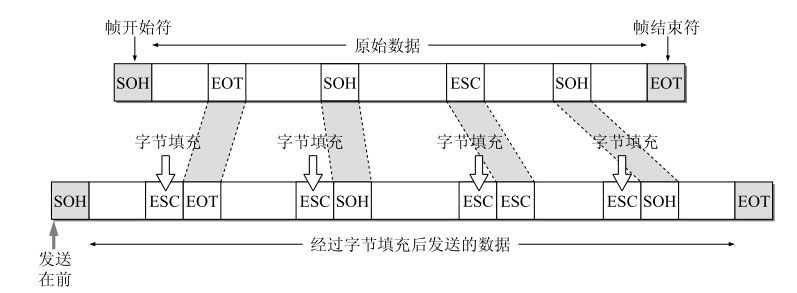

### 差错检测

目前数据链路层广泛使用了循环冗余检验（CRC）来检查比特差错。

引入：奇偶校验（采用奇校验，那么每个字节的1的个数需要是奇数个，如果不满足在后面补1，否则后面补0；偶校验同理，只需每个字节的1的个数是偶数个）；累加和校验（在一次通讯数据包的最后加入一个字节的校验数据，是将前面数据包中全部数据的忽略进位的按字节累加和）

CRC算法是将传输的数据流的二进制在后补零之后，与指定的除数相除，得到余数

CRC采用的除法，不是传统的除法，而是将二进制数据流作为多项式的系数，然后进行的是多项式的乘除法：**乘除法采用正常的多项式乘除法，而加减法都采用模2运算**——加减法实际上就是**异或运算**

eg：


具体见[blog](https://blog.csdn.net/liyuanbhu/article/details/7882789)

流程是：

- 确定采用哪种生成多项式，即确定除数：eg：$CRC8 = X^8+X^5+X^4+X^0$，那么就是1,0011,0001，简记为0x31（最高位一定为1，所以忽略）

- 确定位宽，就是生成多项式长度-1，那么CRC8就是9-1=8位位宽。那么在除法计算前，需要在后面补上8个0

- 开始除法计算，原则是：除法采用正常的除法，减法采用异或

- 最后能够得到8位的余数，于是传输的串就是原长度 + 8位余数

  而该余数：是为了进行检错而添加的冗余码，常称为**帧检验序列FCS**

如果在传输过程中无差错，那么经过CRC检验后得出的**余数R肯定是0**。
但如果出现误码，那么余数R仍等于0的概率是非常小的。

所以：数据链路层只采用CRC差错检测技术，只能接受无差错的帧，对于有差错的帧选择直接丢弃——可以近似的认为：**凡是接收端数据链路层接受的帧均无差错**

所以，数据链路层只能保证无差错，并**不能保证可靠传输**：还是会存在帧丢失、帧重复、帧乱序

## 2.2 信道

### 1. 信道分类

- 广播信道：一对多通信，一个节点发送的数据能够被广播信道上所有的节点接收到。

  所有的节点都在同一个广播信道上发送数据，因此需要有专门的控制方法进行协调，避免发生冲突（冲突也叫碰撞）。

  控制的方法有两种：信道复用技术，**CSMA/CD 协议**

- 点对点信道：一对一通信

  不会发生碰撞，比较简单，用**PPP协议**进行控制

### 2. 信道复用（广播信道）

背景：同一个信道，可能有很多设备都需要在上面发送数据

- 频分复用FDM：所有主机在相同时间**占用不同的频率**带宽资源——同一时刻有多个信息在传输
- 时分复用TDM：所有主机在**不同时间占用**相同的频率带宽资源——同一时刻只有一个信息在传输

——这两种通信方式，**在通信的过程中主机会一直占用一部分信道资源**。但是由于计算机数据的突发性质，通信过程没必要一直占用信道资源而不让出给其它用户使用，因此这两种方式对信道的利用率都不高。


- 统计时分复用：不固定每个用户在时分复用帧中的位置，只要有数据就集中起来组成，当一个帧的数据放满了，就发送出去。

  这个又称为**异步时分复用**，用户并不是周期性占有某段时间片的

  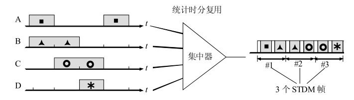

- 波分复用：采用不同的波长来光来传递不同的信息，即光的频分复用

- **码分复用**：利用正交的性质

  每一个用户可以在**同样的时间使用同样的频带进行通信**，用户之间用不同的码型，使互相之间不会产生干扰，即能从数据流中分离出传递给自己的信息。该信号有很强的抗干扰能力，其频谱类似于白噪声，不易被敌人发现

  规则是：
  
- 为每个用户分配 m bit 的码片，并且所有的码片**正交**，即对于任意两个码片 $\vec S$ 和 $\vec T$ ，满足：$\frac{1}{m} \vec S \cdot \vec T=0$
  - 在拥有该码片的用户发送比特 1 时就发送该码片，发送比特 0 时就发送该码片的反码

  举例：取 m=8，设 $\vec S$ 的码片为 00011011

  在计算时将 00011011 记作 (-1 -1 -1 +1 +1 -1 +1 +1)，可以得到：

  $\frac{1}{m} \vec S \cdot \vec {S'}=-1$

  $\frac{1}{m} \vec S \cdot \vec S=1$

  所以，当接收端使用码片对接收到的数据进行内积运算时，结果为 0 的是其它用户发送的数据，结果为 1 的是用户发送的比特 1，结果为 -1 的是用户发送的比特 0。

  ——即通过内积的计算，排除非自己接收的数据，接收自己的数据0、1数据串
  
  码分复用需要发送的数据量为原先的 m 倍。

### 3. CSMA/CD协议（广播信道）

载波监听多点接入 / 碰撞检测。

- 多点接入：**总线型网络**，主机以多点接入的方式连接在一根总线上（在总线上，同一时间只能有一个主机在发送数据，多个点发送的数据会产生干扰）

- 载波监听：即**检测信道，每个节点不论在何种状态下必须不停检测信道**

  发送前检测，为了获得发送权。如果发送前检测到有其他站在发送就暂停发送；如果没有发送就发送

- 碰撞检测：**边发送边监听**，即适配器边发送数据边检测信道上的信号电压的变化情况，以便判断自己在发送数据时其他站是否也在发送数据。

  当几个站同时在总线上发送数据时，总线上的信号电压变化幅度将会增大（互相叠加）。当适配器检测到的信号电压变化幅度超过一定的门限值时，就认为总线上至少有两个站同时在发送数据，表明产生了碰撞。

  一旦发现碰撞，停止发送，等待一段时间后才再次发送。

  why：在发送前确认没有在发送，而发送时还是会发生碰撞
  
  $\because$ 可能存在同时检测，同时发现空闲，同时发送的问题；还有，电磁波发送存在一定的延时，需要隔一段时间才能检测到（**电磁波在1km电缆的传播时延约为5 μs**）

单程端到端的传播时延为 $\tau$，最先发送的站点最多经过 $2\tau$ 就可以知道是否发生了碰撞，称 **$2\tau$为争用期（碰撞窗口）** 。只有经过争用期之后还没有检测到碰撞，才能肯定这次发送不会发生碰撞。——最大的极端就是如下：

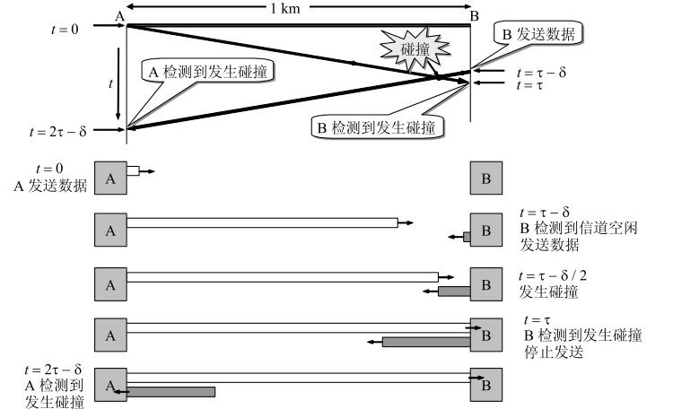

（$\tau$，取最坏情况，即取总线两端的两个站之间的传播时延（这两个站之间的距离最大）为端到端传播时延。）

使用CSMA/CD协议时，一个站不可能同时进行发送和接收（但必须边发送边监听信道）。因此使用**CSMA/CD协议的以太网只能按照半双工通信**

当发生碰撞时，站点要停止发送，等待一段时间再发送。这个时间采用 **截断二进制指数退避算法** 来确定：

- 首先规定了基本退避时间为$2\tau$，具体的**争用期时间是51.2 μs**。对于10Mb/s以太网，在争用期内可发送512bit，即64字节。也可以说争用期是512比特时间。1比特时间就是发送1比特所需的时间。
- 从离散的整数集合$ {0, 1, .., (2^k-1)} (k=min(重传次数, 10)$)中随机取出一个数，记作 r，然后取 r 倍的争用期作为重传等待时间。等待该时间之后，再次尝试重传。如果重传16次仍不成功，就丢弃该帧向上层报告。

所以，还存在一种情况：

某个站发送了一个很短的帧，但发生了碰撞。不过在这个帧发送完毕后发送站才检测到发生了碰撞。但已经没有办法中止帧的发送——在发送完毕之前没有检测出碰撞，所。以以太网规定：**最短帧长64字节，即512bit**。如果要发送的数据非常少，那么必须加入一些填充字节，使帧长不小于64字节——**凡长度小于 64 字节的帧都是由于冲突而异常中止的无效帧。**只要收到了这种无效帧，就应当立即将其丢弃。

信号在以太网上传播1km大约需要5 μs。以太网上最大的端到端时延必须小于争用期的一半（即25.6 μs），这相当于**以太网的最大端到端长度约为5km**。实际上的以太网覆盖范围远远没有这样大。因此，实用的以太网都能在争用期51.2 μs内检测到可能发生的碰撞

——注意，这个是针对10Mb/s的以太网，现在的速度应该远不止了（100Mb/s，那么就修改争用期，变成5.12us，而最短帧长仍为64B，那么以太网最大的端到端的长度应该在1km内）

强化碰撞：当发送数据的站一旦发现发生了碰撞时，除了立即停止发送数据外，还要再继续发送**32比特或48比特的人为干扰信号**，以便让所有用户都知道现在已经发生了碰撞。10Mb/s以太网，发送32（或48）比特只需要3.2（或4.8）μs


所以，一次碰撞的发生，需要消耗：总线被占用的时间是$T_B + T_J +\tau$

以太网还规定了帧间最小间隔为**9.6 μs**，相当于96比特时间。为了使刚刚收到数据帧的站的接收缓存来得及清理，做好接收下一帧的准备

所以总结CSMA/CD的要点：

- 准备发送：适配器从网络层获得一个分组，加上以太网的首部和尾部，组成以太网帧，放入适配器的缓存中。**但在发送之前，必须先检测信道。**
- 检测信道：若检测到信道忙，则应不停地检测，一直等待信道转为空闲。若检测到信道空闲，并在96比特时间内信道保持空闲（保证了帧间最小间隔），就发送这个帧。
- 在发送过程中仍不停地检测信道，即网络适配器要边发送边监听，存在2种可能：
  - 发送成功：在争用期内一直未检测到碰撞。这个帧肯定能够发送成功。
  - 发送失败：在争用期内检测到碰撞。这时立即停止发送数据，并按规定发送人为干扰信号。适配器接着就执行指数退避算法，等待 r倍512比特时间后，再次检测信道等待发送（回到步骤2）

以太网每发送完一帧，一定要把已发送的帧暂时保留一下。如果在争用期内检测出发生了碰撞，那么还要在推迟一段时间后再把这个暂时保留的帧重传一次。

### 4. PPP协议（点对点信道）

因特网用户通常都要连接到某个ISP才能接入到因特网。**PPP协议就是用户计算机和ISP进行通信时所使用的数据链路层协议**。

PPP 的帧格式：

- F 字段为**帧的定界符**，帧的开头和结尾都有，如果出现连续两个定界符，是一个空帧，直接丢弃，0x7E
- A 和 C 字段暂时没有意义
- 2字节的协议字段：针对是网络层的协议：协议字段为0x0021时，PPP帧的信息字段就是IP数据报；0xC021,则信息字段是PPP链路控制协议LCP的数据
- FCS 字段是使用 CRC 的检验序列
- 内容部分的长度不超过 **1500字节**


PPP协议的透明传输的策略：

- 字节填充（异步传输中）：

  转义符定义为0x7D

  规定了：

  - 把信息字段中出现的每一个0x7E字节转变成为2字节序列(0x7D, 0x5E)
  - 若信息字段中出现一个0x7D的字节（即出现了和转义字符一样的比特组合）,则把0x7D转变成为2字节序列(0x7D, 0x5D)。
  - 若信息字段中出现ASCII码的控制字符（即数值小于0x20的字符），则在该字符前面要加入一个0x7D字节，同时将该字符的编码加以改变。例如，出现0x03（在控制字符中是“传输结束”ETX）就要把它转变为2字节序列(0x7D, 0x23)。

  收到之后，再反向替换，就能恢复原来的信息

- 零比特填充（同步传输中）：

  定界符：0X7E=0111,1110——所以存在连续6个1

  在发送端，先扫描整个信息字段（通常是用硬件实现，但也可用软件实现，只是会慢些）。只要发现有5个连续1，则立即填入一个0。

  在接收端，先找到定界符，然后对定界符内的比特流进行扫描，每当发现5个连续1时，就把这5个连续1后的一个0删除，以还原成原来的信息比特流

## 2.3 MAC地址（硬件/物理地址）

MAC 地址是链路层地址，长度为 **6 字节（48 位）**，用于**唯一标识网络适配器**，在网卡出厂时就写在**ROM**中了（固定的）

所以：

- 计算机的适配器坏了而我们更换了一个新的适配器，那么这台计算机的局域网的“地址”也就改变了（虽然，该计算机的位置等没有任何变化）
- 而如果将电脑移动到其他地方，但是由于适配器不变，所以MAC地址仍不变

——所以MAC地址不是严格意义上的地址，算是标识符

**一台主机拥有多少个网络适配器就有多少个 MAC 地址**。例如笔记本电脑普遍存在无线网络适配器和有线网络适配器，因此就有两个 MAC 地址。

**网卡有过滤功能**：每收到一个MAC帧就先用硬件检查MAC帧中的目的地址。如果是发往本站的帧则收下，然后再进行其他的处理。否则就将此帧丢弃，不再进行其他的处理

所以会收下3种帧：

-  单播帧（一对一），即收到的帧的MAC地址与本站的硬件地址相同
- 广播帧（一对全体），即发送给本局域网上所有站点的帧（全1地址）
- 多播帧（一对多），即发送给本局域网上一部分站点的帧。

## 2.4 链路层设备

### 1. 网桥

在数据链路层扩展以太网要使用网桥(bridge)。**网桥工作在数据链路层**，它根据MAC帧的目的地址对收到的帧进行**转发和过滤**。当网桥收到一个帧时，并不是向所有的接口转发此帧，而是先检查此帧的目的MAC地址，然后再确定将该帧转发到哪一个接口（转发），或者是把它丢弃（即过滤）

两个以太网通过网桥连接起来后，就成为一个覆盖范围更大的以太网，而原来的每个以太网就可以称为一个**网段**

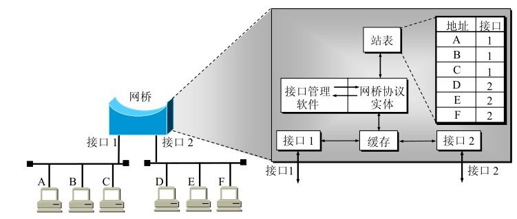

网桥依靠**转发表**（又称转发数据库或路由目录）来转发帧

若网桥从接口1收到A发给E的帧，则在查找转发表后，把这个帧送到接口2转发到另一个网段，使E能够收到这个帧。若网桥从接口1收到A发给B的帧，就丢弃这个帧，因为转发表指出，转发给B的帧应当从接口1转发出去，而现在正是从接口1收到这个帧，这说明B和A处在同一个网段上，B能够直接收到这个帧而不需要借助于网桥的转发。

网桥是通过内部的接口管理软件和网桥协议实体来实现的：

网桥的好处：

- 过滤通信量，增大吞吐量：不同网段上的通信不会相互干扰，不同网段间是隔离的碰撞域

  （两个网桥换成为集线器或转发器，那么整个网络仍然是一个碰撞域）

- 扩大了物理范围

- 提高了可靠性：网络出现故障，只影响个别网段

- 可互连不同物理层、不同MAC子层和不同速率（如10Mb/s和100Mb/s以太网）的以太网。

缺点：

- **增加时延**：先存储和查找转发表，然后才转发，并且转发前也还是需要执行CSMA/CD
- 没有流量控制功能，当网桥中的缓存的存储空间可能不够而发生溢出，以致产生帧丢失的现象
- 只适合于用户数不太多(不超过几百个)和通信量不太大的以太网，否则有时还会因传播过多的广播信息而产生网络拥塞。这就是所谓的**广播风暴**

**透明网桥**：以太网上的站点并不知道所发送的帧将经过哪几个网桥，以太网上的站点都看不见以太网上的网桥，还是一种即插即用设备（可自主学习）

学习方法：若从某个站A发出的帧从接口x进入了某网桥，那么从这个接口出发沿相反方向一定可把一个帧传送到A。所以网桥只要每收到一个帧，就记下其源地址和进入网桥的接口，作为转发表中的一个项目：构成了**地址 - 接口的映射表**（不是类似于路由器的，有目的地址，端口等多种信息的）

并且还使用了一个生成树(spanning tree)算法：找到在任何两个站之间确定的一条路径（防止兜圈子，针对错误的目的地址帧，如果没有该算法，就会在局域网）

### 2. 交换机

<a name="exchange"></a>

本质上是**多接口的网桥**

交换机也具有自学习能力，学习的是交换表的内容，交换表中存储着 **MAC 地址到接口的映射**。

正是由于这种自学习能力，因此交换机是一种即插即用设备，不需要网络管理员手动配置交换表内容。

下图中，交换机有 4 个接口，主机 A 向主机 B 发送数据帧时，交换机把主机 A 到接口 1 的映射写入交换表中。为了发送数据帧到 B，先查交换表，此时没有主机 B 的表项，那么主机 A 就发送广播帧，主机 C 和主机 D 会丢弃该帧，主机 B 回应该帧向主机 A 发送数据包时，交换机查找交换表得到主机 A 映射的接口为 1，就发送数据帧到接口 1，同时交换机添加主机 B 到接口 2 的映射。


交换机主要学习的是：连接的主机的MAC地址 - 端口的映射关系

利用以太网交换机可以很方便地实现**虚拟局域网 VLAN**

### 3. 适配器

计算机与外界局域网的连接是通过通信**适配器**，即为**网卡**。

配器和局域网之间的通信是通过电缆或双绞线以串行传输方式进行的，而适配器和计算机之间的通信则是通过计算机主板上的I/O总线以并行传输方式进行的——适配器的一个重要功能就是要进行数据串行传输和并行传输的转换

**适配器包含了数据链路层及物理层这两层次**

适配器接收和发送各种帧时不使用计算机的CPU：

- 当适配器收到有差错的帧时，就把这个帧丢弃而不必通知计算机
- 当适配器收到正确的帧时，它就使用**中断**来通知该计算机并交付协议栈中的网络层
- 当计算机要发送IP数据报时，就由协议栈把IP数据报向下交给适配器，组装成帧后发送到局域网

**计算机的硬件地址（MAC地址）：存放在适配器（网卡）的ROM中，是写死固定的。而计算机的软件地址（IP地址）放在计算机的存储器中**

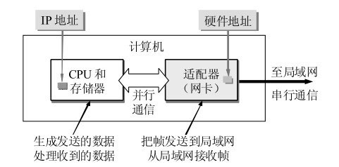

### 4. 集线器（物理层）

<a name="collector"></a>

集线器的主要功能是对接收到的比特进行再生整形放大，**以扩大网络的传输距离**，之后再将这个比特发送到其它所有接口。如果集线器同时收到两个不同接口的帧，那么就发生了碰撞。

使用集线器的以太网在逻辑上仍是一个**总线网**，各站共享逻辑上的总线，使用的还是CSMA/CD协议。在同一时刻至多只允许一个站发送数据

**集线器工作在物理层，它的每个接口仅仅简单地转发比特**——收到1就转发1，收到0就转发0，不进行碰撞检测，该发生的碰撞还是会发生，没有帧缓存功能

## 2.5 不同的网络概念

### 1. 局域网

局域网是一种典型的**广播信道**，**主要特点是网络为一个单位所拥有，且地理范围和站点数目均有限**。

局域网的主要优点：

- **具有广播功能**，从一个站点可很方便地访问全网。局域网上的主机可共享连接在局域网上的各种硬件和软件资源
- 便于系统的扩展和逐渐地演变，各设备的位置可灵活调整和改变
- 提高了系统的可靠性、可用性和生存性。

可以按照网络拓扑结构对局域网进行分类：


（匹配电阻：避免在总线上产生有害的电磁波反射）

局域网工作的层次**跨越了数据链路层和物理层**，而不仅仅和数据链路层相关

### 2. 以太网（局域网的一种）

以太网是一种**星型拓扑结构局域网**。

为了通信的简便，以太网采取了以下两种措施：

- **无连接**的工作方式。适配器对发送的**数据帧不进行编号，也不要求对方发回确认**（TCP的要求编号 + ACK确认）。这样做可以使以太网工作起来非常简单，而**局域网信道的质量很好**，因通信质量不好产生差错的概率是很小的。因此，以太网提供的服务是**尽最大努力的交付，即不可靠的交付**。当目的站收到有差错的数据帧时（例如，用CRC查出有差错），就把帧丢弃，其他什么也不做。**对有差错帧是否需要重传则由高层来决定**。例如，如果高层使用TCP协议，那么TCP就会发现丢失了一些数据。于是经过一定的时间后，TCP就把这些数据重新传递给以太网进行重传。但以太网并不知道这是重传帧，而是当作新的数据帧来发送。

  由于以太网是随机接入的，所以存在一个时间可能有多个主机需要发送信息，那么会产生干扰，所以需要有协议来控制该冲突：**CSMA/CD**

- 用**曼彻斯特编码**的信号。

  原因：普通0/1信号，当出现一长串的连1或连0时，接收端就无法从收到的比特流中提取位同步（即比特同步）信号。

  而曼彻斯特编码的码元1是在前一个间隔为低电压而后一个间隔为高电压（01）。码元0则正好相反（10），那么保证了在每一个码元的正中间出现一次电压的转换，而接收端就利用这种电压的转换很方便地把位同步信号提取出来

  差分曼彻斯特码是：0不变，遇到1变化。

  但是它所占的**频带宽度比原始的基带信号增加了一倍**

  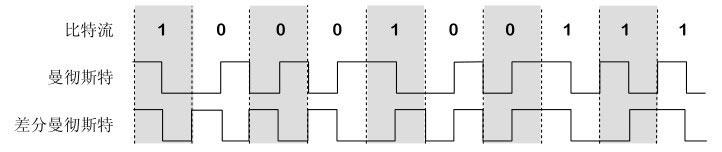

早期使用[集线器](#collector)进行连接，目前以太网**使用交换机替代了集线器**，[交换机](#exchange)是一种链路层设备，它不会发生碰撞，能根据 MAC 地址进行存储转发。

以太网MAC帧格式：

- **类型** ：标记上层使用的协议；0x0800时，就表示上层使用的是IP数据报

- **数据** ：长度在 46-1500 之间，如果太小则需要填充；

  min = 46 = 64 - 首部（6+6+2+4）

  max = MTU = 1500

  如果需要填充，那么是由上层协议来剥离填充部分的：IP协议的首部就有一个“总长度”字段。因此，“总长度”加上填充字段的长度，应当等于MAC帧数据字段的长度

  eg：当IP数据报的总长度为42字节。当MAC帧把46字节的数据上交给IP层后，IP层就把其中最后4字节的填充字段丢弃。

- **FCS** ：帧检验序列，使用的是 CRC 检验方法；


前同步码：接收端的适配器在接收MAC帧时能够迅速调整其时钟频率，使它和**发送端的时钟同步**，也就是“实现位同步“

MAC帧的FCS字段的检验范围不包括前同步码和帧开始定界符

### 3. 虚拟局域网（服务，而不是类型）

虚拟局域网：由一些局域网网段构成的与物理位置无关的逻辑组，而这些网段具有某些**共同的需求**。每一个**VLAN的帧都有一个明确的标识符**，指明发送这个帧的工作站是属于哪一个VLAN。

**虚拟局域网其实只是局域网给用户提供的一种服务，而并不是一种新型局域网。**

虚拟局域网可以建立与物理位置无关的逻辑组，只有在同一个虚拟局域网中的成员才会收到链路层广播信息。

例如下图中 (A1, A2, A3, A4) 属于一个虚拟局域网，A1 发送的广播会被 A2、A3、A4 收到，而其它站点收不到。


使用 VLAN 干线连接来建立虚拟局域网，每台交换机上的一个特殊接口被设置为干线接口，以互连 VLAN 交换机。IEEE 定义了一种扩展的以太网帧格式 802.1Q，它在标准以太网帧上加进了 4 字节首部 VLAN 标签，用于表示该帧属于哪一个虚拟局域网。

# 3. 网络层

## 3.1 概述

命名：由于网络层的核心是网际协议IP，所以又称**网际层、IP层**

整个互联网的核心

网络层：**主要是将多个网络通过路由器互联成为一个互联网**。

网络层向上只提供简单灵活的、**无连接的**、**尽最大努力交互**的数据报服务。

- 无连接：发送分组时不需要先建立连接。每一个分组（也就是IP数据报）独立发送，与其前后的分组无关（不进行编号）

- 尽最大努力交互：即不可靠的，所传送的分组可能出错、丢失、重复和失序（即不按序到达终点），当然也不保证分组交付的时限

  （如果通信需要是可靠的，那么就由网络的主机中的传输层负责）

**网际协议IP**是TCP/IP体系中两个最主要的协议之一

与 IP 协议配套使用的还有三个协议：

- **地址解析协议 ARP**（Address Resolution Protocol），还有对应的逆地址解析协议RARP（已经淘汰了，DHCP协议已经包含了RARP协议的功能）
- **网际控制报文协议 ICMP**（Internet Control Message Protocol）
- **网际组管理协议 IGMP**（Internet Group Management Protocol）

4个协议之间的关系：

IP需要用到ARP，ICMP和IGMP需要用到IP

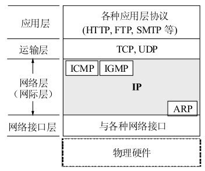

网络是多种多样的，TCP/IP体系在网络互连上采用的做法是在**网络层（即IP层）采用了标准化协议**，但相互连接的网络则可以是异构的。参加互连的计算机网络都使用相同的IP协议，因此可以把互连以后的网络看成一个**虚拟互连网络**，即逻辑互连网络：互连起来的各种物理网络的存在异构性，但是利用IP协议就可以使这些性能各异的网络在网络层上看起来好像是一个统一的网络

## 3.2 IP 数据报格式


首部的前一部分是固定长度，共**20字节**，是所有IP数据报必须具有的。在首部的固定部分的后面是一些可选字段，其长度是可变的

- **版本** : 有 4（IPv4）和 6（IPv6）两个值；

- **首部长度** : 占 4 位，因此最大值为 15。值为 1 表示的是 1 个 32 位字的长度，也就是 4 字节。因为固定部分长度为 20 字节，因此该值最小为 5。首部最大为60字节（希望用户尽量减少开销）。如果可选字段的**长度不是 4 字节的整数倍，就用尾部的填充部分来填充**。

- **区分服务** : 用来获得更好的服务，一般情况下不使用。

- **总长度** : 包括首部长度和数据部分长度。（如果存在分片，也是每个分片的IP数据报的总长度）

- **生存时间** ：TTL，它的存在是为了防止无法交付的数据报在互联网中不断兜圈子。**以路由器跳数为单位**，当 TTL 为 0 时就丢弃数据报。

- **协议** ：指出携带的数据应该上交给哪个协议进行处理，例如 ICMP、TCP、UDP 等。

- **首部检验和** ：因为数据报每经过一个路由器，都要重新计算检验和，因此**检验和不包含数据部分**可以减少计算的工作量。

  （先把IP数据报首部划分为许多16位字的序列，并把检验和字段置零。用反码算术运算把所有16位字相加后，将得到的和的反码写入检验和字段）

- **标识** : 在数据报长度过长从而发生分片的情况下，**相同数据报的不同分片具有相同的标识符**。

- **片偏移** : 和标识符一起，用于发生分片的情况。该片在原分组中的相对位置。**片偏移的单位为 8 字节**。（所以需要以8字节为单位进行分片，最后一个分片可以不足8字节）

-  **标志**(flag) 占3位，但目前只有两位有意义。

  - 标志字段中的最低位记为MF (More Fragment)。MF = 1即表示后面“还有分片”的数据报。MF = 0表示这已是若干数据报片中的最后一个
  - 标志字段中间的一位记为DF (Don't Fragment)，意思是“不能分片”。只有当DF = 0时才允许分片。

在IP层下面的每一种数据链路层协议都规定了一个数据帧中的数据字段的最大长度，这称为**最大传送单元MTU** (Maximum Transfer Unit)。当一个IP数据报封装成链路层的帧时，此数据报的总长度（即首部加上数据部分）一定不能超过下面的数据链路层所规定的MTU值。最常用的以太网就规定其**MTU值是1500字节**。若所传送的数据报长度超过数据链路层的MTU值，就必须把过长的数据报进行分片处理。每个分片都有首部

虽然使用尽可能长的IP数据报会使传输效率提高（因为每一个IP数据报中首部长度占数据报总长度的比例就会小些），但数据报短些也有好处。每一个IP数据报越短，路由器转发的速度就越快

**IPv6就把IP数据报的首部长度做成固定的**

## 3.3 IP地址分类

IP 地址的编址方式经历了三个历史阶段：

- 分类
- 子网划分
- 无分类

### 0. IP地址和MAC地址的区分

层次的角度看：

- 物理地址是数据链路层和物理层使用的地址
- IP地址是网络层和以上各层使用的地址，是一种**逻辑地址**

使用IP地址的IP数据报一旦交给了数据链路层，就被封装成MAC帧了。**MAC帧在传送时使用的源地址和目的地址都是硬件地址**

连接在通信链路上的设备（主机或路由器）在接收MAC帧时，其根据是MAC帧首部中的硬件地址。在**数据链路层看不见隐藏在MAC帧的数据中的IP地址**。只有在剥去MAC帧的首部和尾部后把MAC层的数据上交给网络层后，**网络层能在IP数据报的首部中找到源IP地址和目的IP地址。**

### 1. 分类

IP地址 = 网络号 + 主机号，其中不同分类具有不同的网络号长度，并且是固定的。

网络号：标志主机连接到的网络，要求在整个互联网范围内是唯一的

主机号：要求在该网络中是唯一的

——该IP地址在整个因特网范围内是唯一的。


*A类、B类和C类地址都是单播地址（一对一通信）*

*D类地址用于多播（一对多通信）*

从IP地址的结构来看，IP地址并不仅仅指明一个主机，而是还指明了主机所连接到的网络。

**特殊的保留IP：**

| 类别 | 网络号数据   | 网络范围 | 主机数       |
| ---- | ------------ | -------- | ------------ |
| A    | $2^7-2$      | 0~127    | $2^{24} - 2$ |
| B    | $2^{14} - 2$ | 128~191  | $2^{16} - 2$ |
| C    | $2^{21}-1$   | 192~224  | $2^8-2$      |

A类中不能分配的网络号：

- 0。**网络号字段为全0的IP地址是个保留地址，意思是“本网络”**
- 127（即01111111）。保留作为本地软件**环回测试**

B类中不能分配的网络号：

- 网络地址128.0.0.0是不指派的，可以指派的B类最小网络号是128.1.0.0

C类

- 网络地址192.0.0.0也是不指派的，可以指派的C类最小网络号是192.0.1.0

主机号都有2个不能分配：

- 全0的主机号字段表示该IP地址是“本主机”所连接到的**单个网络地址**
- 全1表示“所有的(all)”，因此全1的主机号字段表示该网络上的**所有主机**

特点：

- IP地址管理机构在分配IP地址时只分配网络号，主机号给单位自行分配
- 路由器仅根据目的主机所连接的网络号来转发分组，减小了路由表所占的存储空间以及查找路由表的时间

——很少使用了

### 2. 子网划分

通过在主机号字段中拿一部分作为子网号，把两级 IP 地址划分为三级 IP 地址。

IP 地址 = 网络号  + **子网号** + 主机号

不使用第一种分类的原因：

- IP地址空间的利用率有时很低，对于A类网络，主机有时候没有那么多，造成大量浪费
- 给每一个物理网络分配一个网络号会使路由表变得太大，导致网络性能变坏
- 两级IP地址不够灵活，必须要先申请到网络号才能将网络接入

特点：**划分子网只是把IP地址的主机号这部分进行再划分，而不改变IP地址原来的网络号**。

凡是从其他网络发送给本单位某个主机的IP数据报，仍然是根据IP数据报的目的网络号找到连接在本单位网络上的路由器。但此路由器在收到IP数据报后，再按目的网络号和**子网号找到目的子网**，把IP数据报交付目的主机

要使用子网，必须配置**子网掩码**——**一个网络或一个子网的重要属性**

IP 地址 与 子网掩码 = 网络地址，并且根据IP，能够知道网络所属的类，并且能够根据掩码知道子网位数和子网号

eg：一个 B 类地址的默认子网掩码为 255.255.0.0（前16位），如果 B 类地址的子网占两个比特（说明最多有4个子网），那么子网掩码为 11111111 11111111 11000000 00000000，也就是 255.255.192.0。

145.13.3.10的主机所在的网络进行子网划分，它本来是B类的网络（128~192之间的），将主机号的8位作为子网号，那么当前IP所在的子网号为3的网络的**网络地址是145.13.3.0**（既不是原来两级IP地址的网络地址145.13.0.0，也不是简单的子网号3，网络地址 = 网络号 + 子网号+补0）

注意：外部网络看不到子网的存在，对外还是表现为一个网络

划分子网增加了灵活性，但却减少了能够连接在网络上的主机总数

在不划分子网时，既然没有子网，为什么还要使用子网掩码？——为了更便于查找路由表

### 3. 无分类编址CIDR

特点：

- 消除了传统 A 类、B 类和 C 类地址以及划分子网的概念使用网络前缀和主机号来对 IP 地址进行编码，网络前缀的长度可以根据需要变化。
-  CIDR把**网络前缀都相同**的连续的IP地址组成一个“CIDR地址块”。

IP 地址 =  网络前缀号 + 主机号

CIDR：使用“斜线记法"，IP地址后面加上斜线“/”，然后写上网络前缀所占的位数，eg：192.168.0.0/16，表示前16位为网络号，也表示子网掩码的1的个数，CIDR 的地址掩码可以继续称为子网掩码

CIDR仍然在本单位内根据需要划分出一些子网

一个 CIDR 地址块中有很多地址，一个 CIDR 表示的网络就可以表示原来的很多个网络，并且在路由表中只需要一个路由就可以代替原来的多个路由，减少了路由表项的数量。把这种通过使用网络前缀来减少路由表项的方式称为**路由聚合**，也称为 **构成超网** 。


——就是将路由表中的路由表项能合并的尽量合并：——最长前缀匹配即可

eg：172.18.129.0/24、172.18.130.0/24、172.18.132.0/24、172.18.133.0/24，如果这四个进行路由汇聚，得到172.18.128.0/21，那么表项从4个变成1个。

在路由表中的项目由“网络前缀”和“下一跳地址”组成，在查找时可能会得到不止一个匹配结果，应当采用**最长前缀匹配**来确定应该匹配哪一个。前缀匹配越多，那么网络越具体

eg：其目的IP地址为D = 206.0.71.130，路由表中：206.0.68.0/22和206.0.71.128/25，均能匹配上，那么选择后者，因为后者匹配的数位25，所以更为具体

CIDR优势：

- 可以更加有效地分配IPv4的地址空间，可根据客户的需要分配适当大小的CIDR地址块，而不用按照8/16/24来划分网络号，而可以在1~31位网络号中随意分配

## 3.4 地址解析协议ARP

### 1. 概念

问题引出：已经知道了一个机器的IP地址，需要找出其相应的硬件地址（RARP，已知硬件地址的主机能够通过RARP协议找出其IP地址）

原因：实际传输过程中，还是要在**实际网络的链路上传送数据帧**时，最终还是必须使用该网络的硬件地址。但IP地址和下面的网络的硬件地址之间由于格式不同而不存在简单的映射关系（IP地址有32位，而局域网的硬件地址是48位），并且在一个网络上可能经常会有新的主机加入进来，或撤走一些主机。更换网络适配器也会使主机的硬件地址改变。

——即网络层实现主机之间的通信，而链路层实现具体每段链路之间的通信。因此在通信过程中，IP 数据报的源地址和目的地址始终不变，而 MAC 地址随着链路的改变而改变，所以报文中需要获得MAC地址


每个主机都有一个 ARP 高速缓存，里面有**本局域网**上的各主机和路由器的 IP 地址到 MAC 地址的映射表，并且这个映射表还经常动态更新（新增或超时删除）

流程：

- 当主机A要向本局域网上的某个主机B发送IP数据报时，就先在其ARP高速缓存中查看有无主机B的IP地址

  如果在ARP Cache中存在IP地址（即存在对应的映射），那么直接获取MAC地址，封装成MAC帧，然后发送即可

- 如果没有，可能是主机B才入网，也可能是主机A的ARP Cache还是空的

  - ARP进程在本局域网上**广播发送**一个ARP请求分组

    主要内容是：“我的IP地址是209.0.0.5，硬件地址是00-00-C0-15-AD-18。我想知道IP地址为209.0.0.6的主机的硬件地址

  - 所有主机上运行的ARP进程都收到此ARP请求分组

  - 主机B的IP地址与ARP请求分组中要查询的IP地址一致，就收下这个ARP请求分组，并向主机A发送ARP响应分组

    主要内容是：“我的IP地址是209.0.0.6，我的硬件地址是08-00-2B-00-EE-0A

  - 主机A收到主机B的ARP响应分组后，就在其ARP高速缓存中写入主机B的IP地址到硬件地址的映射。

    （并且，当主机B收到A的ARP请求分组时，也会把A的这一地址映射写入主机B自己的ARP高速缓存中，所以A的请求分组需要带上自己的IP地址和MAC地址，方便别的主机进行cache存储）

——ARP请求分组是广播发送的，但ARP响应分组是普通的单播


ARP Cache的生存时间：每一个映射地址项目都设置生存时间，凡超过生存时间的项目就从高速缓存中删除掉

### 2. 注意

ARP是解决**同一个局域网**上的主机或路由器的IP地址和硬件地址的映射问题，跨局域网ARP无法解析MAC地址，也不需要MAC地址。不同局域网需要通过路由器（跨局域网的传输时，通过路由器，而路由器存在不同的IP地址，所以源IP和目的IP也会发生变化）

从IP地址到硬件地址的解析是自动进行的，主机的用户对这种地址解析过程是不知道的

典型的4种利用ARP的场景：


（1）发送方是主机（如H1），要把IP数据报发送到**同一个网络**上的另一个主机（如H2）。这时H1发送ARP请求分组（在网1上广播），找到目的主机H2的硬件地址。——直接使用

（2）发送方是主机（如H1），要把IP数据报发送到**另一个网络**上的一个主机（如H3或H4）。这时H1发送ARP请求分组（在网1上广播），找到网1上的一个**路由器**R1的硬件地址。剩下的工作由路由器R1来完成。

（3）发送方是路由器（如R1），要把IP数据报转发到与R1连接在同一个网络（网2）上的主机（如H3）。这时R1发送ARP请求分组（在网2上广播），找到目的主机H3的硬件地址

（4）发送方是路由器（如R1），要把IP数据报转发到网3上的一个主机（如H4）。H4与R1不是连接在同一个网络上。这时R1发送ARP请求分组（在网2上广播），找到连接在网2上的一个路由器R2的硬件地址。剩下的工作由这个路由器R2来完成

why：不直接使用硬件地址进行通信，而是要使用抽象的IP地址并调用ARP来寻找出相应的硬件地址呢？

存在着各式各样的网络，它们使用不同的硬件地址。要使这些异构网络能够互相通信就必须进行非常复杂的硬件地址转换工作。而IP地址是统一的，对于用户来说只需关注IP地址，MAC地址转换工作交给ARP进程即可

## 3.5 网际控制报文协议 ICMP

ICMP 是为了更有效地转发 IP 数据报和提高交付成功的机会。它封装在 IP 数据报中，但是不属于高层协议：ICMP报文 +IP首部，然后发送出去

主要功能：报告差错情况和提供有关异常情况的报告

ICMP 报文分为**差错报告报文**和**询问报文**。


（时间超过：当路由器收到生存时间为零的数据报时，除丢弃该数据报外，还要向源点发送时间超过报文。当终点在预先规定的时间内不能收到一个数据报的全部数据报片时，就把已收到的数据报片都丢弃，并向源点发送时间超过报文。）

（改变路由（重定向） 路由器把改变路由报文发送给主机，让主机知道下次应将数据报发送给另外的路由器（可通过更好的路由））

（回送请求和回答：测试目的站是否可达以及了解其有关状态）

（时间戳请求与回答：可用来进行时钟同步和测量时间。）

ICMP差错报告报文中的数据字段都具有同样的格式：把收到的需要进行差错报告的**IP数据报的首部**和**数据字段的前8个字节**（这些信息对源点通知高层协议是有用的）提取出来，作为ICMP报文的数据字段。再加上相应的ICMP差错报告报文的前8个字节，就构成了ICMP差错报告报文


特殊情况：

不应发送ICMP差错报告报文的几种情况

- 对ICMP差错报告报文不再发送ICMP差错报告报文
- 对第一个分片的数据报片的所有后续数据报片都不发送ICMP差错报告报文
- 对具有多播地址的数据报都不发送ICMP差错报告报文
- 对具有特殊地址（如127.0.0.0或0.0.0.0）的数据报不发送ICMP差错报告报文。

### 1. Ping（分组网间探测）

Ping 是 ICMP 的一个重要应用，主要用来**测试两台主机之间的连通性**。

PING是**应用层直接使用网络层ICMP**的一个例子。它没有通过运输层的TCP或UDP

原理：PING使用了ICMP回送请求与回送回答报文，通过向目的主机发送 ICMP Echo 请求报文，目的主机收到之后会发送 Echo 回答报文。**Ping 会根据时间和成功响应的次数估算出数据包往返时间以及丢包率。**

### 2. Traceroute

Traceroute 是 ICMP 的另一个应用，用来**跟踪一个分组从源点到终点的路径**。

Traceroute 发送的 IP 数据报封装的是无法交付的 UDP 用户数据报，并由目的主机发送终点不可达差错报告报文。

- 源主机向目的主机发送一连串的 IP 数据报。第一个数据报 P1 的生存时间 TTL 设置为 1，当 P1 到达路径上的第一个路由器 R1 时，R1 收下它并把 TTL 减 1，此时 TTL 等于 0，R1 就把 P1 丢弃，并向源主机发送一个 **ICMP 时间超过差错报告报文**；
- 源主机接着发送第二个数据报 P2，并把 TTL 设置为 2。P2 先到达 R1，R1 收下后把 TTL 减 1 再转发给 R2，R2 收下后也把 TTL 减 1，由于此时 TTL 等于 0，R2 就丢弃 P2，并向源主机发送一个 ICMP 时间超过差错报文。
- 不断执行这样的步骤，直到最后一个数据报**刚刚到达目的主机**，主机不转发数据报，也不把 TTL 值减 1。但是因为数据报封装的是无法交付的 UDP，因此目的主机要向源主机发送 **ICMP 终点不可达差错报告报文**。
- 之后**源主机知道了到达目的主机所经过的路由器 IP 地址以及到达每个路由器的往返时间**。

## 3.6 路由选择协议

路由选择协议都是自适应的，能随着网络通信量和拓扑结构的变化而自适应地进行调整。

互联网可以划分为许多较小的自治系统 AS，一个AS对其他AS表现出的是一个单一的和一致的路由选择策略（该AS选择的路由协议是一致的），eg：一个大的ISP就是一个AS

可以把路由选择协议划分为两大类：

- 内部网关协议IGP：AS内部的路由选择：RIP 和 OSPF
- 外部网关协议EGP：AS间的路由选择：BGP

（要弄清以下三个要点，即和哪些路由器交换信息？交换什么信息？在什么时候交换信息？）

### 1. 路由信息协议RIP：IGP

RIP 是一种**基于距离向量的路由选择协议**。距离是指跳数，直接相连的路由器跳数为 1。跳数最多为 15，**>15 表示不可达**。

特点：

- 仅和相邻路由器交换自己的路由表
- 换的信息是当前本路由器所知道的全部信息，即自己的路由表
- 按固定的时间间隔

经过若干次交换之后，所有路由器最终会知道到达本自治系统中任何一个网络的最短距离和下一跳路由器地址。

RIP协议可以收敛，并且过程也较快

距离向量算法：——找出到每个目的网络的**最短距离**

- 对地址为 X 的相邻路由器发来的 RIP 报文，先修改报文中的所有项目，把下一跳字段中的地址改为 X，并把所有的距离字段加 1；
- 对修改后的 RIP 报文中的每一个项目，进行以下步骤：
  - 若原来的路由表中没有目的网络 N，则把该项目添加到路由表中；
  - 否则（在路由表中有目的网络N）：若下一跳路由器地址是 X，则把收到的项目**替换**原来路由表中的项目（因为网络状态在发生改变）；否则（即这个项目是：到目的网络N，但下一跳路由器不是X）：若收到的项目中的距离 d 小于路由表中的距离，则进行更新（例如原始路由表项为 Net2, 5, P，新表项为 Net2, 4, X，则更新）；否则什么也不做。
- 若 3 分钟还没有收到相邻路由器的更新路由表，则把该相邻路由器标为不可达，即把距离置为 16。

RIP 协议优点：实现简单，开销小

 RIP 协议缺点：

- 能使用的最大距离为 15，**限制了网络的规模**
- 当网络出现故障时，要经过**比较长的时间才能将此消息传送到所有路由器**。

——RIP协议的这一特点叫做：**好消息传播得快，而坏消息传播得慢**

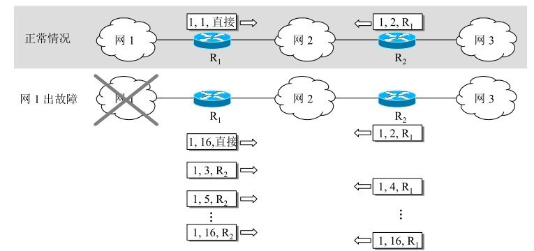

### 2. 开放最短路径优先OSPF：IGP

开放最短路径优先 OSPF，是为了克服 RIP 的缺点而开发出来的。

开放表示 OSPF 不受某一家厂商控制，而是公开发表的；最短路径优先表示使用了 Dijkstra 提出的最短路径算法 SPF。

OSPF 具有以下特点：

- 向本自治系统中的所有路由器发送信息，这种方法是**洪泛法**。
- 发送的信息就是**与相邻路由器的链路状态**，链路状态包括与哪些路由器相连以及链路的度量，度量用费用、距离、时延、带宽等来表示。这个是路由器的部分信息。
- 只有当链路状态发生变化时，路由器才会发送信息。

所有路由器都具有**全网的拓扑结构图**（RIP是走一步看一步），并且是一致的（RIP中每个路由器的路由表都是独有的）。相比于 RIP，OSPF 的更新过程收敛的很快。

OSPF将一个自治系统再划分为若干个更小的范围，叫作区域，那么能表示的范围更大，并且使用的泛洪法也会减少了整个网络上的通信量。在一个区域内部的路由器只知道本区域的完整网络拓扑，而不知道其他区域的网络拓扑的情况。OSPF使用**层次结构的区域划分**。在上层的区域叫作主干区域（主要是连通其他在下层的区域），从其他区域来的信息都由**区域边界路由器**进行概括。在主干区域内还要有一个路由器专门和本自治系统外的其他自治系统交换路由信息。这样的路由器叫作自治系统边界路由器

OSPF不用UDP而是直接用IP数据报传送，RIP是用UDP进行传送

### 3. 边界网关协议BGP：EGP

内部网关协议（如RIP或OSPF）主要是设法使数据报在一个AS中**尽可能有效地**从源站传送到目的站

AS 之间的路由选择很困难，主要是由于：

- 互联网规模很大：必须对任何有效的IP地址都能在路由表中找到匹配的目的网络，那么路由表将会十分庞大，RIP和OSPF都不适合了
- 各个 AS 内部使用不同的路由选择协议，无法准确定义路径的度量；
- AS 之间的路由选择必须考虑有关的策略，比如有些 AS 不愿意让其它 AS 经过。

BGP 只能寻找一条比较好的路由，而不是最佳路由。

**每个 AS 都必须配置 BGP 发言人**，通过在两个相邻 BGP 发言人之间**建立 TCP 连接**来交换路由信息。


## 3.7 虚拟专用网VPN

由于 IP 地址的紧缺，一个机构能申请到的 IP 地址数往往远小于本机构所拥有的主机数，并且一个机构并不需要把所有的主机接入到外部的互联网中。**机构内的计算机可以使用仅在本机构有效的 IP 地址（专用地址）**，而不需要给所有计算机申请全球唯一的IP地址（全球地址）

有三个专用地址块：

- 10.0.0.0 ~ 10.255.255.255（10.0.0.0/8）
- 172.16.0.0 ~ 172.31.255.255（172.16.0.0/12）
- 192.168.0.0 ~ 192.168.255.255（192.168.0.0/16）

专用地址只能用作本地地址而不能用作全球地址，又称可重用地址（世界上存在很多该重复的IP地址）。在因特网中的所有路由器，对目的地址是专用地址的数据报**一律不进行转发**。

VPN 使用公用的互联网作为本机构各专用网之间的通信载体。

- 专用：指机构内的主机只与本机构内的其它主机通信；
- 虚拟指好像是，而实际上并不是，它有经过公用的互联网进行专用网不同网点间的通信。由于要经过公用网，所以**所有通过因特网传送的数据都必须加密**

一个机构要构建自己的VPN就必须为它的每一个场所购买专门的硬件和软件，并进行配置，使**每一个场所的VPN系统都知道其他场所的地址**（即路由器需要能够知道其他场所的地址，那么能够通过路由器进行IP目的地址和源地址的包装，并发送出去）

下图中，场所 A 和 B 的通信经过互联网,如果场所 A 的主机 X 要和另一个场所 B 的主机 Y 通信，IP 数据报的源地址是 10.1.0.1，目的地址是 10.2.0.3

- 数据报先发送到与互联网相连的路由器 R1
  - R1 对内部数据进行加密，
  - 然后重新加上数据报的首部，源地址是路由器 R1 的全球地址 125.1.2.3，目的地址是路由器 R2 的全球地址 194.4.5.6
- 路由器 R2 收到数据报后将数据部分进行解密，恢复原来的数据报，此时目的地址为 10.2.0.3，就交付给 Y。

所以X到Y的通信，实际上是通过了公用的因特网，但在效果上就好像是在本部门的专用网上传送一样


## 3.8 网络地址转换NAT

背景：专用网内部的主机使用本地 IP 地址又想和互联网上的主机通信时，可以使用 NAT 来**将本地 IP 转换为全球 IP**——目前用的最多的扩展IP地址的途径（实际上是重用全球IP）

装有NAT软件的路由器叫做NAT路由器，**它至少有一个有效的外部全球IP地址**。这样，所有使用本地地址的主机在和外界通信时，都要在NAT路由器上将其本地地址转换成全球IP地址，才能和因特网连接。

NAT路由器工作流程：

- 发送数据报：IP数据报的源IP地址192.168.0.3，转换为新的源IP地址（**即NAT路由器的全球IP地址**）172.38.1.5，然后转发出去
- 接收数据报：通过NAT地址转换表，就可把IP数据报上的旧的目的IP地址172.38.1.5，转换为新的目的IP地址192.168.0.3（主机A真正的本地IP地址）

在以前，NAT 将本地 IP 和全球 IP 一一对应，这种方式下拥有 n 个全球 IP 地址的专用网内最多只可以同时有 n 台主机接入互联网。那么该专用网的主机可以轮流使用该n个全球IP地址。

为了更有效地利用全球 IP 地址，现在常用的 NAT 转换表把**传输层的端口号也用上了**，使得多个专用网内部的主机共用一个全球 IP 地址。使用端口号的 NAT 也叫做网络地址与端口转换 NAPT。


（NAPT把专用网内不同的**源IP地址，都转换为同样的全球IP地址**。但对源主机所采用的**TCP端口号（不管相同或不同），则转换为不同的新的端口号**。因此，当NAPT路由器收到从因特网发来的应答时，就可以从IP数据报的数据部分找出运输层的端口号，然后根据不同的目的端口号，从NAPT转换表中找到正确的目的主机。）——加上port，为了能够正确找到接收应答的主机


## 3.9 网络层设备——路由器

### 1. 路由器结构

路由器是一种具有多个输入端口和多个输出端口的**专用计算机**，从路由器某个输入端口收到的分组，把该分组从路由器的某个合适的输出端口转发给下一跳路由器。

路由器的转发分组正是网络层的主要工作。

路由器从功能上可以划分为：

- **路由选择**：控制部分，核心构件是路由选择处理机，主要任务：根据所选定的路由选择协议**构造出路由表**

- **分组转发**：交换结构、一组输入端口和一组输出端口

  - 交换结构：根据转发表对分组进行处理，将某个输入的分组找到合适的端口发送出去

    （交换结构可看成是“在路由器中的网络”）

注意，转发和选择有差别，转发是发出去，涉及到一个路由表；而选择，是涉及到多个路由器，主要就是路由表


路由表：**每个主机都有**（主机在发送每一个IP数据报时都要查找自己的路由表），若按目的主机号来制作路由表，则所得出的路由表就会过于庞大。在路由表中，对每一条的主要信息是：**（目的IP地址，下一跳IP地址）**（在分类网络中）；（目的网络地址、子网掩码和下一跳地址）（在子网划分网络中）

那么路由器也是有路由表的。

### 2. 路由器分组转发流程

在互联网上转发分组时，**是从一个路由器转发到下一个路由器**

问题提出：IP数据报的首部规定是源IP地址，和目的IP地址，那么该如何**通过目的IP地址找到一下跳路由器**呢？

分组转发算法：

- 从数据报的首部提取目的主机的 IP 地址 D，得到**目的网络地址 N**。
- 若 N 就是与此路由器直接相连的某个网络地址，则进行**直接交付**，直接把数据报交付目的主机（当然还需要，数据报封装为MAC帧，再发送此帧）；
- 若不是直接相连，若路由表中有目的地址为 D 的特定主机路由，则把数据报传送给表中所指明的下一跳路由器，是间接交付；
- 若没有特定路由，那么若路由表中有到达网络 N 的路由，则把数据报传送给路由表中所指明的下一跳路由器；
- 若没有找到下一跳路由，若路由表中有一个默认路由，则把数据报传送给路由表中所指明的默认路由器；
- 都没有找到，报告转发分组出错。

（**特定主机路由**：对特定的目的主机指明一个路由。用处：使网络管理人员能更方便地控制网络和测试网络，同时也可在需要考虑某种安全问题时采用这种特定主机路由）

（**默认路由**：当找不到其他适合的路由的时候，就用它。减少路由表所占用的空间和搜索路由表所用的时间，在一个网络只有很少的对外连接时是很有用的）

## 3.10 IP多播

### 1. 概念

为了一对多的通信

源地址只需发送一次。路由器R1在转发分组时，需要把收到的分组复制成n个副本，然后发送出去。当分组到达目的局域网时，由于**局域网具有硬件多播功能**，因此不需要复制分组，在局域网上的多播组成员都能收到这个。

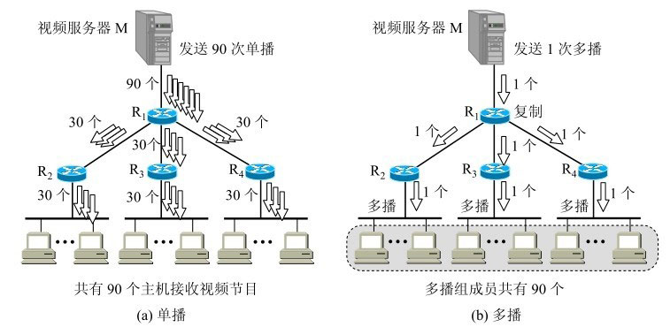

能够运行多播协议的路由器称为多播路由器

多播数据报的目的地址：是D类地址——**多播地址只能用于目的地址，而不能用于源地址**

### 2. IGMP & 多播路由选择协议

IGMP协议是让连接在本地局域网上的多播路由器知道本局域网上是否有主机参加或退出了某个多播组。

IGMP的工作：

- 当某个主机加入新的多播组时，该主机应向多播组的多播地址发送一个IGMP报文，声明自己要成为该组的成员。本地的多播路由器收到IGMP报文后，还要利用多播路由选择协议把这种组成员关系转发给因特网上的其他多播路由器
- 组成员关系是动态的。本地多播路由器要周期性地探询本地局域网上的主机，以便知道这些主机是否还继续是组的成员。**只要有一个主机对某个组响应，那么多播路由器就认为这个组是活跃的**。但一个组在经过几次的探询后仍然没有一个主机响应，多播路由器就认为本网络上的主机已经都离开了这个组，因此也就不再把这个组的成员关系转发给其他的多播路由器。


# 4. 传输层

## 4.1 概念

传输层所属的位置：向它上面的应用层提供通信服务，它属于面向通信部分的最高层，同时也是用户功能中的最低层。

**设备的区别**：只有主机的协议栈才有运输层，而网络核心部分中的**路由器在转发分组时都只用到下三层的功能**。

**与网络层的区别**：

- 网络层只把分组发送到目的主机
- 传输层是将分组传递给**真正通信的主机中的进程**——真正的端到端的通信是应用进程之间的通信

传输层提供了**进程间的逻辑通信**，传输层向高层用户屏蔽了下面网络层的核心细节，使应用程序看起来像是在两个传输层实体之间有一条端到端的逻辑通信信道。

传输层的重要功能：复用和分用：

- 复用：发送方不同的应用进程都可以使用同一个运输层协议传送数据
- 分用：接收方的运输层在剥去报文的首部后能够把这些数据正确交付目的应用进程

运输层的两个主要协议：TCP、UDP

需要掌握的：(5) 在不可靠的网络上实现可靠传输的工作原理，停止等待协议和ARQ协议。(6) TCP的滑动窗口、流量控制、拥塞控制和连接管理。

基本知识补充：

### 端口：

传输层主要是提供进程间的逻辑通信，那么要对每个应用层的进程分配一个明确的标志。在OS中进程是通过pid来区分的。但是，OS之间的pid格式不同——就必须**用统一的方法对TCP/IP体系的应用进程进行标志**

方法：在运输层使用**协议端口号**，即**端口**。这个端口是软件端口，和硬件端口不同。该端口只有本地意义，在不同的计算机之间，端口号相同是没有关联的，也不会产生冲突。

- 软件端口：是应用层的各种协议进程与运输实体进行层间交互的一种地址
- 硬件端口：是硬件设备进行交互的接口

只要把要传送的报文交到目的主机的某一个合适的目的端口，剩下的工作（即最后交付目的进程）就由TCP来完成。

计算机通信是采用客户-服务器方式。客户在发起通信请求时，必须先知道对方服务器的IP地址和端口号

- 服务端使用的端口号：

  - 熟知端口号：0~1023，指派给TCP/IP最重要的一些应用程序，所有用户都知道	
  - 登记端口号：为没有熟知端口号的应用程序使用的

- 客户端使用的端口号

  是短暂端口号，被动态分配的，在发送给服务器的时候带上，那么服务器响应就直到要给哪个端口。通信结束就不存在了。

### 套接字：

端口号拼接到IP地址即构成了套接字/插口。

格式：在点分十进制的IP地址后面写上端口号，中间用冒号或逗号隔开

socket = IP地址 : 端口号

eg：192.168.25:80

**每一条TCP连接唯一地被通信两端的两个套接字所确定**

TCP连接 ::= {socket1, socket2}

同一个IP地址可以有多个不同的TCP连接，而同一个端口号也可以出现在多个不同的TCP连接中。

## 4.2 UDP 和 TCP 的特点


- 用户数据报协议 UDP：是无连接的，尽最大可能交付，没有拥塞控制，面向报文（对于应用程序传下来的报文不合并也不拆分，只是添加 UDP 首部），支持一对一、一对多、多对一和多对多的交互通信。<不可靠>
- 传输控制协议 TCP：是**面向连接的**，提供可靠交付，有流量控制，拥塞控制，**提供全双工通信**，面向字节流（把应用层传下来的报文看成字节流，把字节流组织成大小不等的数据块），每一条 TCP 连接只能是点对点的（一对一）。<可靠>


——应用层协议主要使用的运输层协议

## 4.3 UDP

### 1. 概念

- 无连接的：发送数据之前不需要建立连接。

  减少开销和发送数据之前的时延

- 尽最大努力交付的：不可靠的

- 面向报文的

  UDP对应用层交下来的报文，既不合并，也不拆分，直接加上头部传递给网络层；对于IP层交付的报文，去除UDP头部传递给应用层

  ——即以报文为单位

  因此，**应用程序必须选择合适大小的报文**。太大，IP层会进行分片；太小，头部开销过大

- 没有拥塞控制、流量控制

  即使网络出现拥塞，也不会降低发送速率

  适合实时应用，允许有部分数据丢失，但是不允许有太大时延的

- 支持一对一、一对多、多对多等的交互通信

- 首部开销小：8个字节

——不使用拥塞控制功能的UDP有可能会引起网络产生严重的拥塞问题

### 2. 首部格式


首部字段只有 8 个字节，包括源端口、目的端口、长度、检验和。12 字节的伪首部是为了**计算检验和临时添加的**。

- 源端口号：需要对方回信时选用。不需要时可用全0
- 目的端口号：必须有
- 长度：整个数据报的长度，以字节为单位，min=8
- 检验和：检测UDP用户数据报在传输中是否有错。有错就丢弃

如果接收方UDP发现收到的报文中的目的端口号不正确（即不存在对应于该端口号的应用进程），就丢弃该报文，并由**ICMP发送“端口不可达”差错报文**给发送方

检验和的计算方法：同IP数据报的检验方法类似，但是UDP是把首部和数据部分一起都检验，以16位为单位进行计算，最后不足的补0；按二进制反码计算和，最后将该和的二进制反码写入检验字段

——当无差错时其结果应为全1

——检错能力不强，但是简单，处理起来较快

## 4.4 TCP

### 1. 概念

- 面向连接的：先建立TCP连接，才能进行通信

- 提供可靠交付的：无差错、不丢失、不重复、并且按序到达

- 面向字节流

  应用程序交下来的数据看成仅仅是一连串的无结构的字节流

  不关注里面的内容，只把字节流组织成大小不等的数据块，但保证：接收方应用程序收到的字节流和发送方应用程序发出的字节流完全一样

- 有拥塞控制、流量控制

- 一对一（点对点）

- 全双工通信

  TCP允许通信双方的应用进程在任何时候都能发送数据，TCP连接的两端都设有发送缓存和接收缓存，用来临时存放双向通信的数据

  在发送时，应用程序在把数据传送给TCP的缓存后，就可以做自己的事，而TCP在**合适的时候把数据发送出去**。在接收时，TCP把收到的数据放入缓存，上层的应用进程在**合适的时候读取缓存中的数据**。

TCP的报文长度由对方给出的窗口值和当前网络拥塞的程度来决定。如果应用进程传送到TCP缓存的数据块太长，TCP就可以把它划分短一些再传送。如果应用进程一次只发来一个字节，TCP也可以等待积累有足够多的字节后再构成报文段发送出去

### 2. 首部格式

前20个字节固定（和IP的固定字段一样）

后面有4n字节是根据需要而增加的选项(n是整数)


- 源端口和目的端口：各占2个字节

- **序号**（发送相关的）：用于**对字节流进行编号，以字节为单位**，例如序号为 301，表示**第一个字节的编号**为 301，如果携带的数据长度为 100 字节，那么下一个报文段的序号应为 401。

  整个要传送的字节流的起始序号必须在**连接建立时设置**

- **确认号**（接受相关的） ：期望收到的下一个报文段的序号。例如 B 正确收到 A 发送来的一个报文段，序号为 501，携带的数据长度为 200 字节，因此 B 期望下一个报文段的序号为 701，B 发送给 A 的确认报文段中确认号就为 701。

  确认号 = N，表示N-1之前的都已经正确接收了。

- **数据偏移** ：指的是数据部分距离报文段起始处的偏移量，实际上指的是**首部的长度**，以32位字长为单位

  数据偏移占4位，最大有15，表示首部最大为60字节

- 紧急URG：当URG=1时紧急字段有效，即相当于高优先级的数据，那么会优先发送该数据。

  发送方TCP就把**紧急数据插入到本报文段数据的最前面**，而在紧急数据后面的数据仍是普通数据。会与首部中紧急指针配合使用。

- **确认 ACK** ：当 ACK=1 时确认号字段有效，否则无效。TCP 规定，在**连接建立**后所有传送的报文段都必须把 ACK 置 1。

- 推送PSH：发送方TCP把PSH置1，会立即创建一个报文段发送出去。接收方TCP收到PSH = 1的报文段，就尽快地交付接收应用进程，而不再等到整个缓存都填满了后再向上交付。

- 复位RST：TCP连接中出现严重差错（如由于主机崩溃或其他原因），必须释放连接，然后再重新建立运输连接

- **同步 SYN** ：在连接建立时用来同步序号。当 **SYN=1，ACK=0 时表示这是一个连接请求报文段**。若对方同意建立连接，则响应报文中 SYN=1，ACK=1。

  SYN置为1就表示这是一个连接请求或连接接受报文

- **终止 FIN** ：用来释放一个连接，当 FIN=1 时，表示此报文段的发送方的数据已发送完毕，并要求**释放连接**。

  用在，断开TCP连接上

- **窗口** ：窗口值作为**接收方**让发送方设置其发送窗口的依据。之所以要有这个限制，是因为接收方的数据缓存空间是有限的。

  窗口值是经常在动态变化着。

- 检验和：占2字节。检验和字段**检验的范围包括首部和数据**这两部分。和UDP用户数据报一样，在计算检验和时，要在TCP报文段的前面加上12字节的伪首部

- 紧急指针：占2字节。紧急指针仅在URG = 1时才有意义，它指出本报文段中的紧急数据的字节数。紧急指针指出了**紧急数据的末尾**在报文段中的位置

  **即使窗口为零时也可发送紧急数据**

在可选项中：

最大报文段长度 MSS：每一个TCP报文段中的**数据字段的最大长度**。

MSS不能太小：否则首部开销占比过大；不能太大：否则到IP层还需要分片，分片之后可能会存在传输出错要重传问题，并且分片传输到之后还需要组装——所以，MSS要尽可能的大

**连接建立的过程中**，双方都把自己能够支持的MSS写入这一字段，以后就按照这个数值传送数据，两个传送方向可以有不同的MSS值

## 4.5 TCP 的连接和释放

具体见[TCP.pdf](#TCP连接建立)

运输连接就有三个阶段，即：连接建立、数据传送和连接释放

TCP连接的建立采用CS方式。主动发起连接建立的应用进程叫做客户，而被动等待连接建立的应用进程叫做服务器。

### TCP的三次握手


假设 A 为客户端，B 为服务器端。

- 首先 B 处于 **LISTEN（监听）状态**，等待客户的连接请求。

- A 向 B 发送连接请求报文，**SYN=1，ACK=0**，选择一个初始的序号 x。

  此时，A进入SYN-SENT状态，B仍处于LISTEN状态

  TCP规定，SYN报文段（即SYN = 1的报文段）**不能携带数据**，但要**消耗掉一个序号**，所以下一个报文序号从x+1开始

- B 收到连接请求报文，如果同意建立连接，则向 A 发送连接确认报文，**SYN=1，ACK=1**，确认号为 x+1，同时也选择一个初始的序号 y。

  此时，B进入SYN-RCVD状态，A仍处于SYN-SENT状态

  这个报文段也**不能携带数据**，但同样要消耗掉一个序号，所以下一个报文需要从y+1开始

- A 收到 B 的连接确认报文后，还要向 B 发出确认，确认号为 y+1，序号为 x+1

  此时，A进入ESTABLISHED状态，B仍处于SYN-RCVD状态

  这边的ACK报文段可以携带数据。但如果不携带数据则不消耗序号，所以这种情况下，下一个报文的序号还是x+1

- B 收到 A 的确认后，连接建立。

  此时，A、B都处于ESTABLISHED状态。

**三次握手的原因**

1. 主要原因第三次握手是为了防止失效的连接请求到达服务器，让服务器错误打开连接。

   存在的异常：

   - A发出的第一个连接请求报文段丢失了，之后超时重传，第二次传输后B成功收到，并且建立连接了。但是，如果A的连接请求SYN并没有丢失，而是在某些网络结点长时间滞留了，以致延误到这一次的**连接释放以后的某个时间才到达B**。本来这是一个早已失效的报文段。但B收到此失效的连接请求报文段后，就误认为是A又发出一次新的连接请求。于是就向A发出确认报文段，同意建立连接。假定不采用三次握手，那么只要B发出确认，新的连接就建立了。但是，实际上现在A并没有发出请求，所以忽略了B发送来的ACK，也不会发送数据，所以B一直等待A的连接，导致资源浪费

     ——如果有第三次握手，客户端会忽略服务器之后发送的对滞留连接请求的连接确认，不进行第三次握手，因此就不会再次打开连接。

   那么如何区分2次的SYN呢？

   SYN超时重传之后，会更新seq，而服务端收到旧的报文之后，发送ACK，而客户端收到ACK之后，会将ACK中的ack进行比较，如果该ack不是最新的，那么就发送RST，表示中断该连接

2. 二次握手，无法可靠同步初始化序号，即服务器端的seq初始值不一定能确认获取
3. 避免资源浪费，就是在1的基础上，能够防止存在多个同样的TCP连接，所以减少资源浪费

### TCP 的四次挥手


以下描述不讨论序号和确认号，因为序号和确认号的规则比较简单。并且不讨论 ACK，因为 ACK 在连接建立之后都为 1。

- A 发送连接释放报文，FIN=1。

  此时，A处于FIN-WAIT-1状态，而B仍处于ESTABLISHED状态

  FIN报文段即使不携带数据，它也消耗掉一个序号。

- B 收到之后发出确认，此时 TCP 属于半关闭状态，B 能向 A 发送数据但是 A 不能向 B 发送数据（因为是A主动提出要关闭TCP连接的，表明没有数据需要发送了，而B如果还有数据需要发送那就发送，且A还需要接收）

  此时，A在收到ACK报文后，状态变成FIN-WAIT-2，而B处于CLOSE-WAIT状态

- 当 B 不再需要连接时，发送连接释放报文，FIN=1。

  此时，A仍处于FIN-WAIT-2状态，而B处于LAST-ACK状态

- A 收到后发出确认，进入 TIME-WAIT 状态，等待 2 MSL（最大报文存活时间）后释放连接。

- B 收到 A 的确认后释放连接。

**四次挥手的原因**

客户端发送了 FIN 连接释放报文之后，服务器收到了这个报文，就进入了 CLOSE-WAIT 状态。这个状态是为了让服务器端发送还未传送完毕的数据，传送完毕之后，服务器会发送 FIN 连接释放报文。

——所以，不能将服务端的ACK和FIN合并（合并，就类似于三次握手的结果了）

**TIME_WAIT**

客户端接收到服务器端的 FIN 报文后进入此状态，此时并不是直接进入 CLOSED 状态，还需要等待一个时间计时器设置的时间 2MSL。这么做有两个理由：

- **确保最后一个确认报文能够到达**。如果 B 没收到 A 发送来的确认报文，那么就会重新发送连接释放请求报文，A 等待一段时间就是为了处理这种情况的发生。
- 等待一段时间是为了让本连接持续时间内**所产生的所有报文都从网络中消失**，使得下一个新的连接不会出现旧的连接请求报文。

TCP还设有一个**保活计时器**：

存在一种情况：客户端的主机突然出故障，那么服务器以后就不能再收到客户发来的数据。因此，服务器需要在限定的时间内等待，在该时间段内，如果没有任何连接相关的活动，那么TCP保活机制开始工作：每隔一个时间段，发送一个探测报文。超过该时间就认为客户端出了故障，接着就关闭这个连接。而服务器每收到一次客户的数据，就重新设置保活计时器；

## 4.6 TCP 可靠传输

### 1. 可靠传输的基本原理

#### 1.1 停止等待协议


发送方发送一个数据之后，就停止发送了，直到收到接收方发送的ACK确认报文，才进行下一次发送；

并且在发送时，开启一个超时重传倒计时，如果在到期之前都没有收到ACK报文，就进行重传。

需要注意：

- A发送之后需要保留M1的副本，以防出现重传情况；
- 分组和确认分组都必须进行编号（这样才能明确是哪一个发送出去的分组收到了确认，而哪一个分组还没有收到确认。）；
- 设置的重传时间应当比数据在分组传输的平均往返时间更长一些

出现差错的特殊情况：**确认丢失和确认迟到**，即报文已经正确收到了，但是ACK报文传递的时候出现问题，从而触发了发送方的超时重传


- 对于确认丢失，那么导致A会重传，而B实际上已经正确收到了该M1，所以再次收到M1后
  - 丢弃重复收到的M1报文
  - 发送确认报文ACK
- 对于确认延迟，由于网络延迟等情况，导致ACK报文没有丢失，但是在超时重传之后才到发送方。那么A会收到重复的ACK——收下后丢弃；B会收到重复的M1，直接丢弃，并且发送确认报文

——那么该网络传输就变得可靠了，该种协议又被称为：自动重传请求ARQ，即重传请求是自动进行的（时钟触发），而不需要接收方发送请求触发

但是，信道利用率很低：


$U = \frac{T_D}{T_D + RTT + T_A}$

$T_D$是发送出去分组的时间，$T_A$是发送出去ACK的时间。都是，分组长度 / 数据率

可以利用编号，来实现流水线发送——连续ARQ协议和滑动窗口协议

#### 1.2 连续ARQ协议

发送方会维持发送窗口，它的意义是：位于发送窗口内的n个分组都可连续发送出去，而不需要等待对方的确认，这样能够提高信道的利用率。

接收方一般都是采用**累积确认**的方式。这就是说，接收方不必对收到的分组逐个发送确认，而是在收到几个分组后，对按序到达的最后一个分组发送确认，这就表示：到这个分组为止的所有分组都已正确收到了。

优点是：容易实现，即使确认丢失也不必重传。但缺点是不能向发送方反映出接收方已经正确收到的所有分组的信息。

eg：发送5个分组，第3个分组丢失，只收到前2个的确认，那么需要把后面3个分组全部重传——Go-back-N（回退N），表示需要退回来重传已发送的N个分组。

当通信线路质量不好时，连续ARQ协议会带来负面的影响。

### 2. 重传机制

TCP 使用**超时重传**来实现可靠传输：如果一个已经发送的报文段在超时时间内没有收到确认，那么就重传这个报文段。

一个报文段从发送再到接收到确认所经过的时间称为往返时间 RTT，加权平均往返时间 RTTs 计算如下：


其中，0 ≤ a ＜ 1，RTTs 随着 a 的增加更容易受到 最新的RTT 的影响，而受之前的RTTs影响变小下·。

超时时间 RTO 应该略大于 RTTs，TCP 使用的超时时间计算如下：


其中 RTTd 为偏差的加权平均值。

具体见[TCP可靠传输的技术保证.md](#1)

### 3. TCP 滑动窗口

窗口是缓存的一部分，用来暂时存放字节流。发送方和接收方各有一个窗口，接收方通过 TCP 报文段中的窗口字段告诉发送方自己的窗口大小，发送方根据这个值和其它信息设置自己的窗口大小。

发送窗口内的字节都允许被发送，接收窗口内的字节都允许被接收。如果发送窗口左部的字节已经发送并且收到了确认，那么就将发送窗口向右滑动一定距离，直到左部第一个字节不是已发送并且已确认的状态；接收窗口的滑动类似，接收窗口左部字节已经发送确认并交付主机，就向右滑动接收窗口。

**接收窗口只会对窗口内最后一个按序到达的字节进行确认**，例如接收窗口已经收到的字节为 {31, 34, 35}，其中 {31} 按序到达，而 {34, 35} 就不是，因此只对字节 31 进行确认。发送方得到一个字节的确认之后，就知道这个字节之前的所有字节都已经被接收。

具体见[TCP可靠传输的技术保证.md](#2)


## 4.8 TCP 流量控制

具体见[TCP可靠传输的技术保证.md](#3)

流量控制是为了控制发送方发送速率，保证接收方来得及接收。

接收方发送的确认报文中的窗口字段可以用来控制发送方窗口大小，从而影响发送方的发送速率。将窗口字段设置为 0，则发送方不能发送数据。

发送方的发送窗口不能超过接收方给出的接收窗口的数值。注意，TCP的**窗口单位是字节**，不是报文段

## 4.9 TCP 拥塞控制

具体见[TCP可靠传输的技术保证.md](#4)

如果网络出现拥塞，分组将会丢失，此时发送方会继续重传，从而导致网络拥塞程度更高。因此当出现拥塞时，应当控制发送方的速率。这一点和流量控制很像，但是出发点不同。流量控制是为了让接收方能来得及接收，而**拥塞控制是为了降低整个网络的拥塞程度**（是一个全局的控制）。


TCP 主要通过四个算法来进行拥塞控制：**慢开始、拥塞避免、快重传、快恢复**。

发送方需要维护一个叫做拥塞窗口（cwnd）的状态变量，注意拥塞窗口与发送方窗口的区别：**拥塞窗口只是一个状态变量，实际决定发送方能发送多少数据的是发送方窗口。**

为了便于讨论，做如下假设：

- 接收方有足够大的接收缓存，因此不会发生流量控制；
- 虽然 TCP 的窗口基于字节，但是这里设窗口的大小单位为报文段。

### 1. 慢开始与拥塞避免


发送的最初执行慢开始，令 cwnd = 1，发送方只能发送 1 个报文段；当收到确认后，将 cwnd 加倍，因此之后发送方能够发送的报文段数量为：2、4、8 ...——指数增加

注意到慢开始每个轮次都将 cwnd 加倍，这样会让 cwnd 增长速度非常快，从而使得发送方发送的速度增长速度过快，网络拥塞的可能性也就更高。设置一个慢开始门限 ssthresh，当 cwnd >= ssthresh 时，进入拥塞避免，每个轮次只将 cwnd 加 1。

如果出现了超时，则令 **ssthresh = cwnd / 2，cwnd=1**，重新从慢开始进行

### 2. 快重传与快恢复

快重传的概念：

前提要求：接收方每收到一个失序的报文段后就立即发出重复确认（为的是使发送方及早知道有报文段没有到达对方）而不要等待自己发送数据时才进行捎带确认。eg：已经接收到 M1 和 M2，此时收到 M4，应当发送对 M2 的确认。

具体操作：在发送方，如果**收到三个重复确认，那么可以认为下一个报文段丢失**，此时执行快重传，立即重传下一个报文段。例如收到三个 M2，则 M3 丢失，立即重传 M3。

在这种情况下，只是丢失个别报文段，而不是网络拥塞（如果网络发生了严重的拥塞，就不会一连有好几个报文段连续到达接收方）。因此执行快恢复，令 **ssthresh = cwnd / 2 ，cwnd = ssthresh**，注意到此时直接进入拥塞避免状态。

**慢开始和快恢复的快慢指的是 cwnd 的设定值，而不是 cwnd 的增长速率**。慢开始 cwnd 设定为 1，而快恢复 cwnd 设定为 ssthresh。


# 5. 应用层

每个应用层协议都是为了解决某一类应用问题，而问题的解决又必须通过位于不同主机中的多个应用进程之间的通信和协同工作来完成的。应用进程之间的这种通信必须遵循严格的规则。

应用层协议应当定义：

- 应用进程交换的报文类型，如请求报文和响应报文
- 各种报文类型的语法，如报文中的各个字段及其详细描述
- 字段的语义，即包含在字段中的信息的含义
- 进程何时、如何发送报文，以及对报文进行响应的规则。

——即不同主机的进程之间如何进行通信：语法、语义等

需要明确：应用层的许多协议都是基于**客户-服务器方式（CS）**。即使是对等通信方式，实质上也是一种特殊的客户-服务器方式。这里再明确一下，**客户、服务器都是指通信中所涉及的两个应用进程**。客户-服务器方式所描述的是进程之间服务和被服务的关系。

最主要的特征就是：客户是服务请求方，服务器是服务提供方。

本章最重要的内容是：

(1) 域名系统DNS——从域名解析出IP地址。

(2) 万维网和HTTP协议，以及万维网的两种不同的信息搜索引擎。

(3) 电子邮件的传送过程，SMTP协议和POP3协议使用的场合。

(4) 基于万维网的电子邮件系统的特点。

(5) 动态主机配置协议DHCP的特点。

(6) 网络管理的三个部分（SNMP本身、管理信息结构SMI和管理信息库MIB）的作用。

(7) 系统调用和应用编程接口的基本概念。

## 5.1 域名系统

背景：用户在请求服务器服务时，都是使用主机的名字，而很少直接使用IP地址，主要是不容易记忆。

理论上讲：整个因特网可以只使用一个域名服务器，使它装入因特网上所有的主机名，并回答所有对IP地址的查询。

但是，实际应用上并不可取。因为因特网规模很大，这样的域名服务器肯定会因过负荷而无法正常工作，而且一旦域名服务器出现故障，整个因特网就会瘫痪。

所以采用**层次树状结构的命名方法，并使用分布式的域名系统DNS**

### 1. 域名结构

任何一个连接在因特网上的主机或路由器，都有一个唯一的层次结构的名字，即**域名**

域还可以划分为子域，而子域还可继续划分为子域的子域，这样就形成了顶级域、二级域、三级域，等等。

每一个域名都是由**标号**序列组成，而各标号之间用**点**隔开（请注意，是小数点“.”，不是中文的句号“。”）

eg：www.baidu.com：www是三级域名；baidu是二级域名；com是顶级域名

语法：每一个标号不超过63个字符，也**不区分大小写字母**。标点符号中只能用 - 。由多个标号组成的完整域名总共**不超过255个字符**

**级别最低的域名写在最左边，而级别最高的顶级域名则写在最右边**

域名只是个逻辑概念，和IP地址的点分十进制没有关系。

顶级域名：国家顶级域名、通用顶级域名、基础结构域名（只有一个arpa，反向域名，用来反向域名解析）、新顶级域名

我国把二级域名划分为“类别域名”和“行政区域名”两大类


最上面就是根，是没有对应的名字

### 2. 域名服务器

DNS服务器的管辖范围不是以“域”为单位，而是以**“区”**为单位。区是DNS服务器实际管辖的范围。区可能等于或小于域，但一定不可能大于域。（主要是域的范围太广，域名太多，服务器负载不过来）

DNS 是一个**分布式数据库**，提供了**主机名和 IP 地址之间相互转换**的服务。这里的分布式数据库是指，每个站点只保留它自己的那部分数据。

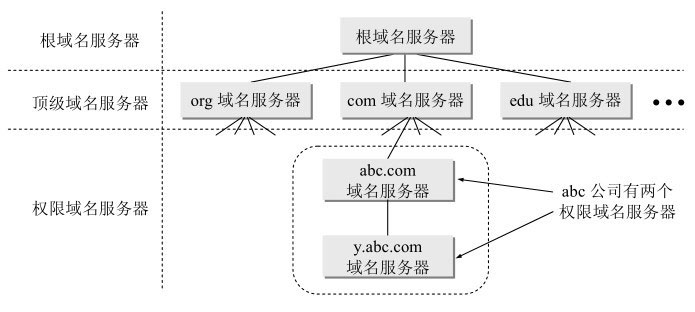

1. 根域名服务器：最高层次的

   若要对因特网上任何一个域名进行解析（即转换为IP地址），只要自己无法解析，**就首先要求助于根域名服务器**

   如果所有的根域名服务器都瘫痪了，那么整个的DNS系统就无法工作

   在因特网上共有13个不同IP地址的根域名服务器，实际上是13套装置，而一套装置可能有多台服务器组成。

   现在世界上大部分DNS域名服务器都能就近找到一个根域名服务器。

2. 顶级域名服务器

   管理在该顶级域名服务器注册的所有二级域名

   当收到DNS查询请求时，就给出相应的回答（可能是最后的结果，也可能是下一步应当找的域名服务器的IP地址）

3. 权限域名服务器

**本地域名服务器**（默认域名服务器）：不属于上面的层次，当一个主机发出DNS查询请求时，这个查询请求报文就发送给本地域名服务器

每一个ISP，或一个大学，甚至一个大学里的系，都可以拥有一个本地域名服务器。所以本地域名服务器离用户较近，一般不超过几个路由器的距离。

当所要查询的主机也属于同一个本地ISP时，该本地域名服务器立即就能将所查询的主机名转换为它的IP地址，而不需要再去询问其他的域名服务器。

操作：

1. 主机向本地域名服务器查询都是用**递归查询**，即本地域名服务器会负责将主机的IP地址找到，让不是让主机自行查询
2. 而本地域名服务器查询是用**迭代查询**，即只指路不负责带路

具体见[IP相关知识.pdf](#DNS域名解析)

流程：

1. 主机m.xyz.com先向其本地域名服务器dns.xyz.com进行递归查询
2. 本地域名服务器采用迭代查询。它先向一个根域名服务器查询
3. 根域名服务器告诉本地域名服务器一个IP地址，是顶级域名服务器dns.com的IP地址
4. 本地域名服务器向顶级域名服务器dns.com进行查询
5. 顶级域名服务器dns.com告诉本地域名服务器一个IP地址，即权限域名服务器dns.abc.com的IP地址
6. 本地域名服务器向权限域名服务器dns.abc.com进行查询
7. 权限域名服务器dns.abc.com告诉本地域名服务器，所查询的主机的IP地址。
8. 本地域名服务器获得该主机的IP地址后，把查询结果告诉主机m.xyz.com。

为了提高效率，且减轻根域名服务器的负担，域名服务器中广泛地使用了**高速缓存**：存放最近查询过的域名以及从何处获得域名映射信息的记录。

DNS 可以使用 UDP 或者 TCP 进行传输，使用的端口号都为 **53**。大多数情况下 DNS 使用 **UDP** 进行传输，这就要求域名解析器和域名服务器都必须**自己处理超时和重传从而保证可靠性**。在两种情况下会使用 TCP 进行传输：

- **如果返回的响应超过的 512 字节**（UDP 最大只支持 512 字节的数据）。
- 区域传送（区域传送是主域名服务器向辅助域名服务器传送变化的那部分数据）。

## 5.2 文件传送协议FTP

FTP是使用得最广泛的文件传送协议。

FTP提供交互式的访问，允许客户指明文件的类型与格式（如指明是否使用ASCII码），并允许文件具有存取权限。

基于TCP的FTP和基于UDP的TFTP：都是需要复制整个文件（是文件传输的一个大类的特性）

- 若要存取一个文件，就必须先获得一个本地的文件副本
- 要修改文件，只能对文件的副本进行修改，然后再将修改后的文件副本传回到原节点。

**FTP 使用 TCP 进行连接**，它需要两个连接来传送一个文件：

- 控制连接：服务器打开**端口号 21** 等待客户端的连接，客户端主动建立连接后，使用这个连接将客户端的命令传送给服务器，并传回服务器的应答。

  控制连接在整个会话期间一直保持打开，FTP客户所发出的传送请求，通过控制连接发送给服务器端的控制进程，但控制连接并不用来传送文件

- 数据连接：用来传送一个文件数据。

并且，数据连接和控制连接是发生在两个不同的端口上的，那么数据连接与控制连接不会发生混乱

根据数据连接**是否是服务器端主动建立**，FTP 有主动和被动两种模式：

- 主动模式：服务器端主动建立数据连接，其中服务器端的端口号为 **20**，客户端的端口号随机，但是必须大于 1024，因为 0~1023 是熟知端口号。

  


- 被动模式：客户端主动建立数据连接，其中客户端的端口号由客户端自己指定，服务器端的端口号随机。

  

主动模式要求**客户端开放端口号给服务器端，需要去配置客户端的防火墙**。被动模式只需要服务器端开放端口号即可，无需客户端配置防火墙。但是被动模式会导致服务器端的安全性减弱，因为开放了过多的端口号。

ps：

TFTP：很小且易于实现的文件传送协议，TFTP只支持文件传输而不支持交互，没有列目录的功能，也不能对用户进行身份鉴别。

主要特点：每次传送的数据报文中有512字节的数据，但最后一次可不足512字节（若文件长度恰好为512字节的整数倍，则在文件传送完毕后，还必须在最后发送一个只含首部而无数据的数据报文，表示结尾）；数据报文按序编号，从1开始；支持ASCII码或二进制传送； 可对文件进行读或写； 使用很简单的首部。

使用端口号：69

优点：

1. 可用于UDP环境。需要将程序或文件同时向许多机器下载时就往往需要使用TFTP
2. TFTP代码所占的内存较小

## 5.3 远程登录协议

TELNET 用于登录到远程主机上，并且远程主机上的输出也会返回。

TELNET 可以适应许多计算机和操作系统的差异，例如不同操作系统系统的换行符定义。

## 5.4 www与相关技术

www：即万维网，是一个**大规模的、联机式的信息储藏所**。

万维网用链接的方法能非常方便地从因特网上的一个站点访问另一个站点（也就是所谓的“链接到另一个站点”），从而主动地按需获取丰富的信息。

- 万维网使用**统一资源定位符URL**来标志万维网上的各种文档，并使每一个文档在整个因特网的范围内具有**唯一的标识符**。
- 万维网客户程序和服务程序遵循的协议是：**超文本传送协议HTTP** 。HTTP是一个应用层协议，它使用TCP连接进行可靠的传送。
- 万维网使用**超文本标记语言HTML**，用链接从本页面的某处链接到因特网上的任何一个万维网页面

### 1. URL

资源：在因特网上可以被访问的任何对象，包括文件目录、文件、文档、图像、声音等，以及与因特网相连的任何形式的数据

URL的格式：<协议>://<主机>:<端口>/<路径>

- <协议>：使用什么协议来获取该万维网文档，最常用的协议就是http，还有ftp协议
- :// ：不能省略
- <主机>：指出该文档在哪个万维网主机上，使用的是域名

使用http的URL：http://<主机>:<端口>/<路径>

HTTP的**默认端口号是80**，通常可以省略

可以省略文件的<路径>项，则URL就指到因特网上的**某个主页**（该域名下服务器配置的主要展示的页面）

### 2. HTTP协议

HTTP是面向事务的应用层协议（事务就是一系列的信息交换，要么不交换，需要交换就要交换全部信息）

具体见[HTTP.pdf](#http)

HTTP的特性：

- HTTP协议是**无连接的**。这就是说，虽然HTTP使用了TCP连接，但通信的双方在交换HTTP报文之前不需要先建立HTTP连接
- HTTP协议是**无状态的**。同一个客户第二次访问同一个服务器上的页面时，服务器的响应与第一次被访问时的相同

所以如果要获取数据，首先需要TCP连接：先使用三次握手。当三次握手的前两部分完成后（即经过了一个RTT时间后），万维网客户就把**HTTP请求报文作为三次握手的第三个报文的数据发送给万维网服务器**。服务器收到HTTP请求报文后，就把所请求的文档作为响应报文返回给客户。

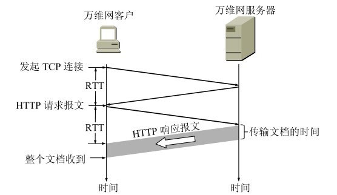

所以 请求一个万维网所需的时间：该文档的传输时间（与文档大小成正比）加上两倍往返时间RTT

HTTP/1.0的主要缺点，就是每请求一个文档就要有两倍RTT的开销（即每次传输完成后，都会断块TCP连接）

HTTP/1.1：使用了**持续连接**，在发送响应后仍然在一段时间内保持这条连接，使同一个客户（浏览器）和该服务器可以继续在这条连接上传送后续的HTTP请求报文和响应报文，只需要这些文档都在同一个服务器上就行；并且还实现了管道传输，即客户端可以发起多个请求，并且可以不等前一个请求返回响应，就可以发出第二个请求，但是服务器还是需要顺序处理的

代理服务器：万维网的高速缓存，会把最近的一些请求和响应暂存在本地磁盘中，如果请求的和暂存请求相同，那么返回暂存响应；如果不相同就由代理服务器发出HTTP请求。所以代理服务器有时是作为服务器（当接受浏览器的HTTP请求时），但有时却作为客户（当向因特网上的源点服务器发送HTTP请求时）

HTTP的报文结构：HTTP有两类报文：

(1) 请求报文——从客户向服务器发送请求报文

(2) 响应报文——从服务器到客户的回答

HTTP请求报文和响应报文都是由三个部分组成：

- 开始行，用于区分是请求报文还是响应报文。在请求报文中叫做**请求行**(Request-Line)，而在响应报文中叫做**状态行**(Status-Line)。在开始行的三个字段之间都以空格分隔开，最后的“CR”和“LF”分别代表“回车”和“换行”
  - 请求行：方法（命令），请求资源的URL，HTTP的版本
  - 状态行：HTTP的版本，状态码，以及解释状态码的简单短语
- 首部行，用来说明浏览器、服务器或报文主体的一些信息。首部可以有好几行，但也可以不使用。在每一个首部行中都有首部字段名和它的值，每一行在结束的地方都要有“回车”和“换行”。整个首部行结束时，还有一空行将首部行和后面的实体主体分开、
- 实体主体，在请求报文中一般都不用这个字段，而在响应报文中也可能没有这个字段。

请求报文举例：

```
GET /chn/yxsz/index.htm HTTP/1.1   {请求行使用了相对URL}
Host: www.tsinghua.edu.cn   {此行是首部行的开始。这行给出主机的域名}
Connection: close    {告诉服务器发送完请求的文档后就可释放连接}
User-Agent: Mozilla/5.0   {表明用户代理是使用Netscape浏览器}
Accept-Language: cn     {表示用户希望优先得到中文版本的文档}
{请求报文的最后还有一个空行}
```

## 5.5 电子邮件协议

一个电子邮件系统由三部分组成：**用户代理、邮件服务器以及邮件协议**。

1. 用户代理 UA：用户与电子邮件系统的接口，在大多数情况下它就是运行在用户PC中的一个程序

   其实就是一个客户端，用来看、写、发、收邮件

2. 邮件服务器：发送和接收邮件，同时还要向发件人报告邮件传送的结果（已交付、被拒绝、丢失等）

   邮件服务器需要使用两种不同的协议。一种协议用于UA向邮件服务器发送邮件或在邮件服务器之间发送邮件；而另一种协议用于UA从邮件服务器读取邮件

3. 邮件协议包含**发送协议和读取协议**，**发送协议常用 SMTP，读取协议常用 POP3 和 IMAP**。


邮件发送的步骤：

1. 发件人使用UA写邮件

2. 发件人发送邮件，UA将邮件**用SMTP协议**发送到**发送方邮件服务器**，此时UA是客户端，发送方邮件服务器是服务器。

3. 发送方SMTP服务器收到邮件后，将邮件存放到邮件缓存队列，等待发送出去（等待时间的长短取决于邮件服务器的处理能力和队列中待发送的信件的数量。但这种等待时间一般都远远大于分组在路由器中等待转发的排队时间）

4. 发送方邮件服务器和接收方邮件服务器建立**TCP连接**。此时发送方邮件服务器是SMTP的客户端，而接收方邮件服务器是服务端。然后就把缓存中的邮件**用SMTP协议**发送出去。**邮件不会在因特网中的某个中间邮件服务器落地**。

   如果SMTP客户无法和SMTP服务器建立TCP连接（例如，接收方服务器过负荷或出了故障），那么要发送的邮件就会继续保存在发送方的邮件服务器中，并在稍后一段时间再进行新的尝试。如果SMTP客户超过了规定的时间还不能把邮件发送出去，那么发送邮件服务器就把这种情况通知用户代理

5. 接收方邮件服务器收到邮件后，将邮件缓存在收件方邮件服务器中，等待收件人读取

6. 收件人运行UA，使用**POP3协议**读取邮件，此时UA是客户端，接收方邮件服务器是服务器

电子邮件由信封和内容两部分组成。

- 信封：写了收件人的地址：`用户名 @ 邮件服务器域名`

### 1. 简单邮件传送协议SMTP&MIME

**SMTP 只能发送 ASCII 码**，而互联网邮件扩充 MIME 可以发送二进制文件。MIME 并没有改动或者取代 SMTP，而是增加邮件主体的结构，定义了非 ASCII 码的编码规则。那么，MIME邮件可在现有的电子邮件程序和协议下传送

SMTP：是单方面的传输，即SMTP客户端向SMTP服务器发送信息

1. 连接建立

   使用SMTP的熟知端口号码**(25)**与接收方邮件服务器的SMTP服务器建立**TCP连接**。在连接建立后，接收方SMTP服务器要发出“220 Service ready”（服务就绪）。然后SMTP客户向SMTP服务器发送HELO命令，附上发送方的主机名。SMTP服务器若有能力接收邮件，则回答：“250 OK”，表示已准备好接收。若SMTP服务器不可用，则回答“421Service not available”（服务不可用）

   如在一定时间内发送不了邮件，邮件服务器会把这个情况通知发件人。

   SMTP 不使用中间的邮件服务器，TCP连接总是在发送方和接收方这两个邮件服务器之间**直接建立**，即不会将邮件暂存在某个中间服务器，要么发送出去，要么暂存

2. 邮件传输

   邮件的传送从MAIL命令开始，MAIL命令后面有发件人的地址。若SMTP服务器已准备好接收邮件，则回答“250OK”。否则，返回一个代码，指出原因。如：451（处理时出错），452（存储空间不够），500（命令无法识别）等

   下面跟着一个或多个RCPT命令。每发送一个RCPT命令，都应当有相应的信息从SMTP服务器返回，如：“250 OK”，表示指明的邮箱在接收方的系统中。或“550 No such user here”（无此用户），即不存在此邮箱。——先确认是否准备好接收，且是否能够接收

   再下面就是DATA命令，表示要开始传送邮件的内容了

3. 连接释放

   邮件发送完毕后，SMTP客户应发送QUIT命令。SMTP服务器返回的信息是“221（服务关闭）”，表示SMTP同意释放TCP连接


SMTP有如下限制：

- 不能传送可执行文件或者其他二进制文件
- 只能传送ASCII码构成的邮件，对于非英语的文字无法传送
- SMTP服务器会拒绝超过一定长度的邮件
- 某些SMTP的实现并没有完全按照SMTP的因特网标准

采用通用因特网邮件扩充MIME

### 2. 邮局协议POP3

POP3简单，但是功能有限

POP3 的特点是只要用户从服务器上读取了邮件，就把该邮件删除。但最新版本的 POP3 **可以不删除邮件**。

### 3. 网际报文存取协议IMAP

复杂，IMAP是一个**联机协议**

IMAP 协议中客户端和服务器上的邮件保持同步，如果不手动删除邮件，那么服务器上的邮件也不会被删除。IMAP 这种做法可以让用户随时随地去访问服务器上的邮件。

## 5.6 动态主机配置协议

DHCP 提供了**即插即用**的连网方式，用户不再需要手动配置 IP 地址等信息。

DHCP 配置的内容不仅是 IP 地址，还包括子网掩码、网关 IP 地址。

DHCP 工作过程如下：

1. 客户端发送 Discover 报文，该报文的目的地址为 255.255.255.255:67，源地址为 0.0.0.0:68，被放入 **UDP** 中，该报文被广播到同一个子网的所有主机上。如果客户端和 DHCP 服务器不在同一个子网，就需要使用中继代理。
2. DHCP 服务器收到 Discover 报文之后，发送 Offer 报文给客户端，该报文包含了客户端所需要的信息。因为客户端可能收到多个 DHCP 服务器提供的信息，因此客户端需要进行选择。
3. 如果客户端选择了某个 DHCP 服务器提供的信息，那么就发送 Request 报文给该 DHCP 服务器。
4. DHCP 服务器发送 Ack 报文，表示客户端此时可以使用提供给它的信息。


## 5.6 常用端口


| 应用             | 应用层协议 | 端口号  | 传输层协议 | 备注                        |
| ---------------- | ---------- | ------- | ---------- | --------------------------- |
| 域名解析         | DNS        | 53      | UDP/TCP    | 长度超过 512 字节时使用 TCP |
| 动态主机配置协议 | DHCP       | 67/68   | UDP        |                             |
| 简单网络管理协议 | SNMP       | 161/162 | UDP        |                             |
| 文件传送协议     | FTP        | 20/21   | TCP        | 控制连接 21，数据连接 20    |
| 远程终端协议     | TELNET     | 23      | TCP        |                             |
| 超文本传送协议   | HTTP       | 80      | TCP        |                             |
| 简单邮件传送协议 | SMTP       | 25      | TCP        |                             |
| 邮件读取协议     | POP3       | 110     | TCP        |                             |
| 网际报文存取协议 | IMAP       | 143     | TCP        |                             |


# ps：互联网中设备总结

网络互联的背景：网络是变化多样的，由于用户需求不同，所以不能让大家都使用同一个网络，**没有一种单一的网络能够适应所有用户的需求**，所以如何将不同的网络互联起来称为麻烦的事情。

将网络互相连接起来要使用一些**中间设备**：

| 层级       | 中间设备     | 概念                                                         |        |
| ---------- | ------------ | ------------------------------------------------------------ | ------ |
| 物理层     | 转发器       |                                                              | 集线器 |
| 数据链路层 | 网桥、桥接器 |                                                              | 网卡   |
| 网络层     | 路由器       | 由于一个路由器至少应当连接到两个网络，因此一个路由器至少应当有两个不同的IP地址。 |        |
| 网络层以上 | 网关         | 连接两个系统，两个系统使用的协议不一定相同，需要转换         |        |

- 用网关连接两个不兼容的系统需要在高层进行协议的转换
- 中间设备是转发器或网桥时，仅仅是把一个网络扩大了，而不算是网络互联，因为它们有同样的网络号；而路由器连接了两个网络，才算是网络互联
- 当一个主机同时连接到两个网络上时，该主机就必须同时具有两个相应的IP地址，其网络号必须是不同的。这种主机称为**多归属主机**(multihomed host)。
- 路由器只根据目的站的IP地址的网络号进行路由选择，而不会关注源IP地址（没有意义）
- 网络适配器决定了MAC地址


各层的数据传输的本质：

| 层级       | 功能                         | 解释                     | 数据名称                |
| ---------- | ---------------------------- | ------------------------ | ----------------------- |
| 应用层     |                              |                          |                         |
| 传输层     | 进程与进程之间的通信         | 为应用进程间提供逻辑通信 | TCP报文段/UDP用户数据报 |
| 网络层     | 主机与主机之间的通信         | 为主机之间提供逻辑通信   | IP数据报（分组/包）     |
| 数据链路层 | 一个物理链路两端的机器的通信 |                          | 帧                      |
| 物理层     |                              |                          |                         |

逻辑通信：从应用层来看，只要把应用层报文交给下面的运输层，运输层就可以把这报文传送到对方的传输层，好像这种通信就是传输层直接沿水平方向传送数据。但事实上这两个传输层之间并没有一条水平方向的物理连接。数据的传送是沿着图中的虚线方向（经过多个层次）传送的

